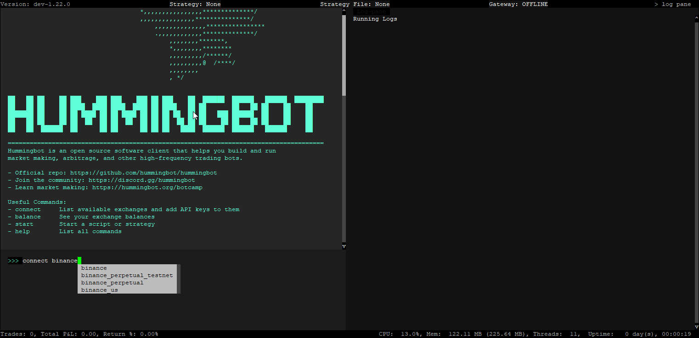
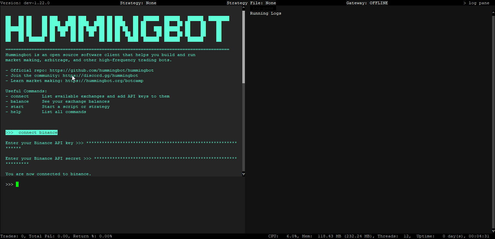

# Connecting your API Keys

In the previous examples we were using paper trading which does not require any API keys to be connected. In order to do live trading with Hummingbot we'll need to connect API keys for the exchanges we want to trade on. 

## Generate API Keys
 
The first step is to generate API keys for the exchanges we want to connect to Hummingbot. The instructions for setting up API keys for each exchange may differ. 

In this example, we'll connect Binance API keys. Check [here](https://docs.hummingbot.org/exchanges/binance/#generate-api-keys) for instructions on how to generate API keys for Binance.

Check the [Connectors list](../../../exchanges/index.md) for a list of exchanges that are currently integrated with Hummingbot

!!! Warning
    Please always keep your API keys secure and do not share them. 

## Connect API keys to Hummingbot

In the Hummingbot run the `connect` command for the exchange we want to connect to. In this case for Binance use the command below - 

```
connect binance
```



You should get a prompt to enter in your API keys - you can use the following commands below to paste them into the Hummingbot terminal. Note that `CTRL + V` doesn't work and you'll get a `Pyperclip error` if you try to use it. 

  - <kbd>CTRL</kbd>+<kbd>SHIFT</kbd>+<kbd>V</kbd>

  - <kbd>SHIFT</kbd> + RMB (right-mouse button)

  - <kbd>SHIFT</kbd> + <kbd>INS</kbd>



After entering your API keys you should get a success message if everything went through okay. You can also confirm by running the `connect` command again and check that both columns next to Binance are showing `Yes`. 


You now have Binance API keys connected. If you need to connect API keys for other exchanges just follow the same steps. In the next section we'll learn how to run a script on live trading using the connected API keys.

[Running a V2 Script](4-run-v2.md){ .md-button .md-button--primary }