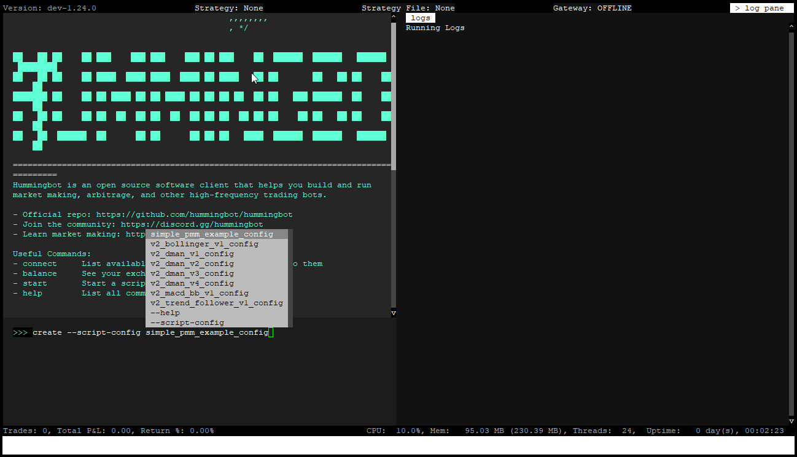
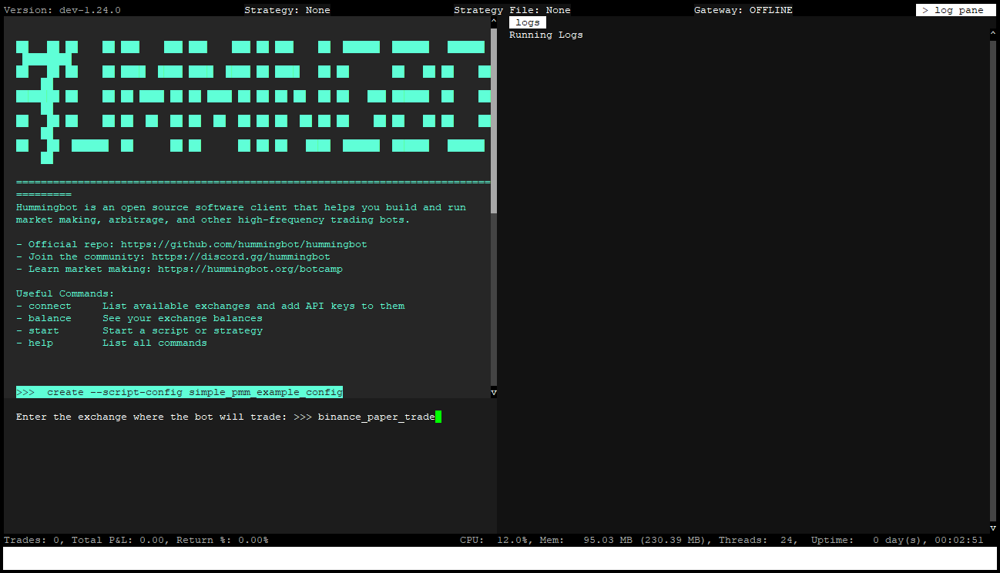
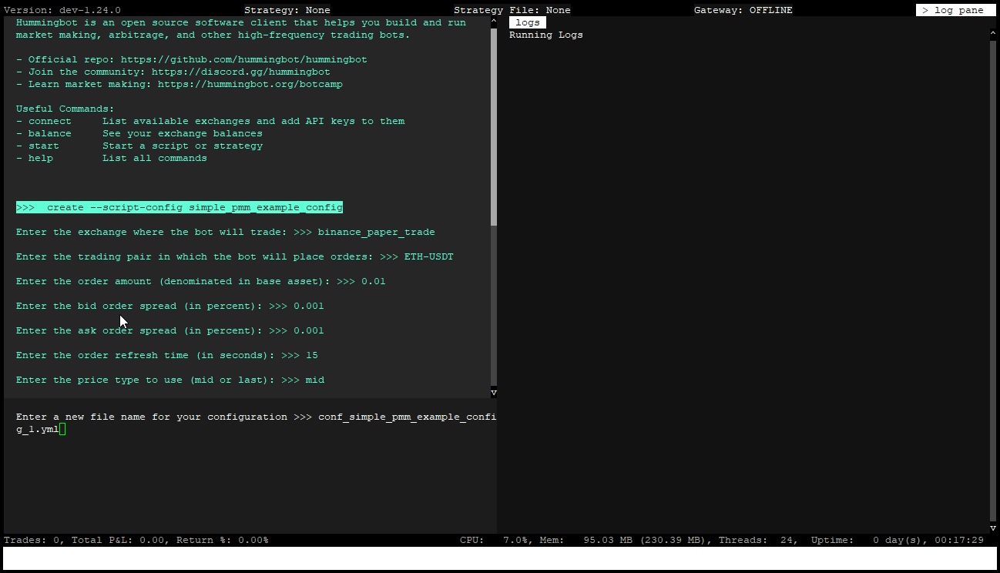
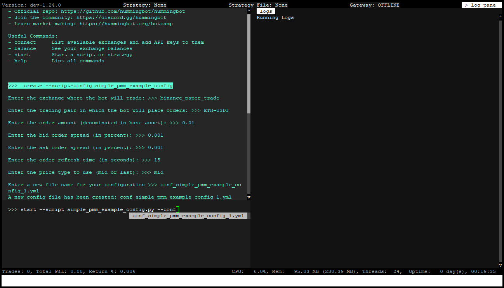
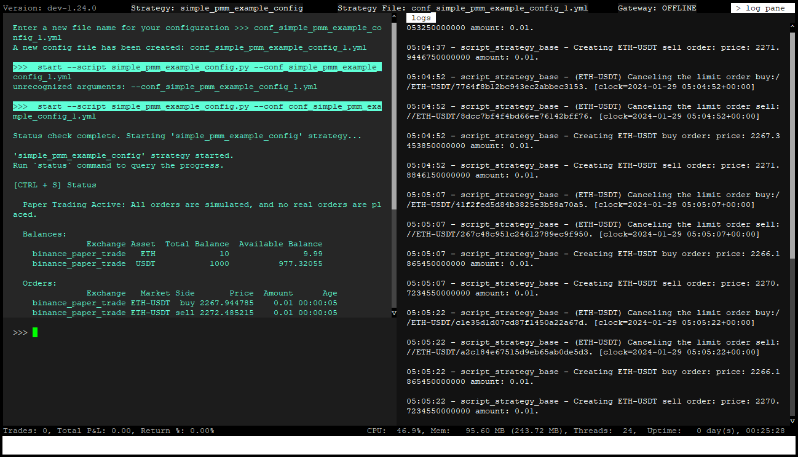
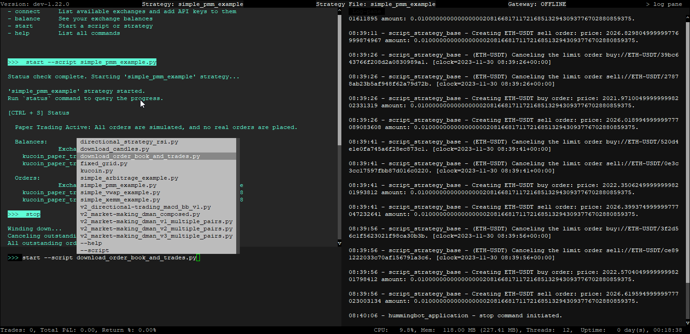

# Docker Installation Guide - Running a Configurable Script

## Simple PMM (config) Example

Let's use the `simple_pmm_example_config.py` script. This is a configurable script which will create orders for a token pair in paper trading mode. For configurable scripts, the first step is to create a config file. Here's how to create one:

```
create --script-config simple_pmm_example_config

```

When you use the `create --script-config` and press <kbd>SPACE</kbd> Hummingbot will display available scripts in the scripts folder, as shown below.

[](create-script-config.png)

If you don't see any scripts under the `/scripts` folder, run these commands in the terminal to make them appear: 

```bash
sudo chmod -R a+rw ./hummingbot_files
docker cp hummingbot:/home/hummingbot/scripts-copy/. ./hummingbot_files/scripts/
```

Select the `simple_pmm_example_config.py` script and press <kbd>ENTER</kbd>. 

[](config-script.png)

You will then be guided to configure the settings. At this stage, you may modify the options or simply hit <kbd>ENTER</kbd> to accept the default values. After finalizing the configuration, name the config file and press <kbd>ENTER</kbd> to save it.

[](save-config.png)


Once the config is saved we can now launch the script. Enter the command below to launch the script!

```
start --script simple_pmm_example_config.py --conf conf_simple_pmm_example_config_1.yml
```

Note that the autocomplete will popup after pressing <kbd>SPACE</kbd> after both the `--script` and `--conf` parameters so you can just select the correct script / config file from the list and then press <kbd>ENTER</kbd>

[](load-config-script.png)

After pressing <kbd>ENTER</kbd> you should be able to see activity in the log pane. Use the `status` command for more details or press <kbd>CTRL</kbd> + <kbd>S</kbd>. It should resemble the screen below.

```
status
```


[](script-status.png)

To stop the script from running, type the `stop` command in the Hummingbot terminal

```
stop
```

## Download Order Book Data

Let's try another example and this time we'll try to fetch order book data using the **download_order_book_and_trades.py** script.

This script is pre-configured to download the **"ETH-USDT"** & **"BTC-USDT"** pairs using Binance paper trade. 

Use the following command in the Hummingbot terminal to start the script:

```
start --script download_order_book_and_trades.py
```



Once you press <kbd>ENTER</kbd>, the script will start running and downloading the order book information. Give this a few minutes as it will take some time to download the data.

Initially, the log pane may display `binance is not ready. Please wait...` while downloading. You can ignore this message.

After a few minutes check the `hummingbot_files/data` folder and you should see the following text files:

```
binance_paper_trade_BTC-USDT_order_book_snapshots_2023-xx-xx.txt
binance_paper_trade_BTC-USDT_trades_2023-xx-xx.txt
binance_paper_trade_ETH-USDT_order_book_snapshots_2023-xx-xx.txt
binance_paper_trade_ETH-USDT_trades_2023-xx-xx.txt
```

Back in the Hummingbot terminal, if the log pane still shows `binance is not ready. Please wait....` just send the `stop` command to halt the bot.

Congratulations! You've successfully run your first two scripts. Next, we'll learn how to connect API keys for live trading.

[Connecting your API Keys](4-api-keys.md){ .md-button .md-button--primary }
