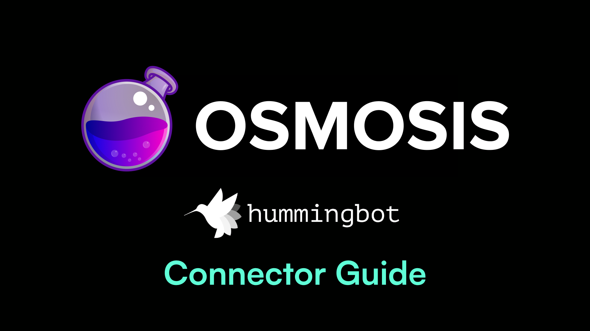

# Using Osmosis with Hummingbot




## Introduction

Welcome to our user tutorial on integrating the power of **Vega Protocol** with **Hummingbot** for your trading journey. In this guide, we'll walk you through the detailed steps required to seamlessly set up a Vega Wallet, link it with Hummingbot, and embark on your trading adventures. 

Whether you're new to automated trading or looking to leverage Vega Protocol's decentralized trading capabilities, this guide is designed to provide you with all the information you need to get started. Let's dive into the world of blockchain-based trading with **Vega Protocol** and **Hummingbot**, and unlock new possibilities in your trading strategy.

## Prerequisites

### Create a Cosmos Wallet

#### Leap (recommended)

**Browser Extension**

- [Chrome extension:]()

- [Firefox extension:]()

#### Keplr

**Browser Extension**

- [Chrome extension:]()

- [Firefox extension:]()


### Deposit Funds

Follow these steps to deposit and fund your wallet for trading on Osmosis:

!!! Note
    Please ensure your wallet has sufficient balance, including OSMO for gas fees 

[](metamask_deposit.gif)

**Steps:**


<br>

## Install Hummingbot

There are two main methods to install Hummingbot:

### Docker

The **recommended** method for installing Hummingbot is using Docker.

- [Docker Quickstart Guide](https://hummingbot.org/academy-content/docker-installation-guide/)

### Source

For advanced users who are comfortable using command line interface, installing from source allows for customization and private changes.

Guides for various environments:

  - [Linux](../../../installation/linux.md)
  - [Windows](../../../installation/windows.md)
  - [MacOS](../../../installation/mac.md)

<br>

## Add Wallet to Hummingbot

To connect your Vega Wallet to Hummingbot and unlock full trading capabilities, you need two important pieces of information: your **Snap Key** (also known as Vega Party ID) and your **wallet seed phrase**. Here's how you can find and use them:

### Export Private Key

Your **wallet seed phrase** is a separate piece of information, typically a series of words provided when you initially set up your wallet. This phrase acts as a backup to access your wallet and should be kept secure and private. 

When connecting your Vega Wallet to Hummingbot, you will be prompted to enter this seed phrase as part of the authentication and setup process.

Here's how to get your **wallet seed phrase** from Metamask

{: style="height:497px;width:296px"} &nbsp;&nbsp;&nbsp;&nbsp; {: style="height:497px;width:296px"}

**Retrieving your wallet seed phrase from Metamask:**

- Navigate to the three-dot menu at the top right and select **Settings** > **Security & Privacy**.
- Choose **Reveal Secret Recovery Phrase**.
- Confirm your identity by answering two security questions, then enter your Metamask password and click **Next**.
- Press the **Hold to Reveal SRP** button to view your wallet seed phrase.


**Security Notice:** Your wallet seed phrase is extremely sensitive. Keep it confidential and never share it online or with anyone you don't trust. Always ensure you're in a secure and private environment when handling your seed phrase.

<br>

### Hummingbot **connect** command

The **connect** command lets you add your user credentials in order to connect to an exchange or protocol. For centralized exchanges, this command asks you for your API key, while blockchain protocols asks you for your private key.

Hummingbot stores both API keys and private keys on the local machine in encrypted form, with the Hummingbot client password as the key.

[](connect_vega.gif)

**Connect Vega Wallet**

- To connect to **Osmosis mainnet** run the command below 

```
gateway connect osmosis
```

- To connect to the **Osmosis testnet**, select _'testnet'_ instead of 'mainnet' when prompted.


- You will be prompted to enter your **Osmosis private key**. If valid, you should get a message saying **The connector osmosis_osmosis_mainnet is now using wallet osmo<public_key>**

- To confirm the connection, you can run the balance command below to see if Hummingbot is able to pull the available balance from the exchange

```
gateway balance
```


<!-- ## Starting Your first script

To run your first script, in the Hummingbot terminal, enter the command below to start the [v2_dman_v3_multiple_exchanges.py](https://github.com/hummingbot/hummingbot/blob/master/scripts/v2_dman_v3_multiple_exchanges.py) script

```
start --script v2_dman_v3_multiple_exchanges.py
```

[](image14.png)

If you have connected your wallet successfully to Hummingbot and have sufficient funds in your mainnet trading wallet, the bot will then start to place orders on **mainnet** with the following trading pairs: 

- **BTCUSDPERP-USDT** 

- **ETHUSDPERP-USDT** 

You can run the **status** command shown below or press <kbd>CTRL</kbd> + <kbd>S</kbd> to check the bot status

```
status
```

## Modifying the Script

The **v2_dman_v3_multiple_exchanges.py** script has the following default values for exchange, trading pair and candles. 

[](image1.png)

If you want to make changes to the above as well as the **indicators**, **orders config**, **triple barrier** and other **advanced script configs**, follow the steps below. 

[](script_config.gif)

**Scripts Config**

- Locate your **hummingbot/scripts** folder and open the **v2_dman_v3_multiple_exchanges.py** file using any text editor or an IDE like [Visual Studio Code](https://code.visualstudio.com/). For the above example, we're using **nano** - which is a text editor available in Linux to make the changes from the command-line. 

- Make the changes you want, then make sure to save once you're done. In the above example we're switching from **mainnet** to **testnet** and changing one of the trading pairs from **ETHUSDPERP-USDT** to **INJUSDTPERP-USDT**.

- Restart Hummingbot and run the command below to start the script again

```
start --script v2_dman_v3_multiple_exchanges.py
```

For reference, here's a link to the [modified script](https://gist.github.com/david-hummingbot/e3a21aa802362b672560f62841660508)

<br> -->


## Known Issues

- alphabetical order of token pair
- fee tier (no lowest)
- poolprice rpc times out intermittantly

---

**[Placeholder for additional Osmosis info]**

---

## Additional Resources

- [Osmosis Front-End]()

- [Osmosis Mainnet]()

- [Osmosis Testnet]()

- [Testnet Faucet]()


