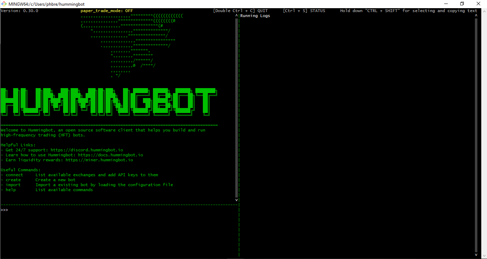
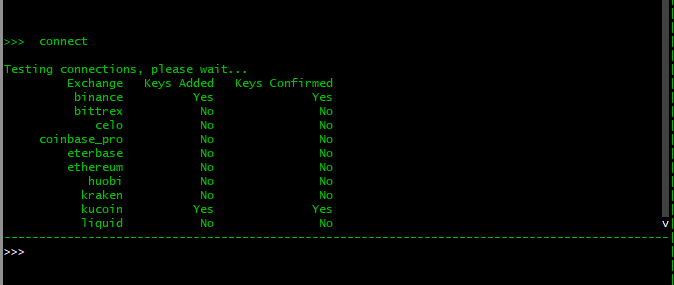
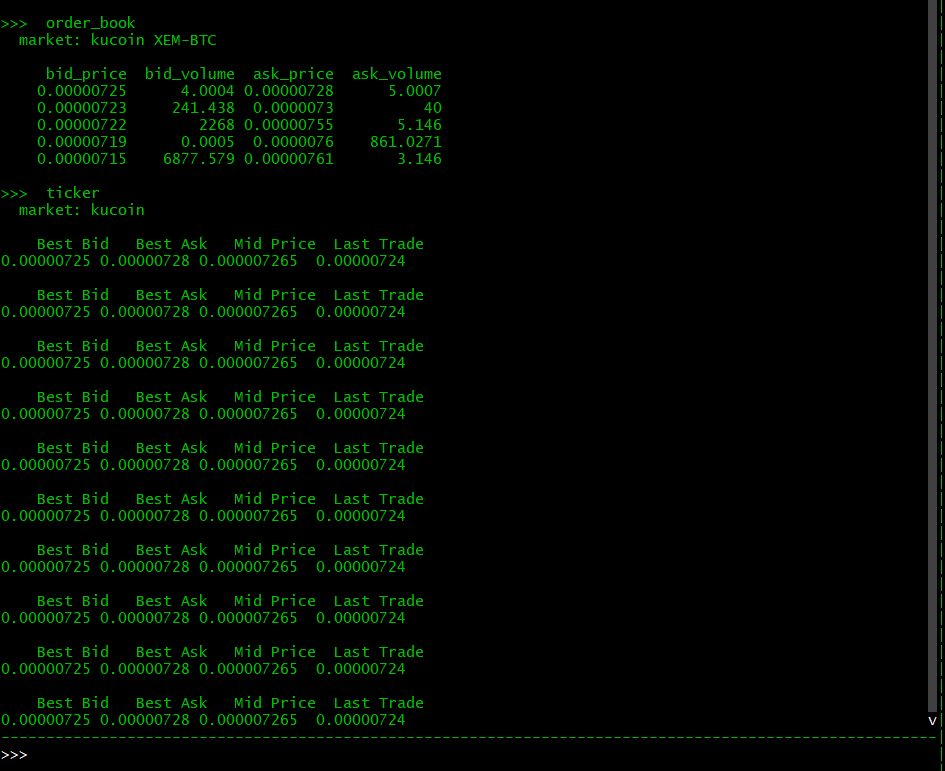

# Extracting the best value from Hummingbot - Commands part 1

### Welcome back to the Hummingbot Academy!

Through the resources available here on the Academy, you have already learned:

- [What is market making](../2020-09-what-is-market-making/index.md)

- [How to install Humminbot](/quickstart/index.md)

<!-- more -->

Starting to use **Hummingbot** can be daunting at first, and you might feel a bit overwhelmed by the CLI interface or by the amount of information options available to you.

We do have a great [documentation](https://docs.hummingbot.io/) center that can help you to understand what you can do with Hummingbot, but if you still feel it is a lot of information to digest, allow me to guide you through everything you need to know to successfully run your market making bot.

<!-- more -->

#### Understanding the Hummingbot screen

But before we start, we have to talk a bit about the **Hummingbot** screen:

If you are a Windows or Mac user and have never used a terminal/CLI interface, don't panic ([and carry a towel](https://en.wikipedia.org/wiki/Towel_Day)).

Executing trading operations with Hummingbot isn’t as hard as it seems at first glance, and is mostly about adjusting the configuration settings that best fit your strategy. 

As can be seen on the picture above, the Hummingbot screen is divided into three sections:

- Right section: **Log** section, where you will be able to see what actions the bot executed;

- Left upper section: **Status** section, where you will be able to see the settings and your order status

- Left lower section: The **command prompt**, where you tell the bot what to do.

#### How to use the commands

Typing commands on the **command prompt** is how you will be able to control Hummingbot.

Don’t worry too much about how many commands you will have to use and/or memorize. As you run your trading operation with **Hummingbot**, you will eventually learn them, and if you forget how to do anything, you can always return to this guide!

Also, **Hummingbot** have an autocomplete feature that will list all the possible commands as you type them, and if you press **up** or **down** on your keyboard you will be able to select what command you want.

**help**

Within this article we will talk about all the available **Hummingbot** commands on this article, but you can also use `help` to see a list of what you can type on the command line.

And two more tips before we continue:

- Anytime you press Tab on your keyboard you will be presented with all the options you can use, be it on the command line, or on a question asked after you entered the command.

- Using Ctrl + x you will be able to exit any configuration prompt.

#### Commands to create your strategy

Before starting, you first need to set up your Hummingbot instance to connect to the exchanges you will be trading on, and then define what will be the strategy you will use.

The commands listed below are used to complete this first step of your market making journey.

**connect**

For the bot to communicate with exchanges and send commands to place/cancel market orders, you must create a connection between the bot and the exchange.

Using the `connect` on the command, you will see all the connectors officially supported on the current Hummingbot version, their current situation:

To create a connection to an exchange (if you haven’t already), you can type `connect [exchange name]`.

After that, Hummingbot will ask you to input your **exchange API keys**.

Each exchange will have its own way to create these keys. If you don’t know how to create them, we have [a guide for each supported exchange on our documentation page](/exchanges/index.md).

If you are using a decentralized exchange on the Ethereum blockchain, the `connect ethereum` command will allow you to add your wallet private keys, so the bot will be able to interact with the protocol.

> All the keys that you add to your Hummingbot instance are stored locally and encrypted. We do not collect any type of data from your Hummingbot instance.

**What if my favorite exchange isn’t listed?**

There are many exchanges out there. Even though we wanted to make it possible for our users to connect with most of them, it takes a lot of time and effort to implement and maintain these connections with a high degree of reliability and quality.

Exchanges connections are handled by the part of the Hummingbot code that we call **connectors**, and only **connectors** that have been reviewed and tested by the Hummingbot core development team are added as officially supported to the latest version. 

But Hummingbot is constantly evolving, and our team is continually working on adding more **connectors** to our official release.

As an [open-source project](https://github.com/hummingbot/hummingbot), anyone in our community can contribute to building new **connectors**. Our team is always willing to help any developer who wants to help improve Hummingbot. You can always find us on our [Discord server](https://discord.com/invite/2MN3UWg).

But if you aren’t a developer, you can instead [create a request on our Github repo](https://github.com/hummingbot/hummingbot/issues?q=is%3Aopen+is%3Aissue+label%3Aconnector), asking for your favorite exchange to be added- or look for help from our community developers also on our [Discord server](https://discord.com/invite/2MN3UWg).

We are also working on giving more power to our community.  We recently completed our [second governance vote](../2020-10-governance-proposal-2/index.md), which allowed our liquidity miners to vote for the next connector to be officially supported and included in the next release.

**create & import**

After connecting to an exchange, it’s time to create your strategy configuration.

Entering the `create` command to initiate, then you will be asked to specify what strategy you would like to create:

`arbitrage`

This strategy is about connecting two exchanges and taking advantage of the different prices of an asset between them.

You can learn more about it reading the article [What is arbitrage?](../2020-09-what-is-arbitrage/index.md)

`celo_arb`

With this strategy you can execute arbitrage operations between the [Celo blockchain](https://celo.org/) and other exchanges for the cUSD stablecoin and CELO governance token.

Besides the profit opportunity from the arbitrage, using this strategy also functions as a way to help keep the cUSD price close to 1 USD.

You can learn more about how this strategy works on the [blog announcement](../2020-06-celo-arbitrage/index.md) and on the [quickstart guide](../2020-06-celo-arbitrage/index.md).

`cross_exchange_market_making`

This strategy is a combination of market making and arbitrage, where make markets on an exchange with typically lower liquidity and hedge with corresponding trades at better prices on another higher liquidity exchange.  This strategy is also known as “liquidity mirroring”.

You can learn more about how this strategy works by reading the What is [Cross-exchange market making?](../2020-09-what-is-cross-exchange-market-making/index.md) article.

`pure_market_making`

With this strategy, you will execute market making operations using only one exchange.

This is the standard market making strategy, and Hummingbot offers a lot of ways for you to customize how you want your bot to operate.

But if you still have some questions about market making and how it works, you can learn more about the it’s fundamentals by reading [What is market making?](../2020-09-what-is-market-making/index.md) Article.

After choosing your strategy, you will be asked to enter some basic parameters for your bot. 

If you enter any of these configurations wrong, don’t worry, you are always able to change them at any time with the `config` command (which we will talk more about later).

When you finish setting your strategy up, you will be asked to name your configuration file. It’s always a good idea to name the config file something that describes the strategy and is easy to remember (and keep the .yml extension).

Any time you restart Hummingbot, you can use the `import` command to load a previously saved configuration file.

#### Execution commands

With your Hummingbot ready to go, it’s time to order it to start sending orders to your exchange and do the heavy lifting.

To do that, you will have to use the commands below.

**start, stop & exit**

The commands `start`, `stop` and `exit` will do exactly what they say, so there isn’t much need for a long explanation about them.

Also, it is important to notice that every time you use these commands, the bot will cancel all the orders it created.

**paper_trade**

This is a very important step before you start using Hummingbot to trade with real funds, even if you already have experience as a trader or as a market maker.

It is very important to understand how the bot operates, and what effect of each parameter has on your strategy; otherwise, you run the risk of incurring a loss without understanding what went wrong.

Paper trading is a feature on Hummingbot that allows you to **test your strategy in real-time** with a simulated balance and simulated trades.

This simulation uses actual market information and actual trades to simulate how your bot would have traded and behaved in that situation.

Example:

- Hummingbot is connected to your exchange, and the BTC/USD mid price is 11,100;

- Hummingbot creates a buy BTC/USD order at the price of 11,099;

- If someone buys BTC at 11,099 on your exchange, the bot will act as if your buy order of 11,099 were filled.

To enable/disable paper trading use the command `paper_trade` on the command prompt, and you will be asked if you want to activate it.

To check if paper trading is enabled, you can just look at the top bar of your bot screen:

#### Market information commands

Although executing an **algorithmic trading** strategy means you won’t have to be glued to your computer screen all day long, markets change all the time, and a good trader will always look to adapt his strategy to the current situation.

With the commands below you will be able to check some informations related to the markets your Hummingbot is working on.

**balance**

Want to know how much of each asset you have on the exchanges you are connected to without having to access the exchange webpage?

Just use the `balance` command, and the bot will show all the assets you have on all exchanges you connected via the `connect` command.

Besides checking your balance, this command also has two additional functions:

`balance limit [exchange] [asset] [amount]`

With this, you can set a limit of how much of the asset each Hummingbot instance is allowed to use.

For example, if you have 1 BTC on binance, but want to use only 0.5 BTC to market with the bot, typing `balance limit binance BTC 0.5` will do the job, and the bot will never trade more than the value you defined.

The limit configuration will be saved on the `global_conf.yml` file, therefore any bot instance using the same global configuration file will share the limit.

If you installed Hummingbot on [Windows](/installation/windows.md) or [Mac](/installation/mac.md) using the binary installation, running two instances will use the same `global_conf.yml` file. A way to work around this is to install a second copy of Hummingbot in a different directory.

Installing via Docker on Windows, Mac or Linux presents the opposite situation, since each docker instance will have its own configuration files, and if you want to use the same global configuration, you will have to copy the files from one paste to another.

`balance paper`

As mentioned before, when running with `paper_trading` enabled, the bot will execute your strategy in real-time, but using a simulated balance.

This command will show you the simulated assets balances that are being used.

You can changed these values at any time by typing `balance paper [asset] [amount]`,  

That way, you can your Hummingbot with `paper_trading` enabled with any market that is available on the exchange you are connected to.

**order_book & ticker**

You can also check the current status of the market you are operating in.

With `order_book`, you will be able to look at five levels of the exchange order book, including the order volume.

Using `ticker`, the bot will show an update of what are the current prices on the market.

### Join our community!

That’s all for today, but there is still a lot more to cover. There are still a few more commands left to talk about, and we will go back to them in the next article. Meanwhile, if you haven’t already, feel free to join our ever growing community.

We already have an established (and growing) community full of people using Hummingbot, and you can join us on our [Discord channel](https://discord.com/invite/2MN3UWg) to talk about the bot, strategies, liquidity mining and anything else related to the cryptocurrency world, and receive direct support from our team.

To keep up with the news and updates, make sure to follow us on [Twitter](https://twitter.com/hummingbot_io), and our community on [Reddit](https://www.reddit.com/r/Hummingbot/).

On our [Youtube Channel](https://www.youtube.com/channel/UCxzzdEnDRbylLMWmaMjywOA?sub_confirmation=1), you can find a lot of content about market making, including interviews with professional traders and cryptocurrency- related events.

