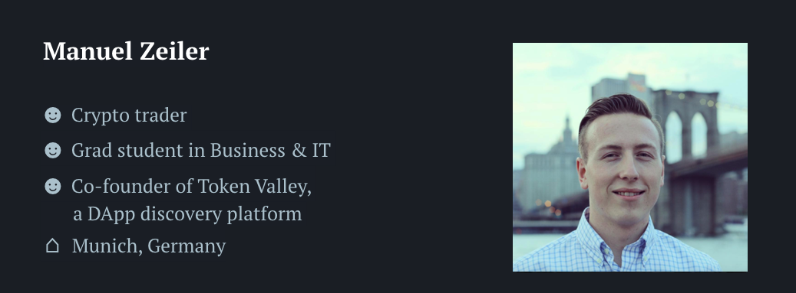

Welcome to the 3rd interview of this series! In this post, we will introduce Manuel Zeiler who is an experienced crypto trader and a co-founder of DApp discovery platform <a href="https://www.tokenvalley.com/" target="_blank"> Token Valley </a>.

Manuel once created a crypto market making bot that ran on IDEX, Bittrex and HitBTC, and he was able to pocket **10% profit per month**! He is now working on his master's thesis in blockchain at the Munich School of Management.

Let’s meet Manuel!

*Disclaimer: All views expressed in this interview are the interviewee’s and do not represent the opinions of hummingbot.io.*

### How did you get into crypto trading? Have you been trading other assets before crypto?

I first started to trade crypto in 2017. The funny thing is that crypto is actually the first thing I've ever traded. I haven’t traded any stocks before. I have a tech background because blockchain is also tech-heavy. I started trading classic arbitrage between EtherDelta and centralized exchanges in 2017, and then the boom happened. In 2018, I did some market making on centralized and decentralized exchanges.

### How did you get started in market making?

I had this gut feeling that there are some arbitrage opportunities between the centralized exchanges and DEXes such as IDEX. So I programmed a data scraping tool that used APIs to request prices every minute. Then I found out that there is a lot of what I would call “spread arbitrage” opportunities. So I started doing this “spread arbitrage”. I would quote on IDEX and counter fill (the order) on a centralized exchange. During this process, I realized what I was actually doing was kind of market making. I didn’t even know that this was market making.

Hummingbot’s <a href="https://docs.hummingbot.io/strategies/cross-exchange-market-making/" target="_blank">cross-exchange market making</a> is exactly what I did. I was really happy that somebody with more resources is trying to solve the problem. I was self-funded, and also to be honest, APIs of DEXes are just very immature. There are also some bugs. For example, the API would give me “sell”, but (it) was actually “buy”. So I had to tweak my code.

It’s a really fun journey and I was able to make some money. I did a lot of iterations on my bot (to make it work). When the code was finished, I just let it run automatically on AWS and maintained it from there.

> Ideally you have quite legit coins, good spreads and little competition, then you are good to go!

Unfortunately, Ethererum price dropped pretty significantly (in late 2018). The bot became unprofitable because I didn’t get enough fills to make up the big drop of ETH. So I eventually had to pause it.

### How did you manage your inventory?

At the beginning, I was having both altcoins and ETH inventories on both (CEX and DEX). Obviously, You do a bid on IDEX and it gets filled, so you need to do the counter fill on a CEX. For CEXes, I used Bittrex and HitBTC. You know I was doing long tail, there were highest match of markets between IDEX and these ones. I was trying to automate rebalancing but I was struggling because I had to automate Ethereum transactions but I found the APIs of centralized exchanges have some bugs.

After a while, I found the spreads were so high on IDEX, so I didn't have to do the counter fill on the CEX. I was also mitigating the inventory risk because there is no need for the inventory on the CEX (anymore). It became just classic market making on IDEX.

### Were you able to capture profit? How did you benchmark your profit?

Overall, I was making money. I made around 10% a month. Don’t think I made too much. There wasn’t a lot of volume because I was on a long-tail market. Many altcoins have tiny volume.

I measured my profit in USD because I paid for AWS in USD.

### What are the three most important trading lessons you've learnt from your experience?

A big lesson is managing inventory risk because I’m not in the game to go long, I’m in the game of market making.

The second one is that when you analyze it, in theory the number looks really good, but when actually doing it, you’ll figure out that there are competitions, bidding wars, etc. It’s actually not that easy to jump into the market.

Also as you can tell, those DEXes are still in their infancy. Code errors and stuff can be a problem. You need to be prepared for that.

### You mentioned that the No.1 thing is managing the inventory risk, how did you manage it?

Just not to have too much inventory in altcoins. To be really honest, you don’t need a lot of those altcoins because the average trade size is really really small, ~0.2 ETH per trade. Maybe you need a bit more (than 0.2 ETH). Depends on how many orders you have on each side. But I mean **I would only do 1 or 2 ETH**. When you make profit, get it out and make it ETH or DAI. Don’t accumulate those altcoins. I was making this mistake by accumulating a lot of altcoins at the very beginning.

### Are there any tools that you think are helpful for crypto trading?

Frankly, it’s just my own code, NodeJS, and MySQL. Sometimes I play with Google Sheets when I make the calculations. I don’t do charting on TradingView. I just have the order book in my head, since that's how the prices are determined. At the end of the day, it all comes down to the order book and trade history.

### Do you follow crypto Twitter or subscribe to any crypto media, and which ones do you recommend?

Yes, I get most of my information from Telegram, Reddit and Twitter. I’m in one of Crypto Valley’s telegram groups. I’ve been to their conference in Switzerland. It was really good!

On Twitter, I like <a href="https://twitter.com/zhusu" target="_blank">Zhu Su</a> from Three Arrows Capital, and I think he has some really good insights. I also follow <a href="https://twitter.com/kylesamani" target="_blank">Kyle</a> from Multicoin Capital.
