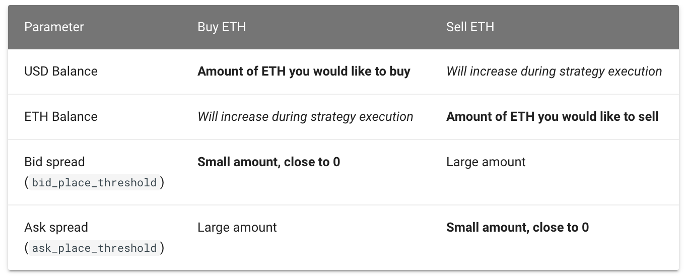
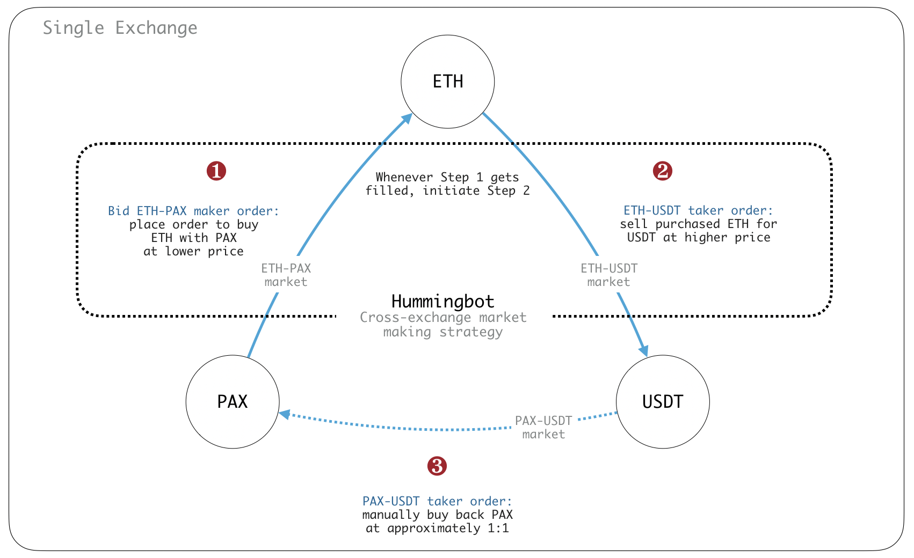

# Hummingbot Strategy Hacks 101

Hummingbot currently comes with three main built-in trading strategies.  A quick recap, these are:

1. **Pure-market making**: the most general form of market making, placing bid and asks for a single token pair on a single exchange.
2. **Cross exchange market making** (aka *liquidity “mirroring”*): making orders on one exchange (typically a less-liquid exchange, e.g. a DEX), and hedging those orders on another, more liquid exchange (e.g. Binance).
3. **Arbitrage**: monitoring a single token pair (or equivalents, e.g. different stable coin pairs) and trading when there is a pricing dislocation (buy low, sell high).

But did you know that you could use these strategies as building blocks to create other trading strategies?  As the Hummingbot team continues to build out the capabilities of Hummingbot, particularly additional exchange connectors and strategies, there are other strategies users can already derive from the existing three strategies above.

<!-- more -->

### Pure market making

#### EMS Strategy 1: Time-Weighted Average Price (TWAP) Trade Execution

Rationale
- Trade a large block of assets by splitting into smaller trades that are spread out over a period of time.
- Trade by placing limit orders, which is typically lower on most exchanges, instead of market orders.

A common need that arises for investors is to buy or sell a large block of an asset.  While an investor could do this all in one go, it may be more efficient to spread out trades over time to reduce slippage.  This particularly becomes more important for markets with thin order books, where order book depth may not allow for trading the entire size or would result in doing so at weighted average price multiple percentage points away from mid-market.

As an alternative, the amount of asset to be traded can be broken up into smaller trades which can be placed at different points in time.

The Hummingbot team is actually currently working on a TWAP (and VWAP)  strategy, which will be part of a developer tutorial to be released in October.  But in the meantime, users can effectively achieve the same result by looking at the configuration parameters in a different light:

- **order_amount**: the size of the smaller blocks that the trade is broken into
- **cancel_order_wait_time**: time delay between trading each block

Depending on whether or not you want to buy or sell (example: ETH):

By configuring the strategy this way, it will effectively execute a series of buys or sells over time.  The strategy will still continue to place buy and sell orders (given sufficient inventory), but by placing an order for the desired action (buy or sell) at a low spread (which may even be zero), this makes it more likely that this order will be filled, while placing the opposite order at a large spread makes that very unlikely to be filled.

#### EMS Strategy 2: Rebalance Your Portfolio for a Target Quote/Base Asset Ratio

You can use the **inventory skew** function to rebalance your portfolio to achieve that desired ratio.  Simply configure the pure market making strategy and set **inventory_target_base** to the desired amount of base currency in the portfolio.

Again, the strategy will continue to create bid and ask orders, but adjust sizes to try to eventually achieve the target inventory ratio.

### Cross Exchange Market Making

#### Triangular Arbitrage = Cross Exchange Market Making + Manual Rebalance

Typically cross exchange market making is used for two different exchanges.  However, cross-exchange market making on a single exchange could allow for executing [triangular arbitrage](https://en.wikipedia.org/wiki/Triangular_arbitrage).

Triangular arbitrage uses three different currency pair markets to capture profits.  Each market trades independently, which creates the potential for a pricing dislocation.

Below we use the example of ETH-PAX, ETH-USDT, and PAX-USDT.  The ETH-PAX market is currently less liquid than ETH-USDT.  An example of a triangular arbitrage trade would be (1) buy ETH (pay PAX) at a lower, cheaper price in the **ETH-PAX** market, (2) sell the purchased ETH (receive USDT) at a higher price in the **ETH-USDT** market, and then (3) sell the USDT proceeds for PAX in the **PAX-USDT** market.  In this trade, a trader starts out with PAX, routes it through the three markets, and hopefully ends up with more PAX than when he started.

Example cross-exchange market making configuration:
- Maker: Binance
- Taker: Binance
- Maker pair: ETH-PAX (the less liquid pair)
- Taker pair: ETH-USDT

Hummingbot’s cross exchange market making strategy would execute legs 1 and 2.  The strategy would not handle the third leg (USDT => PAX conversion), but assuming the conversion can happen approximately at parity, then the user could do this step manually at any time to rebalance.

[Title](/strategies/index.md)
To learn more about Hummingbot’s strategies, you can visit the [strategies documentation site](/strategies/index.md).

Are there any strategies you would like to see implemented in Hummingbot?  Please visit the [Discord channels](https://discord.gg/hummingbot) to suggest and discuss with the Hummingbot community.

