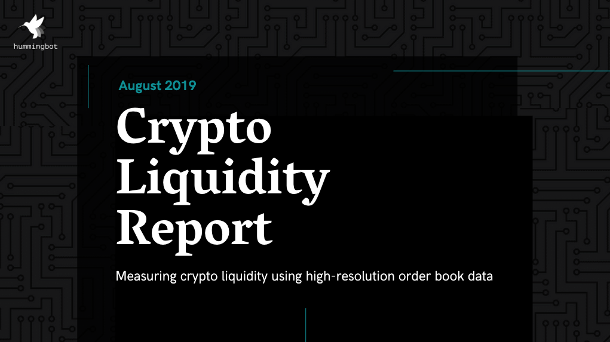
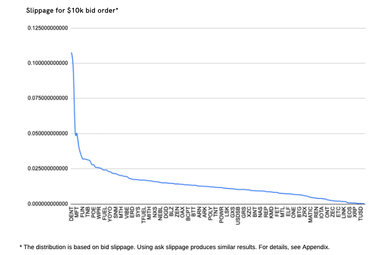

# Crypto Liquidity Report: Measuring crypto liquidity using high-resolution order book data

Recently, we conducted a first-of-its-kind analysis to measure the liquidity of crypto assets using high-resolution Binance order book data. In this report, we assess and rank the 159 cryptocurrencies on Binance based on their liquidity in August 2019.

To measure liquidity, we use **slippage**, which measures the price impact of a buy or sell order. Slippage refers to the difference between the expected price of a trade and the price at which the trade is actually executed. Deep, liquid order books have low slippage, while thin, illiquid order books have high slippage. 

We believe slippage is a more robust indicator of liquidity than trading volume. As an ex-ante metric, slippage measures information used by traders *before they trade* to decide whether to execute the trade and in which venue to execute it. In contrast, volume is an ex-post metric and can be [easily manipulated](https://www.theblockcrypto.com/daily/24941/bitwise-report-bitcoin-is-a-significantly-more-efficient-market-despite-95-fake-volume).

<!-- more -->

### Key findings

- The most liquid asset is 600x more liquid than the least liquid asset.
- Higher market cap assets and stablecoins have better liquidity.
- Only less than 20% crypto assets have <0.5% slippage.
- Volatility and liquidity are slightly correlated in an inverse way.

### Motivation

In our post [The Role of Market Makers and Importance of Liquidity](/blog/2019/01/30/the-role-of-market-makers-and-importance-of-liquidity/) we published earlier this year, we discussed how liquidity is the lifeline of an asset, and argued how the resource is not equally distributed in the crypto industry because market making as a service requires an exorbitant amount of capital, and professional market makers are only interested in more liquid digital assets. 

Crypto exchanges and token projects spend an estimated $3 billion annually on [market making](https://hackernoon.com/a-guide-to-market-making-for-crypto-startups-jydr387v), in the form of rebates, fees, and cost of inventory.

The goal of this Liquidity Report is to measure the actual liquidity of different digital assets on the market, and demonstrate how the liquidity resource is highly concentrated on top market cap assets and very scarce for long-tail assets.  

Given the liquidity crisis, this industry desperately needs an alternative solution. We believe, to cross the giant chasm between the demand for liquidity and the actual supply of it, incentivizing everyone within the project’s own community to act as its market maker is a viable, measureable and decentralized alternative for liquidity. 

### Power-law distribution of liquidity

Crypto liquidity follows a power-law distribution. More than 80% of digital assets have >0.5% slippage, and over 60% have >1% slippage. Bitcoin, the #1 liquid digital asset, has 0.018% bid slippage, which is 600X more liquid than DENT, the least liquid digital asset among all assets sampled in this research. 

### Top 50 liquid crypto assets

Below, we shared the list of the 50 most liquid digital assets based on their weighted bid slippage (using ask slippage produces similar results). In general, well-known large market cap assets and stablecoins are among the most liquid. Is there any one that surprises you?

### Positive correlation between liquidity and market cap

We also calculated the correlation between liquidity of an asset and its market capitalization. The correlation has been aligned with what we expected - the higher market cap assets tend to enjoy higher liquidity. 

That said, outliers exist. Assets such as MATIC, ONE and DUSK have higher liquidity relative to their current market cap while assets like DOGE have lower relative liquidity. This result also gives us confidence that small market cap assets have a chance to get better liquidity with the appropriate market making infrastructure in place, and the better liquidity would eventually be a driving force of the asset’s market capitalization. 

### Next steps

We plan to publish this liquidity report on a monthly basis to provide crypto projects, digital asset exchanges and crypto enthusiasts with a reliable indicator for crypto liquidity. Through collective efforts, we hope to see improved numbers and more fairly distributed liquidity resources for all the crypto projects in the foreseeable future. 

Additionally, we’re discussing with multiple projects and exchanges about the concept of empowering the community members to earn rewards from market making, and a few have been on board. We're now in the process of finalizing the structure and mechanics of a more scalable platform for community-driven liquidity bounties. We are going to make a formal announcement about that around the end of October! 