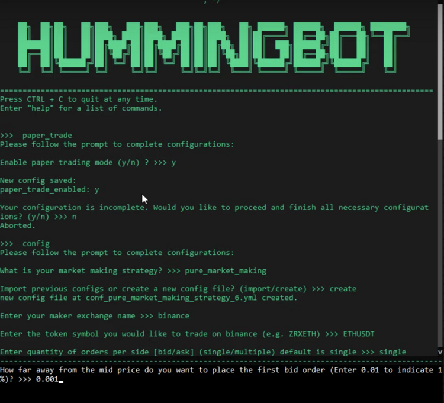
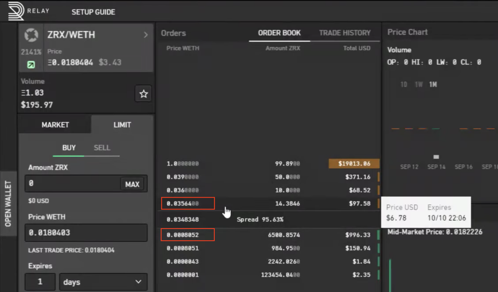
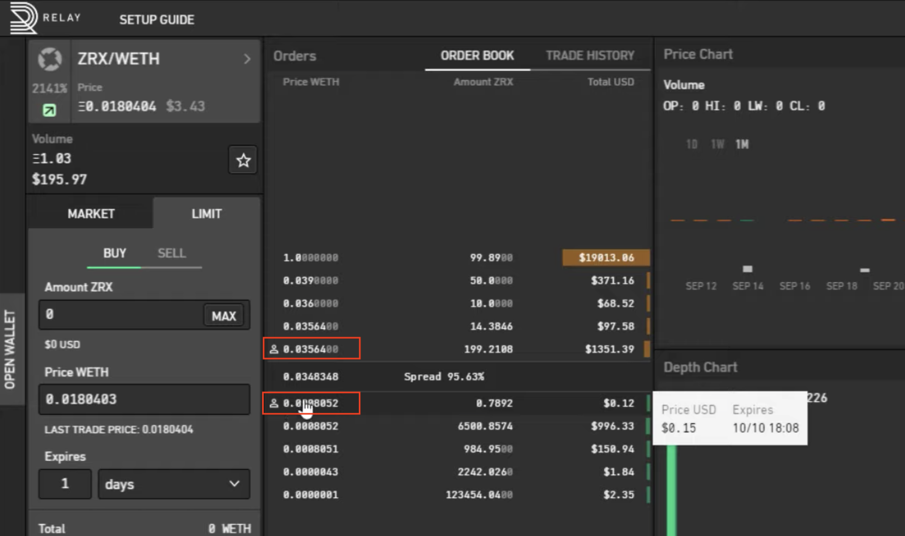

During the past two months, we have added a number of advanced features to the **pure market making** strategy to help users run Hummingbot with less risk and more profit! This post describes how these new features work:

* [Paper trading mode](#paper-trading)
* [Inventory skew](#inventory-skew)
* [Best bid-ask jumping](#penny-jumping)
* [Other features](#other)

--- 
<h3 id="paper-trading">Paper trading mode</h3>

Paper trading mode is a simulated market environment in which users make buying and selling decisions and test out the performance, rather than placing actual orders on a real exchange.

This feature allows users to test Hummingbot and simulate trading strategies without incurring any financial risks. It uses dummy balances that you can set in your `conf_global.yml` file using a text editor. An exchange account, Ethereum wallet and Ethereum address are also not required when doing paper trading. As of November 20, 2019, this feature has supported Binance, Coinbase Pro, Huobi, DDEX, Bamboo Relay, and Radar Relay.

The paper trading mode can be enabled/disabled inside Hummingbot with the `paper_trade` command. The top bar of the Hummingbot client should say `paper_trade_mode: ON` when it is activated. To adjust the dummy token balances used in paper trading mode, edit your `conf_global.yml` file, located in your client's `conf` directory.

Paper trading is a good way to see how well a certain strategy will behave in the market over a period of time. It gives you a rough benchmark of the performance.

> **Caveat: Paper trading mode may overstate the return you'll get from a certain strategy, because when you place orders in the real world, other market makers and traders will respond to your actions and might impact the profitability of your trades.**

Therefore, paper trading is more useful on a relative basis. For example, you may want to run two paper trading bots - one with a wider spread and very long cancel order wait time, and the other with a tighter spread and short cancel order wait time. Over time, you'll be able to figure out the best parameters you want to set when trading with actual assets. 

##### More resources about paper trading
- Watch the full demonstration video [here](https://youtu.be/Zxq6S317pfw?t=385).
- Read the documentation on paper trading mode [here](https://docs.hummingbot.io/operation/command-ref/#paper_trade).

<h3 id="inventory-skew">Inventory skew</h3>

Inventory risk is one of the main risks that market makers face. When markets trend upwards, market makers tend to sell more than they buy and hold less of an asset that increases in value. Conversely, when markets trend downwards, market makers tend to buy more than they sell and hold more of an assets that decreases in value.

The inventory skew parameter is designed to adjust your order sizes as your inventory changes, so that you maintain a target base/quote inventory ratio. For example, let's assume that you are trading the ZRX-WETH pair while your current asset inventory consists of 80% ZRX and 20% WETH. Setting your `inventory_target_base_percent` to 0.5 will allow the bot to automatically adjust the order amount on both sides, selling more and buying less ZRX until you get a 50%-50% ratio.

To turn it on, set the `inventory_skew_enabled` parameter to true, and set your `inventory_target_base_percent`. 

##### More resources about inventory skew
- Read the documentation on inventory skew [here](https://docs.hummingbot.io/strategies/pure-market-making/#inventory-based-dynamic-order-sizing).
- See the inventory skew calculator [here](https://docs.google.com/spreadsheets/d/16oCExZyM8Wo8d0aRPmT_j7oXCzea3knQ5mmm0LlPGbU/edit#gid=690135600).

<h3 id="penny-jumping">Best bid-ask jumping (formerly penny jumping)</h3>

Formerly called "penny jumping", this feature is ideal for making markets in illiquid, wider markets. It allows you to maximize the spread of your orders while still ensuring that your orders are the best orders in the market.

This feature comes from how professional market makers and crypto hedge funds actually do market making. Professional market makers do not naively set a spread, but rather they take into account order book state and react to what other traders are doing. 

By setting `jump_orders_enabled` to TRUE, your bot will automatically adjust your orders one tick better than the top bid and ask orders in the market. If another market maker jumps your order, Hummingbot will automatically jump the other market maker's orders until it reaches your spread parameters (`bid_place_threshold`, `ask_place_threshold`) are reached.

You can also specify how deep to go into the orderbook for calculating the top bid and top ask price using `jump_orders_depth`.

Let's see what this looks like in practice. In the order book below, the best bid and ask orders are highlighted in red.

When `jump_orders_enabled` is enabled, Hummingbot places orders (highlighted in red) one tick better than the previously best orders. If other traders jump you, the bot will automatically respond to the competing orders by jumping them.

##### More resources about best bid-ask jumping
- Watch the full demonstration video [here](https://youtu.be/7fnAUXRLF4g?t=1491).
- Read the documentation [here](https://docs.hummingbot.io/strategies/pure-market-making/#penny-jumping-mode).

<h3 id="other">Other features</h3>

##### Order replenishment delay

`filled_order_replenish_wait_time` is a parameter we added to Hummingbot in v0.15.0. The goal of this parameter is to allow the bot to pause before placing a new order in the event of an order just being filled. 

Markets tend to trend going in one direction, which poses a risk of continued trading in that direction. For example, continuing to buy and accumulate base tokens in the case of a prolonged downward move. 

To mitigate this risk, you may want to set a delay after an order is filled before replenishing your order. By default, we add a 10-second delay 

##### Hanging orders

Hanging orders gives you more control over how Hummingbot adjusts your orders. As a market maker, you want to set a spread on both sides of the order book. By default, we always cancel and replenish orders every fixed interval of time, but hanging orders allows you to adjust this behavior.

By setting `enable_order_filled_stop_cancellation` to true, Hummingbot will leave the orders on the other side "hanging" (not cancelled) whenever one side (buy or sell) is filled so that you can always buy low and sell high if the market is bouncing up and down.
