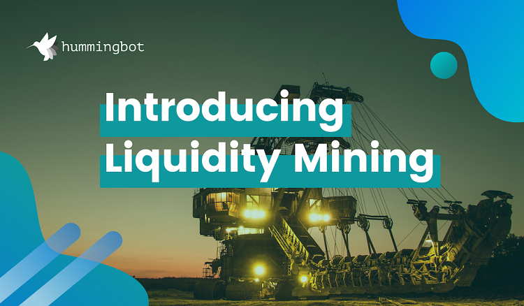
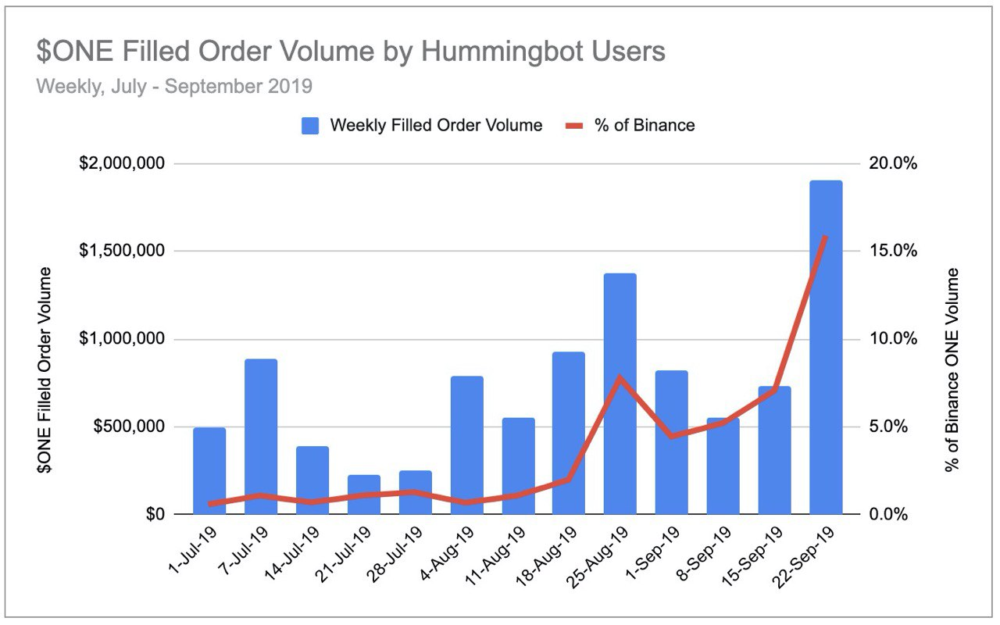
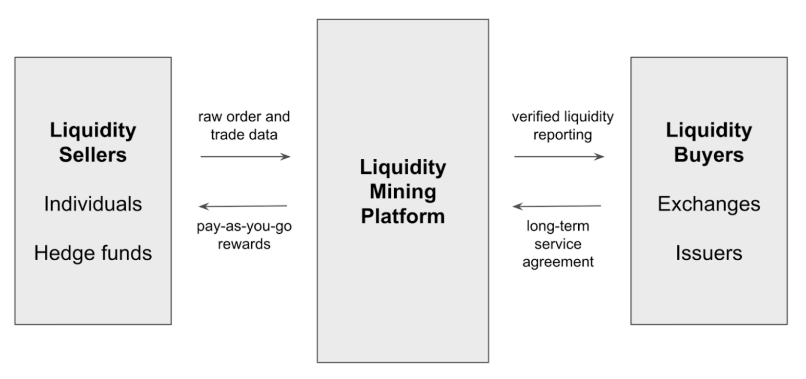
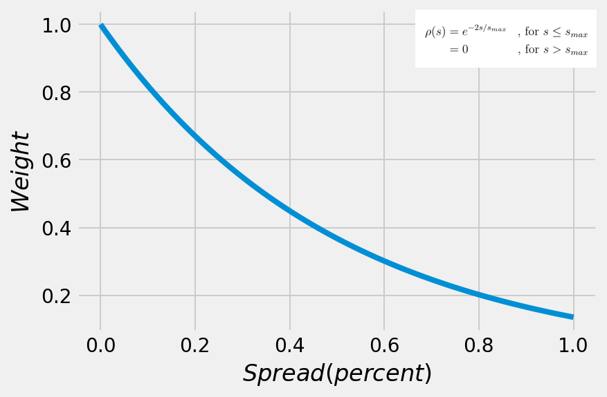
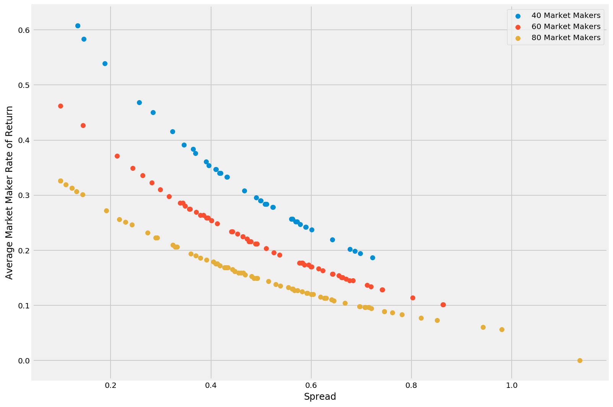
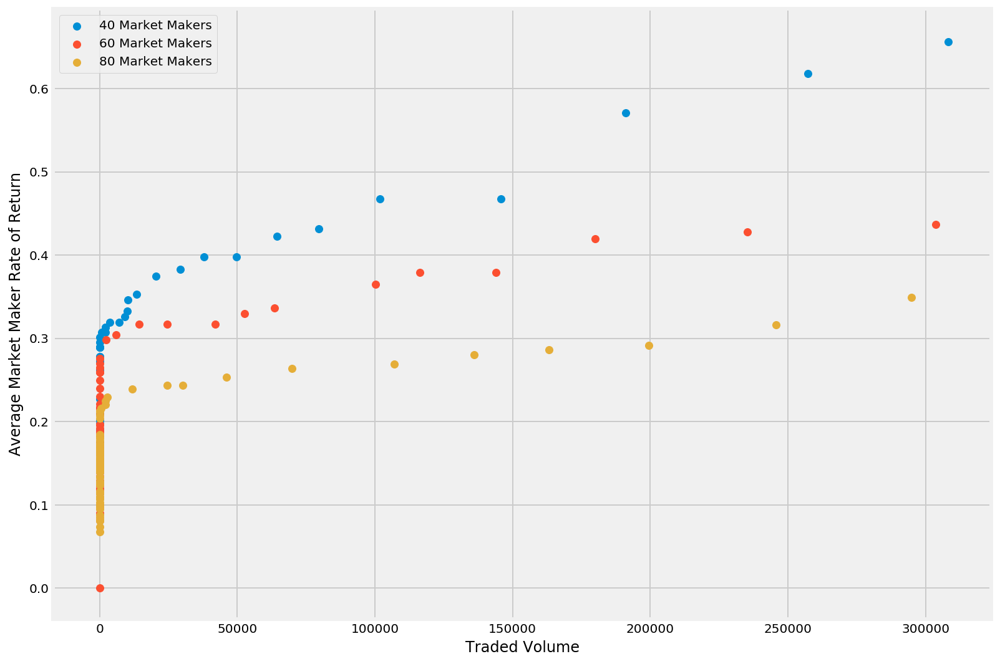

# Introducing Liquidity Mining: A Marketplace-Based Approach to Market Making

- Market making is a huge but inefficient industry in crypto. Exchanges and token issuers pay quantitative hedge funds millions of dollars per year to provide liquidity.
- We introduce **liquidity mining**, a digital marketplace for liquidity, powered by the Hummingbot open source software that lets anyone run a market making bot ([read the whitepaper](/liquidity-mining-whitepaper)).
- Simulations show that users can earn **10-50% annually** while providing the same level of liquidity as a hedge fund. This results in **5-10x cost savings** for exchanges and token issuers.
- We are excited to announce our **8 launch partners** that represent a broad cross-section of the crypto market (centralized exchanges, DEX protocols, and token issuers) who will create liquidity mining campaigns that reward their communities for market making.

<!-- more -->

### Market making is broken

The need for liquidity is persistent in crypto. Crypto markets are highly fragmented, caused by regulations that force exchanges to silo order books, competition between stablecoins, and technologies like [0x Launch Kit](https://0x.org/launch-kit) that allow anyone to create a decentralized exchange. Per [CoinMarketCap](https://coinmarketcap.com), there are now 21,000+ unique markets (trading pairs), all of whom compete with one another for a scarce pool of liquidity.

> **We estimate that exchanges and token issuers spend $1.2 billion per year on market making, in the form of fees, rebates, and cost of lent inventory.**

Despite this large sum of money spent, market making in crypto is rife with inefficiency, opacity, and manipulation. Ask any exchange and token issuer about their experience with professional market makers, and the resounding message is: (1) crypto market makers are expensive, (2) they operate as a black box; it's hard to evaluate how effectively they are doing their jobs and actually improving liquidity, and (3) economic incentives are lopsided and unfair.

A typical market maker arrangement is a multi-month contract with high monthly fees and additional fees charged per currency pair and per exchange.  Market makers force projects to give them millions of dollars of inventory, charge up to six figures per month in fees, and  receive a percentage of any profits generated while taking none of the downside. Exchanges and token issuers are effectively funding market makers to go wild at the casino!

While alternative arrangements do exist for exchanges, such as market maker rebates and agreements based on order book uptime, these too can be gamed.  Market makers can engage in **rebate arbitrage**, in which market makers can opportunistically create and cancel orders at select times in order to qualify for rewards while not actually providing beneficial, meaningful liquidity.

*How can these market makers get away with this?*  The problem is that there are only a limited number of quant hedge funds with the technology to provide this service; scarcity has allowed them to hold exchanges and token issuers hostage.

Until now...

### Individuals can be effective market makers

Hummingbot is an open source project that allows anyone to create and build market making bots. Launched in April 2019, we currently support 9 centralized and decentralized exchanges and 4 strategies. With 1,000+ installs per month, we now have a rapidly growing global community of individual and professional market makers.

In July, we ran a 3-month pilot with Harmony Protocol to assess whether members of their community could provide the same level of liquidity as a professional market maker. Over the course of 3 months, approximately 70 individuals were responsible for up to 15% of the Harmony $ONE token's overall trading volume on Binance:

Since professional market makers typically generate 10-20% of a token's volume on an exchange, the Harmony pilot proved that a community of individuals could effectively replace a professional market maker.

Now that we have established the basis for **decentralized market making**, how can we take the next step of expanding and scaling this concept to the broader crypto market?

### Introducing Liquidity Mining

Similar to how digital marketplaces such as Google Ads and Uber revolutionized industries such as online advertising and transportation, we believe that a marketplace-based approach can improve matching efficiency, boost transparency, and align incentives in the market for liquidity in crypto.

In this marketplace for liquidity, buyers can create campaigns that reward sellers for making markets in designated tokens and exchanges.  Reward payments can be mapped to objective, observed actions of liquidity sellers.

We call this **Liquidity Mining** because the concept is similar to proof-of-work mining. Rather than setting up a mining rig and using electricity, users utilize computational power and token inventory to run the Hummingbot market making client. By competing with other participants to earn economic incentives, their combined efforts can achieve a common goal, providing liquidity for a specific token and exchange. In return, they are compensated proportional to their work, according to an algorithmically defined model. For more details, please see the [Liquidity Mining whitepaper](/liquidity-mining-whitepaper).

##### Aligning liquidity buyers and sellers using spread

Successful marketplaces generally utilize a standard measure that fairly aligns incentives between buyers and sellers. In liquidity mining, this measure is **spread**, the percentage difference between an order's price and the current mid-market price.

For liquidity buyers, lower spreads mean improved liquidity, since an order's spread determines the marginal benefit in reducing slippage, which measures how much traders lose on a trade due to illiquidity. On the other hand, for liquidity sellers, lower spreads imply a higher level of risk, for which the sellers will require additional compensation.

We use an exponential decay function which weights the value of spread at each continuous level. Liquidity buyers can customize this distribution by adjusting two simple parameters, the function constant and the maximum spread.

Using this standardized measure, liquidity buyers can create reward schedules that only pay for observable, beneficial liquidity. Meanwhile, liquidity sellers are rewarded commensurate with the risks they bear.

##### Preventing gamification with high-resolution order book snapshots

Currently, market makers typically earn a monthly fee for complying with obligations related to spread, volume, and uptime. Since the uptime requirement is typically 80-90%, market makers can selectively post order in normal market conditions and intentionally stay out of the market in the most volatile periods in a month. This allows market makers to earn their monthly fee while minimizing risk, but it also prevents the consistency of liquidity through the month that liquidity buyers seek.

In liquidity mining, we split the monthly fee into small fixed blocks through the month. For instance, a $5,000 monthly fee can be represented as about 44,000 individual blocks of $0.11 per minute. By taking high-resolution snapshot of an order book each minute, we can allocate those "time block rewards" to the market makers with orders present in each snapshot.

In normal market conditions when liquidity is high, all market makers split the same fixed reward and earn a lower rate. But in volatile, illiquid markets when only a few market makers are willing to place orders, they also get the same reward. Like surge pricing in Uber, this mechanism incentivizes market makers to participate by increasing their compensation when their services are most needed.

---

This model allows the equilibrium "price" of liquidity to be set by natural market forces. The size of the reward pool and the spread distribution curve are levers that buyers can adjust to tailor how they want to pay for liquidity. Meanwhile, the snapshot block rewards incentivize market makers to earn higher rates of return for providing liquidity in volatile markets.

### Simulation-based analysis

Obviously, this marketplace can only work if the liquidity sellers are compensated fairly and rewarded appropriately for the risk they are assuming.

Since market making requires the deployment of inventory, the economics for engaging in liquidity mining needs to be comparable to those of alternative uses of capital, e.g. (1) HODLing, (2) lending, and (3) staking.  Furthermore, the act of market making may entail more risk than these alternatives; therefore, liquidity mining must create the potential for superior returns.

In the Liquidity Mining whitepaper, we presented the results of simulations that assess the effects of how this model works across different liquidity regimes.

We assumed a total monthly budget of less than $5,000, a tiny fraction of how much exchanges and token issuers pay market makers today. We then ran simulations with 40, 60, and 80 market makers, representing periods of low, normal, and high liquidity, respectively. Incoming market orders are modeled as a Poisson process with random arrival rates and sizes. For more information, see *§3.5.2 Simulation-Based Analysis: Results*, [Liquidity Mining Whitepaper](https://hummingbot.io/liquidity-mining-whitepaper)).

<b>Annual rate of return vs. spread</b>

Market makers earnings are a function of (1) spread and (2) competition. What's noteworthy is that these annualized rates of return compare favorably with other return strategies available to crypto holders, such as staking and lending. While running a market making bot undoubtedly requires more time and effort that those alternatives, users are compensated for that extra work via higher returns.

<b>Annual rate of return vs. traded volume</b>

Even though the liquidity mining model does not explicitly reward market makers for traded volume, returns are positively correlated with volume: market makers who earn the most also fill the most trades.

<b>Trade size vs. slippage</b>

Finally, the simulations show that as little as a $5000 per month budget may be able to generate a liquid market, even for larger trades. Slippage for a $10,000 order is 0.08%, 0.15%, and 0.19% for the low, normal, and high liquidity regimes, respectively.

As we wrote in our recent [Crypto Liquidity Report](/crypto-liquidity-report-2019-8.pdf), over 80% of the tokens trading on Binance have at least 0.5% slippage for a $10,000 order, and slippage has a strong inverse correlation with market capitalization.

### Launch partners

To launch the liquidity mining platform, we are excited to announce that we have partnered with a number of companies that represent a broad cross-section of the crypto market:

- **Centralized exchanges**: [Liquid](https://www.liquid.com/) (by Quoine), [Bitcoin.com Exchange](https://exchange.bitcoin.com)
- **DEX protocols**: [0x](https://0x.org/), [Loopring](https://loopring.org/#/)
- **Token issuers**: [Harmony](https://harmony.one/), [Zcoin](https://zcoin.io/), [iExec](https://iex.ec/), [Solana](https://solana.com/)

Our launch partners are united in the mission of promoting open access to market making and providing a fair, transparent model for market maker compensation.  Each partner has committed to launching a liquidity mining campaign to reward users for providing liquidity once the platform goes live.

We appreciate their support and are busy building the data infrastructure to power the liquidity mining platform. We expect the first campaigns to go live by January 2020. Hummingbot users will soon have many more opportunities to earn rewards!

### Liquidity mining enables crypto to realize its potential

Crypto allows anyone to create an asset that can be traded by anyone in the world. But whether it's a liquid global reserve currency like Libra, synthetic Tesla shares powered by [UMA Protocol](https://umaproject.org/), decentralized sports betting powered by [Augur](https://www.augur.net/), or digital cats and wizards issued by [Dapper Labs](https://www.dapperlabs.com/), these assets are only valuable if they are liquid.

But until now, the long tail of crypto assets has faced an unfair disadvantage. Due to high costs, traditional market making services have generally been inaccessible to all but the largest, most well-funded projects and exchanges.

>**Liquidity mining levels the playing field by allowing any project or exchange to get liquidity on a self-serve, pay-as-you-go basis.**

### For more information
- [Liquidity mining whitepaper](https://hummingbot.io/liquidity-mining-whitepaper)
- [Download Hummingbot](https://hummingbot.io/download/)
- [Hummingbot whitepaper](https://hummingbot.io/whitepaper.pdf)

For exchanges and token issuers interested to learn more about liquidity mining campaigns, please contact us at [partnerships@hummingbot.io](mailto:partnerships@hummingbot.io).
