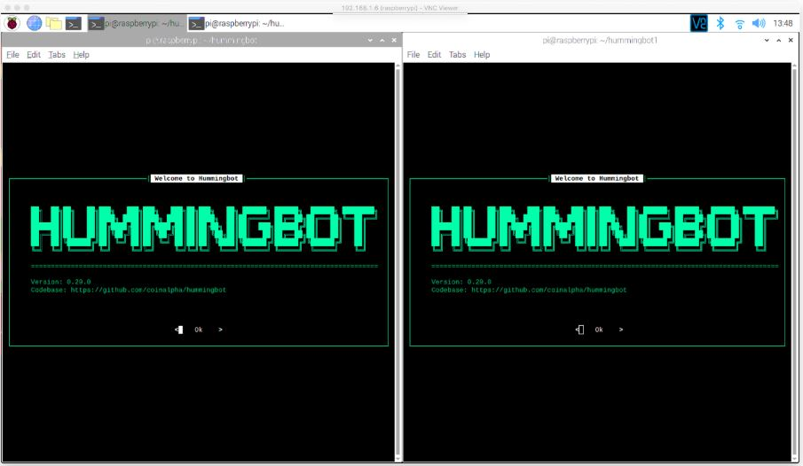
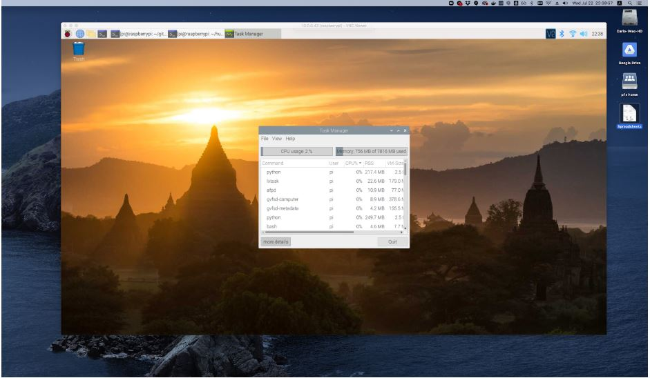
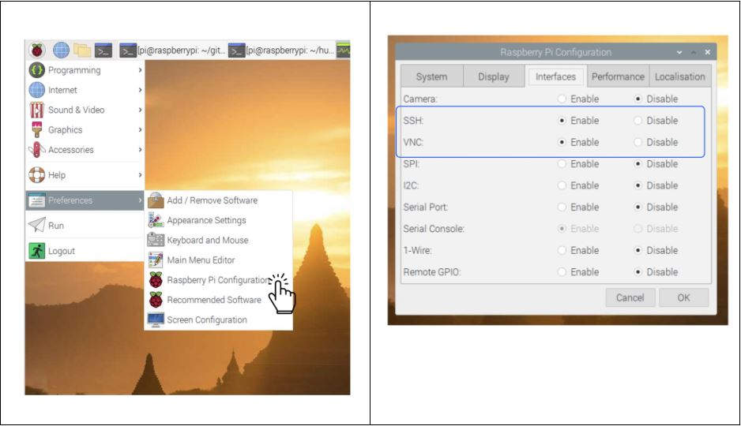

# Deploying Hummingbot on a Raspberry Pi 


*First of all, we owe much of the content of this blog post to one of our community members (@Punkhead) on our discord, who experimented with running Hummingbot on a Raspberry Pi and managed to successfully get it working!  He also published a post on Reddit ([Hummingbot on RPI4, how-to
](https://www.reddit.com/r/Hummingbot/comments/h83lhv/hummingbot_on_rpi4_howto/)) discussing how he did it.*
 

<!-- more -->

### Why run Hummingbot on a Raspberry Pi?
 
For users who want to run Hummingbot on a long-term basis, we generally recommend deploying Hummingbot on a cloud server.  Since Hummingbot is an automated trading bot trading on a market that is always open, you would typically want to run it 24/7, uninterrupted.  A cloud server works well because you can create a small server instance to discreetly run Hummingbot.  The downside of running Hummingbot on your local computer is that there are risks of interruption: it may have to compete for resources with other applications, any other application that crashes your system would also effectively crash Hummingbot, and you may simply forget that you’re running Hummingbot and accidentally close terminal or turn off your computer (e.g. folding your laptop closed).  By running Hummingbot on a cloud server, you have a dedicated machine that is only interrupted if you deliberately command it.
 

But now that we (@Punkhead) figured out a way to run Hummingbot on a Raspberry Pi, this might have to be the new go to way of operation!  Running Hummingbot on a Raspberry Pi has the same main benefit of running it on a cloud server: having a dedicated machine for Hummingbot.  Raspberry Pi’s are relatively low cost, easy to set up, energy-efficient since Pi uses about 4W which is 75 times less than desktop PC, and, of course, don’t have the monthly charges associated with a cloud provider.  These small but mighty pieces of hardware are more than sufficient to run even multiple instances of Hummingbot.

Of course, there are instances where a cloud server would still be better, e.g. if your internet connection or power may not be reliable.  However, for a majority of folks, this may not be a problem so a Raspberry Pi may be preferred versus a cloud server.


### Required equipment


 
To build a Raspberry Pi, you need the following:
* **Raspberry Pi board**: for our testing, we used a Raspberry Pi 4 with 8 GB RAM
* **SD card**: the Raspberry Pi’s data store.  A reader/USB adapter may be required to connect to your computer, to load the OS if you haven’t purchased a preloaded SD card
* **USB-C power supply**
* **Mini-HDMI display cable**: just for setup
* **Case**: optional, but recommended
 
Not having ever built a Raspberry Pi before, it sounded like a cool idea to timelapse video to document the build process.  However, it turned out to be disappointingly “not so cool”; the “build” itself was so easy that the video ended up being mostly just unwrapping parts.  Nonetheless, here’s that video: https://vimeo.com/440892396.
You can easily find parts on Amazon.com or shops referenced on [Raspberry Pi’s](https://www.raspberrypi.org/) site.  There are all-in-one kits, such as [this one](https://www.amazon.com/gp/product/B08956P7LC/).  But it’s just as easy to buy individual components, which also gives you more flexibility on customizing (e.g. choosing a different case).


### System requirements

In our testing, we found that each Hummingbot instance requires approximately 200mb of RAM per instance and approximately 600-650mb of hard drive space.  Therefore, the operation should be possible even on Raspberry Pi’s with less RAM than the 8 GB we used for testing.
 
Punkhead is actually running 17 instances on his Raspberry Pi!

The most resource intensive part of running Hummingbot is compiling from source, which ties up the CPU at 100% for a few minutes.  But since you only do this on installation and when updating Hummingbot versions, this is not really an issue.


### Installing Hummingbot
The only way to currently install Hummingbot on a Raspberry Pi is by downloading the source files from github and compiling and running from source.  This adds a few more steps than downloading binaries or running from Docker, but below we have provided a step-by-step guide to walk you through the process.

We plan on creating a Docker image version of Hummingbot in the future that will make operation much easier, but for the time being, you can install from source.

### Preparing the Raspberry Pi for installation
** Step 1. Install 64-bit Raspberry Pi OS **

To run Hummingbot on a Raspberry Pi, a 64-bit OS is required. Raspberry Pi has a beta 64-bit version of the Raspberry Pi OS. You can download [here](https://www.raspberrypi.org/forums/viewtopic.php?t=275370).
 
** Step 2. Load the image file to your Raspberry Pi’s SD card **

Raspberry Pi has an easy to follow [guide](https://www.raspberrypi.org/documentation/installation/installing-images/) with alternatives on how to load the SD card with a Raspberry Pi OS from different operating systems.  In my case, I [loaded the OS using Mac OS](https://www.raspberrypi.org/documentation/installation/installing-images/mac.md) using the built in command line tool `diskutil`.

** Step 3. Boot your Raspberry Pi **

Insert your SD card into the Raspberry Pi and plug in the power source. From there, the first launch options will be prompted. 
Sure, here's the formatted markdown:


#### Install Hummingbot Dependencies

**Step 1. Open the Raspberry Pi terminal**

In the top left corner of the desktop, there is a shortcut that opens the terminal.

**Step 2. Install Miniforge**
- Download Miniforge from GitHub

```bash
wget https://github.com/conda-forge/miniforge/releases/latest/download/Miniforge3-Linux-aarch64.sh
sh Miniforge3-Linux-aarch64.sh
```

- Install Python 3.7 

```bash
sudo apt-get install python3.7
```

- Update the alternatives 

```bash
sudo update-alternatives --install /usr/bin/python python /usr/bin/python3 1
```

**Step 3. Log out and Log back in to enable `conda`**

This will make the `conda` command available in shell / terminal.

#### Install pip dependencies

```bash
# 1) Create a conda environment for Hummingbot
conda create --name hummingbot

# 2) Activate your conda environment 
conda activate hummingbot

# 3) Install the pip dependencies
pip install pandas cython cachetools aiohttp ruamel.yaml eth_account aiokafka sqlalchemy binance python-binance ujson websockets signalr-client-aio web3 prompt_toolkit 0x-order-utils 0x-contract-wrappers eth_bloom pyperclip telegram python-telegram-bot jwt numpy mypy_extensions 
```

#### Install, compile, and Run Hummingbot

```bash
# 1) Clone the Hummingbot repo from Github
git clone https://github.com/CoinAlpha/hummingbot.git

# 2) Compile and clean your Hummingbot directory
cd hummingbot && ./clean && ./compile 

# 3) Run Hummingbot
./start
```

And that’s it! Hummingbot should be up and running.

### Running Multiple Bots



Similar to how you would run multiple bots when installing from source, you can just clone the Hummingbot repo to two different file folders, or just copy your clone to another folder. You then need to compile each instance separately, and you can launch each of them as separate processes.

**Running Multiple bot with tmux**

Tmux is a terminal multiplexer, it means that you can open multiple sessions of Hummingbot from one installation. With Tmux you can easily switch between multiple Hummingbot instances by detaching them and reattaching them. Checkout this link for details on how to [Get started with Tmux.](https://linuxize.com/post/getting-started-with-tmux/)

### Controlling Remotely using VNC Viewer

SSH and VNC features are natively built into the Raspberry Pi and can easily be turned on in the Raspberry Pi configurations settings. By turning these on, you can access the Raspberry Pi from another computer by (1) using terminal to SSH, similar to how you would access a cloud server, or (2) using VNC to enable remote desktop access to the Raspberry Pi GUI. This is very convenient; after initial setup of the Raspberry Pi, you can simply unplug the monitor, keyboard and mouse, and just set the Raspberry Pi itself aside and just access it remotely going forward.



**Step 1. Enable SSH and VNC on your Raspberry Pi**

**Option 1: Terminal using `raspi-config`**

```bash
sudo raspi-config
```

Under Interfacing Options, enable SSH and VNC.

**Option 2: Access in Raspberry Pi Configuration**

Select the menu in the top left corner of the screen then go to **Preferences** > **Raspberry Pi configuration** > **Interfaces** from there you will see options to enable SSH and VNC.



**Step 2. Get your Raspberry Pi’s private IP address**

Type `ifconfig` to get the IP address of your Raspberry Pi to enter into your VNC Viewer. For SSH, you can run `ssh pi@[ipaddress]`. The IP address is the `inet` address which is not the localhost IP address 127.0.0.1:


