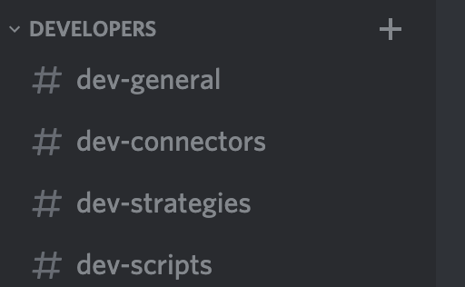

# Scaling the Hummingbot developer community 

From the beginning, we conceived of Hummingbot as a **shared public utility**: an open source project that helps you create trading bots on any crypto exchange without having to write low-level integrations to exchange APIs. 

We knew that we would have to create the first few exchange integrations, but we hoped that over time, the open source nature of the Hummingbot codebase would allow others to contribute their own exchange connectors and strategies. 

Since we launched last year, [58 unique developers](https://github.com/hummingbot/hummingbot) have contributed to the open source Hummingbot codebase. But we’re also aware we should be doing more to support the many developers, both professional and individuals, who want to customize Hummingbot for their own needs and contribute to the open source codebase.

<!-- more -->

In spite of our relatively incomplete documentation and constantly evolving codebase, many developers have forked Hummingbot and built their own exchange connectors, which is why we recently announced a [community governance initiative](../2020-08-exchange-connector-governance/index.md) to vote on which forks we support and merge into the official codebase. In addition, many developers want to learn how to use our new Scripts feature that lets you use market data to fine-tune bot behavior and even create their own Hummingbot strategies.

To better support the burgeoning Hummingbot developer community, I’m excited to announce the following initiatives:

### Monthly developer call

In order to provide a forum for our developer community, we will host a public developer-focused Zoom meeting on the morning of each Hummingbot release. Afterward, we will publish the replay to our Youtube channel.

Each developer call will cover:
* What's new in each Hummingbot release
* Upcoming developments on the Hummingbot roadmap
* Q&A and feedback

The first call will take place on **Monday September 7**, the planned ship date for the next version of Hummingbot.

**How to join**

We have created a [public calendar](https://calendar.google.com/calendar/embed?src=c_ruja4htlurjjq88j6o3ec5asv8%40group.calendar.google.com) that contains the upcoming developer call events. The Zoom link are in the calendar entries. We recommend that you import this calendar into your calendar application, using the links below.

* Calendar ID (use this with Google Calendar): c_ruja4htlurjjq88j6o3ec5asv8@group.calendar.google.com
* Public address (iCal): https://calendar.google.com/calendar/ical/c_ruja4htlurjjq88j6o3ec5asv8%40group.calendar.google.com/public/basic.ics

### Important changes by release

We release a new version of Hummingbot every 4 weeks, and we are constantly improving and refactoring the codebase. Starting with the [v0.30.0 release notes](https://docs.hummingbot.org/release-notes/), we now include sections that communicate relevant information for developers.

### New dev channels in Discord

We have created a new Developers section on our [Discord chat server](https://discord.hummingbot.io) with channels for different topics. Please ask your technical questions there, and our team will do our best to get them answered!

### Developer Hub (coming soon!)

We are working on a developer hub, an expanded version of the [Developer Manual](/developers/index.md) and other resources for developers on the Hummingbot website. We hope that this hub will provide a one-stop shop for any developer looking to build on top of Hummingbot.

