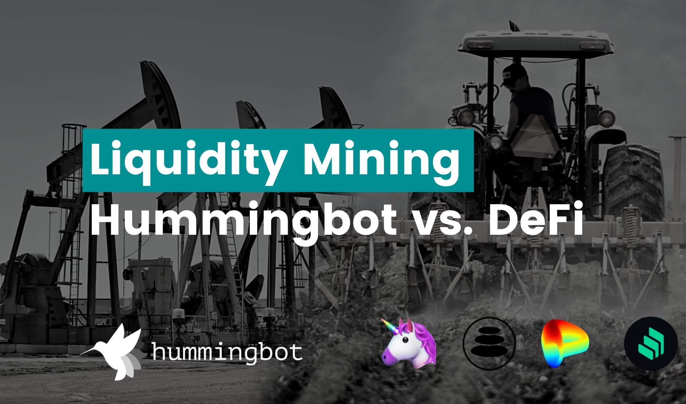
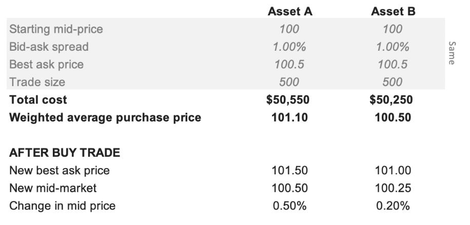
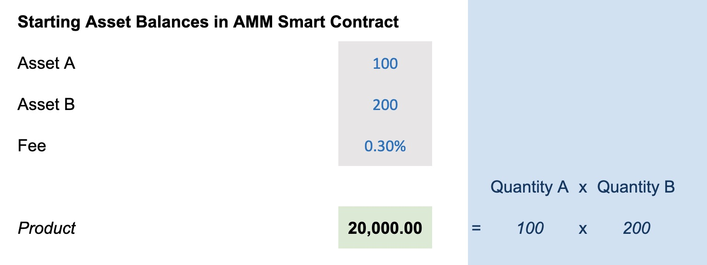
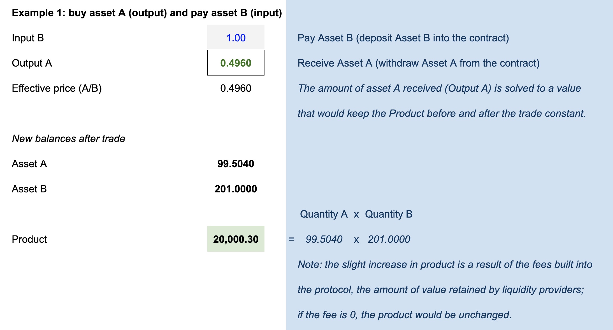
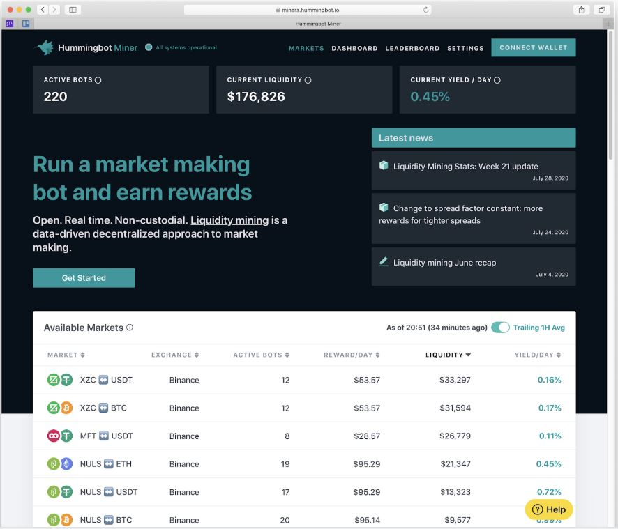
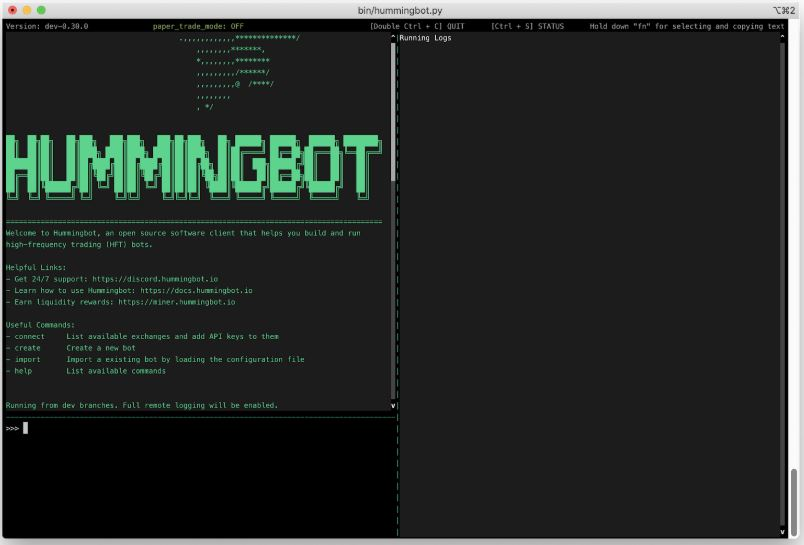
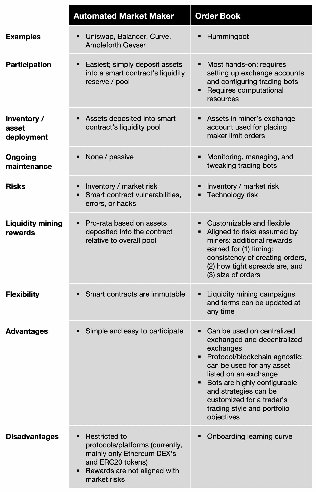

# Understanding Liquidity Mining

The need for liquidity is as constant a theme in the cryptocurrency market as are death and taxes.  However, as we have previously written in other blogs (such as [this one](../2019-11-liquidity-mining/index.md), the way in which token issuers and exchanges procure market making in the crypto market is broken.  The reliance on high cost, price gouging crypto market makers is just not sustainable or scalable. This led us to propose the [concept of liquidity mining](http://bit.ly/liquiditymining) and launch the [Hummingbot Miners](https://miners.hummingbot.io) platform for decentralized and crowd-sourced market making.

We have been encouraged to see other projects experiment with community-based liquidity provision, most notably in DeFi with automated market makers (AMM).  Whether it’s called “liquidity mining” or “yield farming”, there has been a surge in activity in DeFi as protocols such as Compound, Synthetix, Balancer, Ampleforth, and Loopring aim to propel wider market adoption by rewarding their communities for providing liquidity.

With this heightened interest in liquidity mining, we explain in this blog how our Hummingbot Miner platform fits into the landscape. We also compare and contrast liquidity mining in the order book model popularized by centralized exchanges versus the automatic market maker (AMM) model that is prevalent in DeFi.

<!-- more -->

### What is liquidity and why is it important?

We first begin with defining the goal.  There are several metrics that are generally associated with the concept of “liquidity”, such as traded volume, bid-ask spread, and slippage.  What these metrics aim to do is to quantify _**how easily and how efficiently**_ an asset is traded.

Below is an example of two order books with similar characteristics: same mid-price, best bid/ask prices, bid-ask spread.  However, they differ in that Asset B’s order book has 5x the liquidity (order book depth) of Asset A’s, i.e. for each price level, Asset B’s order book has 5x more orders than Asset A’s.  The graphs and summary table below show the impact of a taker buy order to buy the same quantity (500) of each token on each order book.  The blue bars represent the ask orders consumed by such an order:

Because Asset B is more liquid and has more order book depth: (1) I get a lower weighted average price (100.5 vs. 101.1, or $50,250 total spend vs $50,550) to buy 500 tokens which is closer to the mid-price, and in this example, is also the same as the best-ask price, and (2) mid-price is less affected (from 100 to 100.25 vs. 100.5) by the trade, which means the order book can absorb more trading with less price volatility.

Even though both assets started at the same price (same mid-price, best bid/ask price, bid-ask spread), ultimately it is more expensive for me to purchase my target amount of Asset A because Asset A’s order book is thinner, less liquid, and less able to accommodate my trade amount.  Similarly, if I subsequently want to sell my 500 of holdings, again I get a worse price for selling Asset A:

I am able to sell 500 of asset A and B and I receive an additional $300 for Asset B.  After the buy and sell transactions, I have incurred a loss of $1,100 for trading Asset A (spent $50,550 to buy and received $49,450 to sell) and only $500 for trading Asset B (purchased for $50,250 and sold for $49,750).  I incurred a lower friction cost to transact in Asset B.  As an investment, the price of Asset A will have to rise more than Asset B’s just to overcome the additional friction cost due to the lower liquidity.

One way to think of it is that lower liquidity results in a larger “penalty” for transacting in an asset, both to (1) users who want to use the protocol (more expensive to buy tokens), and (2) investors, since there will be higher friction costs for buying and eventually selling the assets.  Also for both types of buyers, lack of liquidity could possibly even prevent them from completing their intended transaction altogether, if there is not order book depth to accommodate larger order sizes.

### Why is liquidity important for token issuers?

_**Liquidity, or lack thereof, can be a barrier to protocol usage and adoption**_.  Difficulty or inefficiency in acquiring native tokens for use on protocols can put off users and potential new users from adopting the protocol.  In the example above, lower liquidity for Asset A makes it more expensive to acquire tokens and increases friction in trading the asset.  In more extreme cases, there may not be enough order book depth to accommodate a user’s demand for a larger amount of tokens.  Several issuers we have discussed with have noted that this is a recurring problem; they regularly get requests from funds or other large buyers of tokens (e.g. to acquire for staking) who are unable to source sufficent token amounts efficiently or at all from exchanges.    Also, higher volatility introduces extraneous risk for would-be protocol users, who now have to take into consideration pricing, timing, and inventory risk just to acquire tokens to use the protocol.

_**Liquidity factors into investor decisions**_.  Illiquidity and thin order books can prevent larger investors from acquiring and participating in the trading of an asset, due to higher volatility and uncertainty of being able to trade in and out of large quantities of tokens: “if I buy X tokens today, is there a risk that I may not be able to sell my X tokens tomorrow?”.  For larger investors and institutions managing larger investment amounts, liquidity is an important factor in the investment decision and may prevent these types of investors from purchasing an asset in the first place.  Naturally, fewer potential investors, and, in particular, fewer potential large/institutional investors, translates into lower overall demand and active traders of an asset.

_**Liquidity prevents large holders from being able to influence price**_: tokens which have a large portion of their circulating supply held by a few larger holders have an elevated risk of market manipulation and collusion. Thin order books and lack of liquidity further exacerbate this risk because a single large order can dramatically impact price. In contrast, a widely disseminated token, deep liquidity across multiple venues, and a larger number of liquidity providers can mitigate this risk.

_**Lack of liquidity can lead to exchange delistings**_: exchanges typically require tokens to have target amounts of traded volume and activity.  They typically warn token issuers whose tokens fall into the lower one-third of trading volume on their exchange.  Some factors may also include the number of unique traders trading the token.  If a token is not listed on an exchange or is not easily accessible to the general public, this feeds back into the first two points: barrier to adoption and closing off to potential investors.

### What is liquidity mining?

In the example above, “providing liquidity” means creating maker / limit orders that add to order book depth.  By adding maker orders to populate an order book, liquidity providers perform the vital function of absorbing taker orders and facilitating trading for other market participants.  Traditionally, providing liquidity, or market making, was predominantly or entirely done by specialized actors: professional market makers, crypto funds, and, in some cases, exchanges themselves.

In our whitepaper [Liquidity Mining](/liquidity-mining.pdf), we coined the term “liquidity mining”, which refers to a crowd-sourced, decentralized alternative to providing liquidity.  Rather than relying on specialized traders, liquidity mining sources liquidity from a network of actors, which may include a token issuer’s own community, other groups of traders such as the Hummingbot community, or, more broadly, members of the general trading/token-holding public.  Since market making is risky and requires the deployment/tying up of assets, liquidity mining needs to provide an incentive mechanism in order to solicit participation.

While Hummingbot liquidity mining focuses on getting decentralized market makers to make markets on central limit order books (i.e., centralized and decentralized exchanges), protocols such as [Uniswap](https://uniswap.exchange), [Balancer](https://balancer.finance), and [Curve](https://curve.fi) also get decentralized liquidity providers to facilitate liquidity by contributing assets for use by automated market makers.

### Why liquidity mining?

Liquidity mining provides a number of benefits for issuers:

**Reduce reliance on expensive market makers**.  To get liquidity, projects currently pay hedge funds for market making.  The hedge funds charge very high fees, typically require issuers to provide millions worth of inventory to be used for market making, and charge a significant portion of profits; market makers share in the upside but none of the downside.  Moreover, the hedge funds typically operate as a black box, with limited visibility into how they are trading, making it difficult to evaluate how well a market maker is doing its job.

**Reward and engage communities for decentralizing liquidity**.  Through liquidity mining, an issuer is able to reward entire communities and individuals who contribute to market making.  Rewards are distributed based on clearly-defined rules, ensuring that participants are rewarded for specific, eligible behaviors.  This also provides a way of distributing tokens to many more users.  Lastly, decentralizing market making diversifies the source of liquidity, decreasing dependence on single parties.

**Enable token-holders to earn a productive yield**.  Token holders can now use their tokens more productively instead of just HODL-ing.  Market making requires holding assets in inventory and making them available for trading and creating orders.  Long-term holders can participate in liquidity mining to deploy their holdings in order to earn liquidity mining rewards and yields.  If the rewards or yield are denominated in the native token, this has the additional effect that price increases further enhance yield, creating a virtuous circle as it becomes more attractive for market participants to purchase the token in order to participate in liquidity mining.

### History of liquidity mining

Hummingbot coined the term “liquidity mining” in a [whitepaper](/liquidity-mining.pdf) that we released in October 2019; similar to the concept of mining for proof of work or proof of stake, in liquidity mining, decentralized actors use their own resources (computing for running market-making bots, token inventory) for market making.  In aggregate, all participants are providing liquidity for specific token issuers and exchanges offering rewards.

However, prior to this, there had been other experiments with incentivizing communities to provide liquidity:
* Trading competitions on centralized exchanges like Binance, Huobi, and HitBTC were the predecessor to these.  The competitions typically rewarded users based on volume traded.
* Synthetic’s Uniswap liquidity incentive campaign in spring 2019
* Hummingbot’s [ONE Makers liquidity bounty program](../2019-09-does-community-based-market-making-work/index.md) for Harmony Protocol in summer 2019, our "liquidity bounties" pilot for liquidity mining.

Subsequently in March 2020, we launched our new Hummingbot Miners platform, our implementation of liquidity mining as we outlined in our whitepaper for which we have already ran campaigns for 8 token issuers.

_**DeFi nomenclature: “liquidity mining” vs. “yield farming”**_

The term “liquidity mining” has recently been used and adopted for wider applications in the DeFi space, such as Balancer and Curve, which are also decentralized protocols for providing liquidity.  Similar to Uniswap, Balancer and Curve are automated market makers where liquidity providers earn fees for depositing assets into pools that enable trading.  In addition to these fees, Balancer and Curve boost liquidity provider yields by also paying out BAL tokens to liquidity providers, and Uniswap may copy this model when they launch their own token in the future.

Aside from liquidity mining on Balancer and Curve, there has been increasing use and adoption of the term “liquidity mining” for other DeFi protocols that incentivize users to deposit/deploy their assets in return for token rewards, such as Compound.  While these protocols are not focused on “liquidity” in the trading context, they do deal with “liquidity” in the balance sheet management context, in its meaning of assets available to a company (or user/party).  The DeFi industry has also included protocols in this category into the “liquidity mining” umbrella.  Since these protocols involve the deploying of assets to earn additional token rewards or yields (be it for providing trading liquidity for asset lending), this type of activity is also being called “yield farming”, and the terms “liquidity mining” and “yield farming” are now being used interchangeably.

In this blog, we focus solely on the form of liquidity mining that refers to the deployment of assets to facilitate the _**trading**_ of assets.

### Liquidity mining options

#### Automated Market Makers

Uniswap was the first widely adopted automated market maker, though there were other protocols (e.g. Bancor) which had proposed and were working on similar concepts beforehand.  AMMs are simple smart contracts that hold two (in the case of Uniswap) or more (in the case of Balancer) different assets with varying amounts of each.  Anyone can trade with an AMM by sending it some amount of one asset and receiving a certain amount of some other asset.

The mechanics of an AMM is actually quite simple; below is a numerical example of a Uniswap-style contract (for reference, see this [AMM spreadsheet](https://bit.ly/amm-calc)).  We start out with a contract to trade two assets, Asset A and Asset B.  A liquidity provider (or group of liquidity miners in aggregate) have deposited 100 tokens of Asset A and 200 tokens of Asset B.  Uniswap is a “constant product market maker”, which means that the exchange rate used in trading is determined such that the product of the quantities of Asset A and Asset B should be equal before and after any trade.  In this example, the starting product is 20,000:

The following table illustrates the impact of a trader that trades Asset B (deposits 1 unit of Asset B into the contract) in exchange for receiving (withdrawing from the contract) some amount of Asset A:

The amount of Asset A that the trader receives is simply determined by a mathematical formula:

The AMM just solves for the amount of Asset A post trade that would keep the left and right sides of the equation equal, which in this case is 99.504.  As a result, the trader receives 0.496 of Asset A, which is the difference between the 100 starting balance and the 99.504 required new balance.

_**Yield for liquidity providers**_

The example above also shows the benefit to the liquidity providers, which is the built-in fee of 0.30%.  For the trade of 100 Asset B, there is approximately 0.003 of Asset B value (100 x 0.3%) that is retained by the contract.  In the example trade, the trader receives 0.496 of Asset A.  Absent the 0.30% fee, the trader would have received 0.4975 of Asset A.  The 0.0015 of Asset A that remains in the liquidity pool is the value retained by the liquidity providers.

Note: Since the ratio of Asset A to Asset B is 1:2, the 0.0015 of Asset A retained corresponds to 0.003 of Asset B value, or the 0.30% fee charged on the 100 Asset B trade size.

_**Participation and share of rewards**_

In order to become a liquidity provider for an AMM, you would just have to deposit tokens into the contract in the current ratio of assets in the contract.  In the example above (before trade), I can just simply deposit Asset A and Asset B in the corresponding 1:2 ratio (100:200).  I can deposit 10 units of Asset A and 20 units of Asset B which would entitle me to a claim for 9% of the overall liquidity pool in the contract.  At some point in the future, I could withdraw my 9% claim of the then asset pool, including any fees that have accrued and were retained in the liquidity pool.

This form of liquidity mining incentive is very straight forward; the liquidity provider fee is a fixed percentage for each trade and a liquidity provider’s share of rewards is simply based on the ratio of the assets they deposited into the contract as compared to the overall liquidity pool.

_**AMM variations**_

Similar to Uniswap, other liquidity mining protocols/campaigns such as Balance, Ampleforth’s Geyser, and Curve work much the same way as described above.  However, each of their liquidity mining platforms also pay out their native tokens (BAL, AMPL, and CRV, respectively) to liquidity providers as additional incentive to enhance yields.

Balancer also differs from Uniswap in that it allows for multiple assets (up to 8) to be included and used in a single liquidity pool.

### Order book liquidity mining

Our liquidity mining platform [Hummingbot Miners](https://miners.hummingbot.io) is a form of liquidity mining that is not based on smart contracts.  Rather than relying on smart contracts, we use data systems and infrastructure to measure liquidity provider’s trading activity and contributions to liquidity on existing trading venues, i.e. centralized and decentralized exchanges.  While this is materially more complex than an AMM, the benefits are significantly more flexibility with wider-reaching applicability.  For example, this form of liquidity mining can be applied to centralized exchanges (in addition to DEXes), while incentive mechanisms can be customized to reward for specific actions by traders.  In addition, miners are engaging in a traditional form of market making, creating bid and ask orders on an exchange order book to create order book depth.

In order to enable this form of liquidity mining, we have developed two main components to our system:

1. **the Hummingbot software client**: an open-source trading bot with tools and trading strategies that allows anyone to act as a market maker.

	
	
2. **Liquidity mining infrastructure**: data collection and analysis infrastructure that allows us to track and analyze orders created by liquidity miners in order to administer incentive and rewards mechanisms.

While we provide Hummingbot as a tool to enable users to market make, traders with their own bots or even those who want to manually trade, can still participate in liquidity mining without needing to use Hummingbot.

_**How it works**_

Hummingbot Miner liquidity campaigns are essentially trading competitions, with predefined rules for eligibility and the distribution of rewards.  Miners are rewarded for placing and maintaining orders in an order book.  A token issuer or exchange funds a reward pool and specifies the criteria and methodology for participants to earn this reward, including parameters such as (1) which exchange, (2) which trading pairs are eligible, (3) maximum spread of orders that are eligible for rewards, and (4) the gradient of how much to reward orders placed at tighter spreads vs. those placed at wider spreads.  The Hummingbot Miners infrastructure collects user order data and applies the campaign’s rules to miners’ orders in order to determine, and ultimately pay out, rewards.

One of the innovations we proposed in our whitepaper was a data-driven incentive mechanism that aligns liquidity mining rewards to the risks associated with market making: miners earn higher rewards for (1) more consistently placing maker orders, with (2) tighter spreads, and with (3) larger sizes.  A liquidity mining reward pool is split up equally and allocated to each minute in a reward period.  In order to maximize rewards, a miner would have to consistently place and replenish orders in the order book over time.  We continually take snapshots of orders and trades created by miners, and freeze an aggregate snapshot for each minute.  For each minute snapshot, we then weight orders created by miners based on spread (tighter spread, higher weight) and size (larger order size, higher weight).  We subsequently use these weights to pro-rate the share of that minute’s reward pool amongst miners.

The end result is that rewards are designed to reward actions that create beneficial liquidity (consistent orders with tighter spreads and larger sizes) to compensate for the additional risk associated with those actions.

#### Summary comparison of liquidity mining alternatives

