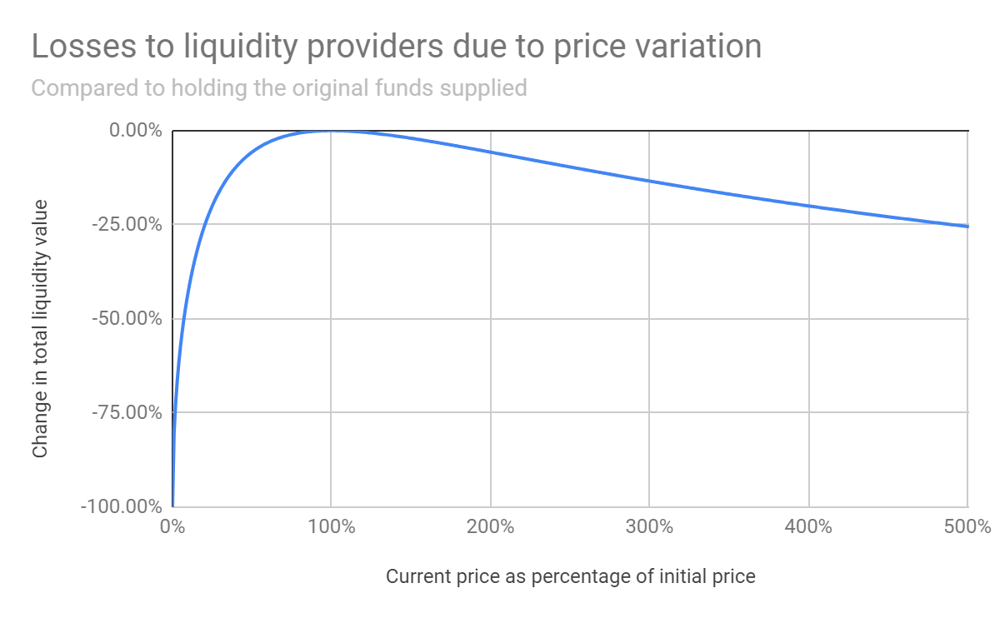
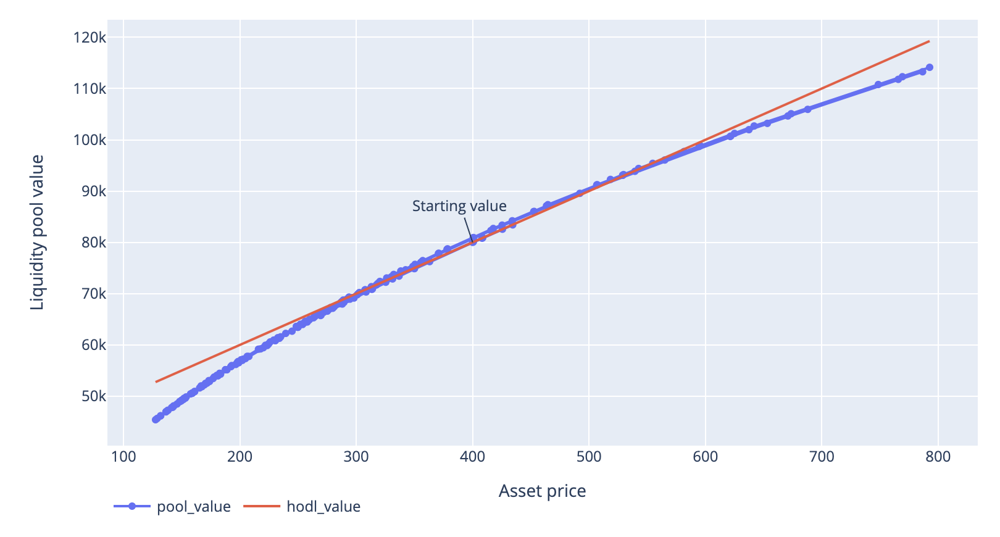
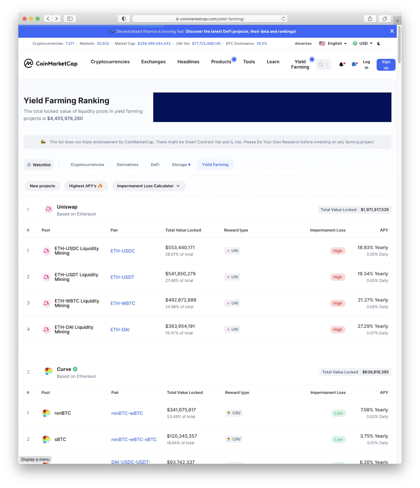
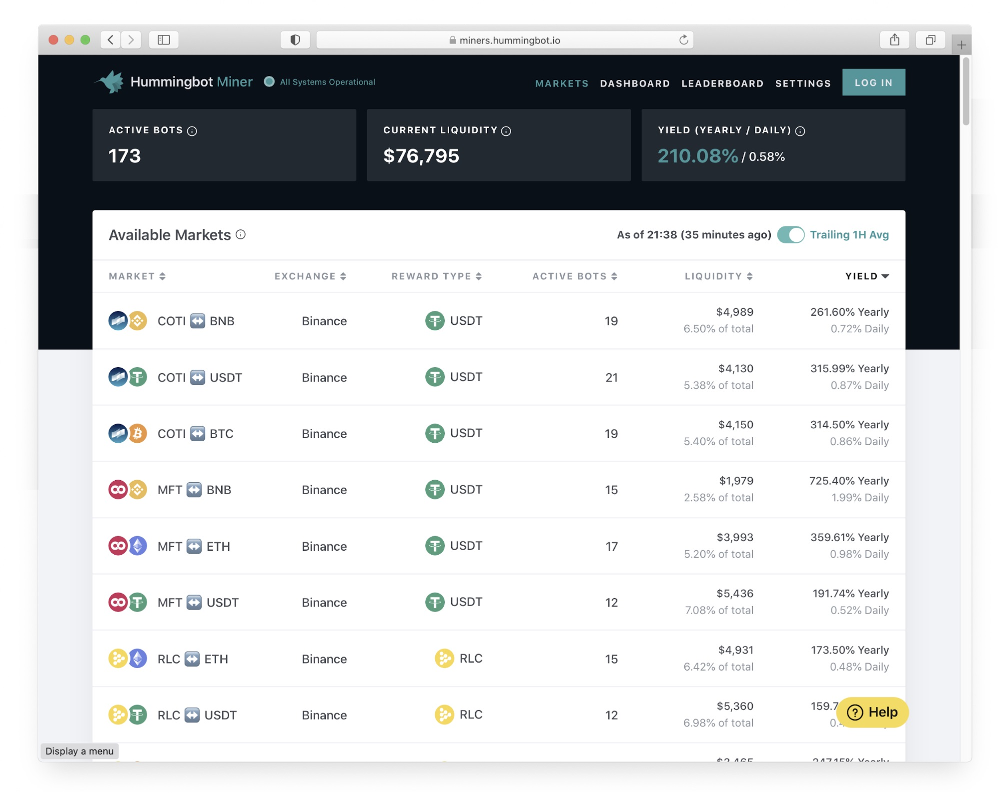

While we wrote the [original whitepaper](https://hummingbot.io/liquidity-mining.pdf) and coined the term “<i>**liquidity mining**</i>”, the concept recently became popularized in DeFi with the emergence of [Balancer](https://balancer.finance/), [Curve.Fi](https://www.curve.fi/), and, despite being late to the game, [Uniswap](https://uniswap.org/), who recently introduced token distributions to the original Automated Market Maker (AMM) concept.

Our version of liquidity mining and that of DeFi share the same objective: <i>**finding an efficient way for token issuers and protocols to provide liquidity for digital assets**</i>.  Token liquidity has long been a problem in the cryptocurrency market due to the large and growing number of token assets, exchanges, and exchange protocols, meanwhile there has only been a limited number of sophisticated (and expensive) hedge funds and market makers that could serve the markets.

> **Hummingbot Miners and AMM liquidity mining both take a decentralized, crowd-sourced approach to market making. They allow the general public, not just the professional market makers, to participate in providing liquidity for digital assets.**

One important way in which they enable this is by creating frameworks for compensating a decentralized group of market makers.

<!-- more -->

Most of the readers reading this will probably already be aware of the promise of tens to even hundreds of percentages of yields offered by liquidity mining protocols as well as on Hummingbot Miners.  **But are they real? What’s the catch?**

In this post, we discuss the considerations in participating in liquidity mining through DeFi AMM versus Hummingbot Miners: what are the advantages, disadvantages, and the risks of the two different approaches.

### AMMs... a recap

Automated Market Makers (AMMs) are a recent innovation in DeFi that introduced a new, simplistic form of market making enabled by smart contracts. Automated market makers are smart contracts that hold assets (collectively, the "liquidity pool") and allow for exchange between those assets.

The prices at which assets are exchanged on an AMM are determined by a simple equation that references how much of each asset is contained in the liquidity pool. The simplest model is the "Constant Product Market Maker model" (XYK) introduced by Vitalik Buterin and popularized by [Uniswap](http://uniswap.org).  *To learn more about the specifics and more details of how AMMs work, here are some great articles*: [What Explains the Rise of AMMs](https://medium.com/dragonfly-research/what-explains-the-rise-of-amms-7d008af1c399).

Specifically for this post, what's important to note is that **for AMMs, the traditional concept of market making is split into two functions: (1) supplying assets/inventory, and (2) determining pricing for trades**. In traditional market making, the market maker performs both of these functions.

For AMMs, *would-be* market makers are relegated to only performing #1: they merely deposit and provide assets to the smart contracts that are to be used for trading. As mentioned above, the determination of price (#2) and facilitation of trade is actually done by the smart contract itself, using the pre-programmed equation. In fact, the actors supplying assets in the context of an AMM are designated "*__liquidity providers__*" rather than *market makers*, reflecting the more limited scope of their involvement.

Since the smart contract is only a set of rules and instructions that doesn't actually do anything on its own, it relies on an external third party, the arbitrageur. Because the AMM is passive, it requires arbitrageurs to trade with it in order to change the composition of the liquidity pool, which, if you recall, is what determines the exchange prices of the AMM and how they should eventually move in-line with market prices.

Liquidity providers deposit assets into an AMM and share a proportional stake of the pool's assets. As a result, a liquidity provider shares the same main risk as a traditional market maker: inventory risk.

Even without any trading, the value of the assets in the pool can go down (relative to some benchmark asset, e.g. USD). And since the composition of the liquidity pool changes over time based on trades, there's also the risk of holding or accumulating an asset that's falling in value (e.g., arbitrageurs trading in the devaluing "bad" asset into the AMM while taking out the (relatively) appreciating "good" asset).

Also, because AMMs require arbitrageurs in order to function, they inherently and by definition are "*leaving money on the table*". Arbitrage is a zero sum game; if an arbitrageur is capturing profits by trading with an AMM, that profit needs to come from somewhere. If you're a liquidity provider, surprise!... that profit is coming from ***you***.

> 🦹‍♂️  **If the other side of your trade is an arbitrageur, you're probably losing money...**

There have been a number of blogs and studies into "<u>impermanent loss</u>, trying to quantify the economics of acting as a liquidity provider in an AMM, such as *[Uniswap: A Good Deal for Liquidity Providers?](https://medium.com/@pintail/uniswap-a-good-deal-for-liquidity-providers-104c0b6816f2)* and *[A primer on constant product matching markets](http://gdre.leo-univ-orleans.fr/direr/paper/Uniswap_v2.pdf).*

The analyses typically show a chart that looks like the following:

*Source: [Uniswap: A Good Deal for Liquidity Providers?](https://medium.com/@pintail/uniswap-a-good-deal-for-liquidity-providers-104c0b6816f2)*

What this graph shows is that at the moment a liquidity provider deposits assets into the liquidity pool, the change in the value of assets starts at 0% and the price of the asset (x axis) is 100% (of course, nothing has happened yet).

Once trading occurs resulting in prices moving up or down (movement along the x-axis), the total value of locked tokens will go down, no matter the price direction, following the path of the curve. Only if price eventually reverts to the original price when tokens were deposited will the liquidity provider return to breakeven.

🤔 ***Wait… what?  So if price moves either up or down, I lose money, and at best I can break even if price reverts to the starting price?  Why would anyone do this?***

**Protocol fees**: to compensate for this risk, the AMM charges fees to traders using the protocol that are accumulated and shared among the liquidity providers. Uniswap started out by charging a 0.3% spread. However, as shown in the cited study above, the 0.3% fee is simply not enough to compensate for the impermanent loss risk.

**Hard to measure performance**: monitoring profits and benchmarking for a liquidity provider is not so straight forward. If the asset price moves higher, the pool value goes up.  Below is another way of looking at the liquidity pool value; rather than looking at the change only (from above), the following graph shows the absolute value of the pool (blue) after 200 simulated trades, compared to the value of the original assets (red) if there were no trades (i.e. HODL):

When prices go up, many liquidity providers may be happy their portfolio value increased, and they may not realize or focus on the fact that actually the value of their assets would be *even higher* had they not done anything.  If asset price goes down, well… just blame it on the market.  Doing something versus not doing something just gets lost in the broader move in the market!  Also, some liquidity providers may just trust that the 0.3% is enough compensation and better than “doing nothing”, but in reality as already mentioned, the 0.3% protocol fee is likely insufficient to compensate liquidity providers for just about any asset with any price volatility (i.e. any asset other than a stable coin).

**Protocol supporters / token issuers**: liquidity providers may not necessarily be profit driven.  Some may provide liquidity, even if it results in portfolio losses, because they want to promote use of the AMM protocols.  Also, token issuers may fund a token pool for their tokens to increase accessibility and tradability of their tokens. They might even use an AMM to "list" their tokens and make them accessible to the public for the first time, to avoid the listing fees and market making requirements of centralized exchanges.

**Token rewards**:  OK so the above rationale is probably not compelling for the majroity general public.  So now we’re getting to the real reason AMM protocols have exploded in the past few months.  It comes down to…*cold hard cash*. Or rather, **token rewards**.

AMMs really blew up when protocols like [Balancer](https://balancer.finance/) and [Curve.Fi](http://curve.Fi) introduced liquidity mining rewards. In addition to the protocol trade fees, liquidity providers received a generous allocation of protocol tokens, which compensated for impermanent loss, and then some. The generous liquidity mining incentives made it so that liquidity providers no longer really had to think too much about impermanent loss.

> **The generous liquidity mining token rewards offered, coupled with the ease of participation, drove the enormous growth of DeFi and participation in liquidity pools.**

---

#### Hummingbot Miner: liquidity mining for centralized exchanges

[Hummingbot Miner](https://miners.hummingbot.io) is our platform where we enable token issuers and exchanges to fund rewards pools that can be earned by market makers and traders for providing liquidity and order book depth for specific tokens. Unlike the AMMs, our platform is not a smart contract protocol; it is trading data infrastructure that enables <i>**liquidity mining on centralized exchanges.**</i>

> Hummingbot Miners brings liquidity mining to many more issuers, exchanges, and trading pairs; the tokens do not have to be ERC20 tokens, we can run liquidity mining campaigns for any token pair listed on a centralized exchange.  <i>**Hummingbot Miner can cover a lot more of the market.**</i>

<small><i>Score card: Hummingbot Miner 1, AMMs 0</i></small>

That being said, because of the ease of setting up AMMs and liquidity mining programs on AMMs, there have been many more liquidity mining programs set up on AMMs at the moment.  We are working on bringing new campaigns and expanding to more exchanges, which is still currently ongoing.

> **There currently exist more liquidity mining programs on AMMs than Hummingbot Miner.**

<small><i>Score card: Hummingbot Miner 1, AMMs 1</i></small>

Because our platform is for centralized exchanges, market makers and traders who participate must place orders on centralized exchange order books, in the traditional way trading is conducted. To facilitate this, users can use Hummingbot (or any other trading bot) to automate their trading in order to continually refresh orders in the order books as well as manage their inventory of trading assets.

> While liquidity mining in AMMs is passive and hands-off (deposits assets and then sit backt), liquidity mining for centralized exchanges is more complex and requires a more hands-on approach. Traders need to set up trading bots, monitor trading, and tweak their strategies over time.  <i>**Participating in a liquidity pool is a lot easier than participating in Hummingbot miner.**</i>

<small><i>Score card: Hummingbot Miner 1, AMMs 2</i></small>

##### Inventory risk vs. AMM impermanent loss

The main risk of market making is inventory risk.  We recently wrote a post about this on our blog: [What Is Inventory Risk?](/blog/2020-10-inventory-risk/)  In our blog, we explained that there is a risk that value of a market maker’s assets could drop in value even without trading (“market risk”) and that there’s also inventory risk; due to trading (and orders being filled), there’s a risk that a market maker may accumulate more of asset at exactly the wrong time, when values are falling.  <i>**Just like liquidity providers, market makers, too, are susceptible to arbitrageurs.**</i>  

But a big difference is that traders participating in Hummingbot Miners are not just passively relying on a rigid smart contract without any risk management measures whatsoever; Hummingbot miners can customize their strategies, embed their trading views into the bots, and implement risk management measures. In trader speak, they can "*add alpha*".

For example, if prices are trending down, AMMs would just continue to accept unfavorable trades.  On the other hand, with Hummingbot, we have a number of risk management features, such as the ability to adjust bid/ask spreads, order pricing, order sizes (bid vs. ask), and adding in order delays or stopping orders on one side (e.g. stop placing bids when prices continually drop).  *Read more about some of these features in our [blog](/blog/2020-10-inventory-risk/)*.

> While market making on centralized exchanges (Hummingbot Miners) does entail more complexity, the trade-off is that **traders have much more power and control over their trading. Hummingbot allows for risk management!**

<small><i>Score card: Hummingbot Miner 2, AMMs 2</i></small>

##### Yields

Hummingbot Miner is still relatively new and a more complex system for users to participate in.  As a result, the number of liquidity miners as well as assets deployed are still limited.  On the other hand, AMM liquidity mining has seen a big boom with lots of liquidity providers participating and supplying assets.  As a result, yields for AMM liquidity mining have been falling, while yields for Hummingbot Miner remain considerably higher.  To compare currently available yields, check out [Hummingbot Miner](https://miners.hummingbot.io) and [CoinMarketCap yield farming](https://coinmarketcap.com/yield-farming/).

> **Yields for Hummingbot Miner currently exceed the yields available in AMM liquidity mining.**

<small><i>Score card: Hummingbot Miner 3, AMMs 2</i></small>

##### Risk-based rewards = customizable risk tolerance

Similar to liquidity pools, using a larger amount of assets for trading as well as trading over longer periods of time allow Hummingbot miners to earn more and accumulate more rewards.  But in addition, Hummingbot Miner rewards are also based on the spreads of orders; the tighter spreads miners use, the more rewards they earn.  This adds another dimension to aligning market maker incentives with the risks they are willling to assume. 

For example, new or more conservative users can use safer trading settings by creating orders with wider spreads.  Even at the wider spreads, these miners can still earn rewards. Meanwhile, more advanced users and/or miners with higher risk tolerance can trade more aggressively, using tighter spreads. In return for the higher risk they assume (and the better liquidity their are providing to the market), they earn a higher portion of rewards.

> **Hummingbot Miner rewards allows miners to participate at their desired risk levels**

<small><i>Score card: Hummingbot Miner 4, AMMs 2</i></small>

#### Conclusion

Liquidity mining in DeFi is really easy; simply deposit assets into a smart contract and you’re off and running. But don’t let the simplicity fool you; acting as a liquidity provider still entails considerable risk, a lot of the same risks as normal market makers.  Also, this simplicity comes at a cost; liquidity providers give up a lot of flexibility, leaving the trading of those assets to the rules of a smart contract.... and arbitrageurs.

If you’re willing to roll up your sleeves, Hummingbot Miner may be a better way to capture liquidity mining rewards.  You have the ability to customize your trading, use risk management tools, and take control of your trading. Participating in Hummingbot Miner is also a way for the general public to get into the world of automated bot trading and earn rewards while doing so.

We are continually adding new exchanges and new token issuers to our platform, so over time, Hummingbot miners will also be able to participate in campaigns for an increasingly diverse group of trading pairs and tokens.

---

##### Useful resources

To learn more about liquidity mining, see below:

- [Hummingbot discord community and 24/7 support](https://discord.hummingbot.io)
- [Hummingbot Miner’s app: current liquidity mining campaigns](https://miners.hummingbot.io)
- [Hummingbot quick start](/academy/quickstart)
- [Liquidity mining quick start](/academy/liquidity-mining)
- Follow [@hummingbot_io](https://twitter.com/hummingbot_io) on Twitter and sign-up for our [our newsletter](https://hummingbot.substack.com/) to stay up to date on new campaigns and product developments