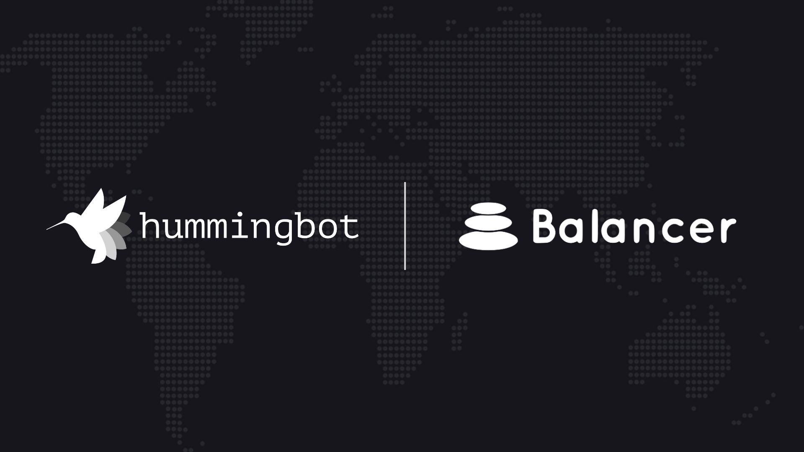
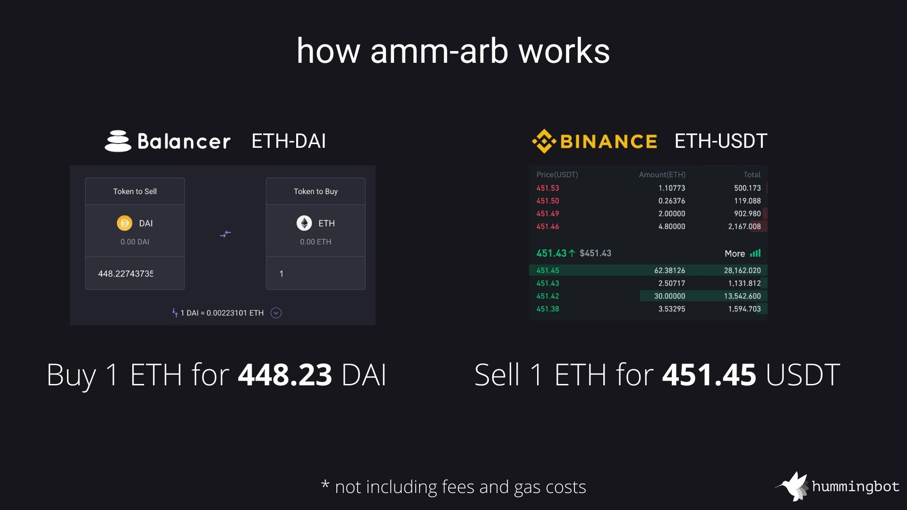

# Introducing the new Balancer connector and arbitrage strategy!

We're incredibly excited to announce a new partnership with [Balancer](https://balancer.finance/), a leading Ethereum decentralized exchange, that allows Hummingbot users to earn arbitage profits from reconciling differences between Balancer and other exchanges.

The Balancer connector is included with the [v0.33 release](https://docs.hummingbot.org/release-notes) of Hummingbot that ships today, along with a new `amm-arb` strategy.

This new strategy allows allows users to arbitrage price differences between automatic market maker (AMM) protocols like Balancer and other Hummingbot supported exchanges such as Binance, Coinbase Pro, and Huobi.

<!-- more -->

## How it works

The new `amm-arb` strategy lets you exploit the differences between AMMs like Balancer and order book exchanges like Binance. Extending the `celo-arb` strategy [released](../2020-06-celo-arbitrage/index.md) a few months ago, `amm-arb` uses a new, simpler design that works with any AMM protocol, on both Ethereum and non-Ethereum chains!

In the example above (with screenshots taken at the same time), there appears to be an arbitrage opportunity between the ETH/DAI pair on Balancer and the ETH/USDT pair on Binance, assuming DAI-USDT equivalence and no transaction costs (unrealistic). To execute the arbitrage trade, you could buy 1 ETH for about 448 DAI on Balancer and sell 1 ETH for 451 USDT on Binance. In this case, transaction costs may make this trade unprofitable, but it's easy to see how a profitable arbitrage opportunity may arise throughout the day as the market moves around.

You could constantly refresh your browser and make calculations in a spreasheet to detect when a profitable opportunity arises, but that's a lot of work. Instead, run Hummingbot's `amm-arb` strategy and spin up an bot that runs 24/7 and automatically checks for arbitrage opportunities and executes them when they arise.

## Highly customizable

Gas optimization is an important part of Ethereum trading, and the `amm-arb` strategy allows you to customize exactly how you handle gas, using either dynamic gas prices from [ETH Gas Station](https://ethgasstation.info/) or manual gas levels.

Other configurable settings for `amm-arb` include whether the bot runs on mainnet or kovan testnet, how much slippage buffer to add, and whether arbitrage trades are executed in parallel or sequentially.

You can also modify the strategy itself of extend its functionality with a script.

## Partnering with Balancer Labs

We partnered with Balancer to develop this strategy because we believe that the arbitrage opportunities available on Balancer are a perfect fit for the individuals and small firms that make up the bulk of the Hummingbot community.

Like a superset of Uniswap, Balancer allows liquidity providers to deposit a **pool** of assets, so that any pair of assets within the pool can be used to power a trade between them. Since there are thousands of unique pools, this results in an near-infinite combination of pools that can be used for a trade between two assets, creating many arbitrage opportunities that are too small or require too much work for professional firms to take.

**Balancer's protocol design may result in a long tail of arbitrage opportunities, which are ideal for individuals and small firms running Hummingbot.**

## Developing protocol connectors with Hummingbot Gateway

To build the connector to Balancer, we created a separate open source repository called [Hummingbot Gateway](https://github.com/hummingbot/gateway) that helps the Hummingbot client interact with protocols that utilize Javascript-based SDKs, which are common for blockchain protocols. This provides a simpler entry point for external developers who may want to add connectors for their own protocols or extend the functionality of an existing connector.

Essentially, Gateway is a light web server that integrates with various protocols and exposes standardized API endpoints to the Hummingbot client. To mitigate potential security risks, all communications between the Hummingbot client and Gateway uses HTTPS, secured by a self-signed certificate that you create during the installation process.

Currently, Gateway only supports Balancer, and we are working on connectors for Terra and other Ethereum-based AMM protocols, which are planned for release shortly.

## What's next

We're only scratching the surface of what's possible with Hummingbot and Balancer. We look forward to enabling our mutual communities to experiment with:

- Liquidity provider strategies that add or remove liquidity depending on market conditions
- Adjusting gas prices dynamically to respond to front-runners
- Arbitraging differences between Ethereum and non-Ethereum AMM protocols

Since most of the protocol-specific logic resides in Hummingbot Gateway and it can incorporate `npm` modules, it should be relatively simple for developers to add connectors for their own protocols!

## Check out the quickstart guide!

We have created a [Quickstart guide](../2020-12-amm-arbitrage-uniswap-balancer/index.md) for the `amm-arb` strategy that shows you how to install Hummingbot along with Hummingbot Gateway. Afterward, you'll be guided through the process of configuring and running an arbitrage bot between Balancer and another exchange.

> **Note**: Since you have to install Hummingbot Gateway as a separate Docker container, you can only run `amm-arb` if you install Hummingbot via Docker or from source. The Windows and macOS binary installers will not work.
