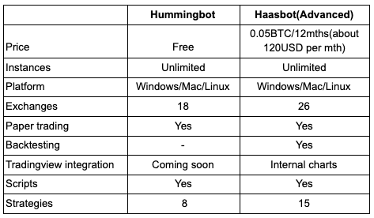
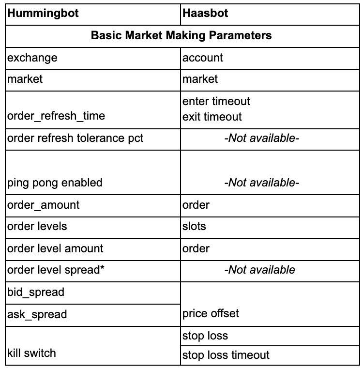
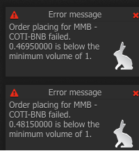
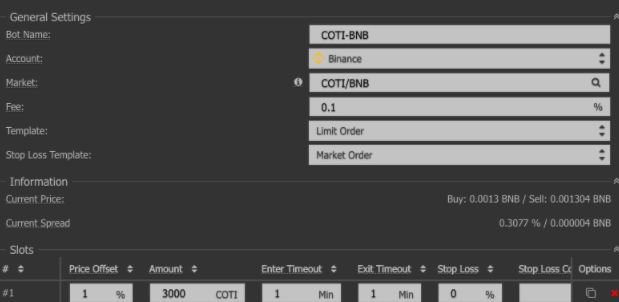
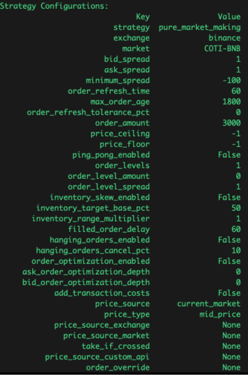
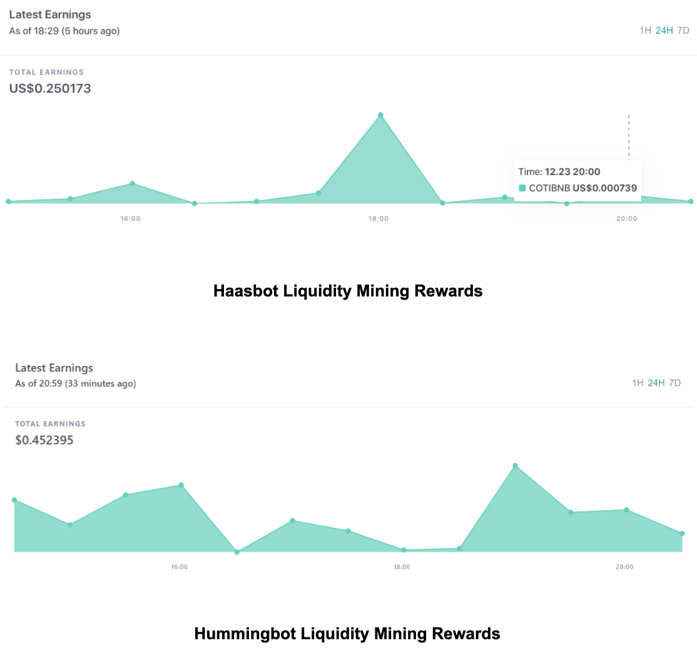

In the previous comparison blog, we compared Cryptohopper and Hummingbot, and  this time, we will continue to compare Haasbot and Hummingbot. 

The goal of this article is to test out both bots and help you make better decisions on which software to use for liquidity mining (Remember, you do not need to use Hummingbot to earn liquidity mining rewards). We will make a comparison of their features and run these two bots for liquidity mining to test out the performance.

# General Feature Comparison 

Only the highest tier of Haasbot (Advanced) supports market making; hence, the plan selection. 
For more information on the plan features, see [Haasbot](https://www.haasonline.com/pricing/). 

Overall, Haasbot has more features, strategies, and exchanges supported. Haasbot allows users to run unlimited bots at the cost of 0.05BTC for 12 months (and the cost has not factored in the currency price appreciation, for example, BTC has been trending up for the past 3 months since Oct 2020), whereas Hummingbot is completely free to use as long as you run it on a local machine. You might want to use a cloud server to run the Humminingbot, which usually needs an extra cost of US$5-10 per month for one bot on average. Though backtesting is highly-requested for any algo trading strategy, it's not available for both bots for market making. Haasbot has its own charts to check the trades and a quick summary of where the market making orders are. Let’s compare other aspects of these two bots.

<!-- more -->

# Privacy & Security

Haasbot does provide a number of safeguards when accessing their bot, for example 2FA-authentication on top of 
usual username/password settings. Although the trade-enabled exchange API keys are kept locally, there is still 
a risk since Haasbot code is proprietary and not publicly available. 

If you run Hummingbot, your private keys and exchange API keys are secure unless your computer/server 
is compromised (see [FAQ](https://docs.hummingbot.io/resources/faq/#are-my-private-keys-and-api-keys-secure) for details). Hummingbot Miner only uses the read-only API keys to extract and calculate 
the mining rewards (see [Privacy](https://docs.hummingbot.io/miner/faq/accounts&privacy/) for details). So rest assured.

# Usability & Support

Similar to Cryptohopper, Haasbot with its graphical user interface, is easier to use upon installing the bot, 
and the bot navigation is quite self-explanatory. However, the technical side of Haasbot will be difficult for 
newbies as they will need more time to understand the Haasbot configurations and process. 
Haasbot does have 24/7/365 support but quite slow in response, and the documentation on its market making 
features is very basic and limited, see [here](https://help.haasonline.com/docs/custom-trade-bots/market-making-bot). 
Although Hummingbot is technical as well, we have extensive documentation and tutorial videos for users to test it 
out and what’s more, you can get instant 24/7/365 support through [Discord](https://discord.hummingbot.io). 

# Customization

As mentioned in the usability section, Haasbot provides a script editor as well as a visual editor to help you 
build custom strategies and perform backtesting. These features are not easy to use and need a steep learning curve 
for newbies who do not have any experience in algorithm trading.  

Similarly, Hummingbot allows you to customize any strategy via custom scripts or code strategy yourself. 
However, Hummingbot has anticipated that users might have problems building their first ever custom scripts so 
that it prepares a repo for a bunch of readily usable scripts for your reference. You can explore the Hummingbot’s 
custom scripts library in the following [repo](https://github.com/CoinAlpha/hummingbot/tree/master/scripts ). 

# Market Making Feature Comparison

The following table maps out the basic market making parameters that can be used in Haasbot and Hummingbot.

Haasbot only offers a minimum timeout of 1min and can’t be set lower whereas Hummingbot can set a minimum of 1 secs. 
The minimum order amount is based on the quote amount and does follow the trade rules in Binance.  For example, 
for `COTI-BNB`, users need to meet a minimum of 1 BNB equivalent of COTI for the bot to start. 

Haasbot offers basic market making features without advanced market features as compared to Hummingbot. 
You can read more about these advanced features in [the following blog](https://hummingbot.io/blog/2020-10-inventory-risk/). In sum, both bots have similar basic market making features but Hummingbot has more advanced features in market making.

# We ran both for liquidity mining for 12 hours, here’s what we learned!

For Haasbot, we use the following settings to start liquidity mining **COTI-BNB** with < **2%** spread(only get rewards 
if spread is within 2%) and enter timeout + exit timeout for a total of **1** min, which is the same as Hummingbot
 parameter ‘order refresh time’ of **60** secs.

- **Exchange:** Binance
- **Pair:** COTI-BNB
- **Price offset:** 1
- order amount:** 3000
- **Enter timeout:** 1 min
- **Exit timeout:** 1 min

See the following screenshots for configuration.

The following screenshots show an example of how similar settings are created in Hummingbot.

After 12 hours of running both Hummingbot and Haasbot,  see the liquidity mining results for both miners.

Both bots started with **3009 COTI ** and **4.27 BNB**. Haasbot has a liquidity reward of **$0.25**, and executed **10** trades. Assuming the same profit projection for the next 30 days, the profit is (0.25x30x2 = ~US$15). Although there are liquidity mining rewards, it does not cover the subscription cost of about **US$120USD** per mth, unless the spreads are tightened for higher rewards, which bring more risks in the long run. 

Hummingbot returned a liquidity reward of **$0.45**, and executed **20** trades. If using Hummingbot, assuming the same profit projection for the next 30 days, the profit is (0.45x30x2 = ~US$27). Hummingbot would have already covered back the VPS hosting around **$5**. 

The same profit projection assumption above is unlikely to hold true in reality because the market conditions fluctuate constantly. 

# Conclusion

For users who wanted more flexibility in customizing the strategy or more strategy options to use, Haasbot is a good choice but the learning curve is steep. They do have many templates for you but their strengths are not in market making as compared to Hummingbot. Although Haasbot costs much higher than Cryptohopper does, Haasbot allows unlimited bots at the highest tier and it's akin to an all-terrain vehicle (ATV) that allows you to have a robust tool to navigate the market using different features and customization ability.

If you just want to focus on market making with liquidity rewards, Hummingbot is the better choice as it is FREE and provides more market making parameters and scripts. But if you prefer a catch-all strategy (use many different types of strategies) and you are willing to pay a premium price, Haasbot would be good. 

Hope this post helps you make your decisions on which bot to use when considering joining liquidity mining! Again, we hope to see you on the [leaderboard](https://miner.hummingbot.io/leaderboard)! 
