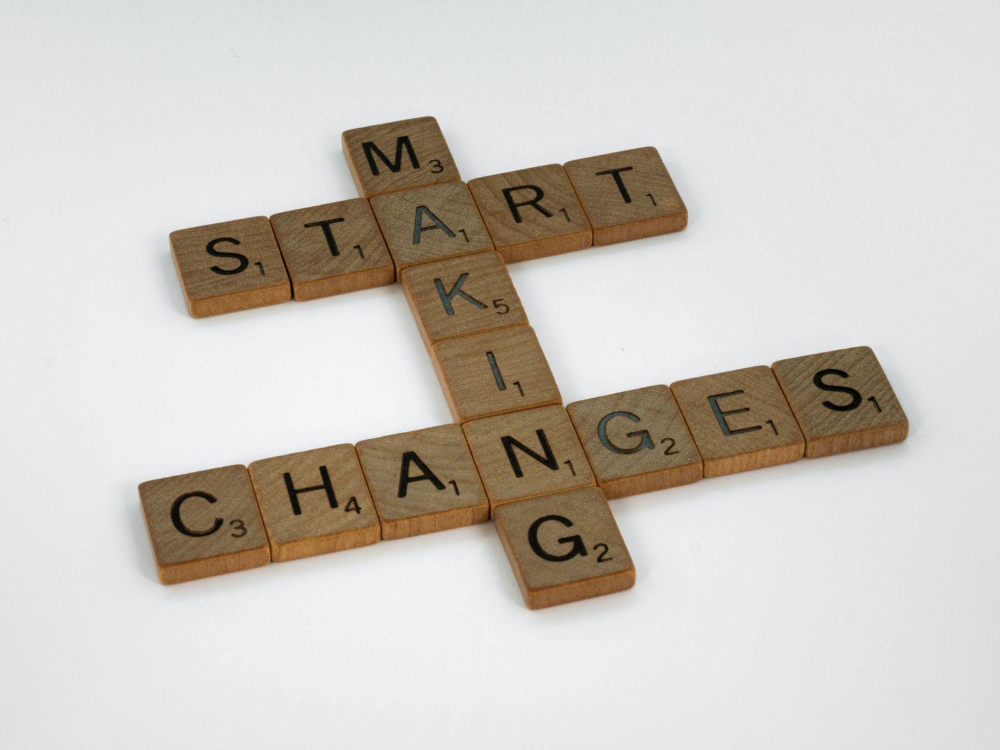

# Hummingbot's 2023 Governance Roadmap

Specifics on our governance roadmap for 2023, Epoch 2 retrospective, and Epoch 3 changes.

In our last [governance post](../2022-12-changes-to-hummingbot-maintenance-and-governance-processes/index.md), we summarized Hummingbot Foundation's progress since we launched the HBOT governance token one year ago, as well as the lessons that we've learned about how to structure the governance process. In particular, the Foundations plans to start regular monthly Polls to allow HBOT users to decide how the scarce maintenance bandwidth would be allocated across various exchanges, strategies, and issues in the Hummingbot codebase.

As a follow-up, this post provides more specifics on our governance roadmap for 2023. This post also serves as the retrospective for Epoch 2 and outlines changes for Epoch 3.

<!-- more -->

## 2023 Goals

Since HBOT's main use case is to allow holders to govern the evolution of the Hummingbot codebase, our main goals revolve around making it easier to acquire and vote with HBOT, as well as making the impact of each vote powerful and clear.

### 1. Ensure that Hummingbot Foundation is cashflow-positive without reliance on HBOT
From inception, Hummingbot Foundation has generated revenues from exchange fee share partnerships, allowing us to reserve HBOT usage only for community rewards and developer bounties, rather than ongoing operating costs. While exchange fee share revenues have fallen alongside general crypto trading volumes in 2022, we believe that our new [Botcamp](https://hummingbot.org/botcamp/?ref=blog.hummingbot.org) line of business has a lot of potential to expand, based on the success stories that we're seeing from early participants.

Botcamp can teach anyone how to design and build their own custom algorithmic trading strategies in a few short weeks. Next year, we aim to expand the content library, deliver more value to participants, and grow the cohort size. By the end of the year, we hope that Botcamp will grow to become the Foundation's primary revenue source and that the Foundation will be cashflow-positive.

*Sub-goals:*

- Expand Botcamp to 40 participants per cohort by December 2023
- Foundation is cashflow positive by December 2023

### 2. Make voting with HBOT simple, clear, and impactful

In 2022, the Foundation processed 234 proposals:

- 38 Hummingbot Governance Proposals
- 32 Hummingbot Improvement Proposals
- 164 Pull Request Proposals
- 90% of these proposals were approved. On average, there were 4.9 unique voters per proposal.

While there is clearly organic interest in using HBOT for governance, we learned that many proposals, each delving into specific pull requests and code minutiae, makes it difficult for the average HBOT holder to express an opinion.

The regular monthly Polls process that we will start in January is designed to compress voting into a certain period each month, as well as simplifying the choices for HBOT holders. In addition, we plan to make it `easier` for community members to see upcoming and ongoing Polls with a Discord bot integration and more info on the [HBOT page](https://hummingbot.org). Finally, we will clarify the `impact` of each monthly round of Poll to the community swiftly afterwards. Adding or removing any exchanges or strategies from the codebase and documentation, as well as prioritizing the issues that the community selects.

**Sub-goals:**

- Conduct Polls each month starting in January 2023
- Add Discord bot that notifies users about ongoing Polls
- Average 20+ unique voters per Poll proposal by December 2023

### 3. Let users earn HBOT for valuable community work

One of the success stories from our many governance experiments during 2022 was [Bounties](https://docs.hummingbot.org/bounties/). Since starting the program in August, we have awarded more than 40 developer bounties to 20+ unique community developers.

We found that when work can be structured into a composable package, such as fixing a bug that can be clearly reproduced or upgrading an exchange connector for which an existing template already exists, community developer bounties can be a great solution. However, when the objective is less clear or the work is ill-defined, involving external developers devolves into a project management nightmare.

The main lesson that we have learned is to create well-defined bounties that reward developers for allocating a fixed amount of their time and attention. In 2023, we plan to continue fleshing out the Bounties initiative that we started in Epoch 2, while finishing off the larger bounties.

One change from 2022 we plan to implement are vesting contracts for developer bounties. We plan to begin vesting developer bounties over a 3-year period, in order to align the incentives of the developer with the growth of the Hummingbot community.

In addition, the [Community Incentives experiment](https://snapshot.org/?ref=blog.hummingbot.org#/hbot-ip.eth/proposal/0x588779179d0229db7de2de9e231f3baafb1fcdbde16bcc93bf34b65280e36a1a) seems to be a great way to ensure Discord support, so we plan to expand that program.

**Sub-goals:**

- Award bounties to 20+ unique developers
- Ship Orchestration module, RippleDEX connector, and other large bounties
- Use a 3-year vesting contract for developer bounties larger than 100K HBOT
- Flesh out Community Incentives project

### 4. Reward the community for providing liquidity to HBOT

Currently, HBOT trades only on [Uniswap](https://uniswap.org/), where are there two community-created pools where you can exchange a small amount of USDC or ETH for HBOT. However, liquidity remains quite low, as the token is not yet listed on any centralized exchanges.

Since the main use case for Hummingbot is to earn rewards by providing liquidity, we believe that it would make sense to incentive the community to improve HBOT liquidity with HBOT rewards, as it would spur Hummingbot usage.

In Q1 2023, we plan to engage with centralized exchanges to make the HBOT token more widely available and liquid. Afterwards, we will work with [Hummingbot Miner](https://miner.hummingbot.io/), [dMiner](https://dminer.hummingbot.io/) and other platforms to reward the community for providing HBOT liquidity across both centralized and decentralized exchanges.

**Sub-goals:**

- Get HBOT listed on CEX in Q1 2023
- Start HBOT liquidity mining campaigns in Q1/Q2 2023

## Epoch 3 Changes

### Epochs will be quarterly rather than semi-annually

Since Polls for exchanges and strategies mark changes to the Hummingbot codebase and process every 3 months, it is only natural that we change the existing Epochs process so that it covers a 3-month cycle. The polls in the first month of the epoch start define the priority and inclusion of exchanges and strategies for the entire epoch.

Epoch 3 will cover the Hummingbot Q1 2023 releases (January, February, March), while Epoch 4 will cover the Q2 2023 releases, etc.

### No pre-defined HBOT distribution targets
While we initially envisioned distributing the entire 400M HBOT community pool in 4 years, we now believe that there shouldn't be fixed per-epoch distribution targets anyway.

We don’t want to create a forced incentive to give away HBOT. Rather, our goal should be to ensure that every HBOT distribution rewards meaningful work that improves the community.

### Focus on monthly polls

The first set of polls will occur from January 4 to 11, 2023:

- CEX Connectors: Rank [CEX connectors](https://docs.hummingbot.org/exchanges/?ref=blog.hummingbot.org) gold/silver/bronze or remove from codebase
- DEX Connectors: Rank [DEX connectors](https://docs.hummingbot.org/gateway/?ref=blog.hummingbot.org) gold/silver/bronze or remove from codebase
- Core Strategies: Rank [Strategies](https://docs.hummingbot.org/strategies/?ref=blog.hummingbot.org) core/community or remove from codebase
- Priority Issues: Prioritize 5 Github issues or pull requests

By holding Polls at the same week every month afterwards and making the experience fun, competitive, and engaging for the community, we hope that, over time, HBOT holders will see the tremendous impact that their votes can have.