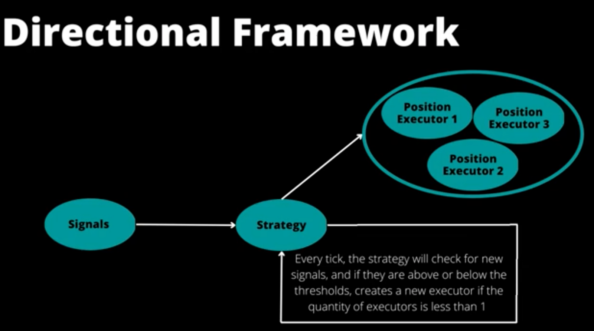
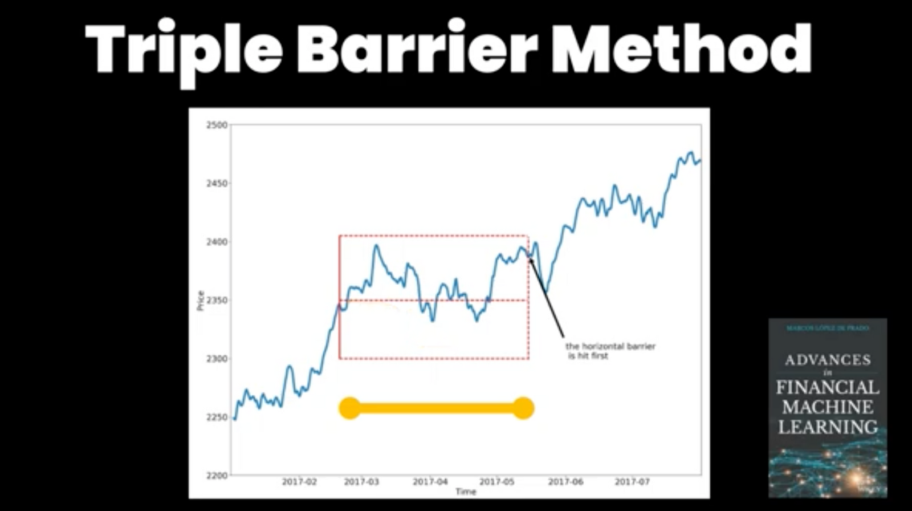

# Strategy Experiment #1: Directional Trading with MACD and Bollinger Bands Indicators

### First post in our new series of Strategy Experiments that publishes hypothesis, code and performance of a running bot strategy.

Welcome back to the Hummingbot blog! Today, we're excited to share our recent experiment using the open source Hummingbot platform to build a crypto trading bot that applies an **indicator-based directional strategy** on the Binance Futures exchange using MACD and Bollinger Bands.

Sign up for Binance Futures using the [Hummingbot referral code](https://www.binance.com/en/futures/ref?code=hummingbot) and get a **10% fee rebate**!

## Introducing Strategy Experiments

This  experiment is the first in our new series of **Strategy Experiments**. Our goal is to create a collaborative environment where users can share their strategy experiments with the community, fostering growth and knowledge sharing among quant traders.

We encourage everyone to share their Strategy Experiments with the community, whether they're successful or not, as we can all learn from each other's experiences. By sharing our findings and discussing new ideas, we hope to create a thriving ecosystem where quant traders can continually improve and refine their trading strategies.

Now, let's discuss the details of our first experiment. Watch the video, or read the description below.

<!-- more -->

<iframe width="560" height="315" src="https://www.youtube.com/embed/uKFBu2bSU1Y" title="YouTube video player" frameborder="0" allow="accelerometer; autoplay; clipboard-write; encrypted-media; gyroscope; picture-in-picture; web-share" allowfullscreen></iframe>

## Description

We've designed a trading strategy using the [MACD](https://www.investopedia.com/terms/m/macd.asp) and [Bollinger Bands](https://www.investopedia.com/terms/b/bollingerbands.asp) indicators to trade the APE-BUSD pair, and we'll be providing a detailed performance analysis. Let's dive in!

## Custom Indicator

In this experiment, we combined MACD and Bollinger Bands indicators to design a custom indicator that may signal a potential mean reversion point in the market. The goal was to identify moments when the market is overextended, either in the overbought or oversold territories, and capitalize on the potential price reversals.

Here's a brief overview of how the combination works:

1. Bollinger Bands: Bollinger Bands are composed of a moving average (middle band) with two additional bands plotted at a specific standard deviation away from the moving average. The bands expand and contract with market volatility, and prices tend to revert to the mean (middle band) over time. In this strategy, we use the %BB value to determine where the current price is relative to the bands, with 0 indicating the lower band (buy), 1 indicating the upper band (sell), and 0.5 indicating the middle of the band.
2. MACD: The Moving Average Convergence Divergence (MACD) indicator measures the relationship between two moving averages (typically 12-day and 26-day exponential moving averages). The MACD line is the difference between the two moving averages, while the MACD signal line is a 9-day exponential moving average of the MACD line. The MACD histogram represents the difference between the MACD line and the MACD signal line. Positive histogram values suggest a buy signal, while negative histogram values indicate a sell signal.

By combining these two indicators, we aim to identify potential mean reversion points when the market is overextended. Thus, our custom decision rules for Long and Short positions are based on the %BB and MACDh values, as well as the MACD line's current value:

- **LONG**: % BB < 0.2 | MACDh > 0 | MACD < 0
- **SHORT**: % BB > 0.8 | MACDh < 0 | MACD > 0

## Directional Framework

This strategy leverages the Directional Framework, a combination of two new features in Hummingbot: [CandlesFeed](https://hummingbot.org/scripts/candles-feed/) and [PositionExecutor](https://hummingbot.org/scripts/smart-components/).

These components make it easier to create custom indicators and self-executing positions, resulting in a more streamlined and efficient trading strategy.

1. CandlesFeed: The CandlesFeed component allows us to generate custom indicators using both historical and real-time exchange data. In this experiment, we utilized the CandlesFeed component to calculate the MACD and Bollinger Bands values, creating our custom indicator that signals potential mean reversion points in the market.

2. PositionExecutor: The PositionExecutor component is a powerful tool that allows Hummingbot to create self-executing positions based on the custom indicator signals. In our strategy, the PositionExecutor component is responsible for managing the Long and Short positions, taking into account the decision rules derived from the %BB and MACDh values, as well as the MACD line's current value. By using the PositionExecutor component in conjunction with the [Triple Barrier Method](https://www.mlfinlab.com/en/latest/labeling/tb_meta_labeling.html) popularized by [Advances in Financial Machine Learning](https://www.amazon.com/Advances-Financial-Machine-Learning-Marcos/dp/1119482089?ref=hummingbot.org), our trading strategy can effectively manage positions and maintain a well-defined risk profile.

We defined a dynamic Take Profit and Stop Loss based on the standard deviation of the last 100 periods, multiplied by a factor of 1.5 for TP and 0.75 for SL. This approach adapts to market conditions, and the time limit was set to 55 minutes.

You can access the [code of this strategy]() to fine-tune it!

## Picking the Right Market

An essential aspect of running a successful trading bot is choosing the right exchange platform and base+quote trading pair (market). It's important to select a market where you may have a fee or speed advantage versus potential competitors, as opposed to one where you are getting running over by huge trading firms, or one where the exchange is unreliable or untrustworthy.

To minimize fees, we selected a BUSD-quoted pair on Binance Futures, and we chose to pay the fees with BNB for an extra discount.

Binance Futures is a Gold connector in Hummingbot, which means that we maintain the WebSocket integration using the highest standards and continually add support for new API endpoints and capabilities. Sign up for Binance Futures using the [Hummingbot referral code]() and **get a 10% fee rebate**!

- Exchange: Binance Perpetual
- Trading Pair: APE-BUSD
- Initial balance: 40.3 USD
- Order amount: 15 USD

## Performance Analysis

- **Start date**: 03/11/2023 | **End date**: 03/22/2023
- **Total uptime**: 11 days, 16:42:14
- **Number of trades**: 334
- **Trading volume**: 4,498 USD
- **Net Return**: -0.62 USD | **PNL (%)**: -1.538%

In this experiment, our trading bot ran for over 11 days, and although the account was safe with low losses and wins, the fee cost impacted the profitability. As a next step, we would recommend tweaking the 3 barrier thresholds, testing other trading pairs and venues, and exploring simulation/backtesting.

## Get Rewarded for Submitting Strategy Experiments

We're excited to announce that by submitting your own Strategy Experiments, you can qualify for rewards from the 1 million HBOT token pool allocated via our Event & Content Incentives 2023 program, approved through the governance proposal [HGP-33: Event & Content Incentives 2023](https://snapshot.org/?ref=blog.hummingbot.org#/hbot.eth/proposal/0x743f6d94a36dd4a70ab0bb64648c229f538ae0ff3ddd56da0fe47d90d2d920f7).

To participate, reach out to our community manager Carlito in a public channel like #general or #content in our [official Discord](https://discord.gg/hummingbot)!

By sharing your Strategy Experiments and participating in the Event & Content Incentives program, you can earn rewards while contributing to the growth and success of the Hummingbot community. We look forward to seeing your submissions!

## Learn to Build your own Custom Strategies

Join the [Hummingbot Botcamp](https://hummingbot.org/botcamp/), an intensive, small-batch 6-week developer bootcamp that teaches you crypto market making and quant trading using the Hummingbot open source software!