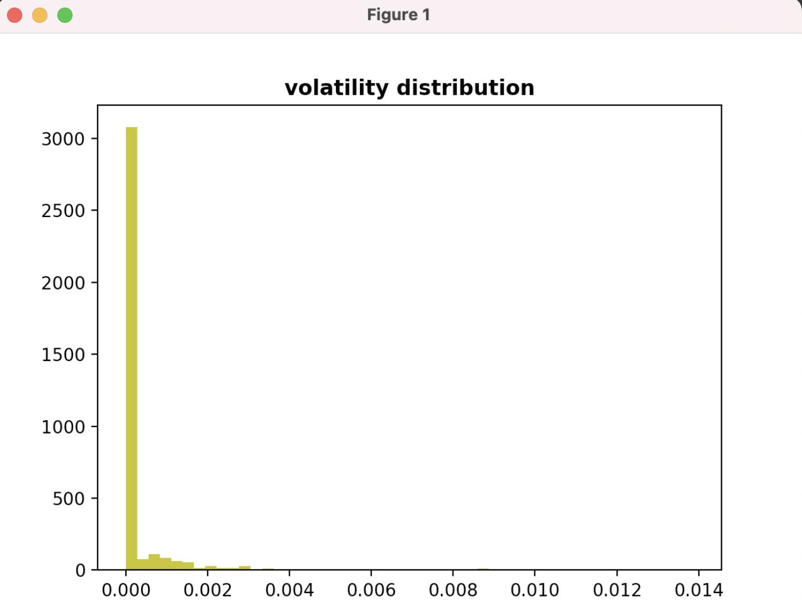

# [Level 2] Strategy #1: Pure Market Making (PMM) Strategy

Here's the content formatted in Markdown:

---

## **Tips for choosing the right spread**

It is important to choose the right spread that balances liquidity mining rewards and having fewer filled trades (hence reducing transaction fees). Too small spread will increase the risk of fill orders, and as a result, the rewards cannot cover the loss due to transaction fees. Excessive spreads will lead to a drop in yield or even the inability to get rewards (each token has an agreed-upon maximum spread for mining rewards).

<!-- more -->

**Market is uptrend:**

- Set tighter bid spreads and wider ask spreads so that you are holding more of the base asset when the market is going uptrend. For example, set inventory skew to hold more of the base asset

**Market is downtrend:**

- Set tighter ask spreads and wider bid spreads so that you are holding less of the base asset when the market is going downtrend. For example, you can set inventory skew to hold less of the base asset.

**Understanding volatility to help us pick the right spread**

- One miner, sun spark, suggests that we can use the API provided by the exchange (take [gate.io](http://gate.io/?ref=blog.hummingbot.org) as an example) to obtain the volatility of the recent transaction price and the TOP 5 Record (spread by type) to help us choose a reasonable spread to balance returns and risks.



- If you haven't used gate.io's API, you can refer to [https://github.com/gateio/gateapi-python](https://github.com/gateio/gateapi-python?ref=blog.hummingbot.org)

Here is sun spark’s code for getting the volatility of the market:

```python
import matplotlib.pyplot as plt

if name == 'main':
    date_to = datetime.now()
    date_from = date_to - timedelta(hours=12)
    configuration = Configuration(key="YOUR_KEY", secret="YOUR_SECRET")
    host="https://api.gateio.ws/api/v4"
    client = ApiClient(configuration)
    spot_api = SpotApi(client)
    data = spot_api.list_candlesticks("XCAD_USDT", _from=int(date_from.timestamp()), to=int(date_to.timestamp()), interval="1m")
    x = [(float(i[5]) - float(i[4])) / float(i[2]) for i in data]
    print("TOP 5 record ", sorted(x, key=None, reverse=True)[:5])
    plt.hist(x, 50, density=True, stacked=True, histtype='bar', linewidth=3, color='y')
    plt.title('volatility distribution', fontweight="bold")
    plt.show()
```

## Tips for setting basic parameters

Every market works differently, but we highly recommend that you check out some tips from successful traders on how they set up their Hummingbot Parameters:

[Trader tips] Favorite Hummingbot Parameters from Trader Jazzy](https://www.notion.so/Trader-tips-Favorite-Hummingbot-Parameters-from-Trader-Jazzy-feeac3c2937d450b8a04855d1e83d18b?ref=blog.hummingbot.org)

- Tips on setting up the following parameters
- price ceiling and price floor
- filled order delay
- order refresh time and max order age
- balance limit
- bid and ask spreads
- order amount

Only take these tips as reference as different traders operate differently for various markets.

## **More tips**

**TradingView Indicators:**

- Use Pure Market Making Strategy but set dynamic bid/ask orders based on TradingView indicators which trigger alerts to Telegram and change the bid/ask orders using `inventory skew` or `spreads-adjusted`
- Adjust bid/ask orders based on TradingView indicators which trigger alerts to Telegram and change the bid/ask orders

**Set up a Kill Switch**

- A kill switch is one of the simplest ways to give you some sort of guardrail when markets become too volatile. It automatically stops the bot when it reaches a certain performance threshold, which can be either positive or negative. To learn more:

[https://hummingbot.org/global-configs/kill-switch/](https://hummingbot.org/global-configs/kill-switch/?ref=blog.hummingbot.org)

---