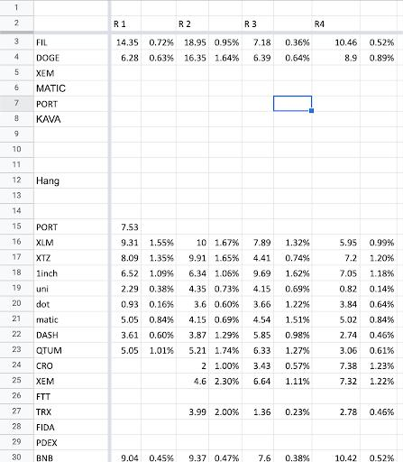
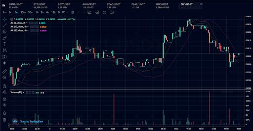
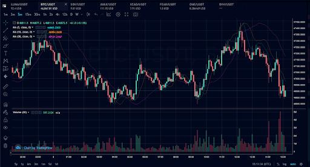

# Common Hallmarks of Successful Miners

*by Kyle Mizui*

Hummingbot Miner has a [leaderboard](https://miner.hummingbot.io/leaderboard) that tracks the highest-paid miners on the platform. You must be wondering, what are the top miners doing that is earning them thousands of dollars a week? This piece is a result of discussions with some of the miners who are in the Eagle Club, and we hope it unveils some of the things profitable miners do.

**1.* Picking Pairs**
**2. Managing Inventory Risks**
**3. Setting up guardrails**
**4. Constant experimentation**
**5. Joining a community**

<!-- more -->

### **1. Picking Pairs**

There are fundamentally two approaches towards picking a pair to mine. There's the conservative way, and there's the riskier way. If you're new to hummingbot, I'll recommend you start with the former.

#### **a. Conservative way**

Fundamentally, the risks that come with market-making can mostly be attributed to inventory risks (to learn more about inventory risk for market makers, see [this article]). You'll ideally want to pick assets that you are comfortable holding. Common characteristics of these coins are:

- High Liquidity: These campaigns are generally adored by the Hummingbot community for their low-risk returns, so it's common for them to be mined by many miners. Use the [factor score](https://support.hummingbot.io/miner/factor-score-what-is-it-and-how-should-i-use-it), and try out those in the stable or growth factor.
- High market cap: You can check this at [Coingecko](https://www.coingecko.com/?ref=blog.hummingbot.org). Generally, coins in the top #100 in Market Cap ranking would generally exhibit lower volatility and are less likely to be subject to price manipulation or rug pulls. A larger market cap generally means there are many holders, many traders, multiple exchange listings, which all help in minimizing volatility. A higher market cap of course means there’s a lot more value and assets behind the token; every price move means a lot to a lot more people.
- Low Volatility: You can check out a coin's volatility by checking out its price and volume charts in [TradingView](https://www.tradingview.com/symbols/BTCUSD/?exchange=BITSTAMP&ref=blog.hummingbot.org) or the exchange of your choice. Ideally, these coins would have less than 2% movement in a 1-minute span.

#### **b. Riskier Way**

If you've traded the conservative way safely, have understood most of how the parameters work in your strategy of choice and want to grow your profits, you should check out higher yield pairs. If you haven't read our previous article on common pitfalls of traders, you really should before moving on. Go on, we'll wait.

In essence, in regards to higher risk pairs, you should:

1. **Try them out in paper mode**
   - Before going all-in on your capital believing it’s a limited time goldrush. Try out your intended strategy in [paper mode](../how-to-use-advanced-market-making-features/index.md). Try to have it run for a few days - or a few hours at the least - to make sure it’s operating profitably
2. **Use real but lower capital**
   - Paper markets and real markets don’t function the same way. For example, slippage issues and latency aren’t as well simulated in paper markets. And of course, your trades *do* affect the market, which cannot be captured in paper trading mode. Try out your strategy now in the real markets, but with smaller capital to make sure it runs the same.
3. **Grow your bot's capital**
   - All green? Great, all systems go, and time to rake in the profits. As you start getting more comfortable with your bots and the market, you can start ramping up your assets used for trading.
4. **Monitoring and tweaking**
   - It’s important to understand that trading is not something where you can “set it and forget it”. Market conditions and dynamics change. Even some unforeseen things, e.g. exchange APIs going down (this is crypto, after all). While you can set some fail-safes and optimize your bots for current conditions, they may not work for all. You need to be diligent, systematic and nurture these hummingbots.

### **2. Managing Inventory Risks**

Inventory risk is when the assets you are holding in the course of market-making, or another trading/investment strategy decrease in value. For example, being a market maker for BTC-USDT would require you to hold some BTC and USDT initially. Due to how a market maker operates, your bot may buy BTC when prices dip, and may sell BTC when prices go up (which is the opposite of what a standard trading strategy of buying low selling high is since now you’re buying high, selling low). Here's a scenario, you set BTC bids at $10 around a mid price of $11. But a sudden dip to $9 hits your bids and stays there. This would mean you now have a temporary loss of $1 for each BTC you bought. This loss is only realized if you sell your BTC at any price below $10. It might recover or it might get worse. This is the risk that market makers bear, and is also how a market maker profits in horizontal markets. But if prices move directionally up or down for a long period of time, you might end up holding a lot of tokens that are worth less. Here’s a more elaborate article on [inventory risks.](../what-is-inventory-risk/index.md)

There are two ways to manage inventory risks:

1. **Hedging**
   - Running the hedging strategy on another bot simultaneously with your trading bot. This hedge strategy would effectively short any inventory you have, and reduce the shorts when you have less inventory. Thus ensuring that your strategy is market-neutral - which means the movement in asset prices does not affect you. Granted, it is a fine skill in itself. As over-hedging would creep up through fees incurred on the other end. Yet, seeing as liquidity mining is rewarded based on orders on the book and not on volume traded, if one is able to minimize volume traded,

 then hedging is a good strategy.
2. **Run arbitrage or cross-exchange market making**
   - These strategies tend to maintain a constant inventory over time, unlike pure market making or liquidity mining. You can also hedge the inventory on the perpetuals market. Furthermore, if you set the maker market of the [cross exchange market making strategy](../../../strategies/cross-exchange-market-making.md) in accordance with the pair that is listed on Hummingbot rewards. Your limit orders that are on the books would earn you rewards as well.

### **3. Setting up guardrails**

As with all things crypto, the market can tend to be quite volatile - arch-nemesis of market makers - and it might cause you to lose money. There are certain ways to set up safety nets or guardrails to minimize your losses during volatile events. This mostly consists of the kill switch and setting price floors and price ceilings in pure market making.

#### **a. [Kill Switch](../../../global-configs/kill-switch.md)**

This is great for when you’re beginning and trying to understand the impacts of tweaking each parameter. Setting a killswitch rate of -10% while you leave your bot running overnight, would help prevent you from losing too much. However, you don’t want to set your killswitch rate too low, sometimes a coin might just have a roller coaster dip and rise, and if you have killswitch on too low, it’ll just shut down after the losses and not recover the gains on the way up. So be careful. It’s a good training wheel for when you’re still learning to bike, but after you become good with it, the training wheels might do more harm than good. To learn more about the kill switch, visit here: [https://hummingbot.org/global-configs/kill-switch/](../../../global-configs/kill-switch.md)

#### **b. Price Floors and Ceiling**

Go through the price chart for the coin you're trading on and check the price range for the past few days. Then set your [price floors and ceilings](https://hummingbot.org/strategies/pure-market-making/?ref=blog.hummingbot.org#strategy-configs) within a range you're comfortable with would help prevent you from buying when it's above the price ceiling, or selling when it's below the price floor.

### **4. Constant Analysis and Experimentation**

Being a Hummingbot miner is akin to being a scientist. You have a hypothesis of what might work. You set up the experimentation within a paper mode or with little capital. Then you run them over time and keep tweaking the parameters till you're satisfied. Finally, you boost your capital and rake in the compound earnings by continually re-trading your profits. Here are some of the things you can do to help you perform better analysis:

1. **Jot down the Profit and Loss (PnL) of each strategy regularly**
   - Analyze individual rewards and risks of each trading pair. Below is a sample of my analysis of 20 pairs over a few days. Then I cut out those with low returns/risk and focused on less, as it's less stressful and takes less time.

    

2. **Set up Telegram Bots**
   - Telegram Bots can help you understand what your bot is doing even when you’re on the go. Instead of scrolling social media when you're doing a number two, now you can make sure your bots are doing fine instead. #Productivity
3. **Researching the coin’s chart in detail**
   - Study the coin in detail. Zoom out into days and then into minutes. See if there are any sudden spikes in volatility. You should try using the volume feature, to see when prices and volume might spike. In the example below, notice how for DIVI, which is a particularly volatile pair, prices would suddenly move due to a sudden volume of trade (the red bars in the lower section).

    

  Ideally, if you’re just beginning, you want to look for pairs which has more stable volume traded, as seen in BTC below.
    
    

### **5. Joining the community**

Quite intuitively, we all believe trading is a zero sum game. More miner profits for you could possibly mean less for me. I do not disagree with this premise, but I hope to prove that there is a significantly larger benefit when you cooperate with others in the community than just being a lone trader.

When I first began, I was a very conservative trader, and I kept trying different strategies to find a configuration that would be profitable even without Hummingbot rewards. After a month of intense trial and error, I was almost ready to hang my towel. That was when I stumbled upon cgambit's conversations on Discord. I reached out to him and asked if he could mentor me. It was only after his suggestions and recommendations that I finally saw some profits. In return, I helped him code a pure market-making script that helped him rebalance his inventories. I believe we both walked away with a bigger pie, and we're still friends to this day. After this, I found ideas that are immensely interesting from `Jelle-Cryptobot`. Cloud server helps from `KappaT`. Support in times when I'm banging my head on an issue I couldn't figure out. And also solidarity when the crypto market occasionally tanks. Through all these, I can definitely say I grew to become a better trader because of the community.

You might be shy, I understand. One thing I'll definitely recommend first is openly asking questions in the appropriate discord channels. You’ll find the community to be immensely supportive and reactive in helping you to solve the problem. Everyone has different strengths. So figure out how you can bring value to the table, and I am sure you'll find value coming back to you tenfold. In essence: Ask questions in public channels, connect with people, ask specific questions, and offer help. Trust me, there's more than enough money to go around, and profiting in a community makes it more meaningful and enjoyable.

The first thing to get started is to join the Discord community. Trading discussions occur in #trader-chat or #liquidity-mining. Hummingbot’s support team from Discord is very responsive as well and they can help you with any setup issues with your strategies. Start by asking questions in the [Discord](https://discord.com/invite/hummingbot?ref=blog.hummingbot.org) channels!

---

**Disclaimer:** The content of this article is provided by a community contributor and does not represent the views of Hummingbot Foundation. The content above does NOT constitute investment, financial, legal, or tax advice, nor does any of the information contained on this article constitute a recommendation, solicitation, or offer to buy or sell any digital assets, securities, options, or other financial instruments or other assets, or to provide any investment advice or service.
