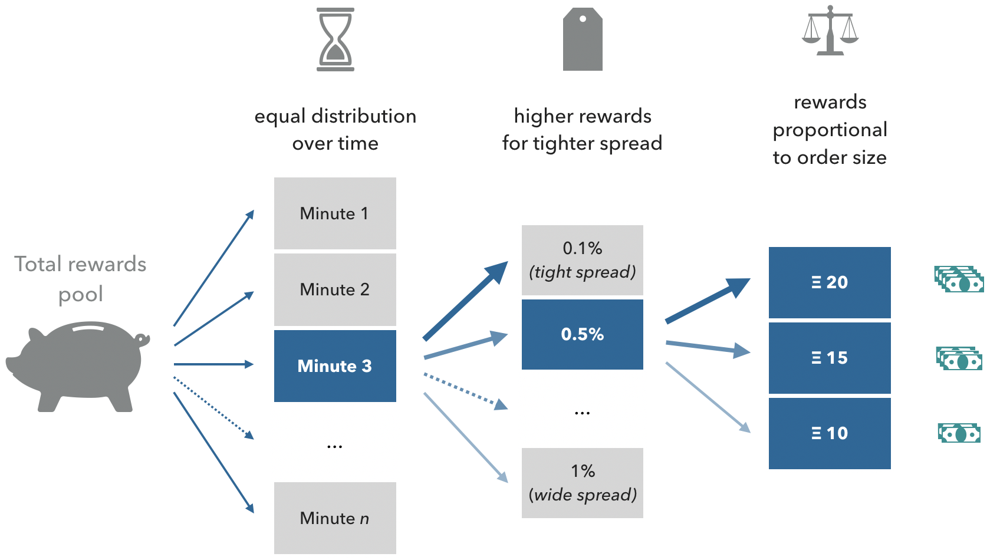
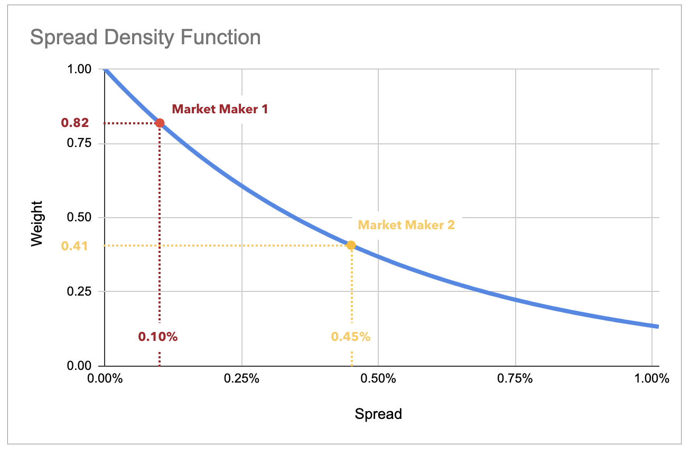
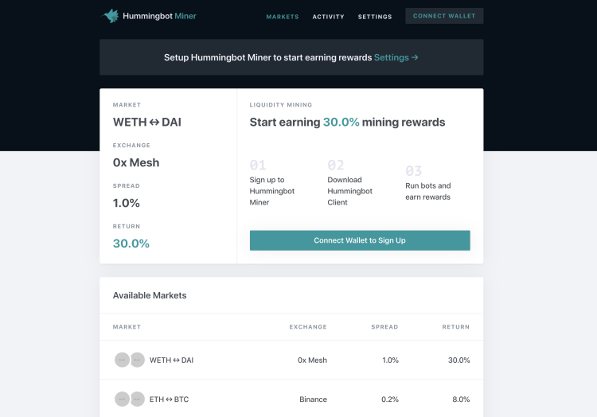

# Demystifying Liquidity Mining Rewards

We explain in more detail the methodology and mechanics of **liquidity mining**, a data-driven, objective methodology for quantifying market maker performance.

In our liquidity mining announcement, we introduced a data-driven, objective methodology for quantifying market maker performance. This serves as the basis for determining fair and open compensation for market makers. So how does it all work? In this post, we explain in more detail the methodology and mechanics of the platform.

<!-- more -->

!!! tip
    For reference, please review this [sample liquidity mining rewards spreadsheet](http://bit.ly/liquidityminingcalc) which illustrates the calculations described in this blog.

Liquidity mining's objective is to align the interests of market makers (the liquidity sellers) with the exchanges and token issuers (the liquidity buyers) that need liquidity. Their interests are directly in opposition: improving liquidity to enable more efficient trading (desired by liquidity buyers) translates into more risk for the liquidity seller. In order to make economic sense for a market maker, the market maker’s compensation must correlate with increased levels of risk.

In order to align risk and reward, there are three main parameters that we use in liquidity mining to determine market maker compensation: (1) time: placing orders in the order book consistently over time, (2) spreads, and (3) order sizes. Our rewards methodology rewards market makers more for placing orders consistently over time in the order book, placing orders with tighter spreads and with larger sizes:

*Figure 1: Rewards allocation based on time, spreads, and order size*

## Step 1: Order Book Snapshots

### Promoting order book consistency over time

In some market maker agreements, market makers agree to terms such as maintaining 90-95% uptime of orders placed in order books over a given period, say one month. The problem with this is that the market maker has discretion on when not to place orders for 5-10% of the time. Typically, they will do so during times of heightened market volatility, further compounding the problem with a sudden drop in liquidity.

In liquidity mining, we mitigate this by sampling order books at regular intervals over a given reward period. The total reward available for the entire reward period is equally divided, allocated to each snapshot, and awarded only to market makers who have placed orders within any given snapshot.

### Below is a numerical example of how rewards are distributed over a campaign period:

* 20 ETH reward budget for a 30-day month
* The 30-day month has 43,200 (30 days x 24 hours x 60 minutes) discrete 1-minute snapshot periods
* Each 1-minute reward snapshot has approximately 0.00046 ETH (20 ETH ÷ 43,200) available for liquidity miners to earn

This means that in each per-minute order book snapshot, 0.00046 ETH is paid to participating market makers with outstanding orders.

This methodology also inherently rewards market makers who continue to make orders when it is less desirable for a market maker to make orders, e.g. during times of increased market volatility. Because the rewards available for each snapshot is distributed proportionally only to market makers who placed orders during that snapshot, when other market makers drop out, the fewer remaining market makers each have a larger share of the reward.

## Step 2: Spreads

### Rewarding market makers for better pricing

In our [liquidity mining whitepaper](/liquidity-mining.pdf), we introduced the spread density function ρ(s) for spread s (Equation 1) as a way of mapping spreads to rewards:

*Figure 2: Spread density function: weighting spreads for reward allocation*

This allows us to create a corresponding relationship between spreads and market maker compensation. This factor is applied to a market maker’s order size when calculating the reward allocations in order to scale the rewards to the spread.

Below is a numerical example:

* smax= 1%: in this example campaign, only spreads of 1% or tighter are rewarded
* Market maker 1: spread = 0.10%, ρ(0.10%) = 0.82
* Market maker 2 spread = 0.45%, ρ(0.45%) = 0.41
* Since the spread factor for market maker 1 is double that for market maker 2, this means that given the same placed order size, market maker 1 will receive double the rewards that market maker 2 receives.

## Step 3: Order size

### Rewarding market makers for order book depth
Market maker compensation is set in direct proportion to the market maker’s order size, scaled by the spread factor.

## Step 4: Reward allocation

### Putting it all together

We first determine the base for reward allocation, which is the sum of all miners’ placed order sizes weighted by the spread factor. For all orders and all miners:

This value is used as the base for determining each individual miner’s allocation. The miner’s allocation (Equation 4) is the proportion of the miner’s own order weights (Equation 3) to the total snapshot order weight:

Finally, the miner’s compensation for the snapshot period is the amount of rewards available for that period weighted by the miner’s reward allocation percentage:

## Economic Comparison: Annualized Return

Since market making requires inventory (quote currency required to place bid orders and base currency required to create sell orders), a market maker's opportunity cost is using that inventory for other economic purposes, in particular: (1) HODLing, (2) staking, and (3) lending. In order to compare the economic merits of market making against these strategies, we first need a metric for the basis.

!!! tip
    The liquidity mining return is an annualized return calculated based on (1) the total amount of mining rewards available for that period, (2) the total volume of eligible orders placed in that period in base currency terms, which is then (3) converted into an annualized rate.

In liquidity mining, we calculate this return for every period and display a live rate (the most recently calculated rate); since each period is only for a short period of time (e.g. 1 minute), we also display a time series to show trends and changes in this rate over longer periods of time.

Specifically for one minute snapshots, the annualized return would be:

This annualized return can then be used to directly compare the economics of liquidity mining vs. HOLDing (0% return), staking, and lending. In the simulation-based analysis in the [liquidity mining whitepaper](/liquidity-mining.pdf), we showed that users could potentially earn 10-50% from liquidity mining.

Ultimately the market and levels of participation will determine the equilibrium rates, but our Hummingbot Miners web app will show users real-time rates of return available from running Hummingbot in various markets so that they can decide to participate when rates are attractive vis-a-vis alternative uses of inventory.

