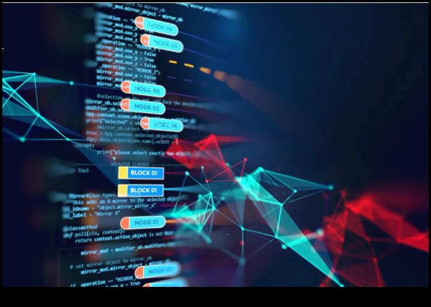

# Getting Started with Algo Trading

Algorithmic trading is the process of using computers programmed to follow a pre-defined set of rules for automatically placing trades in order to generate profits at high speed and high frequency. These are called **bots**.

The pre-defined sets of rules, called an algorithm, can range from quantitative strategies to machine learning models that can reference any data or combination thereof, e.g. prices, volume, or tweets/news feeds for sentiment analysis. 

Algo trading makes markets more liquid by introducing a large volume of trades and orders. Unlike human traders, computers don't need to rest or sleep, are much faster at calculating and sending instructions, and don't suffer from emotions ([at least, not yet??](https://www.psychologytoday.com/us/blog/hot-thought/201712/will-robots-ever-have-emotions)).

<!-- more -->

## Algo Trading for Individuals

In established markets such as equities and commodities, algorithmic trading has been dominated by highly sophisticated institutions that have invested heavily in developing proprietary strategies and infrastructure.  

However, in the nascent cryptocurrency markets, algorithmic trading is becoming more accessible to individual traders and retail investors.  Exponential growth in the number of cryptocurrency exchanges has far outpaced the growth in market participants and trading activity.  As a result, a unique dynamic has arisen: 

1. Opportunities to capture profits using even comparatively primitive algorithmic strategies are possible.
2. The lack of a market close coupled with high market volatility makes automation and the ability to trade 24/7 essential
3. Some bots have been make open source or available to the public to encourage adoption and market participation.

## Getting Started

Through our user interviews, we found one obstacle for developers to step their foot in crypto algo trading is a lack of understanding of trading strategies and financial concepts. This article will leverage useful external resources to answer the questions that might be lingering on your mind.

If you are completely new to this arena, the following tutorials may lay a good foundation for you:

* [Whiteboard Crypto](https://www.youtube.com/c/whiteboardcrypto)
* [Binance Academy](https://academy.binance.com/)
* [Coinbase Learn](https://www.coinbase.com/learn)

If you already have some experience with crypto trading, please skip the above section and read on!

## Technical Prepation

### Can I do algo trading without learning programming?

A handful of platforms and bots currently available allow individuals with any level of experience to run pre-set strategies on a user-friendly graphic user interface. With the help of these bots, technically anyone, especially those who already have manual trading experience, can begin algo trading with a few clicks of the mouse. If you trade for fun and have no time to acquire a new skill, you might want to check out these bots (a few were mentioned in [our previous post](../2019-01-crypto-bot-reviews/index.md)).

At some point down the road, you may want to take a closer look at the logic behind the strategies, test and validate them against historical or real data, figure out your way to improve them, or even create your own strategies or bots. Here is where programming comes into play. While learning programming doesn’t guarantee you to make 10X more money, it does provide 10X more options regarding testing, strategy formulation, debugging and so on. However, whether you’ll need to learn programming ultimately boils down to your goal and motivation for trading.

### Which programming language should I learn?

You can start crypto algo trading with different programming languages such as Python, C++, JAVA, R, etc. There are pros and cons that come with each language.

We will mainly share basic learning resources for Python. As someone who’s completely new to coding, you may wonder, why Python?

Python is one of the most popular languages used by today’s algo traders and developers. It is relatively easy to grasp, widely used, and capable of doing almost anything from backend web development to data analytics. 

Here are two articles providing practical insights into “Why Python”:

* [Advantages and Disadvantages of Python Programming Language](https://medium.com/@mindfiresolutions.usa/advantages-and-disadvantages-of-python-programming-language-fd0b394f2121)
* [Why Python Algorithmic Trading is Preferred Choice Among Traders?](https://www.quantinsti.com/blog/python-trading)

### Python learning resources

This course offered by MIT covers simple algorithms and all the basic Python syntax you’ll need to know, as well as broader computer science concept that will help get you started on your journey:
[Introduction to Computer Science and Programming Using Python](https://www.edx.org/course/introduction-to-computer-science-and-programming-using-python-0).

If time is your key constraint, this crash course takes you less than 3 hours:

<iframe style="width:100%; min-height:400px;" src="https://www.youtube.com/embed/yE9v9rt6ziw"" frameborder="0" allow="accelerometer; autoplay; encrypted-media; gyroscope; picture-in-picture" allowfullscreen></iframe>

After going through these materials, you should be confident with reading code and building simple algorithms yourselves. If so, congrats! You’ll now be able to get started with Hummingbot’s upcoming command line interface, and customize the strategies.

---

Once you crack the Python fundamentals, it’s time to get into the meat of programming for algo trading. [Datacamp](https://www.datacamp.com) provides plenty of courses on this subject matter. This article - [Python For Finance: Algorithmic Trading](https://www.datacamp.com/community/tutorials/finance-python-trading) provides a comprehensive walkthrough from data analysis to strategy building using Python.

When it comes to data analysis, you can always refer to this [cheat sheet](https://www.codementor.io/codementorteam/cheat-sheet-python-for-data-science-xe3m6wy4q) for basic syntax. To tame massive data, Pandas, a Python library for data manipulation and analysis, will come in handy. Here is a [Pandas Tutorial: DataFrames in Python](https://www.datacamp.com/community/tutorials/pandas-tutorial-dataframe-python#gs.meCZt7M) that would be worth learning.

To create more complex AI-powered strategies, sufficient knowledge on machine learning is necessary. Machine learning is a method of data analysis that automates pattern recognition and analytical model building, and enables decision making with little human intervention. You can take [a Tour of Machine Learning Algorithms](https://machinelearningmastery.com/a-tour-of-machine-learning-algorithms/), and spend some good amount of time learning this free [Machine Learning for Trading](https://www.udacity.com/course/machine-learning-for-trading--ud501) online course offered by Georgia Tech, which lays the groundwork for a more advanced algo trading adventure.

## Mental Preparation

1. You have to **understand** the algorithms and strategies you will use or customize.
2. You have to spend some real effort to **do your own research** rather than rely on external sources or so-called expert opinions to make decisions.
3. For other important psychological and personality traits, you can check out this article: [5 Traits New Traders Should Embrace](https://medium.com/@cryptocreddy/5-traits-new-traders-should-embrace-983ff9fa5165).

## Basic Strategies

The strategies routinely used in traditional equity and FX trading can also generally be applied to crypto trading. The strategies employed by most algo traders can be classified into three categories:

### Directional

Directional trading strategies use technical analysis (TA) based on statistical trends gathered from historical data such as trading volume and price movement. One of the underlying assumptions of technical analysis is that the future price movement of a security follows a certain pattern, for which the historical data of trading activity acts as a useful indicator.

Commonly used technical indicators include moving averages such as Exponential Moving Average (EMA) and momentum indicators such as Moving Average Convergence Divergence (MACD) and Relative Strength Index (RSI). Many traders employ one or multiple indicators to generate buy and sell signals.

To grasp the basic idea behind different technical indicators, you can refer to this [List of Technical Indicators](https://www.tradingtechnologies.com/help/x-study/technical-indicator-definitions/list-of-technical-indicators/).

To learn more through free video lectures, click here: [CryptoCred Technical Analysis Lessons](https://docs.google.com/document/d/15c3rN15rkXldY8Te3GDG4NG7noaaoikydOoZQlElwXw/edit?usp=sharing).

Directional strategies works best for normalized and highly liquid markets. However, if the market is new, there is limited data and pricing histories to analyze, making it difficult to identify any normalized or expected behaviors under different market conditions.  And since the market has limited liquidity and market participants, it is vulnerable to violent, unpredictable price swings.  TA analysis may be most effective during short-term "normalized" periods; but in the crypto world, this strategy must be carefully monitored since a material and rapid change in trading patterns may occur at an instant and at any given point in time.

### Arbitrage

The concept of arbitrage is simple: buy low and sell high. These opportunities occasionally arise due to some type of market dislocation or inefficiency.  Some trading bots in the market are dedicated in spotting these opportunities and acting on them.

Here are some examples of arbitrage strategies:

1. *Simple arbitrage*: buy low at one exchange and sell high at another when there exists price dislocation between different exchanges.

2. *Triangular arbitrage*: exchange the initial currency for a second, the second currency for a third, and the third currency for the initial. For instance if you hold ETH and are trying to arbitrage ZRX: (1) buy ZRX with ETH, (2) sell the ZRX for BTC, and (3) sell the BTC for ETH. This triangular arb turns what would be a (a) `ZRX-ETH` trade into a (a) `ZRX-ETH` + (b) `ETH-BTC` + (c) `BTC-ZRX` trade.  By introducing a seemingly unrelated variable (BTC), this strategy creates additional potential for price dislocations, since the three currency pairs (a, b, and c) are independently traded.

3. *AMM arbitrage*: leverage the price differences between automated market makers (AMMs) and other types of exchanges. In essence, an AMM is a type of decentralized exchange that relies on a mathematical formula to price assets. Rather than using a traditional order book like centralized exchanges, prices on an AMM are determined by the ratio of two assets in a liquidity pool. Arbitrageurs can profit when the price of an asset on an AMM diverges from its price on traditional exchanges.

For more guides in cryptocurrency arbitrage, check out these articles:

* [Tether Arbitrage & The Dollar Peg](https://medium.com/@alexkruger/tether-arbitrage-the-dollar-peg-7da405f13ffc)
* [Cryptocurrency arbitrage made easy: A beginner’s guide](https://www.finder.com/cryptocurrency-arbitrage)
* [How to make money on arbitrage with cryptocurrencies](https://hackernoon.com/how-to-make-money-on-arbitrage-with-cryptocurrencies-6618bdad3ce1)

### Market making

At many exchanges, you'll find takers and makers pay different transaction fees. Sometimes, makers can even get rebates or pay zero fees. Why? What is a taker, and what is a maker? Basically, takers *accept* existing buy or sell orders available in the market and are guaranteed execution, while makers *place* limit buy or sell orders at specified prices and sizes and wait for another party (the *taker*) to accept ("fill") their order.
**Market making** involves simultaneously quoting bid (offers to buy) and ask (offers to sell) prices for the same assets on an exchange. By quoting prices at which market makers stand ready to buy and sell assets, they enable price discovery and liquid trading by other market participants.

Algo trading that employs market making strategies will automatically and continuously place both buy and sell limit orders with the goal of trying to profit from the difference between the bid and ask prices (the "*bid-ask spread*") over time.

For more information on different market making strategies, please refer to the [Humminbot whitepaper](/hummingbot.pdf).

### Closing remarks

For those new to algo trading, this field might seem intimidating and be a curious black box that’s interesting but seemingly unapproachable.  However, the crypto market makes it more accessible and it’s a lot easier to get started than you may think!  We hope we’ve provided you some resources here to help you get started.

Programming is an art; there is no right or wrong way to approach it and there is no single way of achieving a single task.  Ultimately, your choice of technology depends on your experience, background, preference, but we hope we’ve laid out some alternatives for those new to algo trading.  Feel free to leave comments here or join [Discord](https://discord.gg/hummingbot) if you want to share your own insights, comments, or have any questions.
