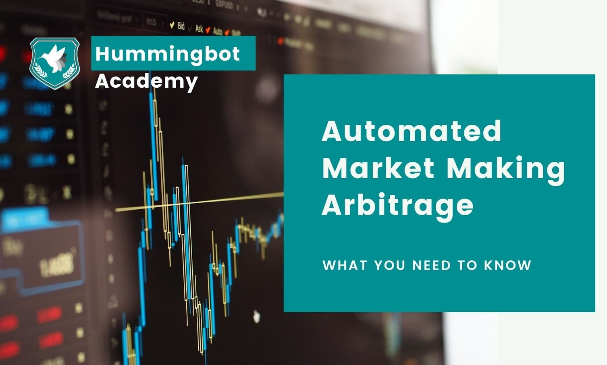
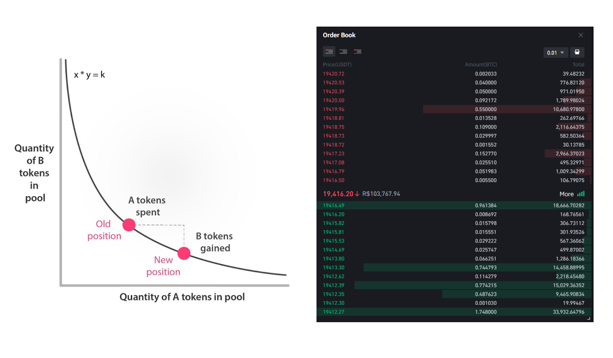
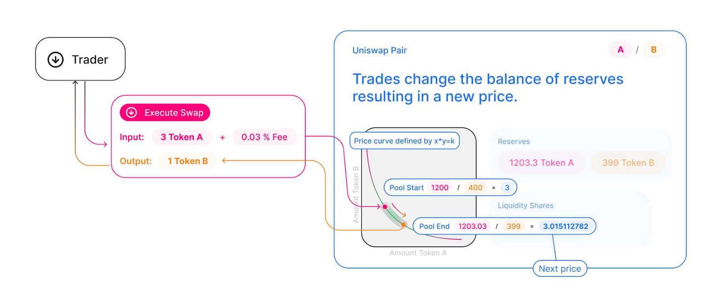

# How to arbitrage AMMs like Uniswap and Balancer

Welcome back to the Hummingbot Academy!

Lately, we have talked a lot about how you can use and customize Hummingbot to create a **market-making** strategy that will suit your trading needs.

But with the release of version 0.33, we added a new **decentralized exchange connector** and a new strategy called `amm-arb` that allow our users to execute arbitrage trades on blockchain protocols.

You can now arbitrage Uniswap and other **Automated Market Maker** protocols!

<!-- more -->

While arbitraging between two centralized exchanges with centralized order book (COB) is pretty simple to execute (choose exchanges, add API keys, choose minimum profitability, ready to go), decentralized exchange trading operations work a bit differently. Executing a profitable arbitrage strategy requires a better understanding of these mechanisms.

This article will help you understand these fundamental differences and help you build your arbitrage strategy, and we will go through the following topics.

*   Arbitrage on Centralized Order Book exchange vs. Automated Market Makers protocols
*   How is price determined on Centralized Exchanges vs. Decentralized AMMs
*   Ethereum Transaction Speed and Cost for arbitrage
*   How to estimate arbitrage costs on Ethereum

### How is the price determined on CLOB vs. AMM?

The answer to this question can be explained using the picture below:

The price of an asset pair on a **Centralized Order Book** is determined by individual market makers creating buy and sell orders while other participants decide if they want to trade at those given prices.

On the other hand, **Automated Market Makers** use a mathematical formula to define the price depending on each asset’s balance deposited on the liquidity pool.

For example, **Uniswap** trading pools only allow two assets, and the price of the pair is determined by the formula `x*y=k`, as you can see on the diagram below:

_Source: Uniswap_

**Balancer** uses a different formula because each pool can have more than two assets, but the price movement concept remains the same.

The consequence is that since prices are discovered in a different way on each model, this creates many arbitrage opportunities between **COB x AMM** or even between two different AMMs.

It is interesting to notice that the only way for the price to move on an AMM is when a swap happens, therefore, arbitrageurs become the main force in helping the AMM keep the price close to all the other markets.

*Note: some AMM protocols might allow users to add liquidity on only one side of the pool, and this might also change the pair price.*

## Trade and Transaction speed

To conclude a profitable arbitrage transaction, speed is critical.

Your trades must be executed as fast as possible, or the opportunity might be gone.

This is the main reason that to execute an arbitrage strategy with Hummingbot you must have funds deposited on both exchanges or wallet so that you can do both buy and sell transactions at the same time.

When arbitraging between two COB exchanges, usually this isn’t an issue (except in extreme cases), because when you use Hummingbot, both orders are sent and executed almost instantaneously.

But when you are dealing with blockchain transactions, things work a bit differently.

On the **Ethereum** for example, every transaction participates in an auction, where the users compete to see who will pay more to have their transactions validated first.

If you set your gas price too high, your transaction will be processed faster, but you risk overpaying for it and increasing the cost of executing the arbitrage.

If you set your gas price too low, you will save on transaction costs, but you risk taking too long to complete the transaction and missing the profitable arbitrage opportunity.

Because of that, the arbitrageurs must always be looking for the best blockchain transaction price, balancing cost x speed.

For the **Ethereum** blockchain, a site like ETH Gas Station can help you estimate the ideal gas price you should use for your transactions, based on the average speed of past blockchain interactions.

With Hummingbot, you have two config options to define how the bot will handle the gas price:

`ethgasstation_gas_enabled = False`

In this situation, Hummingbot will use a fixed gas price for the ethereum transactions it creates, which will be determined by the value set on `manual_gas_price`.

`ethgasstation_gas_enabled = True`

When activated, Hummingbot will use the ETH Gas Station API to choose the price it will use.

You must choose what speed level the bot will use as a reference by changing the `ethgasstation_gas_level` configuration.

## Transaction Order

Two orders will be executed when an arbitrage opportunity is detected, and there are two ways that Hummingbot can send the orders, and they are chosen through the `concurrent_orders_submission` configuration.

### Parallel order execution

When `concurrent_orders_submission` is set as True, the bot will create both orders at the same time.

While on the COB side the order will be immediately executed, on the AMM side the transaction will take more or less time, depending on the gas price you want to pay.

The risk here is that, if your Ethereum transaction takes too long, by the time it is validated, the price on the AMM might have changed, and might end up on a trade loss.

Also, if the blockchain transaction fails, you will have executed only one side of the arbitrage.

### Sequential order execution

With `concurrent_orders_submission` set to False, the bot will send the order to `market_2` only after the trade on `market_1` is confirmed.

If you set `market_1` as the AMM, this will reduce the risk of only one side of the operation being executed if the blockchain transaction fails.

The other side of the coin is that there is the risk that the Ethereum transaction takes too long and the opportunity on the COB side might be gone.

## Slippage Buffer

When Hummingbot detects a profitable arbitrage opportunity it will immediately communicate with the connected exchanges and create an order on each of them. 

Although this happens very quickly there is still a small delay between the bot detecting the opportunity and the trades being concluded.

To avoid having your order not being properly executed due to a change in price between the time that the bot create the order and the moment when the order is executed, you can set a slippage buffer using the config `market_#_slippage_buffer`.

When choosing the slippage buffer size you must consider the following risks:

*   If you use a high slippage buffer, you will reduce the chances of your orders not being completed, but risk paying a higher price at the execution.
*   With a low slippage buffer, you are trying to not overpay for the trade, but risk not having your order being completed due to not having enough offers on the price you want to execute the trade.

Before starting, take a look at the liquidity level of the market you will be running Hummingbot and estimate the ideal slippage buffer based on the `order_size` you are using.

If your `order_size` is usually bigger than the size of the orders being offered on the order book, you might want to increase the `market_#_slippage_buffer`.

## Arbitrage costs

Succesful arbitrage is all about balancing speed vs. cost, and that lead us to the next part of the puzzle: How much it will cost execute the trades.

When you are arbitraging between two COB exchanges, calculating the `min_profitability` is pretty straightforward:

Check what is the trade fee on both exchanges (trading costs) and add your profit margin.

But arbitraging on AMM exchanges is a bit different because along with the trading fee cost, there is also the blockchain transaction cost.

### **Ethereum transactions crash course**

> *Note: With the release of **version 0.34**, Hummingbot now incorporate all the transaction costs entailed on with trading on **Ethereum** (trading profit/loss, fees, slippage, etc) into the **profitability** calculation. That way, the `min_profitability` value must be set as the profit margin desired by the user.*
> *Neverthless, we also want to share how Hummingbot handles the intricacies of Ethereum transactions so you can better understand how everything happens under the hood.*

As we mentioned above, the cost of a transaction you send to the Ethereum blockchain will be defined by how much you are willing to pay to have that transaction processed by the miners. But that isn’t the only factor.

Imagine the Ethereum blockchain as a network of connected servers that work as a single worldwide computer.

All the transactions transmitted on the blockchain can be resumed as a set of instructions from/to different programs (wallets and smart contracts) that run on this world computer.

And as an instruction, each transaction can have a different amount of data being transmitted, depending on what the program will do with that information.

Take a look, for example, at what is being transmitted on a simple token transfer vs. a swap executed on Balancer.

**Token Transfer:**

**Balancer Swap:**

### Calculating the transaction cost

Have you noticed the difference between both transactions?

If you answered **Gas Used by transaction,** you are right. **Gas** is the Ethereum blockchain standard measure of how many resources a transaction will spend. The more information is transmitted on the transaction, the more **Gas** it will use.

Multiply this value by the **Gas Price** of the transaction, you find what the transaction cost (in ETH) is.

For the transactions above, and considering a Gas price of 40 gwei:

Token Transfer: 21,000 Gas x 40 = 840,000 Gwei = 0.00084 ETH

Balancer Swap: 452,647 Gas x 40 = 18,105,880 Gwei = 0.01810588 ETH

### Estimating arbitrage costs

Here is where things get a bit tricky.

Every smart contract has its own set of information (and the amount of gas) that it requires to be transmitted and processed, and they can vary depending on how each AMM contract works.

For example, while Uniswap uses one liquidity pool for each trading pair, Balancer might jump through different liquidity pools to conclude the trade with the lowest slippage. Since each pool can have different prices (due to different token balances) at the moment you send the transaction.

If you know Javascript, you could use [web3](https://www.npmjs.com/package/web3) to calculate how much gas a smart contract interaction would use and incorporate it into your trading.

But for those like me that don’t have a lot of coding knowledge, you can take a look at the past transactions on the AMM smart contract ([here is one of balancer’s AMM contracts](https://etherscan.io/address/0x3e66b66fd1d0b02fda6c811da9e0547970db2f21)), or execute some test swaps on the protocol and check how much gas the transaction used.

This is an essential piece of information because this transaction cost dynamic changes the way the arbitrageur will have to calculate the `min_profitability` parameter.

Arbitrage on AMM protocols means that one trade leg (or two, if you are arbitraging against another AMM) has a fixed transaction cost.

As an example, let's take a look at an arbitrage with ETH and DAI between Binance and Balancer and estimate what the arbitrage cost is:

| Exchange | Transaction cost |
| -------- | ---------------- |
| Binance  | 0.1% trading commission |
| Balancer | 0.2% swap fee (average) |

> **Note:** Each pool on the Balancer protocol has its swap fee. The value above is an average fee weighted by the liquidity size of each pool estimated by me. You can check the fee of each pool on the [Balancer pools list](https://pools.balancer.exchange/#/explore).

Both costs above are proportional to the order size. If you trade 1 ETH in total, you will pay 0.003 ETH in trading fees. If you trade 100 ETH in total, you will pay 0.3 ETH in trading fees.

> For **Balance** you can edit the `conf_global.yml` file to define what is the max amount of swaps/pools you want the bot to use by changing the parameter `balancer_max_swaps`

**Ethereum transaction cost:**

A transaction on Balancer smart contract will use around 50k gas + 100k gas/pool used on the swap.

Let’s assume for this example that, in the worst-case scenario, our arbitrage transactions will use four different pools to execute the swap, for a total of 450k gas spent.

To guarantee that our transactions will be executed as fast as possible, we will set a fixed gas price of 100 gwei.

That way, each arbitrage trade we execute will have a fixed cost of 45,000,000 gwei or 0.045 ETH.

What is important to notice here is that, different from the trading fees, the transaction cost will be the same no matter what the order size is.

What will change is what is the proportion of this cost relative to your order size:

With an order size of 1 ETH, the above transaction cost will be (0.045 / 1) * 100 = 4,5%

With an order size of 100 ETH the above transaction cost will be (0.045 / 100) * 100 = 0.045%

#### Calculating the minimum profitability value

On Hummingbot, the `min_profitability` value is what will trigger the execution of an arbitrage trade.

Like i mentioned before, with version 0.34 you don't have to worry anymore about adding the trading costs to your `min_profitability`. Hummingbot will do all the hard work for you.

But, if you are curious, here is an example of what calculation you would have to do, if Hummingbot didn't added the transaction costs to profit calculation.

To estimate how much it would cost (in % of the order total value) first, we choose what will be the order size. Let’s use 10 ETH as our example.

Arbitraging with 1 ETH, the blockchain transaction cost will be:

(0.045 / 1) * 100 = 4.5%

We add this number to the total trading fee on both legs (0.1% on Binance and 0.2% on Balancer).

4.5 + 0.1 + 0.2 = 4.7%

So, the cost involved on this operation will be 4.7% of the total value of the operation size.

If you set a `min_profitability = 1%`, Hummingbot will execute a trade when the price difference is more than `(4.7% + 1%) = 5.7%` 

### About Gas Limit

There is another type of data that is transmitted on an Ethereum transaction: Gas Limit.

Every transaction sent on the blockchain must have a Gas Limit set that will define the maximum amount of gas that a specific transaction is allowed to use.

If you set this value too low, your transaction might not be accepted.

With Hummingbot, there is no need to worry about this because the transactions created by the bot will have a Gas Limit that will ensure your transactions are concluded.

## Conclusion

The concept of arbitrage trade is easy to understand: Buy low at one market, sell high at another simultaneously with a price difference significant enough to cover the costs, and have a profit margin.

But Automated Market Makers add an extra layer of complexity to this kind of trading operation because of the additional steps needed to complete transactions created on a blockchain.

It is important to notice that the trading concept is still the same, no matter where the operation is happening. What matters is that you, as a trader, understand what are the needed steps and added costs of different trading platforms and adjust your strategy accordingly.

# **Join our community!**

You can be part of our community by joining us on our [ Discord channel](https://discord.com/invite/2MN3UWg) to talk about the hummingbot, strategies, liquidity mining, and anything else related to the cryptocurrency world, and receive direct support from our team.

To keep up with the news and updates, make sure to follow us on [ Twitter](https://twitter.com/hummingbot_io) and our Community on [ Reddit](https://www.reddit.com/r/Hummingbot/).

On our [ Youtube Channel](https://www.youtube.com/channel/UCxzzdEnDRbylLMWmaMjywOA?sub_confirmation=1), you can find a lot of content about market making, including interviews with professional traders and cryptocurrency-related events.
