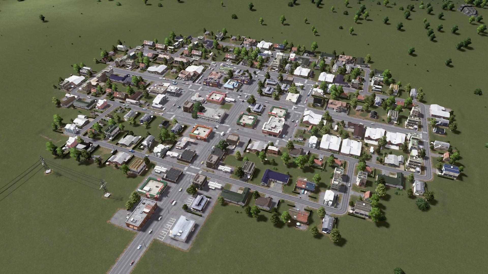

# How to Use the Cross-Exchange Market Making Strategy


Cross exchange is a **maker-taker** strategy that performs market making trades between two markets: it emits limit orders to a less liquid, larger spread market; and emits market orders on a more liquid, smaller spread market whenever the limit orders were hit.

**Arbitrage** and **cross-exchange market making** are often described as "risk-free" because these strategies *largely* mitigate the main risk associated with market making: inventory risk. This makes this strategy more beginner friendly. The main risk that remains is execution risk.

This article explains:
1. The basic concept of cross-exchange market making
2. The difference between cross-exchange market making, arbitrage, and pure market making strategies
3. Why and when to use this strategy

<!-- more -->

## Cross exchange market making reduces inventory risk

Arbitrage and cross-exchange market making are often considered and described as "risk-free" because these strategies *largely* mitigate the main risk associated with market making: inventory risk. The main risk that remains is execution risk. To learn more, please read the following blog post:

[](../2020-09-what-is-cross-exchange-market-making/index.md)
> **What is cross exchange market making?**  
> by Paulo Henrique Welcome back to our Educational Center, where we aim to help you to learn more about market making, arbitrage, and everything related to algorithmic trading. Today we will talk about one of the core strategies that can be used with hummingbot: cross-exchange market making.

## The concept behind cross exchange market making strategy

Our video is outdated in terms of Hummingbot UI but explains the idea of cross exchange market making strategy.

[Cross-exchange market making strategy](https://www.youtube.com/embed/jVIagFbQnmo)

Basically, you want to make a market on a less liquid exchange or pair and take from the more liquid market. Your order prices are based on how much you can buy or sell the asset from the other market.

Let's say you live in a remote area with a fair amount of population but only a couple of stores open to buy goods or merchandise from, therefore we can say that the market in your area is illiquid.



A liquid market is like a commercial area of the city where there are lots of shopping malls and stores that offers to buy and sell even if they have the same kind of goods and services.


Since there's a lot of competition in the city, stores would most of the time compete with each other's prices to attract customers. But in your area, prices can be a lot higher because you have to consider other expenses in obtaining those goods like taxes (similar to fees) and sometimes transportation costs or you'll be able to sell your used items at a very low price than you wanted because they have to consider their costs and how much they can profit if they sell it in the more liquid market.

As an example, let's say you decided to put up a store in your remote area where you buy & sell any sort of goods and call it STORE A. In doing this, you add liquidity to the market. Let's call the stores in the city STORE B. You also need to have a starting inventory - some cash available to buy stuff from others and some merchandise you want to sell.

### Creating sell order in maker, executing a buy order from taker market

You're thinking of selling an item and want to make a 20% profit from it. So you checked the price at STORE B and saw that you can buy the exact same item for $100 (tax not yet included).

Initially, you were thinking of selling it at $120 but you also have to consider taxes (fees) in making those trades. Taxes are at 0.1% and since you're making two trades (sell and buy), you have to pay for it twice. So you want to sell it for $120.22 because:

```
$120 + $0.12 tax ( 0.1% for selling at $120 ) + $0.1 tax ( 0.1% for buying at $100 )
```


You've put it in display waiting for someone to drop by your store and buy the item. When the item was sold you went to STORE B, bought the exact same item for $100.1 including tax and profited $20 from those trades.

### Creating buy order in maker, executing a sell order from taker market

It works the same as the example above, but in reverse. In this case, you want to buy items at the price of how much you can profit from selling it at the more liquid market.

## Cross-exchange market making in action

<iframe style="width:100%; min-height:400px;" src="https://www.youtube.com/embed/gwLjSe0t8K8" frameborder="0" allow="accelerometer; autoplay; encrypted-media; gyroscope; picture-in-picture" allowfullscreen></iframe>
