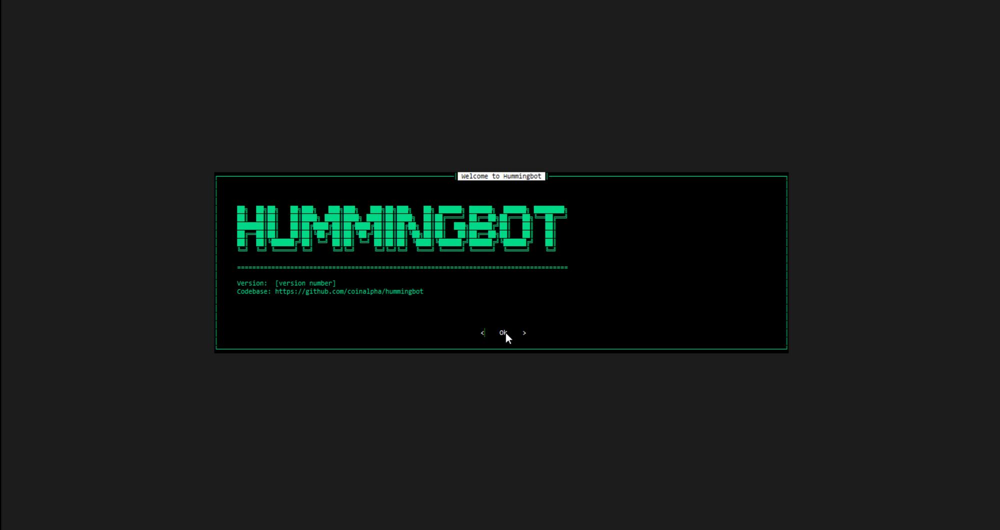

# Hummingbot 2023 Technical Roadmap

*This post provides a description of the technical changes that the Hummingbot Foundation plans to implement over the course of the next year. Note that these changes will be subject to HBOT governance and the approval of the Hummingbot community.*

## From bot to framework

Since it was launched in 2019, the open source [Hummingbot](https://github.com/hummingbot/hummingbot?ref=blog.hummingbot.org) software client has grown and evolved considerably. 

<!-- more -->

Originally a simple market making bot that only supported a few exchanges, today Hummingbot is a now a powerful, complex codebase with connectors to 40+ centralized and decentralized exchanges, 13+ strategies, and helper modules such as the Rate Oracle, Telegram integration, and other components.

With hundreds of daily active users who [generate millions in volume](https://p.datadoghq.com/sb/a96a744f5-a15479d77992ccba0d23aecfd4c87a52?ref=blog.hummingbot.org) and [provide liquidity to many tokens](https://miners.hummingbot.io/?ref=blog.hummingbot.org), the Hummingbot community is a small but powerful global army of quant traders and developers who use and maintain this shared community-owned codebase.

Hummingbot has evolved from a simple market market making bot into a extensible software framework that allows you to build and execute powerful, cross-venue algorithmic trading strategies. 

We've been amazed at what our community has been able to build with Hummingbot. The users who consistently rank at the top of the Hummingbot Miner leaderboard are mostly running customized Hummingbot forks. 

Therefore, our overall goal at Hummingbot Foundation next year is to grow the population of technical Hummingbot users who can customize and create their own strategies via [Scripts](https://docs.hummingbot.org/scripts?ref=blog.hummingbot.org), instead of just running the off-the-shelf strategy templates. 

2023 technical priorities

Source: [Andy Holmes](https://unsplash.com/photos/rCbdp8VCYhQ?ref=blog.hummingbot.org)

### 1. Expand functionality of top exchange connectors

As mentioned in [our recent post](../2022-12-changes-to-hummingbot-maintenance-and-governance-processes/index.md), we plan to leverage HBOT governance to let the community decide on the top 1 (Gold) and 2-4 (Silver) exchanges of each type, CEX and DEX.

After the first poll in January, we will begin to focus maintenance effort on the Gold exchanges, bringing them up to a gold standard technically, as well as adding support for all major endpoints supported in the exchange API, such as:

* All order types
* Lending / borrowing
* Deposit / withdrawal
* Staking / liquidity provision

Hummingbot Foundation will maintain the Gold exchanges and add the endpoints above to them, while creating developer bounties for the Silver exchanges.

### 2. Optimize Hummingbot codebase

The new governance process is designed to limit our ongoing maintenance bandwidth so that we have capacity to make improvements here. After the voting process, we will remove the exchange connectors and strategies that don�t meet minimum vote threshold from codebase.

Currently, the Gateway module is built as a folder in the Hummingbot code repository. We plan to move Gateway into another repository and use git submodule to import it.

In addition, since a simpler codebase will be easier to maintain, we will reassess other aspects of the Hummingbot codebase and aim to reduce overall codebase size by 30%.

### 3. Expand Scripts framework

[Hummingbot Botcamp](https://hummingbot.org/botcamp?ref=blog.hummingbot.org)'s first cohorts are showing that the real power of Hummingbot is allowing people to build simple, powerful custom trading strategies using Scripts. With the most recent release, there are now [13 Script examples in the open source codebase](https://github.com/hummingbot/hummingbot/tree/master/scripts?ref=blog.hummingbot.org) and we plan to each more each month.

Next year, we plan to expand Scripts by:

**Enabling Scripts to work with Gateway**

Many users have asked how Scripts can use the DEX connectors in the Gateway module. We are working on examples now and plan to add them to the next few releases.

**Directional framework**

Hummingbot was originally focused on market making strategies, but the capabilities that the framework offers can make it very suitable to run directional strategies. While you can already build your custom directional strategies with Hummingbot, we will create a set of modules to automate the signal generation, execution and analysis of directional trading strategies.

The modules involved are:

1. **Execution bot:** Bot that receives signals that based on local rules, create a new position and control three barriers: (1) stop loss, (2) take profit and (3) time limit. After execution, the bot can send trading status and history to other destinations.
2. **Signal analytics**: Dashboard that show information related to the signals executed by the bot like: win/lose ratio, max drawdown, P&L, etc.
3. **Signal factory**: Optional module that lets users generate signals using order book data and send signal to a broker that opens up channels that other bots can subscribe to and trade. We have received many inquiries from many traders and developers interested in these type of strategies.

**OHLC Generator + Indicators**

Many of the traders and Hummingbot developers are interested in add indicators to their strategies. 

Currently, the only way to do this with Hummingbot right now is using trailing indicators (per-tick price data collected by the bot), but this solution is not suitable for candlestick indicators, since you have to get historical data to construct the OHLCs needed.

That�s why one of the projects will be the OHLC Generator, that will allow users to initialize their strategies with multiple OHLCs (time or volume based). In addition, we plan to support third-party library like [ta-lib](https://github.com/mrjbq7/ta-lib?ref=blog.hummingbot.org) so that users can compute and create various indicators.

**Make scripts configurable**

One of the benefits of [Strategies](https://docs.hummingbot.org/strategies?ref=blog.hummingbot.org) is that you define configuration `.yml` files that allow users to change parameters through the CLI or by editing the file. However, the downside is that Strategies require you to add a lot of boilerplate code, such as writing the `start.py` file and defining the initialization of the strategy.

On the other hand, [Scripts](https://docs.hummingbot.org/scripts?ref=blog.hummingbot.org) allow users to easily create strategies in a single file, but currently don't allow users to define a configuration file. To get the best of both worlds, we plan to define a new class of Strategies/Scripts that will work with a configuration file and with the simple, Python-based user experience of the existing Scripts.  

### 4. Support external modules like Orchestration

It's clear from community calls that orchestrating multiple bots and controlling bots programmatically are directions that they want the codebase to expand.

Currently, the only ways to interact with the bot right now are using the CLI or the Telegram integration. These solutions are not suitable for a user that wants to manage a lot of bots because:

* If using the CLI, the user has to access to each bot instance and change the parameters there.
* If using the Telegram integration, the user has to create API keys for each bot and add those keys to the conf file of each bot.

A few months ago, the community awarded a 2M HBOT bounty to two community developers, klpanagi and TheHolyRoger, to build an orchestration module, as described in [this forum post](https://forum.hummingbot.org/t/hip-bot-orchestration/186?ref=blog.hummingbot.org).

The proposed solution includes a web interface where the user can see all the bots that are running, the performance of each one and also will be able to execute all the supported commands that the client has right now (start, stop, change strategy, etc). The implementation includes a Broker like (MQTT, Kafka, RabitMQ, etc) that will allow the communications between this Web Application and each client.

The team has submitted a [draft pull request](https://github.com/hummingbot/hummingbot/pull/5945?ref=blog.hummingbot.org) and anyone in the community is free to test it and leave feedback on the Github PR!

We plan to keep the core Hummingbot codebase lightweight and work with community teams to support external modules like orchestration. If there are teams that want to design and maintain similar external components that work with Hummingbot, please let us know.

The road to Hummingbot 2.0

Source: [Karsten Wurth](https://unsplash.com/photos/rafblRbne3o?ref=blog.hummingbot.org)

As Hummingbot evolves into a powerful cross-venue algorithmic trading strategy creation framework, we believe there should be a milestone release called Hummingbot 2.0 at some point in the future, possibly at the end of 2023. 

What features do you think should be in Hummingbot 2.0?

