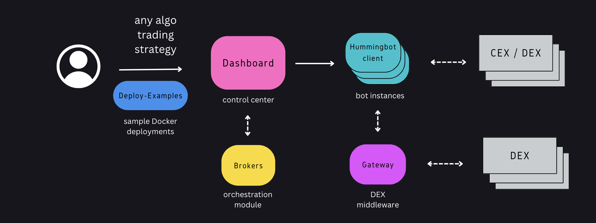
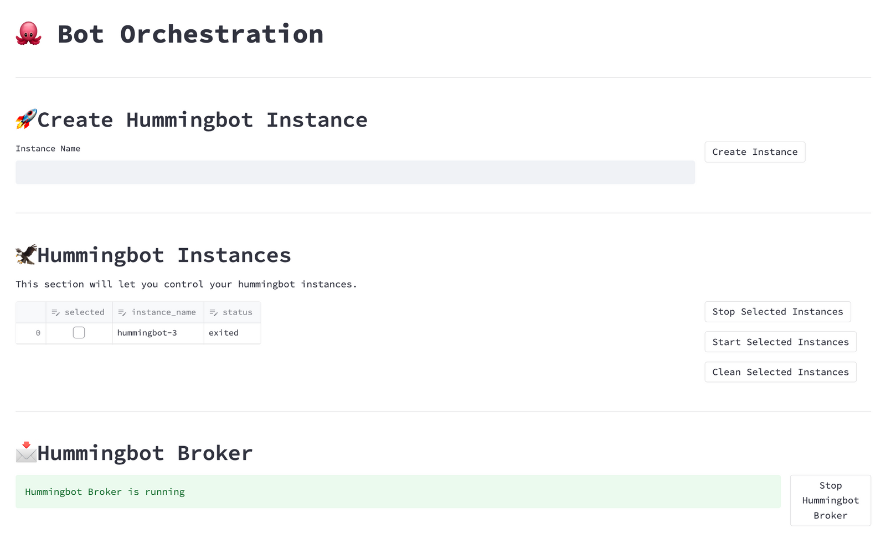

# Kicking Off the Hummingbot Dashboard Community Project

by Hummingbot Foundation

From the moment we open sourced Hummingbot as a CLI-based market making bot back in 2019, people have asked "wen GUI???"

While we knew that a graphical user interface would make Hummingbot more user-friendly, we chose to spend our limited resources on improving Hummingbot's exchange connectors and strategy template library.

Fast forward to 2023, and today Hummingbot has grown into a larger open source ecosystem with diverse types of users globally who use it in a variety of ways. Thousands of individual users run Hummingbot out-of-the-box to earn rewards on the [Hummingbot Miner platform](https://miner.hummingbot.io/), while many institutional trading firms deploy dozens of heavily-customized Hummingbot instances.  In addition, the success of [Community Bounties](https://hummingbot.org/blog/2023/05/03/introducing-community-bounties/) in fixing bugs and adding features have proven that a community development model can sustainably maintain Hummingbot operationally.

Today, we are excited to official launch [Hummingbot Dashboard](https://github.com/hummingbot/dashboard), an open source graphical control center that helps you launch and deploy a fleet of Hummingbot instances. You'll also be able to analyze the performance of each instance and adjust its settings in real-time!

---

Dashboard is the one of the final pieces in the Hummingbot landscape. Hummingbot Foundation now maintain five open source code repositories, each serving a different technical role in the ecosystem:

 - [Hummingbot client](https://github.com/hummingbot/hummingbot): Python engine that automates a trading process (bot)
 - [Gateway](https://github.com/hummingbot/gateway): Typescript middleware that helps bots connect to DEXs and blockchains
 - [Brokers](https://github.com/hummingbot/brokers): MQTT broker module that enables 2-way bot communication
 - [Dashboard](https://github.com/hummingbot/dashboard): StreamLit control center that deploys and manages bots
 - [Deploy-Examples](https://github.com/hummingbot/deploy-examples): Docker Compose-based deployment examples that provide a single entry point for all bot configurations

 These five repos work together to let users deploy and use Hummingbot however they like. For example, an individual user may just run a single market making bot instance alongside the stock dashboard that analyzes its performance. Meanwhile, a trading firm can use the same stack to deploy multiple bots, each running its own custom strategy, and analyze their aggregate performance with a custom dashboard.

Best of all, everything is open source and free!

Early prototype of the Bot Orchestration dashboard

## Dashboard Roadmap

By the end of this year, a user setting up Hummingbot for the first time should be able to:

1. Download [deploy-examples](https://github.com/hummingbot/deploy-examples) and go to the folder with their desired configuration
2. Run `docker compose up -d`
3. See Dashboard app running at [https://localhost:8501]() in the browser
4. Click “Launch bot” in the Bot Orchestration dashboard
5. Hummingbot instance running a market making bot in paper trading mode automatically starts
6. See the bot's real-time performance in the Strategy Performance dashboard
7. Tweak bot parameters and have them take effect immediately
8. Share a public read-only view of the Strategy Performance dashboard

Over the next few months, the Dashboard team plans to create the initial dashboards, which will allow users to:

- Launch and deploy bot instances
- Analyze and manage individual bots
- Perform utility actions like inspecting databases and fetching historical data

These act as standardized templates, which allows the community to earn bounties by contributing future dashboards that:

- Backtest strategies
- Analyze aggregate bot performance and rebalance portfolios
- Customize analysis for specific strategy types

## Building in Public

Achieving this vision would be impossible without the support of the global Hummingbot developer community. There are only 7 full-time people at Hummingbot Foundation, so we try to maximize the time we spent creating Github issues and bounties for community developers, reviewing their pull requests, and administering the governance system.

That's why we are launching Hummingbot Dashboard as a community project, one that Foundation engineers will build in tandem with independent community developers from Day 1.

Dashboard is well-suited to be a community project because each dashboard is its own folder. Since dashboards entail design and user research, we need more than just engineers involved. In addition, the [Streamlit](https://streamlit.io/?ref=blog.hummingbot.org) framework provides an easy way to create nice-looking dashboard in Python.

To demonstrate our commitment to building Dashboard in public, we will livestream regular sprint planning calls on Discord and invite the community to participate and give feedback. A number of community members have already indicated interest in joining the initial Dashboard developer group, so we have scheduled the first kickoff call as a public Discord event for next week.

### Dashboard Kickoff Call Details

 - When: Wednesday June 21 2023 8am PST / 3pm UTC / 11pm SIN
 - Where: Discord `#community-video-calls` channel
 - Link: [https://discord.gg/E3wq2QKH?event=1118718393315500122]()

 At the kickoff call, we plan to give an overview of the current state of the Dashboard project and outline how the community can contribute. If you're interested in helping out, please join or let us know at the `#dashboard` Discord channel!