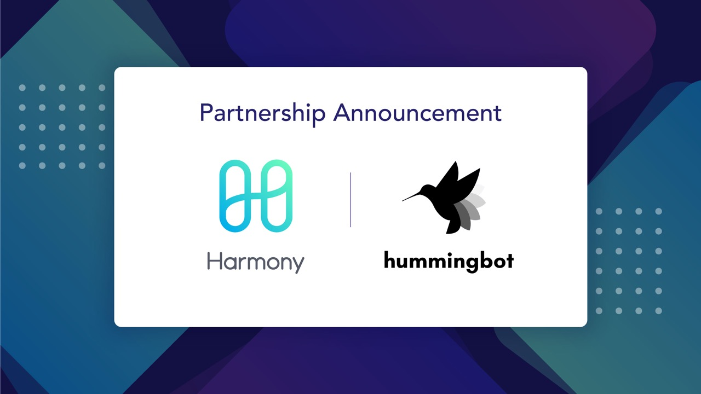

# Introducing Harmony Liquidity Bounties

A new approach to solving one of the biggest problems that face issuers of digital tokens: **liquidity**.

For the first Liquidity Bounty, we have partnered with our friends at [Harmony Protocol](https://harmony.one/), a Layer 1 blockchain project with key innovations in sharding and network transport, founded by a highly technical team from Google, Apple, and Amazon.

<!-- more -->

## Liquidity is a scarce, expensive resource

Liquidity is necessary for any publicly traded asset. Buyers and sellers want to transact at a fair price in a deep, orderly market with little slippage. In the modern financial world, providers of liquidity (i.e. **market makers**) are dominated by quantitative hedge funds and trading firms who have the infrastructure and intelligence to deploy sophisticated algorithms at scale.

We've written before about the [small-cap liquidity crisis](../2019-01-thin-crust-of-liquidity/index.md) in equities, in which smaller stocks can't attract liquidity because the large trading firms focus on market making for the largest stocks on the most liquid trading venues.

Liquidity is an even bigger problem in the fragmented world of crypto. There are relatively few quantitative trading firms with the technical sophistication to do algorithmic market making, so they can charge issuers up to $50,000 per month and require them to put up millions in inventory. This is unaffordable for the vast majority of token issuers.

In addition, the large amount of assets that issuers provide to market makers, coupled with lack of transparency and industry standards, creates perverse incentives for certain market makers to act maliciously via wash trading and market manipulation. Not only does this bad behavior reflect badly on token projects when discovered, but it also causes "pump-and-dumps" which allow malicious market makers to profit at the expense of the ordinary traders in the issuer's community.

## Direct market access unlocks market making for all

The fundamental theory behind market making is quite simple. You just make and maintain two limit orders, a buy order and a sell order. Since you would naturally set the buy price lower than the sell price, market making can be a **positive expectation strategy**, where the expected value of each trade may be positive.

However, market making is predicated on market access. Fiat exchanges like the NYSE and Nasdaq restrict the ability to place orders directly on the exchange to a few designated firms, which is why these firms actually [pay Robinhood](https://www.bloomberg.com/news/articles/2018-10-15/robinhood-gets-almost-half-its-revenue-in-controversial-bargain-with-high-speed-traders) for the right to make a market for Robinhood users' orders.

In contrast, crypto exchanges offer **direct market access**: open trading APIs and free data feeds to everyone. This enabled us to build Hummingbot, open source software for algorithmic trading that allows anyone to build and run market making bots.

While large market makers fight over the most actively traded pairs on the highest volume exchanges, there exists a massive **long tail of smaller markets** who also need liquidity: tokens outside the top 10, smaller exchanges, decentralized exchanges, and new blockchains. By lowering the technical barriers to market making with a free and open-source tool, we hope to grow a community of individuals and smaller firms who are best equipped to make markets for these newer venues.

## A new incentive structure: liquidity bounties

This community-based approach to market making unlocks a new compensation model that we call **liquidity bounties**. Inspired by bug bounties, liquidity bounties allow Hummingbot users to earn rewards from providing liquidity to a token issuer.

Instead of giving millions in inventory and fees to a single market making firm without much visibility into whether they are actually doing their job, token issuers can now set reward tiers based on **hard, quantifiable metrics** such as open order volume and filled order volume. Rather than paying steep upfront fees without clear metrics of success, token issuers can pay only when specific liquidity objectives are achieved. Rather than lining the pockets of a wealthy hedge fund manager, issuers can reward members of their community based on their actual liquidity contribution.

Anyone who is eligible to trade the token can now compete with others to earn extra tokens based on their periodic trading activity. Bounty program participants can see where they rank versus others via a public leaderboard.

We take **compliance** extremely seriously. Liquidity bounty participants need to opt into data collection, which allows us to verify their trading activity against our internal exchange data feeds and prevent reporting of fake volume. In addition, we will run proprietary algorithms to detect wash trading, spoofing, and other bad practices.

Liquidity bounties also help token issuers **boost liquidity across multiple exchanges**. Hummingbot is an open source platform with connectors to both centralized and decentralized exchanges, and we will work with our liquidity bounty partners to prioritize the venues where their tokens trade. Since users can run Hummingbot's [cross-exchange market making strategy](/strategies/cross-exchange-market-making.md) in order to port liquidity from one exchange to another, token issuers should see greater price stability and more even liquidity across the exchange landscape.

## Announcing ONE Makers, the liquidity bounty for Harmony Protocol

We're incredibly pumped to be working with our close friends at [Harmony Protocol](https://harmony.one/) for the first liquidity bounty. A fast and scalable Layer 1 protocol, Harmony has a strong technical team from Google, Apple, and Amazon who is laser-focused on shipping product. Less than a year after launching, they are already live on mainnet with real working dApps that offer seamless UX while maintaining core state on a sharded blockchain.

But I think the secret to their success lies in their dedication to growing a large, global community that values technical rigor. Harmony began as a weekly gathering of former Googlers and friends who got together to discuss academic research into machine learning and blockchain. In fact, it was at one of these gatherings in early 2017 that Carlo, Martin, and I all met and started CoinAlpha, the company behind Hummingbot.

Today, the Harmony community spans the globe. Reflecting the highly technical nature of the team and the project, there is a disproportionate number of developers, data scientists, and others with the technical acumen to run algorithmic trading software like Hummingbot, which makes Harmony the ideal initial partner for Liquidity Bounties.

## How to get started

Starting in a few weeks, anyone eligible to trade ONE can earn extra ONE tokens by market making on Binance as well as other exchanges where ONE may trade. Please sign up here in order to be notified when the program commences.

For token issuers interested in Liquidity Bounties, please visit [this page](https://miner.hummingbot.io/) or email us at [partnerships@coinalpha.com](mailto:partnerships@coinalpha.com) for more information.

## Important disclaimer

### Not Financial, Legal, or Tax Advice

The content of this Site does not constitute financial, investment, legal, or tax advice. You (the reader of this disclaimer, as well as any user of the Hummingbot software) are solely responsible for conducting any legal, accounting, or due diligence review before determining whether to download and use this open-source software and/or participate in any Bounty Programs. You should obtain investment and tax advice from the appropriate advisers before deciding to use Hummingbot or participate in any Bounty Programs.

None of the information contained on this Site constitutes a recommendation, solicitation, or offer to buy or sell any securities, options, or other financial instruments or other assets, or to provide any investment advice or service. The information contained in this Site has been prepared without reference to any particular User’s jurisdiction or location, applicable regulatory authorities, or financial situation, or any other relevant factor that may affect whether a given User can use Hummingbot consistent with any relevant law.

### Data Sharing

By participating in a Bounty Program, you are agreeing to sharing the following information with CoinAlpha, the Token Issuer that is conducting the Bounty Program, and their respective affiliates:

- Orders created by your use of Hummingbot;
- Transactions completed by your use of Hummingbot;
- Your Ethereum wallet address: where bounty awards, if any, are to be received.

When sharing data from Hummingbot, you are solely responsible for configuring what information you agree to share through the Hummingbot log configuration settings (please see [example log templates](https://github.com/hummingbot/hummingbot/blob/master/hummingbot/templates/hummingbot_logs_TEMPLATE.yml)).

For additional terms related to the sharing and use of your data, please review the following:

- CoinAlpha’s Privacy Policy 
- [Hummingbot Apache License 2.0](https://github.com/CoinAlpha/hummingbot/blob/master/LICENSE)
- [Hummingbot Website Terms of Use](https://www.hummingbot.io/terms.pdf)
- Each Token Issuer’s respective Privacy Policy that relates to your use of Hummingbot

