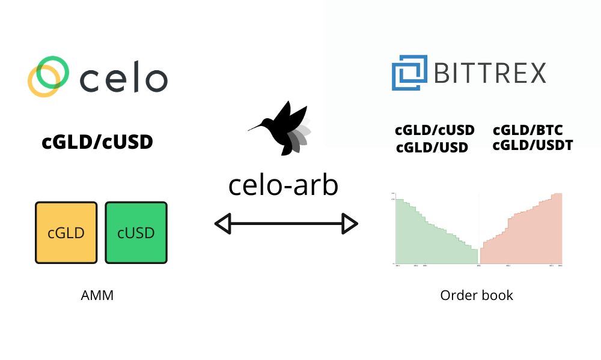

# Introducing the Celo Arbitrage Bot

### TL;DR
In the next `release` of Hummingbot (ETA 2 weeks), we will be officially supporting the [Celo](https://celo.org/) blockchain protocol and releasing a new algorithmic trading strategy called `celo-arb`. 

This strategy will allow anyone with cGLD or cUSD, the two native tokens of the Celo ecosystem, to earn arbitrage profits while contributing to the stability of the Celo protocol. 

In addition, this strategy bridges the disparate worlds of centralized order book exchanges and decentralized automated market makers (AMMs), improving efficiency and price discovery for both.

<!-- more -->

### How celo-arb works

Celo is a new Layer 1 blockchain that is building a new global financial system centered around an algorithmic stablecoin called cUSD. We are huge fans of Celo because they share the ultimate mission as Hummingbot: giving financial superpowers to everyone, no matter where they live or how much money they have. 

To ensure that the cUSD stablecoin trades at or near $1.00, Celo maintains an automatic market maker (AMM) DEX on their blockchain that allows users to exchange the price-stable cUSD for cGLD, the price-fluctuating, volatile asset in the Celo system. Similar to Ethereum-based AMMs such as [Uniswap](https://uniswap.exchange/) and [Balancer](https://balancer.finance/), the Celo AMM uses a constant product market making algorithm, backed by cUSD and cGLD reserves, for liquidity.

At the same time, cGLD and cUSD also trades on Bittrex and other centralized exchanges, across many different trading pairs, such as cGLD-USD, cGLD-USDT, and BTC-cUSD. Each of these trading pairs is an order book comprising hundreds of individual bids and offers at different amounts and price points.

Since the cGLD-cUSD cross on the Celo AMM is algorithmically defined, but other cGLD and cUSD crosses on centralized exchanges are order book-driven, arbitrage opportunities arise as these different markets evolve. These arbitrage opportunities are actually the key to maintaining stability of the cUSD peg. 

Similar to the role that [Keepers](https://developer.makerdao.com/keepers/) play in the Maker ecosystem, arbitrage bots help maintain cUSD stability by exploiting price differences that arise between the centralized exchanges and the AMM.

### No-code arbitrage bots

As shown in this `video`, Hummingbot’s upcoming `celo-arb` strategy allows anyone with cGLD or cUSD to build and run an arbitrage just by answering a few configuration questions. Users can create a bot that continually scans for arbitrage opportunities 24/7 and capitalizes on them. 

As Celo expands to other exchanges and more cGLD and cUSD pairs are listed, there will be many combinations of crosses, creating more potential arbitrage opportunities for bots to capture. The more bots there are, the more anti-fragile Celo’s stability mechanism becomes.

Not only will `celo-arb`, bring greater stability to Celo’s stablecoins, but we also believe that it will strengthen the global Celo token-holder community by giving them another way to productively use their tokens to contribute to the ecosystem. In addition to `celo-arb`, users can also run other Hummingbot strategies to provide liquidity for Celo’s tokens, and they can also use Hummingbot to build their own customized strategies.

### A bridge between two disparate worlds

The `celo-arb` strategy also provides a template for bridging the AMM-dominated decentralized exchange (DEX) landscape and the order-book based world of centralized exchanges. Since the strategy captures arbitrage opportunities between an order book versus an AMM, it can be easily modified to suit to fit Uniswap, Balancer, and other AMMs. 

We invite anyone interested in working on such a strategy to submit an issue to our [public roadmap](https://github.com/orgs/hummingbot/projects/1).

### Try it out

Since Hummingbot is open source, you can already check out the Github [feature branch](https://github.com/hummingbot/hummingbot/tree/development) and test it against ETH-USD pairs on the Baklava Celo testnet. We expect the production strategy to go live closer to when the Celo stability mechanism is activated.

### About Celo

[Celo](https://celo.org/) is a proof-of-stake based blockchain with smart contracts. The technology uses a phone number-based identity system with address-based encryption and eigentrust-based reputation. Its open-source platform allows for an ecosystem of powerful applications built on top, including easier cash transfer programs, peer-to-peer lending, collaborative small-scale insurance, and other digital assets and wallets. Its stablecoin uses phone numbers as identity implemented by an algorithmic reserve-backed stabilization mechanism. The first stablecoin, cUSD, tracks the value of the US Dollar. 

### About the Hummingbot and Celo Partnership

Hummingbot creates high-frequency, algorithmic trading bots and strategies for trading cryptocurrencies on both centralized and decentralized exchanges. Hummingbot aims to give everyone in the world algorithmic trading superpowers that were previously available only to large financial institutions. The goal of our team is to build a more open, fair, and inclusive global financial system. In this sense, Celo’s mission to build a financial system that creates the conditions for prosperity for everyone speaks our minds! This is why we are super excited to work with Celo on this initiative. 
