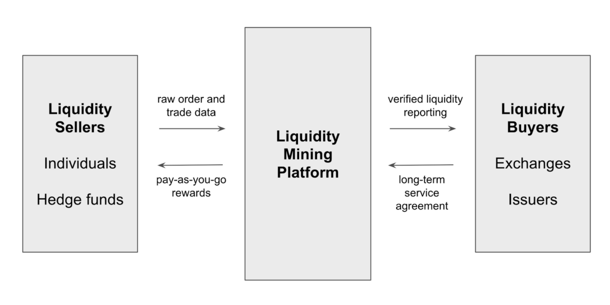
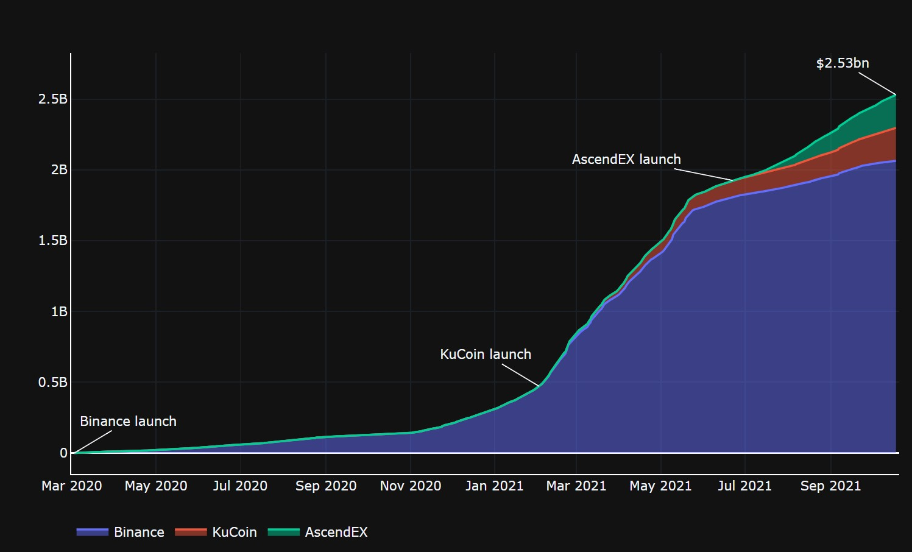
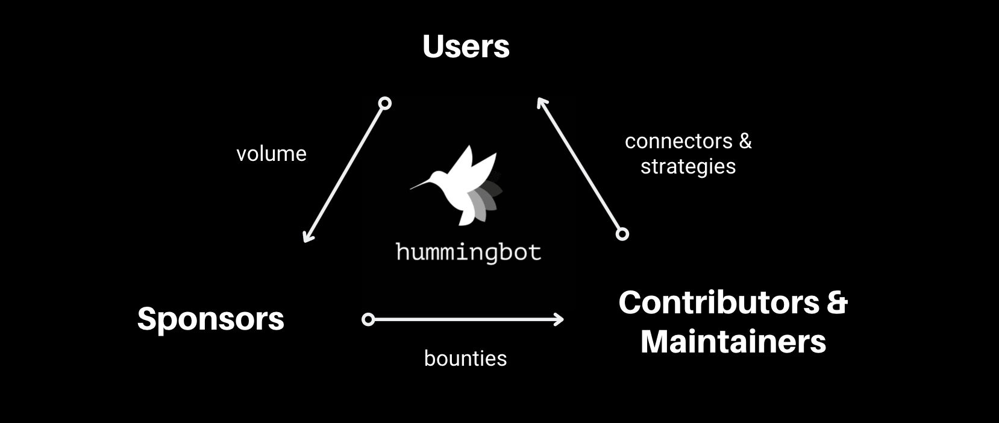
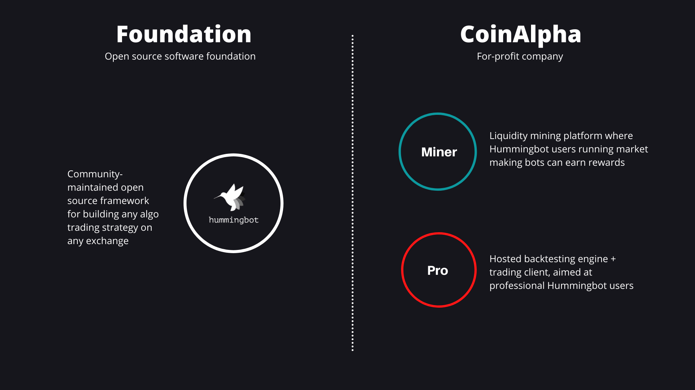

# Introducing the Hummingbot Foundation

A new experimental organization that will coordinate the ongoing maintenance and improvement of Hummingbot via a decentralized set of actors

<!-- more -->

## Summary

- Hummingbot is the leading **open source crypto trading bot** with connectors to 30+ exchanges and a 16k-strong global community of developers and traders
- CoinAlpha, the company behind Hummingbot, plans to establish a **new open source foundation** to enable it to be maintained by its community, similar to the Linux Foundation
- The Hummingbot Foundation is a new experimental organization that will coordinate the ongoing maintenance and improvement of Hummingbot via a decentralized set of actors: **sponsors, contributors, maintainers, and users**
- Launch sponsors include leading blockchain protocols such as [Harmony](https://www.harmony.one/), [Avalanche](https://www.avax.network/), [Terra](https://www.terra.money/), [Polygon](https://polygon.technology/), and [Kava](https://www.kava.io/)
- Launch contributions from long-time community members include a new triangular arbitrage strategy, TradingView webhooks, and a web GUI for Hummingbot
- Because Foundation will earn income from existing exchange fee share agreements and administering bounties, it is expected to be **self-sustainable at inception**
- The Foundation is intended to represent a new experiment in decentralized governance that will set a template for other open source projects to follow

## The problem with open source

In Eric Raymond's 1997 essay [The Cathedral and the Bazaar](https://en.wikipedia.org/wiki/The_Cathedral_and_the_Bazaar), he described a new model for community-led software development, with the open source Linux operating system project as the prime example:

> Linus Torvalds’s style of development—release early and often, delegate everything you can, be open to the point of promiscuity—came as a surprise. No quiet, reverent cathedral-building here—rather, the Linux community seemed to resemble a great babbling bazaar of differing agendas and approaches ... out of which a coherent and stable system could seemingly emerge only by a succession of miracles.

Today, Linux is the world's dominant operating system, powering virtually every website and the majority of mobile devices. Yet despite Linux's overwhelming success, the bazaar-style, community-based model of software development that it pioneered has never been adopted at scale by large software projects.

Instead, most large open source projects today remain cathedral-style projects, primarily maintained by a corporation who benefits from the project's user adoption in other ways (i.e. Android/Google, PyTorch/Facebook).

**Why hasn't a bazaar-style open source software development model taken hold?**

Nadia Eghbal provides a key insight in her recent book about open source [Working in Public](https://nayafia.substack.com/p/22-working-in-public):

> For me, it was open source developers that helped me make sense of the future. They've long experienced the frog-boiling that came with prior social norms of “everybody participates” butting up against the reality of “participation doesn't scale.”
The unfortunate reality of open source is that without a system to coordinate how community developers should collaborate and contribute in a large, complex codebase, a bazaar-style project can't effectively scale.

Most open source projects start as a single developer who shares some useful code on Github and gradually become inundated with bug fixes and feature requests. What starts as a labor of love turns into unpaid indentured servitude, and most maintainers never migrate to a more organized approach to coordinating community involvement. Only the open source projects with the financial backing of a large corporate parent can effectively reach scale.

## What is Hummingbot?

At CoinAlpha, the company behind the [Hummingbot open source project](https://github.com/hummingbot/hummingbot), scaling an open source community is a problem with which we're intimately familiar.

In December 2018, we published a [whitepaper](../hummingbot-whitepaper/index.md) describing plans to build an open source tool called Hummingbot to "decentralize market making" and make available to everyone professional-grade algorithms and tooling previously available only to Wall Street hedge funds.

How market making works (source: [Hummingbot whitepaper](../hummingbot-whitepaper/index.md))

Hummingbot’s main value proposition is enabling users to run high-frequency trading bots on various cryptocurrency exchanges without having to build and maintain low-level API integrations. **Connectors** maintain persistent WebSocket or REST API connections to exchanges, which allow users to run automated trading **strategies** (or bots) that execute in a fast, performant, and reliable manner.

While Hummingbot is a general toolbox that can be used to build any type of trading bot, we focus on market making and arbitrage bots because usage of those strategies benefits our exchange and protocol partners.

Supported by [0x](https://0x.org/), who gave us a developer grant, we [launched Hummingbot]() in April 2019 with connectors to two exchanges: [Binance.com](https://www.binance.com/en) and Radar Relay, an early decentralized exchange.

Today, [Hummingbot](https://github.com/hummingbot/hummingbot) has become the leading open source crypto trading bot with:

- 200k lines of code across 11k commits
- 16k developers and traders in our Discord community
- 2.3k stars and 990 forks on Github
- 100 code contributors (52 not affiliated with CoinAlpha at time of contribution)
- 34 exchange connectors (15 of which were originally built by external contributors)

Over the past two years, our engineering and QA teams together with the open source community have resolved thousands of Github issues, reviewed and tested submitted pull requests, and released a new version of Hummingbot every month, along with intermittent hot-fixes.

## Liquidity mining and Hummingbot Miner

Despite being a small startup, CoinAlpha was able to devote these resources to Hummingbot because of **liquidity mining**, a model for decentralized, community-driven market making that we pioneered.

Liquidity mining creates a 2-sided marketplace for liquidity (source: [liquidity mining whitepaper]())

When we wrote the original liquidity mining whitepaper, the crypto liquidity industry was dominated by market makers who were able to charge small token issuers and exchanges exorbitant fees because there was no option for liquidity.

In response, we built [Hummingbot Miner](https://miner.hummingbot.io/), a platform that lets token issuers and exchanges source liquidity from a decentralized community of Hummingbot users who run market making bots using their own capital. Since its inception in March 2020, Miner has been used by 3,300+ individual market makers to fill over $2.5 billion in trade volume for 84 token issuers.

*Hummingbot Miner filled trade volume since inception*

While Miner's success has enabled us to support Hummingbot thus far, the rapidly growing Hummingbot codebase and global community makes it difficult for CoinAlpha to continue that support indefinitely.

## Need for bazaar-style development

Since Hummingbot is client software that enables traders to build “bots” that they can choose to run across many different centralized and decentralized exchanges, its ultimate value proposition derives from how many unique exchange connectors and trading strategies it can support. With 33 exchange connectors and 10 strategies in the Hummingbot codebase, it is already challenging for CoinAlpha to maintain the growing codebase.

Maintaining exchange connectors requires significant effort, as Hummingbot is a constantly evolving codebase while exchange APIs often change. Connectors are continually improved to accommodate more asset types, as well as to increase performance and reliability.

Meanwhile, as Hummingbot has grown in size, complexity, and users, more and more voices want to influence its development. Hummingbot users want to add connectors to all types of decentralized exchanges on various blockchain protocols, support other product types like futures and options, as well as add other algorithmic trading strategies besides market making.

The good news is that Hummingbot’s modular architecture allows connectors and strategies to be built independently, making it easy to create structured pathways for community developers to contribute code. While CoinAlpha developers have a substantial amount of the initial code, there have been 98 unique code contributors to Hummingbot thus far, the majority of whom have come from our community.

From the beginning, we knew if the Hummingbot project succeeded, the day would come when Hummingbot would outgrow CoinAlpha and stand on its own. That day has arrived. We are proud of what we’ve built together with our community, but it’s time to set **Hummingbot free**.

Hummingbot aims to **democratize high-frequency trading** with open source software that lets traders run any strategy on every exchange. Like our spiritual predecessor Linux, we believe that a community-driven, bazaar-style model of software development is the best way to accomplish this goal.

## Roles

The Foundation’s primary role is to coordinate the ongoing maintenance and improvement of the open source Hummingbot codebase via a decentralized set of actors: **sponsors**, **contributors**, **maintainers**, and **users**.

- **Sponsors** are crypto exchanges, blockchain protocols, or trading firms who fund bounties to build and maintain Hummingbot components, such as connectors or strategies. Usage of these components benefit sponsors by increasing user adoption, activity, and transaction volume on their respective exchanges and blockchains.
- **Contributors** and maintainers are individual developers and firms that build Hummingbot components and submit their work as pull requests to the official Github repository Maintainers, who typically start as contributors, have ongoing responsibilities to maintain the components they build, either for free or for ongoing support fees.
- **Users** are individual and professional traders who install and use the Hummingbot open source software to run trading bots with their own capital. In the Hummingbot configuration, they may elect to report their aggregated, anonymized exchange-level trading volume, which the Foundation may publish.
"Hummingbot’s open source, chain-agnostic approach fits well with Harmony’s vision to bridge every chain. We’re proud to support the Hummingbot Foundation in building open source liquidity infrastructure that powers a multi-chain world.” - Stephen Tse, Founder & CEO

> "Hummingbot’s open source, chain-agnostic approach fits well with Harmony’s vision to bridge every chain. We’re proud to support the Hummingbot Foundation in building open source liquidity infrastructure that powers a multi-chain world.” - Stephen Tse, Founder & CEO

CoinAlpha will continue to maintain certain parts of the codebase, in addition to providing core maintenance services to the Foundation. However, our main focus will now shift to operating and developing Hummingbot Miner as well as other businesses that support the Hummingbot ecosystem.

## Sustainability

CoinAlpha will assign to the Foundation all fee share agreements with exchanges that rebate a portion of fees incurred by Hummingbot users based on their usage of Hummingbot, tracked at the API header level.

Currently, CoinAlpha has numerous agreements with exchanges, including [Binance.com](https://accounts.binance.com/en/register?ref=FQQNNGCD), [OKX](https://www.okx.com/), [Huobi](https://www.huobi.com/en-us/), [KuCoin](https://www.kucoin.com/ucenter/signup?rcode=272KvRf), [Gate.io](https://www.gate.io/signup/5868285?), [Bitfinex](https://www.bitfinex.com/), and [AscendEX](https://ascendex.com/en/register?inviteCode=UEIXNXKW). For each exchange connector, the Foundation will appoint a maintainer, who will be responsible for fixing bugs in exchange for a portion of the fees generated.

In addition, the Foundation plans to charge bounty administration fees to administer, review and merge the development work performed by bounty contributors.

Based on the income generated from these sources, the Foundation expects to be self-sustainable from inception. Over time, we expect this margin to increase as volume and fees generated grow exponentially with users, while maintenance costs scale linearly with the number of connectors and strategies.

## Launch Sponsors

CoinAlpha is launching the Foundation alongside a set of sponsors who are making long-term commitment to support the Foundation by funding bounties and grants that incentivize contributors to the Hummingbot codebase.

## Harmony

Harmony ([https://www.harmony.one](https://www.harmony.one)) is an open and fast blockchain. Harmony's mainnet runs Ethereum applications with 2-second transaction finality and 100 times lower fees, and its secure bridges offer cross-chain transfers with Ethereum, Binance and 3 other chains.

## Avalanche

Avalanche ([https://www.avax.network](https://www.avax.network)) is the fastest smart contracts platform in the blockchain industry, as measured by time-to-finality, and has the most validators securing its activity of any proof-of-stake protocol. Avalanche is blazingly fast, low cost, and green. Any smart contract-enabled application can outperform its competition by deploying on Avalanche.

## Polygon

Polygon ([https://polygon.technology](https://polygon.technology)) is the first well-structured, easy-to-use platform for Ethereum scaling and infrastructure development. Its core component is Polygon SDK, a modular, flexible framework that supports building multiple types of applications.

## Kava

Kava ([https://kava.io](https://kava.io)) is a secure, highly scalable Layer-1 network and ecosystem that aims to be a home for best-in-class DeFi services. Built using the Cosmos SDK and featuring institutional-grade security, Kava’s goal is to unlock the value of DeFi for mainstream users by providing a trusted, streamlined environment that is ready to meet global demand.

## Launch Contributions

In addition to sponsors, certain long-term Hummingbot community members are making significant contributions to the codebase to celebrate the launch of the Foundation:

## Triangular arbitrage strategy (Linq)

Triangular arbitrage is the act of exploiting an arbitrage opportunity resulting from a pricing discrepancy among three different assets in a cryptocurrency market. A triangular arbitrage strategy involves three trades, exchanging the initial currency for a second, the second currency for a third, and the third currency for the initial. During the second trade, the arbitrageur locks in a near zero-risk profit from the discrepancy that exists when the market cross exchange rate is not aligned with the implicit cross exchange rate. A profitable trade is only possible if there exist market imperfections.

Linq will create a strategy for Hummingbot that performs triangular arbitrage on a single exchange using the quote asset of the user's choice.

Linq ([https://linq.network](https://linq.network)) is a Toronto-based firm that specializes in liquidity and market making services for institutional clients and exchanges.

## Hummingbot web GUI (Autonio Foundation)

Autonio Foundation will build a web application with a graphical interface (GUI) for the Hummingbot terminal (the "Web GUI"), which will offer users an easy way to create a trading bot by selecting their preferred exchange, trading pair, trading strategy and its parameters. Once a strategy is created the user can download a strategy configuration file that will then deploy an instance of Hummingbot with the selected strategy parameters.

An easy to use interface is essential to adoption and growth. We believe a Web GUI is a good first step to drive adoption and offer more intelligent tools for advanced and novice traders alike.

Autonio Foundation has agreed to create create this web application and contribute the code to Hummingbot’s open source repository. Furthermore, Autonio Foundation will host the Web GUI enabling users to access it directly from a browser, while advanced users can also build the Web GUI locally by cloning it from the repository.

Autonio Foundation ([https://www.autonio.foundation](https://www.autonio.foundation)) is a decentralized autonomous organization (DAO) built around developing accessible, easy to use and affordable trading tools and services for the DeFi ecosystem.

## TradingView Webhooks (Individual Contributors)

TradingView is a popular web-based charting and scripting tool. This feature allows users to control Hummingbot strategies using TradingView PineScript.

Owen Hobbs and long time community member [@TheHoliestRoger](https://github.com/TheHolyRoger) are two individual contributors to Hummingbot who are teaming up to deliver this integration.

## Conclusion

From databases to operating systems, open source software already powers much of the world's technology. Yet the underlying business problem remains intractable: without sustainable ways to scale community participation, an open source project can't grow.

However, the implications of a sustainable model for open source development could be massive. As Ben Thompson writes in his dystopian vision of Internet 3.0, open source may be our only hope against Big Tech:

> If the priority for an increasing number of citizens, companies, and countries is to escape centralization, then the answer will not be competing centralized entities, but rather a return to open protocols (crypto projects are one manifestation of this, but not the only ones). This is the only way to match and perhaps surpass the R&D advantages enjoyed by centralized tech companies; **open technologies can be worked on collectively, and forked individually, gaining both the benefits of scale and inevitability of sovereignty and self-determination.**

The Hummingbot Foundation is an experiment to build technology in this open, collective manner. Along the way, we hope to set a template that any open source project can follow.
