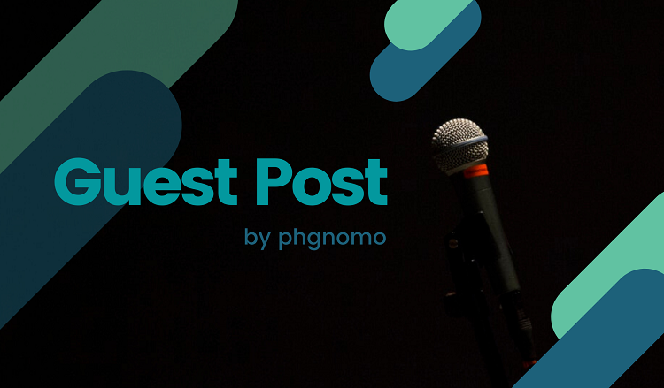

# My Take on Market Making

> This below article is adapted from community member (Discord ID: phgnomo#1429)'s comment in our Discord server. Our blog will provide a space for our community members who produce quality content on market making, crypto algo trading, trading strategies, and insights. In the future, we are going to feature more high quality guest posts. 

The goal of a market making strategy is to fill both opposing orders as soon as possible. So the usual movement of the price of an asset is:

-  Stay on a range of prices
-  Deviate from the range, starting an upward or downward trend
-  Get back to a range on a different level

<!-- more -->

The majority of the profit of market making comes when the price is bouncing on a range. To take advantage of that, the market maker must find the optimal spread value, where the price will bounce from the lowest point to the highest point like in this case - 

Here's what happens with small and large spreads respectively. With a large spread, you will do fewer trades, but each trade will have a bigger profit. With small spreads, you do more trades, with a smaller profit margin. However, large spreads might end up increasing the inventory risk for one main reason - the time it will take for the opposing order to be filled.

- The blue line, small spread: it took 4 hours for the opposing order to get filled
- The green line, big spread: took 6h 30min for the opposing order to get filled

Therefore, you’re stuck with your short inventory 2.5 hours more, than with the smaller spread. A lot can happen within the 2.5 hours in volatile markets. Imagine if your spread were a bit bigger...You would be stuck on a short trade for 9+ hours. 

What if the price never touched that point, and went to the opposing direction? You would be stuck there way longer until the opposing orders were fulfilled.

The inventory risk isn't about trading less, it is about the risk of not closing the opposing trade. By not closing the opposing trade as planned, you will have to decide if you will close the deal at a loss with a smaller profit, or hold the position for a longer time. As a small market maker, you might not feel it. But for a bigger market maker, it will incur a lot of costs associated with how long you have the position open. For example, asset custody costs, employee wages, electricity bills, operational loans, etc.

Now let's talk about volatility. High volatility means that the price has a high probability to bounce on a bigger range. Therefore, a bigger spread is good because there is a bigger chance that both opposing orders will be filled quickly. However, when the market has low volatility, the spreads must be tightened, or you risk not filling both orders. 

Some traders might mix up inventory risk with directional risk. Now, when prices start to trend in one direction or another, that is a different kind of risk called directional risk.

The thing is, the directional risk has an effect of increasing your inventory risk. If you did the same operations while the price was on a range, just like what happened with RLCETH today.

At some point in the day, the price started to trend and hasn't come back yet.

In this case, what happened is that my sell orders started to fill faster than the buy ones. My inventory risk increased not because my spread was small, but because my buy orders wouldn't be filled quickly, so I got stuck in some long positions. If I had a bigger spread, my inventory would still fill up (at a smaller pace). But the effect of this bigger spread would be waiting for a longer period to fill the opposing buy order because it will take a longer time for the price to return to an even lower point. With the smaller spread, I have a higher probability of getting out of the bad position earlier. 

When a trend begins, there are two options:

1. Stop the trades until prices get back to an ideal range. 
2. Adjust your risk by adjusting your spreads on the trend direction. For the case shown above, you can shorten your bid spread and widen your ask spread. If you don't, you risk having a lot of sell orders and fewer buy orders, which increases your inventory risk.

### Conclusion
Inventory risk isn't about taking more or less time to fill one side of the operation, but about how long it takes to close both sides, which is closing the deal and getting the profit as planned. 

Join our conversation on [Discord](https://discord.hummingbot.io) or [Reddit](https://www.reddit.com/r/Hummingbot/). 

