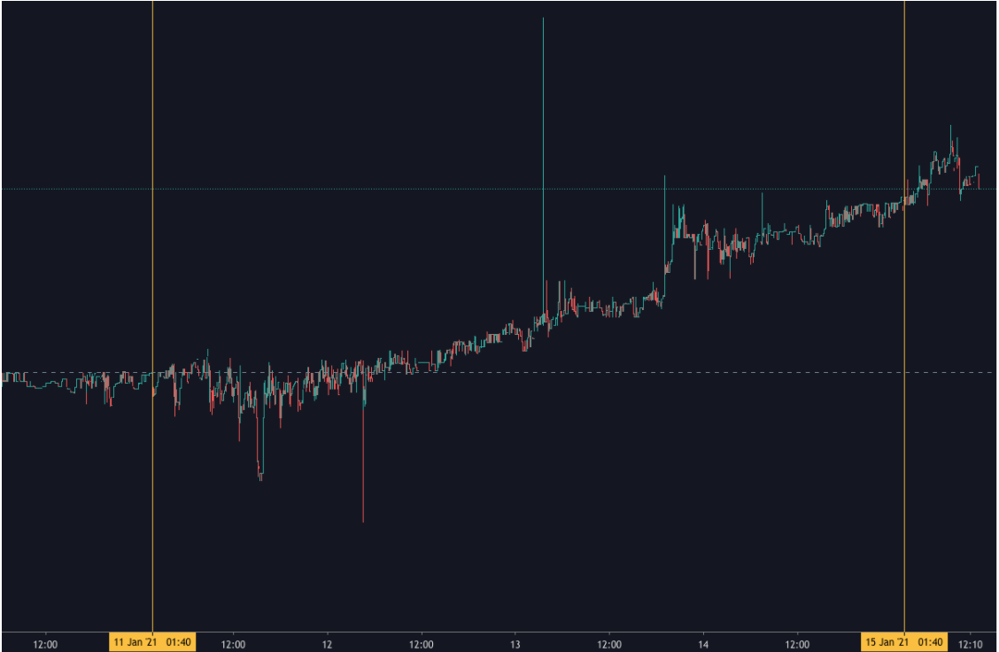
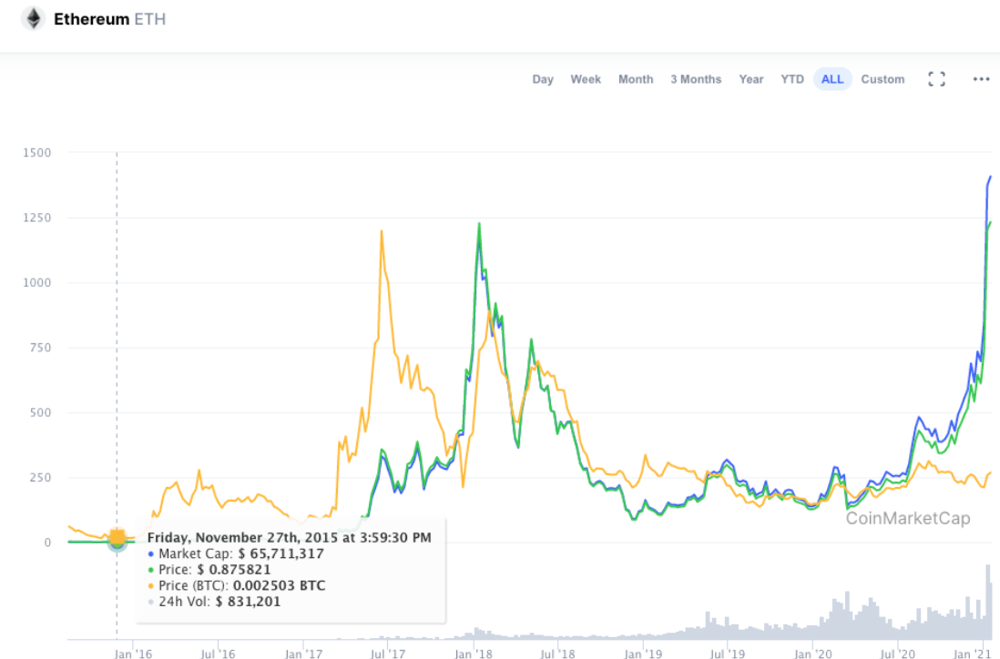
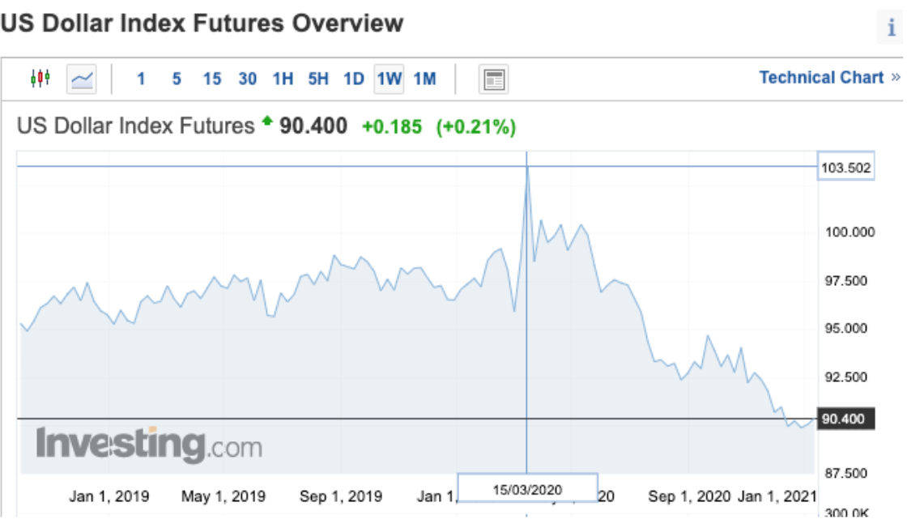
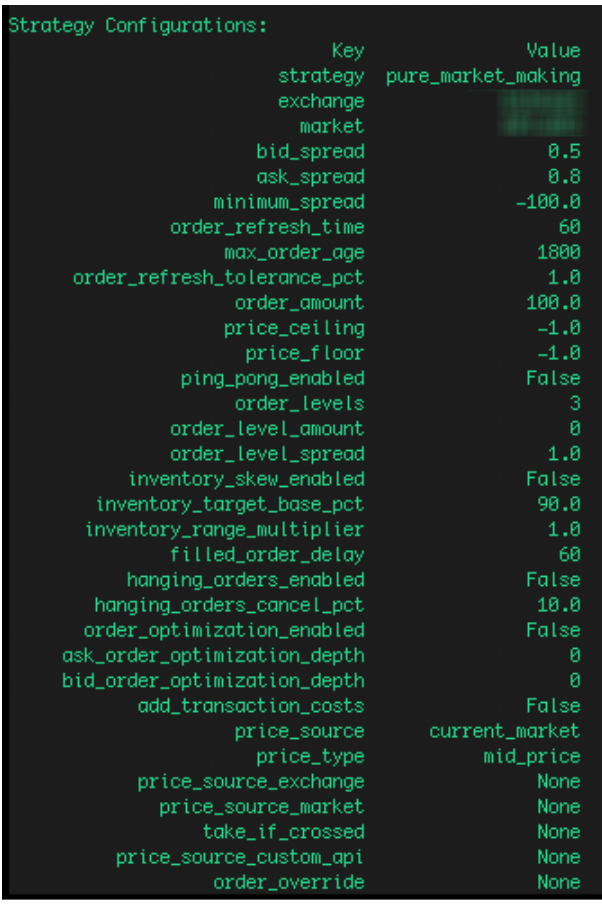
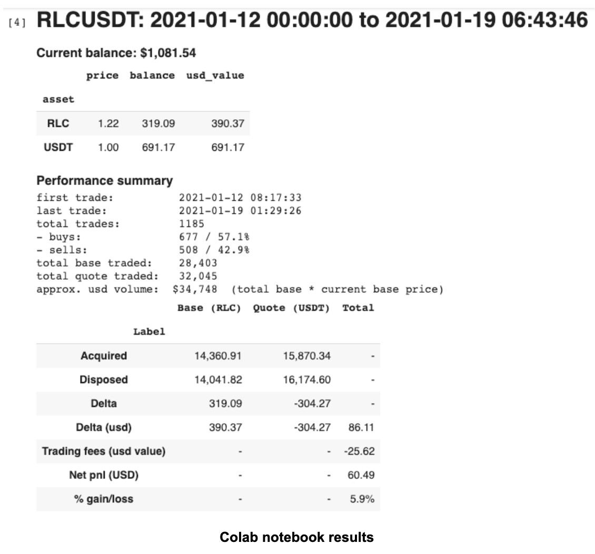
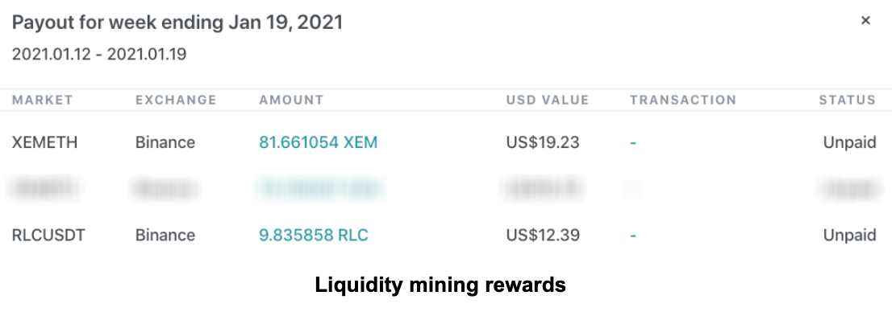
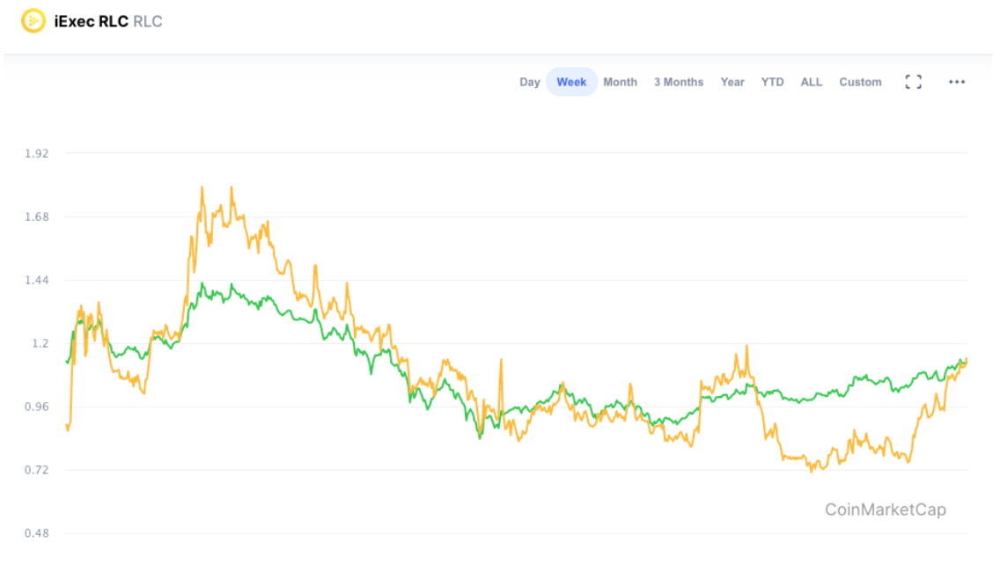

# Sharing is Caring: 3 Trading Pairs I Picked

Until now, the majority of the articles are about learning and optimizing Hummingbot. Let’s take this to the next level. 
Is it possible to profit from market making, and does liquidity rewards help mitigate directional risks? I share the following three 
markets(live) and performance in an attempt to address these concerns. 

**Disclaimer:** *The content of this article is provided by our blog contributor Thomas Yit and does not represent the views of CoinAlpha Inc./Hummingbot. The content below does NOT constitute investment, financial, legal, or tax advice, nor does any of the information contained on this article constitute a recommendation, solicitation, or offer to buy or sell any digital assets, securities, options, or other financial instruments or other assets, or to provide any investment advice or service*

A little bit of intro about myself, been a retail trading in forex for a couple of year till i stumbled on Bitcoin back in 2015 which a buyer accept only BTC as payment back then, bought some using localbitcoins and forget about Bitcoin till 2017 ICO crazy period. Over the next few years start to move into crypto trading space and found Hummingbot in May 2020. Ever since, have been running 4-6 instances but not every instance is performing liquidity mining.

<!-- more -->

## My choice of a market-making trading pair

I found a not too volatile trading pair that ranges nicely in a gradual ascent. See the following screenshot. 

 

I did three-day trading using Hummingbot and the performance is as follows:

 

The return was a **17.10%**, and an average of 10 trades per day, not exactly high-frequency trading but close enough in terms of market-making
 where you have a nice proportional in buy and sell trades. 

So why did I pick this pair in BTC? Now take a look at the Ethereum Coinmarketcap chart. 
(Note: This is not the market pair that was traded in the above example.)

 

You can see that the ETH/BTC(Yellow) is relatively calm and range as compared to ETH/USDT(Green). My take on why the USD is volatile, 
take a look at the USD index.

 

The USD dollar index(basket of currencies) has been on the downtrend since March 2020, in other words, USD is weakening and other currencies are
strengthening. You would prefer markets moving in range for market making. Now, back to the configuration of the trading pair.

 

I set very simple pure market making parameters but the bid/ask orders are dynamic based on TradingView indicators which trigger alerts to Telegram and 
change the bid/ask orders, for more information, see [here](../2021-01-automate-tradingview-for-hummingbot/index.md). 
If you don’t have a TradingView subscription, you can use Hummingbot scripts to adjust accordingly, see 
[here](https://github.com/hummingbot/hummingbot/tree/master/scripts), either using the `inventory_skew` or the `spreads_adjusted` to your preference. 

## My choice of a liquidity mining trading pair 

Since the previous trading pair was a market making and low in trading frequency, let’s take a look at RLC/USDT results, 
a liquidity mining trading pair from 13-01-2021 to 19-01-2021.

 

 

Over 7 days, 1185 trades are executed, an average of 169 trades per day with a PnL of 60.49. Add the liquidity mining rewards of 12.39, 
the total Pnl is abt $72.88 and the gain is **7.1%**. Not too shabby for 7 days of work. 

This pair does not have much of a USDT movement as compared to BTC; thus, a good pair for mining, see the following screenshot. 
Note line in green for USDT.

 

Let’s look into the RLC/USDT chart.

 

Similar to the first market-making pair, RLC/USDT has a nice gradual ascent. The Hummingbot configuration is similar to the first pair with dynamic
bid/ask orders configured from 0.25 - 1%. During the uptrend, the bid spread was configured to be much tighter in order to fill in faster; thus, 
the buy orders are much more than the sell orders.  “Everyone’s a genius in a bull market” let's take a look at a market that is in a downtrend.

## A liquidity mining trading pair that is trending down? 

XEM/ETH has been on a downward trend direction since 13-1-2021, see the following XEM/ETH chart.

 

How about the results? 

 

Over 7 days, 697 trades are executed, an average of 99 trades per day with a PnL of - 43.80 Add the liquidity mining rewards 19.23,
the total Pnl is abt -$24.57. With the [trading competition results](https://www.binance.com/en/support/announcement/6eb604a5a1a14b4bb21d317fc6e9a5d0), 
received abt 44.9 XEM which translate to about $10, thus the Pnl is -14.57 and the loss is about **1.2%**

 

The Hummingbot configuration is similar to the first pair with dynamic bid/ask orders configured from 0.25 - 0.8% and during the downtrend,
the bid was configured to a maximum of 0.4%. Should have increased this bid order to a higher value and with hanging order enabled. 

## Conclusion 

Market making is a fine balancing act between the bulls and the bears and a constant flexing of Hummingbot’s parameters to adjust your inventory,
directional, currency risks. I’m sure there are more successful examples than the ones depicted above and hope more community members will share their examples and experience.

### Important notes and disclaimers

Please review the Liquidity Mining Policy for the full disclaimer, including policies related to the use of Hummingbot.

The content of this Site does not constitute investment, financial, legal, or tax advice: none of the information contained on this Site constitutes a recommendation, solicitation, or offer to buy or sell any digital assets, securities, options, or other financial instruments or other assets, or to provide any investment advice or service.

**No guarantee of profit**: CoinAlpha does not claim that liquidity mining and participation in liquidity mining campaigns will be profitable, however measured, for the user. Liquidity mining yields are a measure of rewards compared to assets used for liquidity mining, excluding any gains or losses incurred from the underlying trading strategy.

**Eligibility requirements**: participation in liquidity mining is subject to eligibility requirements as specified in the liquidity mining policy.

**Campaign terms subject to change**: terms may be modified over the course of the campaign. We will announce any changes, if any, on our discord and reddit; the most up to date terms will also be posted on the liquidity mining campaign terms and the miners app.
