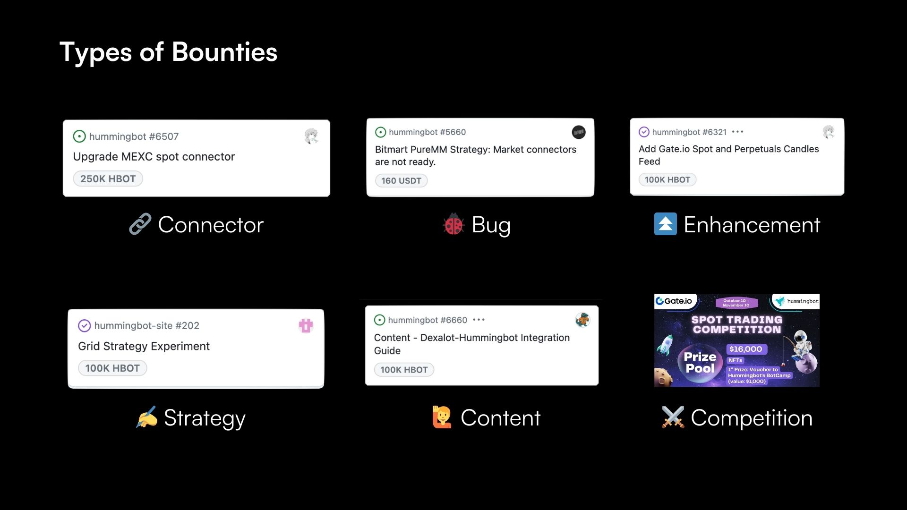

# State of the Foundation 2024

As 2023 winds to a close, [reported volumes](https://p.datadoghq.com/sb/a96a744f5-a15479d77992ccba0d23aecfd4c87a52) from Hummingbot clients have reached an all-time high of **$140M per day**. Widespread usage of Hummingbot across **114 exchange venues** spanning both official releases and unofficial forks shows that Hummingbot is becoming the industry standard for market maker connectivity.

Since it has been two eventful years have passed since the inception of the Hummingbot Foundation and the issuance of the HBOT token, we wanted to update the [original Hummingbot Foundation whitepaper](/governance/whitepaper/). Specifically, this post has three objectives:

1. Provide a retrospective on the Foundation’s journey over the past two years,
2. Propose changes to the Hummingbot governance system, and;
3. Offer a preliminary HBOT allocation budget for 2024.

<!-- more -->

## History

Hummingbot is open source software that helps users build automated, algorithmic trading and market making strategies (bots). [Open sourced](https://github.com/hummingbot/hummingbot) by parent company [CoinAlpha](https://coinalpha.com) in 2019, Hummingbot helps users run high-frequency trading bots on various cryptocurrency exchanges without having to build and maintain low-level API integrations. 

In October 2021, CoinAlpha [established the Hummingbot Foundation](https://hummingbot.org/blog/introducing-the-hummingbot-foundation/) as a decentralized autonomous organization (DAO) utilizing a [Cayman Foundation Company](https://www.notion.so/State-of-the-Foundation-2024-518124200f9e4f788f1d067bfe3ab196?pvs=21) corporate structure, and granted ownership over the Hummingbot open source software codebase to the newly formed entity. 

Subsequently, the Foundation [issued the Hummingbot Governance Token (HBOT) token](https://www.notion.so/State-of-the-Foundation-2024-518124200f9e4f788f1d067bfe3ab196?pvs=21) and formally incepted a dedicated team in December 2021.

Starting from the [v1.0.0 release](https://hummingbot.org/release-notes/1.0.0/), the Foundation team has assumed the responsibility of maintaining Hummingbot code repositories and websites, reviewing pull requests, and shipping official monthly releases.

## Inspiration: Linux

Hummingbot Foundation endeavors to create a system that can coordinate the maintenance and improvement of the Hummingbot codebase, akin to a decentralized version of [Linux Foundation](https://www.linuxfoundation.org/). As illustrated in Eric Raymond's seminal essay [The Cathedral and the Bazaar](https://en.wikipedia.org/wiki/The_Cathedral_and_the_Bazaar), Linux succeeded with a seemingly chaotic but remarkably effective approach of rapid releases and widespread delegation. 

However, the challenge for bazaar-style open source projects often lies in scaling participation effectively. Many open source projects falter as they grow, becoming overwhelmed by maintenance demands without an organized system to manage contributions.

## Key Stakeholders

The Foundation aims to overcome this challenge by enabling key stakeholders of the Hummingbot ecosystem to govern how it evolves using the [HBOT token](https://www.coingecko.com/en/coins/hummingbot). In accordance with budget allocation decisions made by HBOT holders via [Snapshot proposals](https://snapshot.org/#/hbot.eth), the Foundation distributes HBOT tokens as compensation to maintainers and contributors, thus disseminating the token broadly throughout the Hummingbot user community.

As described in the [Hummingbot Foundation whitepaper](/governance/whitepaper/), the key stakeholders of the Hummingbot ecosystem are:

- **Exchanges:** centralized or decentralized exchanges, blockchain protocols, and other projects that benefit from Hummingbot usage and connectivity
- **Contributors:** individual developers and firms that build and maintain Hummingbot components
- **Users:** individual and professional traders who install and use the Hummingbot open source software to run trading bots and generate volume on partner exchanges

## Goals

To build a durable, long-lasting organization that can balance the needs of these stakeholders, the Hummingbot Foundation has had two overarching goals:

### Achieve Financial Sustainability

- **Cashflow Profitability**: The Foundation aims to be cashflow-positive and consistently generates more revenues, primarily via partnerships and sponsorships with exchanges and protocols, than expenses, which consist of maintenance, testing and administration costs. As a profitable organization, the Foundation should not need to depend on the value or sale of HBOT tokens for day-to-day operations.
- **No Conflicts of Interest**: Maintaining our integrity and community trust is paramount. Therefore, the governance  and maintenance system, along with the HBOT allocation process, should be designed to avoid any conflicts of interest with partners and sponsors that provide financial backing to the Foundation.

### Achieve Governance Decentralization

- **Full Transparency**: We embrace the open source ethos for both the Hummingbot codebase and the Hummingbot Foundation, and we are committed to creating a transparent, auditable, and accountable system.

- **No Benevolent Dictator**: We aim to establish a governance structure without a central figure of authority. Instead, the structure should enable a system of governance by a decentralized set of actors, so that no single person or role is needed to enable the Foundation to perform its responsibilities.

## Retrospective: Financial Sustainability

Since the majority of the Foundation's revenues come from fee share partnerships with exchanges, revenues have dropped sharply since 2022 due to the crypto bear market.

In response, the Foundation has reduced headcount and made operations more efficient, while still being able to maintain a consistent velocity of releases and supporting new exchange and protocol connector partnerships.

| Year | Revenues (USD) | Expenses (USD) | Net Income (USD) | 
|------|----------|----------|------------|
| 2022 | 423,392  | 612,052  | -188,660   |
| 2023 | 309,466  | 415.952  | -106,487   |

Originally, the Foundation depends on its original parent company CoinAlpha for financial backing, but this arrangement was terminated in September 2023. To cover expenses, the Foundation entered into a loan agreement with Botcamp Inc, a separate for-profit company that operates the [Botcamp](/botcamp) educational platform. 

While the Foundation still maintains outstanding loan agreements with both CoinAlpha and Botcamp Inc, the Foundation ends 2023 on a strong financial position, with a cashflow-positive Q4 2023 and new partners Vega and Hyperliquid. In 2024, we project Net Income to be positive, based on increased partnership and sponsorship revenue along with lowered expenses compared to 2022 and 2023.

| Foundation Account | 2023 Ending Value (USD) |
|--------------|-----------|
| Total Assets | 2,235,600 |
| Total Assets (ex-HBOT) | 82,061 |

For more information, see the **2023 Financials** and **2022 Financials** tabs, respectively, in [HBOT Tracker](https://docs.google.com/spreadsheets/d/1UNAumPMnXfsghAAXrfKkPGRH9QlC8k7Cu1FGQVL1t0M/edit?usp=sharing).

## Retrospective: Governance Decentralization

The Hummingbot governance system allows HBOT holders to decide which CEX, DEX, and Chain connectors are included in official releases and how bounties are allocated toward them. In order to accommodate exchange API updates, new order types, and other breaking changes, connectors requires ongoing maintenance and engineering work. In addition, adding new connectors may require new library dependencies which introduce security vulnerabilities, so existing users should have a say in determining which connectors are added to the codebase.

Over the past two years, the Hummingbot governance system has evolved to make HBOT voting more efficient, decentralized, and impactful. Some notable changes include:

* Termination of [Delegation](/blog/end-of-hbot-delegation/) to foster greater decentralization of participation
* Introduction of quarterly [Polls](/polls) to allow HBOT holders decide which connectors should be included and how maintenance bounties should be allocated toward them
* Addition of fixed [Bounty Allocations](/bounties) to the top vote-getting connectors

Based on the current level of activity on [Bounties Board](https://github.com/orgs/hummingbot/projects/7), developer demand for bounties remains strong, and the bottleneck lies more with assigning and managing bounties by the Foundation team than with developers picking them up.

| Bounty State | # of Bounties |
|---------------|---------------|
| Open          | 0             |
| Assigned      | 3             |
| Submitted     | 3             |
| Needs Work    | 1             |
| Merged        | 6             |
| Paid/Closed   | 94            |

Bounties have been used to fund specific tasks that improve the usability and functionality of an exchange or chain connector. While the Hummingbot Foundation will proactively create bounties for its partners and sponsors, any HBOT holder may [propose](/governance/proposals) new bounties.

---

Largely, the HBOT system has succeeded in incentivizing community developers and users to maintain connectors, fix bugs, and provide support on Discord. Over the course of 6 epochs, the average HBOT distribution amount has dropped while the range of participants remains diverse, showing that there exists sufficient HBOT value to compensate community developers, even at sub-$10M fully diluted valuation for HBOT.

| Epoch | Quarter(s)    | HBOT Distributed | # of Distributions | Avg HBOT Distribution Amount | Unique Wallets |
|-------|---------------|------------------|--------------------|-------------------------|----------------|
| 1     | Q1 + Q2 2022  | 21,684,357       | 36                 | 602,343                 | 30             |
| 2     | Q3 + Q4 2022  | 9,933,664        | 74                 | 134,239                 | 30             |
| 3     | Q1 2023       | 7,132,497        | 172                | 41,468                  | 43             |
| 4     | Q2 2023       | 3,343,119        | 120                | 27,859                  | 27             |
| 5     | Q3 2023       | 4,625,551        | 89                 | 51,972                  | 33             |
| 6     | Q4 2023       | 2,158,366        | 59                 | 36,582                  | 30             |

For more information on governace, see the  **HBOT Distributions** and other tabs in [HBOT Tracker](https://docs.google.com/spreadsheets/d/1UNAumPMnXfsghAAXrfKkPGRH9QlC8k7Cu1FGQVL1t0M/edit?usp=sharing).

## Proposed Governance Changes

We propose the following changes to streamline the governance system and to enable voters to impact bounty allocation more directly:

### Extend poll duration to 14 days

Polls are the most important and influential proposals each quarter, and the community deserves more time to consider and debate them, We propose to increase the voting duration for Polls from 7 days to 14 days to ensure broad participation of the community.

### Fix proposal quorums based on total supply

Currently, the required quorum for each proposal type is based on HBOT circulating supply. Since the circulating supply is expanding continually and requires updating in the Snapshot system, this creates uncertainty among HBOT voters as to what the required quorum should be at any given time. 

To mitigate this opacity, we propose to fix proposal quorums at the following levels:

| Proposal Type | Quorum Level | % of Total Supply |
|---------------|--------------|-------------------|
| Pull Request Proposal (PRP) |  500,000 | 0.05% |
| New Connector Proposal (PRP) |  5,000,000 | 0.5% |
| Hummingbot Improvement Proposal (HIP) |  15,000,000 | 1.5% |
| Hummingbot Governance Proposal (HGP) |  50,000,000 | 5.0% |

### Allocate connector bounties based on pro-rata vote share

Epoch 6 introduced [fixed bounty allocations](/blog/proposed-epoch-6-governance-changes) for the top CEX, DEX, and Chain connectors. Each Gold connector received a 400,000 HBOT bounty allocation, while each Silver connector received a 100,000 HBOT bounty allocation.

Rather than fixing allocations for Gold and Silver, we propose to allocate HBOT bounties among the connectors for each Poll based on their **pro-rata voting share**, albeit with a maximum allocation cap. This would remove the need for a dedicated Maintainer. Instead, there would be a public HBOT bounty allocation which HBOT holders can spend by proposing to allocate them toward adding upgrades and fixing bugs. See the **HBOT Allocations** tab in in [HBOT Tracker](https://docs.google.com/spreadsheets/d/1UNAumPMnXfsghAAXrfKkPGRH9QlC8k7Cu1FGQVL1t0M/edit?usp=sharing) for the current allocations from Epoch 6.

The Foundation would continue to use the top vote-getting Connector as the **Reference Connector** for that type (CEX, DEX, Chain), and each connector needs to receive a number of votes equal to the **Connector Inclusion Threshold** each quarter to remain in the codebase. However, the current Gold/Silver/Bronze labels would not be necessary.

## 2024 Budget

During 2022 and 2023, an average of 24M HBOT was distributed in each year. At this rate of annual emission, there remains enough HBOT in the community reserve for **the next 13 years**.

This budget proposal aims to allocate sufficient HBOT tokens to address connector maintenance needs, while providing space for the community to propose other use cases for HBOT. Assuming that the proposed governance system changes above are enacted, we propose the following parameter levels for 2024:

| Governance Parameter | Value |
|----------------------| ------|
| Types of Connector Polls      | CEX, DEX, Chain |
| Bounty Allocation per Poll per Epoch | 1,000,000 HBOT |
| Top X Connectors Receive Allocation | 4 |
| Bounty Allocation Cap per Connector | 800,000 HBOT |
| Connector Inclusion Threshold | 200,000 HBOT |
| Support Budget Per Week | 100,000 HBOT |

If approved, this would result in the following HBOT budget allocations for 2024:

| Budget | Allocation | Description |
|--------|------------|-------------|
|Maintenance|12,000,000|3 polls/quarter; 1M/poll |
|Support|5,200,000|100K/week |
|**Total**|**17,200,000**| **6% of total HBOT supply** |

These allocations should be sufficient to fund ongoing maintenance and upkeep of the Hummingbot codebase. We invite the community to propose other HBOT bounty allocations, such as for research & development, liquidity, and other initiatives.
