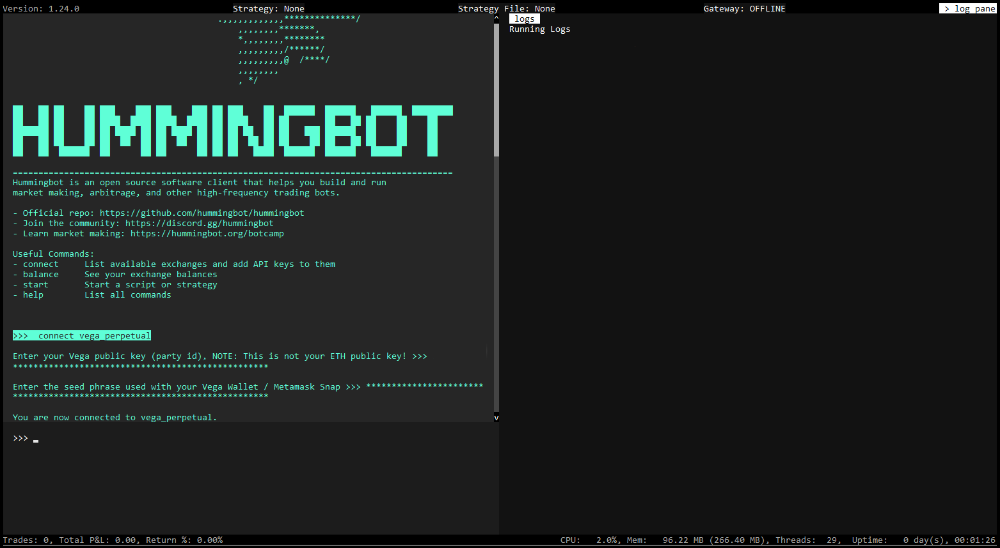

# User Guide: Using Vega Protocol with Hummingbot

## Introduction

Welcome to our user tutorial on integrating the power of Vega Protocol with Hummingbot for your trading journey. In this guide, we'll walk you through the detailed steps required to seamlessly set up a Vega Wallet, link it with Hummingbot, and embark on your trading adventures. 

Whether you're new to automated trading or looking to leverage Vega Protocol's decentralized trading capabilities, this guide is designed to provide you with all the information you need to get started. Let's dive into the world of blockchain-based trading with Vega Protocol and Hummingbot, and unlock new possibilities in your trading strategy.

<!-- more -->

## Prerequisites

### Create a Vega Wallet

A Vega Wallet is essential for interacting with Vega, whether it's for staking or trading. The Vega Wallet apps allow you to manage wallets and key pairs, deposit and withdraw assets, stake and sign transactions. There are several options to create a Vega Wallet app including Chrome / Firefox browser extensions, or a desktop / CLI app. Or if you have an existing Metamask account you can setup a Vega Key through Metamask Snaps which we recommend below. 

**Browser Extension**

- [Chrome extension:](https://chrome.google.com/webstore/detail/vega-wallet-mainnet/codfcglpplgmmlokgilfkpcjnmkbfiel)

- [Firefox extension:](https://addons.mozilla.org/en-GB/firefox/addon/vega-wallet-mainnet/)

**Desktop Wallet**

- [Download the app:](https://github.com/vegaprotocol/vegawallet-desktop/releases) On GitHub, download the desktop app for your operating system.

- [Get started:](https://docs.vega.xyz/mainnet/tools/vega-wallet/desktop-app/getting-started) Read a guide on using the desktop app to connect an existing Vega wallet, create or restore a wallet and start interacting with your keys.

**Metamask Snap** (recommended)

If you're already a MetaMask user, you won't need to create a Vega Wallet to create and use a Vega key.

Once you have Metamask installed, open either Chrome or Firefox and go to [Vega Console](https://console.vega.xyz/)

Click on either "Getting Started" at the top right or "Connect Wallet" at the bottom right

You should get a popup on the screen, select the second option "Install Vega Metamask Snap"

Metamask will open a series of requests pop-ups, review them and then click "Connect", "Install", "Confirm"

Once this is done, click on "Connect" again or if you still have the popup open then select "Connect via Metamask Snap" one more time. You should get a prompt on the screen and click "I Agree" to continue

Once installed and connected to the site, you will see your `SNAP KEY` in the top right with the option, when clicked, to copy the address, this is your `Vega Party ID` which will be used within the system when configuring Hummingbot.

You're now ready to deposit or transfer assets and use your new Vega keypair.

### Deposit Funds

!!! Note
    Please make sure you have enough balance in your wallet including ETH for gas fees. 

In order to trade on Vega we'll need to deposit funds first. Click on the Deposit button in the right hand side of the screen

You may get a message asking you to approve first the use of the chosen asset before you are able to deposit. Make sure to approve this.

In the Deposit window double check the `Vega Key` then click the Asset drop down box and select the Asset you want to deposit. In the example below we are going to select `USDT Faucet` and enter in `500` under the Amount. Double check the above details again then once satisfied, click Deposit. 

You'll then need to approve the transaction in Metamask - click "Confirm" to confirm the transaction. 

Once this is done, you'll just need to wait for the transaction to be confirmed. You should get a confirmation message once this is done. 

Once connected to Hummingbot, you should then be able to view your balance by running the `balance` command

## Install Hummingbot

There are two main methods to install Hummingbot:

### Docker

For most new users, we recommend installing Hummingbot using Docker.

- [Docker Quickstart Guide](https://hummingbot.org/academy-content/docker-installation-guide/)

### Source

We recommend installing Hummingbot from source if you meet any of the following criteria:

- You want to customize or extend the Hummingbot codebase.
- You want to build new components like connectors or strategies.
- You want to learn how Hummingbot works at a deeper, technical level.

Guides for various environments:
  - [Linux](../../../installation/linux.md)
  - [Windows](../../../installation/windows.md)
  - [MacOS](../../../installation/mac.md)

## Connect your Vega Wallet to Hummingbot

In order to connect your Vega Wallet to Hummingbot you'll need your `SNAP KEY` (also known as Vega Party ID) and your `wallet seed phrase`. 

Launch Hummingbot and then enter the command below in the Hummingbot terminal

`connect vega_perpetual`

or if you are connecting to the testnet

`connect vega_perpetual_testnet`

You'll be prompted to enter in your Vega public key (party ID) - this can be found in the top right of the screen where it says "SNAP KEY". 

Next, enter in the wallet seed phrase and if both credentials are valid you should get the message 
"You are now connected to Vega Perpetual"

## Starting Your First Trade

- Step-by-step guide to starting your first trade.
- Monitoring trades and understanding Hummingbot logs.
- Analyzing market conditions and choosing a trading pair.

## Additional Resources

- Vega Mainnet: [Explore Markets](https://vegaprotocol.eth.limo/#/markets)

- Vega Testnet: [Join the Testnet](https://vegafairground.eth.limo/)

- Testnet Faucet: [Get Testnet Tokens](https://www.infura.io/faucet/sepolia)

For a comprehensive list of Vega Wallet alternatives and more about Vega Snaps, visit the [Vega Wallet intro page](https://docs.vega.xyz/mainnet/tools/vega-wallet).

**Snaps Resources:**

- [Github](https://github.com/vegaprotocol/vega-snap) link to the source code for the Vega snap integration

- [Metamask Snaps](https://metamask.io/snaps/) - link to documentation
