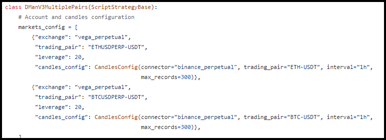

# User Guide: Using Vega Protocol with Hummingbot

## Introduction

Welcome to our comprehensive tutorial on integrating the power of Vega Protocol with Hummingbot for your trading journey. In this guide, we'll walk you through the detailed steps required to seamlessly set up a Vega Wallet, link it with Hummingbot, and embark on your trading adventures. 

Whether you're new to automated trading or looking to leverage Vega Protocol's decentralized trading capabilities, this guide is designed to provide you with all the information you need to get started. Let's dive into the world of blockchain-based trading with Vega Protocol and Hummingbot, and unlock new possibilities in your trading strategy.

<!-- more -->

## Prerequisites

### **Creating a Vega Wallet**

**Metamask Snap (easiest method)**

If you're already a MetaMask user, you won't need to create a Vega Wallet to create and use a Vega key.

Once you have Metamask installed, open a browser and go to [Vega Console](https://console.vega.xyz/)

Click on either "Getting Started" at the top right or "Connect Wallet" at the bottom right

You should get a popup on the screen, select the second option "Install Vega Metamask Snap"

Metamask will open a series of requests pop-ups, review them and then click "Connect", "Install", "Confirm"

Once this is done, click on "Get Started" or if you still have the popup open then select "Connect via Metamask Snap" one more time. You should get a prompt on the screen and click "I Agree" to continue

Once installed and connected to the site, you will see your `SNAP KEY` in the top right with the option, when clicked, to copy the address, this is your `Vega Party ID` which will be used within the system when configuring Hummingbot.

You're now ready to deposit or transfer assets and use your new Vega keypair.

- Vega Wallet
   - Chrome / Firefox Extension
   - Desktop App 
   - Verifying wallet creation and understanding wallet security.

## **Installing Hummingbot**

 - **From Source**
     - Step-by-step instructions on installing Hummingbot from source, including dependencies and environment setup.

 - **Using Docker**
     - Instructions for Docker installation and setting up Hummingbot using Docker containers.
   
## Setting Up Your Trading Environment

**Connecting Vega Wallet to Hummingbot**
In order to connect your Vega Wallet to Hummingbot you'll need your `SNAP KEY` also known as `Vega Party ID` and your wallet seed phrase. 

To connect to Hummingbot run the command below in the Hummingbot terminal

`connect vega_perpetual`

or if you are connecting to the testnet

`connect vega_perpetual_testnet`

You'll be prompted to enter in your Vega public key (party ID) - this can be found in the top right of the screen where it says "SNAP KEY". This is your Vega Party ID

Next, enter in the wallet seed phrase and if the credentials are valid you should get the message 
"You are now connected to Vega Perpetual"

## Starting Your First Trade

- Step-by-step guide to starting your first trade.
- Monitoring trades and understanding Hummingbot logs.
- Analyzing market conditions and choosing a trading pair.

2. **Executing Trades with Hummingbot**

## Advanced Tips and Best Practices

- Strategies for successful trading on Vega Protocol.
- Security best practices for managing your Vega Wallet and Hummingbot.
- Optimizing Hummingbot performance for Vega trading.

## Troubleshooting and Support

**FAQ**

**I can't see assets I've previously deposited**

- If this is your first time using Snap with Vega, but you have previously deposited assets on a different Vega key, you'll need to deposit new assets, or transfer assets to the new keys created by your snap. You can copy your Vega snap public key from within Vega Console.

**Can I create more than one key pair with Vega snap?**
- You can only create one keypair derived from your MetaMask seed, though this may change in the future.

**How do I recover my Vega keys?**
- The Vega keypairs created with snap are derived from the MetaMask seed. Use your MetaMask recovery phrase to recover those Vega keys, and any assets added to them.

**Other ways to set up Vega keys**
- For a full list of alternatives, please check out the [Vega Wallet](https://docs.vega.xyz/mainnet/tools/vega-wallet) intro page

**Limitations**

The Vega Protocol (Metamask) snap cannot:

- Connect to an existing Vega Wallet or keypair, you'll need to start with a new keypair
- Cannot show your Vega assets or their balances in MetaMask
- To see your balances, rewards, or deposit, withdraw or transfer assets between keys, you'll need to interact with Console or the governance dApp
- Rename, import, or export keys
- Show a list of previous transactions

## Snaps Resources:
[Github](https://github.com/vegaprotocol/vega-snap) link to the source code for the Vega snap integration
[Metamask Snaps](https://metamask.io/snaps/) - link to documentation
