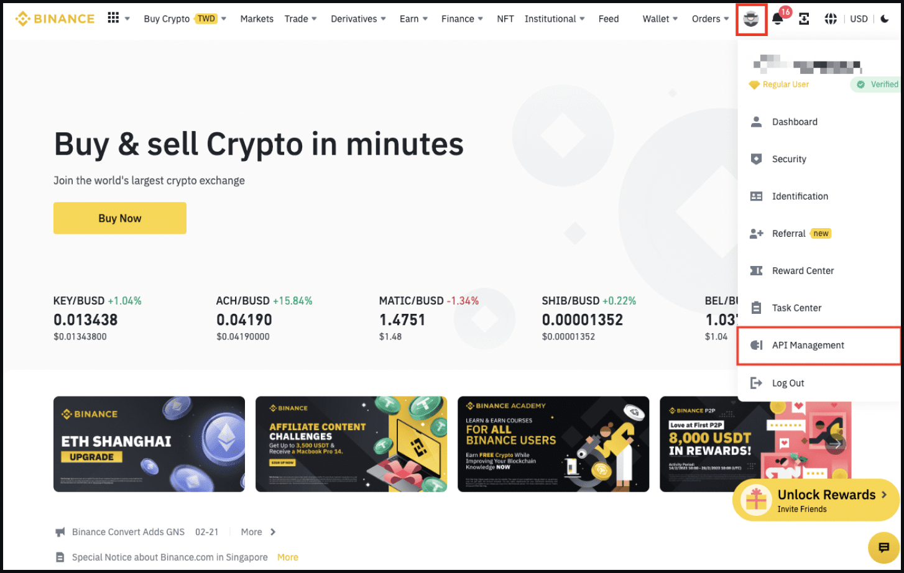
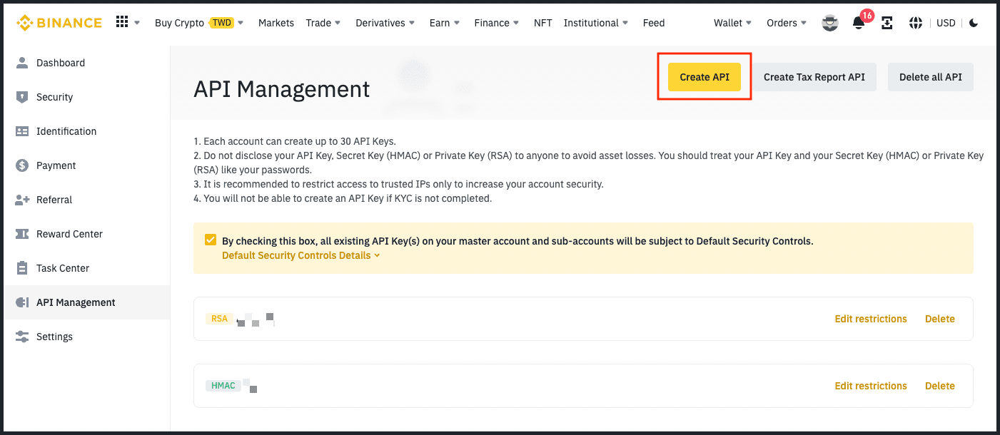
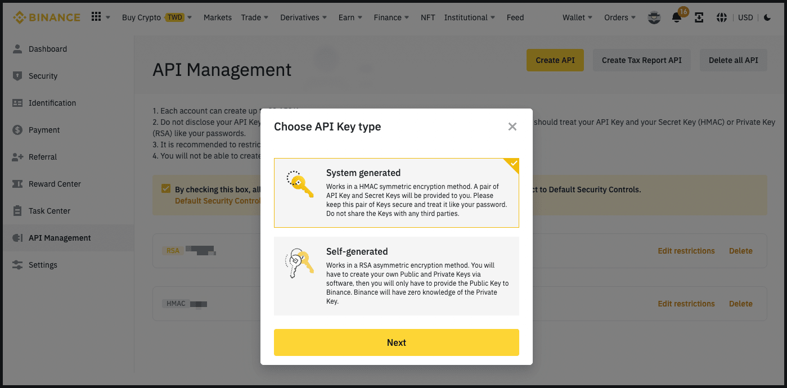
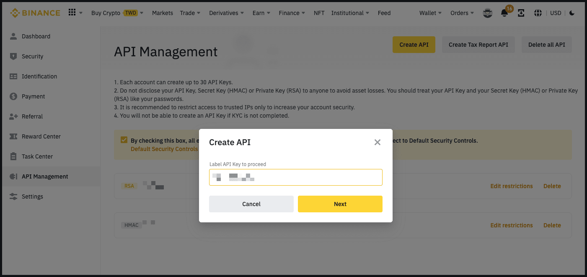
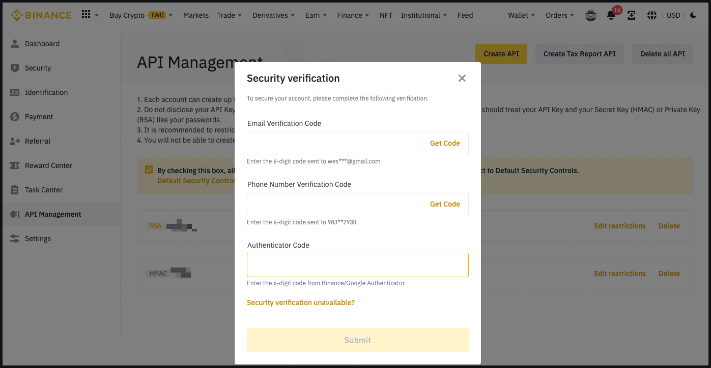

# Binance

!!! tip "Support Hummingbot"
    Hummingbot Foundation has a partnership with Binance that shares some of your fees when you trade on Binance using Hummingbot, at no cost to you. To support us, create an account using our [Binance referral link](https://www.binance.com/en/register?ref=FQQNNGCD) or [Binance Futures referral link](https://www.binance.com/en/futures/ref?code=hummingbot). Thank you! 🙏

## ℹ️ Exchange Info

- **Type**: CLOB CEX
- **Website**: <https://www.binance.com>
- **CoinMarketCap**: <https://coinmarketcap.com/exchanges/binance/>
- **CoinGecko**: <https://www.coingecko.com/en/exchanges/binance>
- **API docs**: <https://binance-docs.github.io/apidocs/spot/en/>
- **Fees**: <https://www.binance.com/en/fee/schedule>
- **Supported countries**: <https://www.binance.com/en/support/faq/115003824812>

## 🛠 Maintenance


- **Tier**: Gold
- **Maintainer**: Hummingbot Foundation

Currently, Binance is a **Gold** exchange, as voted by HBOT holders in each [Epoch](/governance/epochs). The Foundation will be the official maintainer for this exchange's connectors and data feeds. Our engineering team maintains and improves them continually. Gold exchange connectors serve as the "gold standard" template for all other connectors of that type.


## 🔀 Spot Connector
*Integration to exchange's spot markets API*

- [📁 Folder](https://github.com/hummingbot/hummingbot/tree/master/hummingbot/connector/exchange/binance)

### Usage

From inside the Hummingbot client, run `connect binance`:

```
>>> connect binance

Enter your binance API key >>>
Enter your binance secret key >>>
```

If connection is successful:

```
You are now connected to binance
```

### Order Types

This connector supports the following `OrderType` constants:

- `LIMIT`
- `LIMIT_MAKER`
- `MARKET`

### Paper Trading

Access the [Paper Trade](/global-configs/paper-trade/) version of this connector by running `connect binance_paper_trade` instead of `connect binance`.

If this is not available by default, you can configure Hummingbot to add this paper trade exchange. See [Adding Exchanges](/global-configs/paper-trade/#adding-exchanges) for more information.

## 🔀 Perp Connector
*Connector to perpetual futures markets*

- **Connection type**: WebSocket
- [📁 Folder](https://github.com/hummingbot/hummingbot/tree/master/hummingbot/connector/derivative/binance_perpetual)

### Usage

From inside the Hummingbot client, run `connect binance_perpetual`:

```
>>> connect binance_perpetual

Enter your binance_perpetual API key >>>
Enter your binance_perpetual secret key >>>
```

If connection is successful:

```
You are now connected to binance_perpetual
```

### Order Types

This connector supports the following `OrderType` constants:

- `LIMIT`
- `LIMIT_MAKER`
- `MARKET`

### Position Modes

This connector supports the following position modes:

- One-way
- Hedge

### Testnet

This exchange offers a sandbox testnet: <https://testnet.binancefuture.com>

Afer you create an account and create the API keys, you can enter them by using the `connect binance_perpetual_testnet` command within the Hummingbot client. Once connected, you should be able to use the testnet with the available perpetual strategies / scripts. 

## 🕯 Spot Candles Feed
*Collect historical OHCLV data from this exchange's spot markets*

- [📁 Folder](https://github.com/hummingbot/hummingbot/tree/master/hummingbot/data_feed/candles_feed/binance_spot_candles)
- Supported intervals: 1s | 1m | 3m | 5m | 15m | 30m | 1h | 2h | 4h | 6h | 8h | 12h | 1d | 3d | 1w | 1M

### Usage

In a Hummingbot script, import `CandlesFactory` to create the candles that you want:
```python
    from hummingbot.data_feed.candles_feed.candles_factory import CandlesFactory
    candles = CandlesFactory.get_candle(connector="binance",
                                        trading_pair="ETH-USDT",
                                        interval="1m", max_records=50)
```

See [candles_example.py](https://github.com/hummingbot/hummingbot/blob/master/scripts/candles_example.py) for more details.

## 🕯 Perp Candles Feed
*Collect historical OHCLV data from this exchange's perp markets*

- [📁 Folder](https://github.com/hummingbot/hummingbot/tree/master/hummingbot/data_feed/candles_feed/binance_perpetual_candles)
-  Supported Intervals: 1s | 1m | 3m | 5m | 15m | 30m | 1h | 2h | 4h | 6h | 8h | 12h | 1d | 3d | 1w | 1M

### Usage

In a Hummingbot script, import `CandlesFactory` to create the candles that you want:
```python
    from hummingbot.data_feed.candles_feed.candles_factory import CandlesFactory
    candles = CandlesFactory.get_candle(connector="binance_perpetual",
                                        trading_pair=trading_pair,
                                        interval="3m", max_records=50)
```

See [candles_example.py](https://github.com/hummingbot/hummingbot/blob/master/scripts/candles_example.py) for more details.

##x How to create API keys

Log in to your Binance account and click **Profile** - **[API Management](https://www.binance.com/en/my/settings/api-management)**

   

Click **Create API**. Please note that before creating an API Key, you need to:

   - Enable [two-factor authentication (2FA)](https://www.binance.com/en/support/faq/account-functions?c=1&navId=1#11) on your account.
   - Make a deposit of any amount to activate your account.

   

Select **System generated** as your preferred API Key type. For more details on self-generated API Keys, please refer to [How to Generate an RSA Key Pair to Send API Requests on Binance](https://www.binance.com/en/support/faq/2b79728f331e43079b27440d9d15c5db).

   

Enter a label/name for your API Key.

   

Verify your request with 2FA devices.

   

   [](binance-api6.png)

Your API Key is now created. Do not disclose your API Key, Secret Key (HMAC), or Private Key (RSA) to anyone to avoid asset losses. If you forget your Secret Key, you'll need to delete the API and create a new one.
