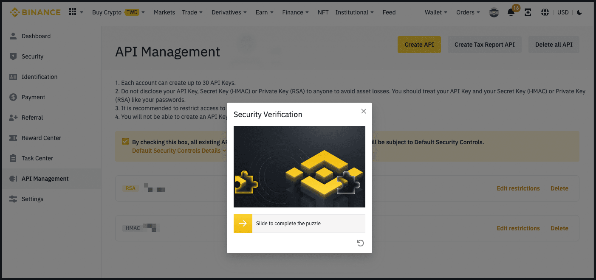

# Binance

**Support Hummingbot by creating an account using our [referral link](https://www.binance.com/en/register?ref=FQQNNGCD)!** 🙏🙏🙏

## ℹ️ Info

- Type: Centralized
- Website: <https://www.binance.com>
- CoinMarketCap: <https://coinmarketcap.com/exchanges/binance/>
- CoinGecko: <https://www.coingecko.com/en/exchanges/binance>
- API docs: <https://binance-docs.github.io/apidocs/spot/en/>
- API version: 4
- Fees: <https://www.binance.com/en/fee/schedule>
- Supported countries: <https://www.binance.com/en/support/faq/115003824812>

## 🛠 Maintenance


HBOT holders voted this exchange into the Gold tier for the current [Epoch](/governance/epochs). Silver exchanges are maintained and updated by Hummingbot Foundation via [Bounties](/governance/polls), tracking improvements made to the Gold exchanges.

**Maintainer:** Hummingbot Foundation

## 💰 Rewards
*Competitions and other programs that incentivize Hummingbot users to use this exchange*

**Current and Upcoming**

Binance is supported on [Hummingbot Miner](https://miner.hummingbot.io/), a platform that rewards users for providing liquidity on specific trading pairs.

**Past**

- List any past Binance trading competitions here

## 📺 Content
*Videos and guides that show how to use Hummingbot with this exchange*

- List any Hummingbot-related blog posts or videos with content specific to this exchange, from us and 3rd parties

## How to create API keys

1. Log in to your Binance account and click [Profile] - [[API Management](https://www.binance.com/en/my/settings/api-management)].

   

2. Click [Create API]. Please note that before creating an API Key, you need to:
   - Enable [two-factor authentication (2FA)](https://www.binance.com/en/support/faq/account-functions?c=1&navId=1#11) on your account.
   - Make a deposit of any amount to activate your account.

   

3. Select **System generated** as your preferred API Key type. For more details on self-generated API Keys, please refer to [How to Generate an RSA Key Pair to Send API Requests on Binance](https://www.binance.com/en/support/faq/2b79728f331e43079b27440d9d15c5db).

   

4. Enter a label/name for your API Key.

   

5. Verify your request with 2FA devices.

   

   [](binance-api6.png)

6. Your API Key is now created. Do not disclose your API Key, Secret Key (HMAC), or Private Key (RSA) to anyone to avoid asset losses. If you forget your Secret Key, you'll need to delete the API and create a new one.

## 🔀 Spot Connector
*Integration to exchange's spot markets API*

- Connection type: WebSocket
- [Connector folder](https://github.com/hummingbot/hummingbot/tree/master/hummingbot/connector/exchange/binance)

### How to Connect

From inside the Hummingbot client, run `connect binance`:

```
>>> connect binance

Enter your binance API key >>>
Enter your binance secret key >>>
```

If connection is successful:

```
You are now connected to binance
```

### Order Types

This connector supports the following `OrderType` constants:

- `LIMIT`
- `LIMIT_MAKER`
- `MARKET`

```
CODE EXAMPLE SHOWING USAGE IN A SCRIPT
```

### Candles Feed

- [Candles Feed folder](https://github.com/hummingbot/hummingbot/tree/master/hummingbot/data_feed/candles_feed/binance_spot_candles)

[Candles Feed](/scripts/candles-feed) allows you to use custom OHLCV candles and indicators in your scripts and strategies. For each pair on this exchange, the following candle intervals are supported:

- `10s`
- `1m`
- `5m`
- `5m`
- `15m`
- `30m`
- `1h`
- `4h`
- `8h`
- `1d`
- `7d`
- `30d`

To use Binance spot candles in scripts, users just need to replace the connector variable with "binance"

```python
)
    trading_pair = "ETH-USDT"
    exchange = "binance"

    candles_1m = CandlesFactory.get_candle(connector=exchange,
                                           trading_pair=trading_pair,
                                           interval="1m", max_records=50)
    candles_3m = CandlesFactory.get_candle(connector=exchange,
                                           trading_pair=trading_pair,
                                           interval="3m", max_records=50)
    candles = {
        f"{trading_pair}_1m": candles_1m,
        f"{trading_pair}_3m": candles_3m,
    }
)    
```

### Paper Trading

Access the [Paper Trade](/global-configs/paper-trade/) version of this connector by running `connect binance_paper_trade` instead of `connect binance`.

If this is not available by default, you can configure Hummingbot to add this paper trade exchange. See [Adding Exchanges](/global-configs/paper-trade/#adding-exchanges) for more information.

## 🔀 Perp Connector
*Connector to perpetual futures markets*

- Connection type: WebSocket
- [Connector folder](https://github.com/hummingbot/hummingbot/tree/master/hummingbot/connector/derivative/binance_perpetual)

### How to Connect

From inside the Hummingbot client, run `connect binance_perpetual`:

```
>>> connect binance_perpetual

Enter your binance_perpetual API key >>>
Enter your binance_perpetual secret key >>>
```

If connection is successful:

```
You are now connected to binance_perpetual
```

### Order Types

This connector supports the following `OrderType` constants:

- `LIMIT`
- `LIMIT_MAKER`
- `MARKET`

### Position Modes

This connector supports the following position modes:

- One-way
- Hedge

### Candles Feed

- [Candles Feed folder](https://github.com/hummingbot/hummingbot/tree/master/hummingbot/data_feed/candles_feed/binance_perpetual_candles)

Candles Feed allows you to use custom OHLCV candles and indicators in your scripts and strategies. For each pair, you can fetch candles using the following intervals:

- `10s`
- `1m`
- `5m`
- `5m`
- `15m`
- `30m`
- `1h`
- `4h`
- `8h`
- `1d`
- `7d`
- `30d`

To use Binance Perpetual candles in scripts, users just need to replace the connector variable with "binance_perpetual"

```python
    candles = CandlesFactory.get_candle(connector="binance_perpetual",
                                        trading_pair=trading_pair,
                                        interval="3m", max_records=150)
```

### Testnets

Binance perpetual has a testnet available [here](https://testnet.binancefuture.com/en/futures/BTCUSDT). Create an account and copy the API keys which you'll then need to enter in by using the `connect binance_perpetual_testnet` command within the Hummingbot client. Once connected, you should be able to use the testnet with the available perpetual strategies / scripts. 
