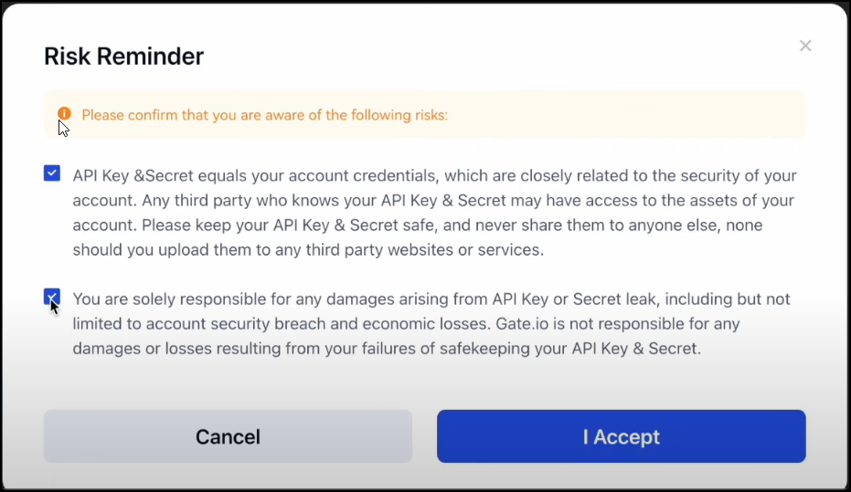
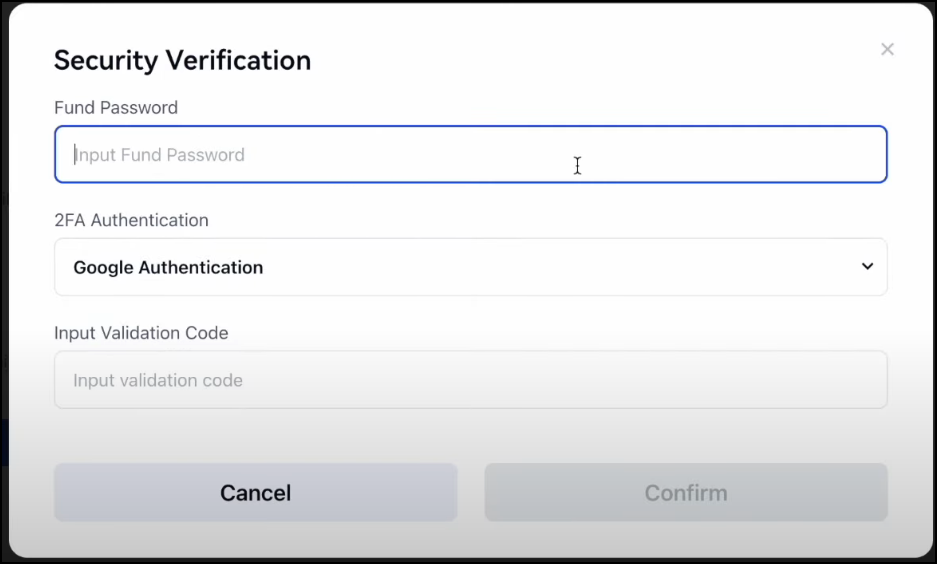

# Gate.io

**Support Hummingbot by creating an account using our [referral link](https://www.gate.io/signup/5868285)!** 🙏🙏🙏

## ℹ️ Info

- Type: Centralized
- Website: <https://www.gate.io>
- CoinMarketCap: <https://coinmarketcap.com/exchanges/gate-io/>
- CoinGecko: <https://www.coingecko.com/en/exchanges/gate-io>
- API docs: <https://www.gate.io/docs/apiv4/en/index.html>
- API version: 4
- Fees: <https://www.gate.io/fee?>
- Supported countries: <https://www.gate.io/help/c2c/c2ctrade/21130/Which-Counties-Regions-are-supported-by-our-OTC-Services>

## 🛠 Maintenance


HBOT holders voted this exchange into the Silver tier for the current [Epoch](/governance/epochs). Silver exchanges are maintained and updated by Hummingbot Foundation via [Bounties](/governance/polls), tracking improvements made to the Gold exchanges.

**Maintainer:** Hummingbot Foundation

## 💰 Rewards
*Competitions and other programs that incentivize Hummingbot users to use this exchange*

**Current and Upcoming**

Gate.io is supported on [Hummingbot Miner](https://miner.hummingbot.io/), a platform that rewards users for providing liquidity on specific trading pairs.

**Past**

* [Gate.io Trading Competition: Results and Retrospective](https://blog.hummingbot.org/gate-io-trading-competition-result-and-retro/)

## 📺 Content
*Videos and guides that show how to use Hummingbot with this exchange*

- List any Hummingbot-related blog posts or videos with content specific to this exchange, from us and 3rd parties

## How to create API keys

1. Go to Gate.io
Log in or create a new account at https://www.gate.io/.

2. Open the API Management page
Hover over the profile icon on the top right corner and go to the [API Management](https://www.gate.io/myaccount/api_key_manage) page:
   
3. Click on the Create API Key button

    

4. Name your API keys

5. Add IP whitelist (optional)
Enable `Bind IP` and input the IP addresses, separated by a comma. You'll need to find the public IP address of the machine you are running Hummingbot 
If you don't want to whitelist your IP then select `Later` instead but the API keys you create will only be valid for 90 days.

6. Choose API v4 Key and a Classic Account type

    

7. Select Permissions
Please select the following permissions and then click on the Submit button.

- [Spot/Margin Trade] -> [Read And Write] - it allows trading Spot and Margin
- [Perpetual Contract] -> [Read And Write] - this will allow trading Futures. 
- [Wallet ] -> [Read Only] -> this is necessary to display the balances correctly.


8. Carefully read the **Risk Reminder**, tick both paragraphs, and click **I Accept**

    

9. Enter **Fund Password**, choose **2FA Authentication** method and enter its code

    

10. Copy your API keys and store them somewhere safe. 

11. Now, you have created API keys for your Gate.io exchange!

## 🔀 Spot Connector
*Integration to exchange's spot markets API*

- Connection type: WebSocket
- [Connector folder](https://github.com/hummingbot/hummingbot/tree/master/hummingbot/connector/exchange/gate_io)

### How to Connect

From inside the Hummingbot client, run `connect gate_io`:

```
>>> connect gate_io

Enter your gate_io API key >>>
Enter your gate_io secret key >>>
```

If connection is successful:

```
You are now connected to gate_io
```

### Order Types

This connector supports the following `OrderType` constants:

- `LIMIT`
- `LIMIT_MAKER`
- `MARKET`

The following is an example script that buys & sells using `market orders`

```python
from decimal import Decimal

from hummingbot.client.hummingbot_application import HummingbotApplication
from hummingbot.core.data_type.common import OrderType
from hummingbot.strategy.script_strategy_base import ScriptStrategyBase


class TestMarketOrders(ScriptStrategyBase):
    
    trading_pair = "ETH-USDT"
    order_amount = Decimal("0.004")
    markets = {"gate_io": {trading_pair}}
    buy_order_id = None
    sell_order_id = None

    def on_tick(self):
        if not self.buy_order_id:
            self.buy_order_id = self.connectors["gate_io"].buy(
                trading_pair=self.trading_pair,
                amount=self.order_amount,
                order_type=OrderType.MARKET)

    def did_complete_buy_order(self, order_completed_event):
        if order_completed_event.order_id == self.buy_order_id:
            self.sell_order_id = self.connectors["gate_io"].sell(
                trading_pair=self.trading_pair,
                amount=self.order_amount,
                order_type=OrderType.MARKET)

    def did_complete_sell_order(self, order_completed_event):
        if order_completed_event.order_id == self.sell_order_id:
            self.logger().info("TestMarketOrders completed.")
            HummingbotApplication.main_application().stop()
```

### Candles Feed

- [Candles Feed folder](https://github.com/hummingbot/hummingbot/tree/master/hummingbot/data_feed/candles_feed/gate_io_spot_candles)

[Candles Feed](/scripts/candles-feed) allows you to use custom OHLCV candles and indicators in your scripts and strategies. For each pair on this exchange, the following candle intervals are supported:

- `10s`
- `1m`
- `5m`
- `5m`
- `15m`
- `30m`
- `1h`
- `4h`
- `8h`
- `1d`
- `7d`
- `30d`

To use Gate.io spot candles in scripts, users just need to replace the connector variable with `gate_io`

```python
)
    trading_pair = "ETH-USDT"
    exchange = "gate_io"

    candles_1m = CandlesFactory.get_candle(connector=exchange,
                                           trading_pair=trading_pair,
                                           interval="1m", max_records=50)
    candles_3m = CandlesFactory.get_candle(connector=exchange,
                                           trading_pair=trading_pair,
                                           interval="3m", max_records=50)
    candles = {
        f"{trading_pair}_1m": candles_1m,
        f"{trading_pair}_3m": candles_3m,
    }
)    
```

### Paper Trading

Access the [Paper Trade](/global-configs/paper-trade/) version of this connector by running `connect gate_io_paper_trade` instead of `connect gate_io`.

If this is not available by default, you can configure Hummingbot to add this paper trade exchange. See [Adding Exchanges](/global-configs/paper-trade/#adding-exchanges) for more information.

## 🔀 Perp Connector
*Connector to perpetual futures markets*

- Connection type: WebSocket
- [Connector folder](https://github.com/hummingbot/hummingbot/tree/master/hummingbot/connector/derivative/gate_io_perpetual)

### How to Connect

From inside the Hummingbot client, run `connect gate_io_perpetual`:

```
>>> connect gate_io_perpetual

Enter your gate_io_perpetual API key >>>
Enter your gate_io_perpetual secret key >>>
Enter your gate_io_perpetual user id >>>
```

If connection is successful:

```
You are now connected to gate_io_perpetual
```

### Order Types

This connector supports the following `OrderType` constants:

- `LIMIT`
- `LIMIT_MAKER`
- `MARKET`

### Position Modes

This connector supports the following position modes:

- One-way
- Hedge

### Candles Feed

- [Candles Feed folder](https://github.com/hummingbot/hummingbot/tree/master/hummingbot/data_feed/candles_feed/gate_io_perpetual_candles)

Candles Feed allows you to use custom OHLCV candles and indicators in your scripts and strategies. For each pair, you can fetch candles using the following intervals:

- `10s`
- `1m`
- `5m`
- `5m`
- `15m`
- `30m`
- `1h`
- `4h`
- `8h`
- `1d`
- `7d`
- `30d`

To use Gate.io Perpetual candles in scripts, users just need to replace the connector variable with `gate_io_perpetual`

```python
    candles = CandlesFactory.get_candle(connector="gate_io_perpetual",
                                        trading_pair=trading_pair,
                                        interval="3m", max_records=150)
```

### Testnets

