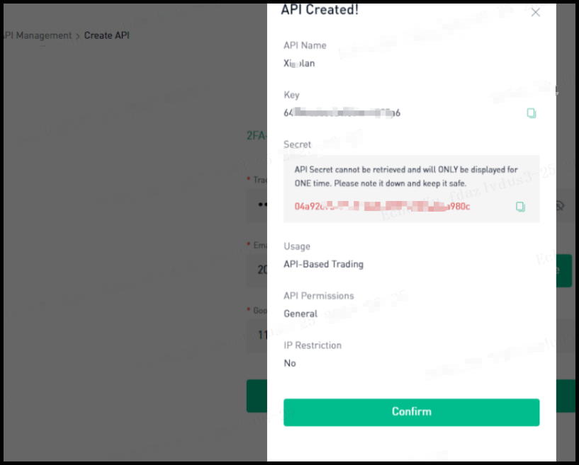

# Kucoin

!!! tip "Support Hummingbot"
    Hummingbot Foundation has a partnership with Kucoin that shares some of your fees when you trade on Kucoin using Hummingbot, at no cost to you. To support us, create an account using our [Kucoin referral link](https://www.kucoin.com/ucenter/signup?rcode=272KvRf). Thank you! 🙏

## ℹ️ Exchange Info

- **Type**: CLOB CEX
- **Website**: <https://www.kucoin.com>
- **CoinMarketCap**: <https://coinmarketcap.com/exchanges/kucoin/>
- **CoinGecko**: <https://www.coingecko.com/en/exchanges/kucoin>
- **API docs**: <https://docs.kucoin.com>
- **Fees**: <https://www.kucoin.com/vip/level>
- **Supported countries**: <https://www.kucoin.com/support/10247584234521> 

## 🛠 Maintenance


- **Tier**: Silver
- **Maintainer**: Hummingbot Foundation

Currently, Kucoin is a **Silver** exchange, as voted by HBOT holders in each [Epoch](/governance/epochs). Silver exchanges are maintained and updated by Hummingbot Foundation via [Bounties](/governance/polls), tracking improvements made to the Gold exchanges.


## 🔀 Spot Connector
*Integration to exchange's spot markets API*

- [📁 Folder](https://github.com/hummingbot/hummingbot/tree/master/hummingbot/connector/exchange/kucoin)

### Usage

From inside the Hummingbot client, run `connect kucoin`:

```
>>> connect kucoin

Enter your kucoin API key >>>
Enter your kucoin secret key >>>
Enter your kucoin passphrase >>>
```

If connection is successful:

```
You are now connected to kucoin
```

### Order Types

This connector supports the following `OrderType` constants:

- `LIMIT`
- `LIMIT_MAKER`
- `MARKET`

### Paper Trading

Access the [Paper Trade](/global-configs/paper-trade/) version of this connector by running `connect kucoin_paper_trade` instead of `connect kucoin`.

If this is not available by default, you can configure Hummingbot to add this paper trade exchange. See [Adding Exchanges](/global-configs/paper-trade/#adding-exchanges) for more information.

## 🔀 Perp Connector
*Connector to perpetual futures markets*

- **Connection type**: WebSocket
- [📁 Folder](https://github.com/hummingbot/hummingbot/tree/master/hummingbot/connector/derivative/kucoin_perpetual)

### Usage

From inside the Hummingbot client, run `connect kucoin_perpetual`:

```
>>> connect kucoin_perpetual

Enter your kucoin_perpetual API key >>>
Enter your kucoin_perpetual secret key >>>
Enter your kucoin_perpetual passphrase >>>
```

If connection is successful:

```
You are now connected to kucoin_perpetual
```

### Order Types

This connector supports the following `OrderType` constants:

- `LIMIT`
- `LIMIT_MAKER`
- `MARKET`

### Position Modes

This connector supports the following position modes:

- One-way
- Hedge

### Testnet


## 🕯 Spot Candles Feed
*Collect historical OHCLV data from this exchange's spot markets*

- [📁 Folder](https://github.com/hummingbot/hummingbot/tree/master/hummingbot/data_feed/candles_feed/kucoin_spot_candles)
- Supported intervals: 1s | 1m | 3m | 5m | 15m | 30m | 1h | 2h | 4h | 6h | 8h | 12h | 1d | 3d | 1w | 1M

### Usage

In a Hummingbot script, import `CandlesFactory` to create the candles that you want:
```python
    from hummingbot.data_feed.candles_feed.candles_factory import CandlesFactory
    candles = CandlesFactory.get_candle(connector="kucoin",
                                        trading_pair="ETH-USDT",
                                        interval="1m", max_records=50)
```

See [candles_example.py](https://github.com/hummingbot/hummingbot/blob/master/scripts/candles_example.py) for more details.

## 🕯 Perp Candles Feed
*Collect historical OHCLV data from this exchange's perp markets*

- [📁 Folder](https://github.com/hummingbot/hummingbot/tree/master/hummingbot/data_feed/candles_feed/kucoin_perpetual_candles)
-  Supported Intervals: 1s | 1m | 3m | 5m | 15m | 30m | 1h | 2h | 4h | 6h | 8h | 12h | 1d | 3d | 1w | 1M

### Usage

In a Hummingbot script, import `CandlesFactory` to create the candles that you want:
```python
    from hummingbot.data_feed.candles_feed.candles_factory import CandlesFactory
    candles = CandlesFactory.get_candle(connector="kucoin_perpetual",
                                        trading_pair=trading_pair,
                                        interval="3m", max_records=50)
```

See [candles_example.py](https://github.com/hummingbot/hummingbot/blob/master/scripts/candles_example.py) for more details.

## How to create API keys

### Step 1

Log in to [Kucoin](https://www.kucoin.com), click the avatar, in the drop-down menu, select **API Management** > **Create API**.


### Step 2

A window will pop up where you can choose either **API Trading** or **Link Third-Party Applications**. 

For API trading, enter the API name and API passphrase.


For linking to a third-party application, first select the name of the third-party app you wish to link. Then, enter the API name and API passphrase, and select API permissions.

For account security purposes, withdrawals are not supported by linking a third-party application, and there is no need to link an IP address. During transactions, the platform will use the configured third-party IP addresses.


During the creation process, pay attention to the relevant prompts and rules on the API creation page. Here are some points for your special attention:

- The API passphrase is crucial. It is highly recommended to write it down and store it in a secure location. You will need the API passphrase for verification when using the API. Additionally, do not disclose your API key to prevent any potential loss of assets.

- To ensure the security of your funds, API keys that are enabled for spot, margin, or futures trading but not linked to an IP address will be automatically deleted or have their trade permissions disabled after 30 days of inactivity. However, there is no expiration limit for API keys that 
only have the General permissions.

- To enable access to permissions, you must add your IP address to the whitelist.

### Step 3

A security verification will pop up. Enter your trading password, email verification code, and Google verification code.

### Step 4

Click the button to confirm and complete the creation.



