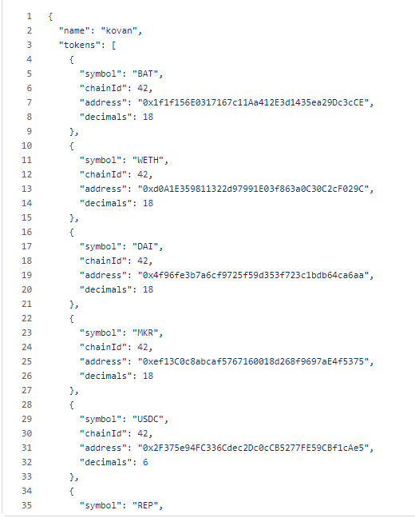

## Working with Token Lists

When trading across different blockchains, it's very important to understand how symbols map to addresses for each chain/network. In Hummingbot, each chain/network defines a `tokenListType` (`FILE` or `URL`) and `tokenListSource` (path to the designated file or URL), which uses the [Token Lists](https://tokenlists.org/) standard to define a token dictionary for each network.

Starting with the [v1.11.0 release](../release-notes/1.11.0.md) the `tokenlistType` by default is now currently set to `FILE` instead of `URL` where the list of tokens are now stored instead within a JSON file which users can now easily edit to add tokens they are currently trading but users can still switch between `URL` or `FILE` if needed.

You can edit the `tokenListType` and `tokenListSource` parameters for each network by running `gateway config`. Below are the instructions for adding tokens either through `FILE` or through `URL`

## Changing Tokenlist `FILE`

Create a local JSON file and save it under ../gateway/src/chains/`[chain_folder]`/... and add the missing token you want to use by adding their token address.

Open the Hummingbot client (make sure its connected to Gateway) and run `gateway config [chain].networks.[network].tokenListSource src/chains/[chain_folder]/name-of-file.json`

For example if you created a JSON file named `arbitrum.json` for Arbitrum One you would run `gateway config ethereum.networks.arbitrum_one.tokenlistSource src/chains/ethereum/arbitrum.json` and press Enter. You should get a message below that the config has been updated and Gateway will automatically restart to update the config.

You could also edit the existing JSON file directly. For example for the Ethereum Kovan testnet the existing JSON token list would be stored under [/chains/ethereum/erc20_tokens_kovan.json](https://github.com/hummingbot/hummingbot/blob/master/gateway/src/chains/ethereum/erc20_tokens_kovan.json).

Locate the file in Explorer and open the file in a notepad or your preferred text editor. See below for how the JSON file should look like in a text editor. From here, just modify the file and add the token address of the tokens you are trading.

## Changing Tokenlist `URL`

Go to [Token Lists](https://tokenlists.org/) and look for a list that contains the tokens you wish to trade and take note of that list URL

Once you have the token list URL, open Hummingbot and make sure Gateway is running and then enter `gateway config [chain].networks.[network].tokenlistType URL`  

For example to change the token list for Arbitrum One you would run `gateway config ethereum.networks.arbitrum_one.tokenlistType URL` and press Enter. You should get a message below that the config has been updated and Gateway will automatically restart to update the config.

Next you'll need to specify the tokenlist URL that you took note of in step 1 by running `gateway config [chain].networks.[network].tokenlistSource [tokenlist URL]` (replace [tokenlistURL] with the actual URL)

For example, to use the [1inch list](https://wispy-bird-88a7.uniswap.workers.dev/?url=http://tokens.1inch.eth.link) with Arbitrum one then the command would be `gateway config ethereum.networks.arbitrum_one.tokenlistSource https://wispy-bird-88a7.uniswap.workers.dev/?url=http://tokens.1inch.eth.link`

!!! note

    CTRL + V doesn't work from within Hummingbot. To paste, try `Shift + Insert` or `CTRL + Shift + V` or `CTRL + Shift + Right Click`

## Additional Information

Alternatively if you installed through Source you can also edit the `JSON` file directly under the `/gateway/src/templates/` folder

For a list of the default parameters including `tokenListType` and `tokenListSource` for each chain/network, see [Ethereum and EVM-Based Chains](/gateway/chains/ethereum/).
