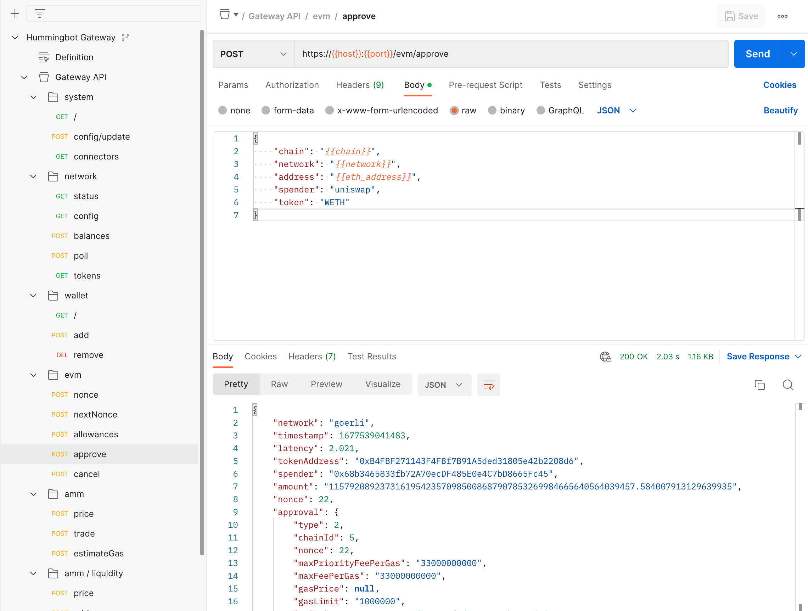
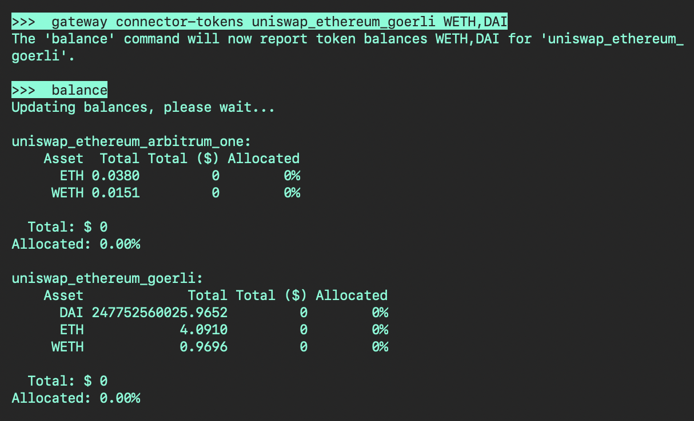

## What are Token Lists?

When trading on DEXs, you should understand how symbols map to addresses for each chain/network. Token symbols are not unique and may have duplicates or scammy clones on each network, so it's very important to be aware of which token address you are actually trading.

Hummingbot uses the [Token Lists](https://tokenlists.org/) standard to define a token dictionary for each network. For example, here are the DAI and HBOT entries from the default Token List for Ethereum Mainnet:

```json
{
    "chainId": 1,
    "address": "0x6b175474e89094c44da98b954eedeac495271d0f",
    "name": "Dai",
    "symbol": "DAI",
    "decimals": 18,
},
{
    "chainId": 1,
    "address": "0xe5097d9baeafb89f9bcb78c9290d545db5f9e9cb",
    "name": "Hummingbot",
    "symbol": "HBOT",
    "decimals": 18,
},
```

When you reference the symbols DAI and HBOT in a strategy, transactions on the `ethereum_mainnet` chain/network will use its Token List to 
identify the corresponding address.

## Where are lists stored?

Starting in [v1.17.0](../release-notes/1.17.0.md), Token Lists for each chain are stored in the `/conf/lists` directory of the root Gateway directory. 

For the [default Docker installation]](https://github.com/hummingbot/deploy-examples/tree/main/hummingbot_gateway_compose) below, the lists are located in the `lists` folder:

```
hummingbot_gateway_compose
    ┣ hummingbot_files
    ┣ gateway_files
        ┣ conf
            ┣ lists
            ┣ connectors
        ┣ db
        ┣ logs
```

The folder location and list file is defined in each blockchain's config file (i.e. `/conf/ethereum.yml`). It also defines a `tokenListType` (`FILE` or `URL`) and `tokenListSource` (path to the designated file or URL) for each network. Note that `URL`-based token lists may impact client latency, compared to accessing the Token List via `FILE`. 

Users are free to change this setting by configuring the `tokenListType` and `tokenListSource` parameters for each network - see [Updating config parameters](/gateway/setup/#updating-config-parameters) for more information.


## Adding tokens

You can replace any of the Token Lists in the `/conf/lists` folder with updated versions. Go to [Token Lists](https://tokenlists.org/) and look for a list that contains the tokens you wish to trade. You can download the list and change `tokenListType` and `tokenListSource` to refer to it, or copy the token entries that you need into the default Token List.

Alternatively, you may add entries to the existing lists by following the convention above.

## Approving tokens

On Ethereum and EVM-compatible chains, wallets need to **approve** other addresses (such as DEXs) before transferring tokens to them. You can inspect the **allowance** for a spender address to see how much of a specific token you can tranfer to it.

When you `start` a strategy or script, Gateway automatically checks whether both base and quote tokens are approved for the DEX that you are using. If they are not approved or if allowance is insufficient, you will see an log message like "Waiting for allowances.." and the strategy will not start.

Here is how you can approve tokens:

### `approve-token` command

Use this command to approve tokens to enable trading on DEXs:

Here is an example:
```python
>>> gateway approve-tokens uniswap_ethereum_goerli WETH
```

[](./approve-tokens-command.png)

!!! tip
    This command is a good way to test whether or not your network's Token List is resolving the symbol correctly. If so, the symbol should displayed in `balance` along with the correct balance.


### Use `/evm/approve` in Postman

Alternatively, you can call the `/evm/approve` endpoint directly from Postman. Afterwards, you can paste the `hash` value in the response in the `txHash` parameter in `network/poll` endpoint to check when the transaction is confirmed.

[](./postman-approve.png)

After it's confirmed, you can use the `/evm/allowances` endpoint to check whether the approval was successful:

[](./postman-allowances.png)


## Displaying tokens in `balance`

Use the `connector-tokens` command to display token balances for various networks. Afterwards, the tokens will be displayed when you run the `balance` command. Note that you may append multiple tokens with commas.

Here is an example:
```python
>>> gateway connector-tokens uniswap_ethereum_goerli WETH,DAI
```

[](./connector-tokens.png)


## Testnet faucets

An testnet faucet is a tool that allows developers and users to obtain testnet ETH or other test assets for free. Testnet ETH is a cryptocurrency that is used exclusively for testing purposes on the Ethereum network and has no real-world value.

Using an Ethereum testnet faucet is a simple process that involves the following steps:

1. Visit a faucet website for your [chain](/chains). For example, see [Ethereum](/chains/ethereum) for a list of testnet faucets.

2. Enter your testnet wallet address where indicaated.

3. Complete any additional verification steps: Depending on the testnet faucet you are using, you may be required to complete additional verification steps, such as solving a captcha or proving that you are not a robot.

4. Receive your testnet ETH: After you have completed the verification steps, the testnet ETH will be sent to your Ethereum testnet address. You can then use this ETH to experiment with the Ethereum testnet network.

## Wrapped tokens

Decentralized exchanges (DEXs) such as Uniswap, Uniswap-Polygon, and TraderJoe have a built-in functionality that automatically converts, or "wraps", native tokens when used for swap trading. This wrapping process is hidden from the user and happens behind the scenes.

Gateway does not auto-wrap tokens by default so users need to wrap native tokens before using them with Gateway. For Uniswap, `ETH` should be wrapped to `WETH` and for Uniswap-Polygon, `MATIC` should be wrapped for `WMATIC`. Similarly, for TraderJoe which is an Avalanche blockchain DEX, its native `AVAX` token should be wrapped to `WAVAX`. It's crucial for users to familiarize themselves with the specific token wrapping requirements of the DEX they are using.

As of version `v1.4.0`, Gateway does not provide an error message if a user attempts to use a token that hasn't been wrapped. Instead, it will simply display the message "Markets are not ready." However, we are actively working on integrating more informative error messages in future releases to improve user experience.

For reference check the Uniswap Docs [here](https://docs.uniswap.org/contracts/v3/reference/deployments)
