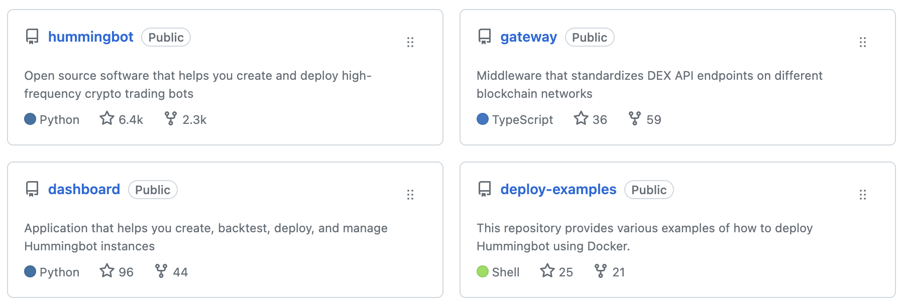

Hummingbot is an open source framework that helps you build **crypto trading bots** that run on both centralized exchanges (CEX), as well as decentralized exchanges (DEX) on various blockchain networks.

The main Hummingbot code repositories are:

* [`hummingbot/hummingbot`](https://github.com/hummingbot/hummingbot): The Hummingbot client that contains the core trading engine and connectors
* [`hummingbot/gateway`](https://github.com/hummingbot/gateway): Middleware that standardizes DEX API endpoints on different blockchain networks
* [`hummingbot/dashboard`](https://github.com/hummingbot/dashboard): Application that helps you create, backtest, deploy, and manage Hummingbot instances
* [`hummingbot/deploy-examples`](https://github.com/hummingbot/deploy-examples): Examples of how to deploy Hummingbot using Docker Compose
* [`hummingbot/hummingbot-site`](https://github.com/hummingbot/hummingbot-site): The official website for Hummingbot Foundation and documentation site for Hummingbot

Our codebase is free and publicly available on Github under the Apache 2.0 open source license. Help us **democratize high-frequency trading** and provide free access to sophisticated algorithms and tooling to everyone!!

## 📓 Quickstart Guides

New to Hummingbot? Start here with various guides for various use cases:

- [Quickstart - Dashboard](/getting-started/dashboard/): Use the new Dashboard application to create and backtest a trading strategy
- [Quickstart - Liquidity Mining](liquidity-mining/index.md): Earn liquidity mining rewards by running Hummingbot on our sister company CoinAlpha's Miner platform
- [Quickstart - Custom Script](./custom-script/index.md): Learn how to develop a custom market making script using Hummingbot!

## ❓ Install Hummingbot client

You can install the Hummingbot client either (1) [via Docker](./docker.md) or (2) [from source](./source/).

We recommend installing Hummingbot using Docker if:

- You want the simplest, easiest installation method
- You don't need to modify the Hummingbot codebase
- You want to deploy Hummingbot alongside with Dashboard, Orchestation Module, and other advanced configurations

Alternatively, install Hummingbot from source if:

- You want to customize or extend the Hummingbot codebase
- You want to build new components like connectors or strategies
- You want to learn how Hummingbot works at a deeper, technical level

## 👩‍💻 For developers

Hummingbot is a general source framework for crypto algorithmic trading. We welcome developers to fork the codebase for their own purposes and contribute to the community.

- [Bounties](../bounties/index.md): Get paid for building and maintaining Hummingbot components
connector middleware
- [Contribution Guidelines](../developers/contributions.m): Read this before submitting a pull request

## 🙋‍♂️ Getting help

Hummingbot features an active, friendly community of users globally! Here are some ways to get help if you're encountering issues:

- Check out the [FAQ](../faq.md), [Troubleshooting](../troubleshooting.md)), and [Glossary](../glossary.md) pages for answers to common questions about Hummingbot
- To report a bug or request a new feature, post a [Github issue](https://github.com/hummingbot/hummingbot/issues/new/choose).
- Join the official [Discord](https://discord.gg/hummingbot) and post your question on **#support**

We pledge that we will not use the information/data your provide us for trading purposes nor share them with third parties.
