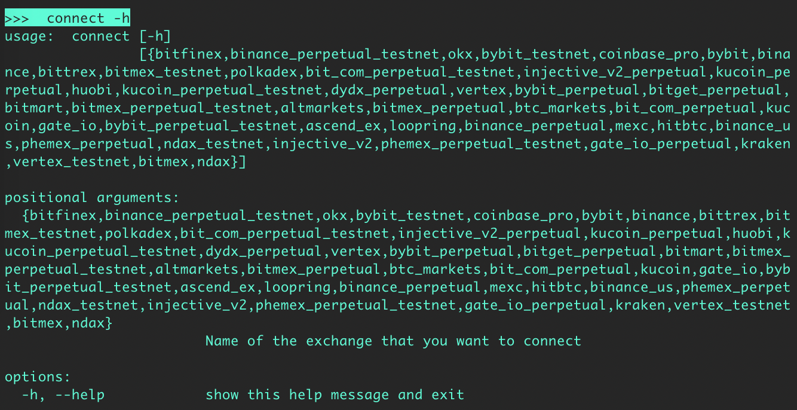

<iframe style="width:100%; min-height:400px;" src="https://www.youtube.com/embed/t3Su_F_SY_0" frameborder="0" allow="accelerometer; autoplay; encrypted-media; gyroscope; picture-in-picture" allowfullscreen></iframe>

## What does API key do?

An API key is a unique code or a set of unique codes used as an API to authenticate and authorize the calling user or application.  There are two important elements included in a set of API keys; the public key and the private key. These are sometimes also referred to as public key and secret key

link: https://academy.binance.com/en/articles/what-is-an-api-key-and-how-to-use-it-securely

---

## How can we create our API keys?

Creating API keys is different from one exchange to another. Some may need to have a KYC to be approve and others just limit the features. Normally creating API keys are located on the settings or API management. You can check this by going to options or settings of preferred exchange. 

Our supported connectors have each step on how you can create API keys, please refer to [https://docs.hummingbot.org/exchanges/](https://docs.hummingbot.org/exchanges/)

### What permissions does the key need?
**Read** and **Trade** permissions for Spot and Perpetual trading

---

## How can we connect our API keys on Hummingbot client?

1. Launch Hummingbot 
2. Run `connect` command then add your preferred exchange (e.g., `connect binance`).
3. You'll be prompted to enter your public API key. Input the public key (or API Key) you generated from the exchange.
4. Next, you'll be prompted for your private API key (or Secret Key).
5. Hummingbot will then verify the connection to the exchange using the provided keys.

### How do we know if API keys are working?

1. After entering your API keys, Hummingbot will attempt to authenticate with the exchange. If successful, you'll receive a confirmation message.
2. Use the `status` command to display information on strategy and connectivity status.
3. You can also use `balance` command to display exchange assets.
4. Ensure there are no errors related to permissions or authentication in the Hummingbot logs.

---

## Store your API keys securely

If someone gains access to your API keys, they can place trades on your behalf. They might execute trades at unfavorable rates or even trade into scam or low liquidity tokens causing significant losses. Unauthorized users can also access your trading history and other sensitive data.

* Recommendations:
    * Never share your API keys with anyone. Treat them as you would your password or private keys.
    * Do not store your API keys online or in easily accessible places. Use secure, offline methods whenever possible.
    * Always ensure that the permissions for withdrawals are turned OFF when generating API keys for trading bots.
    * Regularly review and rotate your API keys.
    * Use dedicated email accounts and strong, unique passwords for your exchange accounts.
    * Enable two-factor authentication (2FA) on your exchange accounts for an extra layer of security.