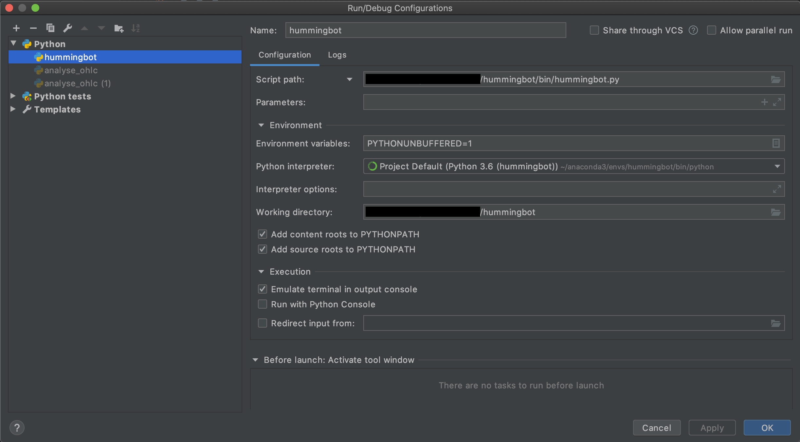

# Using Debugger Tools

This section will detail the necessary configuration / setup required to run the debugger tool from your IDE of choice.

## VS Code

Include the following debug configurations into the `launch.json` configuration file

```json
{
  "version": "0.2.0",
  "configurations": [
    {
      "name": "Python: Hummingbot Application",
      "type": "python",
      "request": "launch",
      "program": "${workspaceRoot}/bin/hummingbot.py",
      "console": "integratedTerminal"
    }
  ]
}
```

By executing the **Start Debugging** command which can be found under the **Run** menu at the top or pressing the <kbd>F5</kbd> key, the debugger will automatically attach itself to the Hummingbot process. The Hummingbot app will appear in the `integratedTerminal`. You may change this as desired.

## PyCharm

In the video below, Abel of CoinAlpha has shown how to debug a Script using Pycharm IDE.


<iframe style="width:100%; min-height:400px;" src="https://www.youtube.com/embed/2O6Ge25rsLk?si=ZNuo16EysuRB-jIx" frameborder="0" allow="accelerometer; autoplay; encrypted-media; gyroscope; picture-in-picture" allowfullscreen></iframe>


Additionally, for PyCharm, you want to set up the debug configurations, as seen in the screenshot below.



For debugging it is neccessary that `Gevent compatible` in `Python Debugger` settings is enabled. See
[Stackoverflow Q&A](https://stackoverflow.com/questions/39371676/debugger-times-out-at-collecting-data).

!!! note
    As of this writing, there is no way to add breakpoints/log points to any of the Cython code in VSCode or PyCharm.
