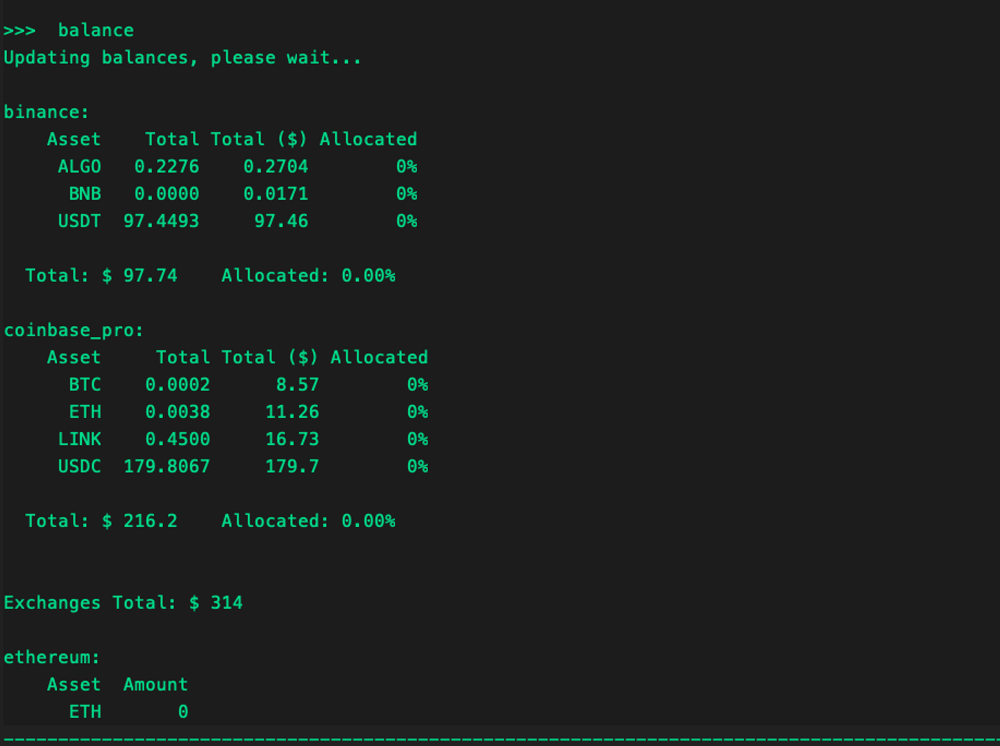
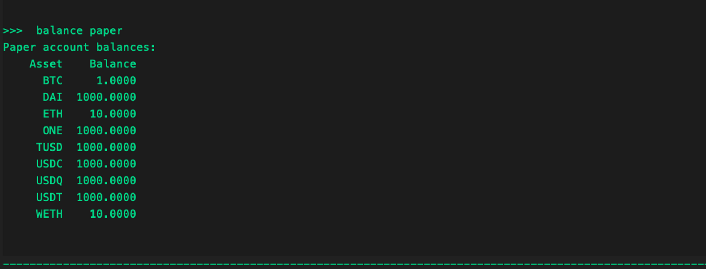
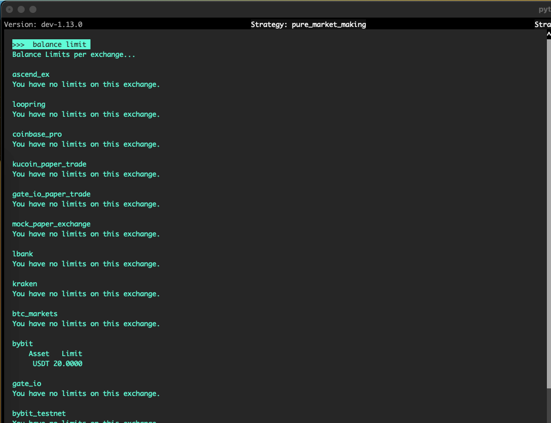
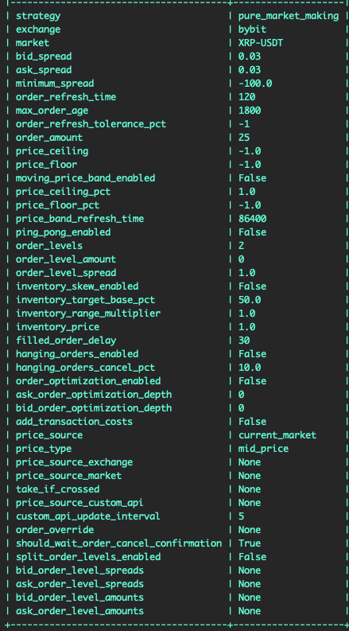
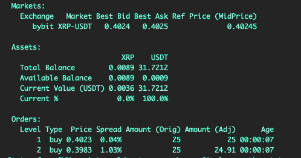
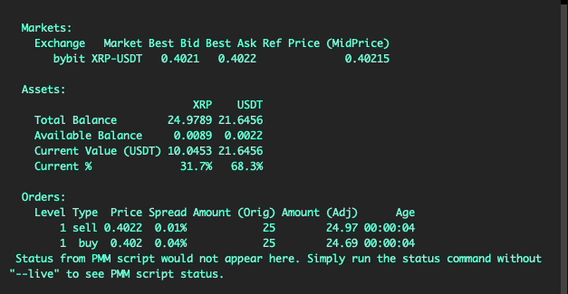

# How to get Balances

## Exchange and wallet balance

Run the `balance` command to check the balances of all connected wallets and exchanges.



The **"Allocated"** column shows how much of your assets are being used when there are active orders.

## Paper Trade balance

Run the `balance paper` command to check your paper trade account balance.



By default, these are the paper trade balances pre-loaded in Hummingbot. You can also enter additional assets and credits to use in paper trade mode.

## Adding Paper Trade Balance

By default, the paper trade account has the following tokens and balances which you can see when you run the `balance paper` command.

```
>>>  balance paper
Paper account balances:
    Asset    Balance
      DAI  1000.0000
      ETH    10.0000
      ONE  1000.0000
     TUSD  1000.0000
     USDC  1000.0000
     USDQ  1000.0000
     USDT  1000.0000
     WETH    10.0000
      ZRX  1000.0000

```

When adding balances, specify the asset and balance you want by running this command `balance paper [asset] [amount]`.

For example, we want to add 0.5 BTC and check our paper account balance to confirm.

```
>>>  balance paper BTC 0.5
Paper balance for BTC token set to 0.5

>>>  balance paper
Paper account balances:
    Asset    Balance
      BTC     0.5000
      DAI  1000.0000
      ETH    10.0000
      ONE  1000.0000
     TUSD  1000.0000
     USDC  1000.0000
     USDQ  1000.0000
     USDT  1000.0000
     WETH    10.0000
      ZRX  1000.0000
```

## Balance limits

Sets the amount limit on how much assets Hummingbot can use in an exchange or wallet. This can be useful when running multiple bots on different trading pairs with same tokens e.g. running a BTC-USDT pair and another bot on ETH-USDT using the same account.

### How it works

You can set how much of a particular token the bot can use by running the command `balance limit [exchange] [asset] [amount]`. You can disable this feature by editing it in the global config file and set it to -1. While setting it to 0 will initially not place any order for a specific asset until a trade is executed to accumulate the said asset.

For example:

```
>>>  balance limit binance USDT 20
Limit for USDT on bybit exchange set to 20.0

```

Run the `balance limit` command to confirm if the changes are applied



### Example Scenario

Create a pure market making strategy, run the `config` command to view the whole configuration. The command `balance limit bybit USDT 20` is used as example



On this scenario we set a config with `order_levels 2` this way we can also see how the balance limit works. The strategy would only be able to create orders that will not be more than 20 USDT.  On the screenshot below, the client was trying to buy a XRP on a amount of 10.137 USDT and observed that the second buy order amount adjusted due to balance limit.



On the screenshot below, a buy order has been successfully filled and after order refresh time the client created orders again but observed that now it did not created another order level since it is beyond the set balance limit of 20 USDT.



## Displaying token symbols in `balance`

You can use the `gateway connector-tokens` command to include tokens in the `balance` command. See [Working with Tokens](/gateway/tokens/#displaying-tokens-in-balance) for more information.