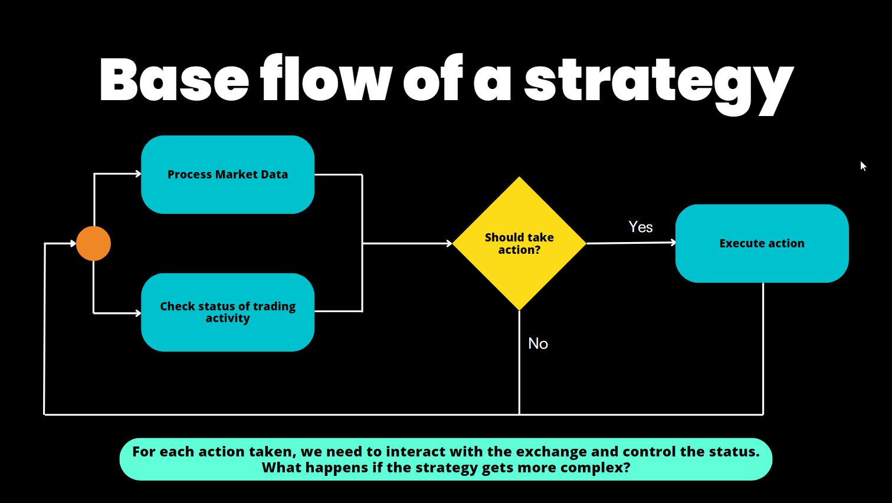

## What is a Hummingbot Strategy?

Like a computer program, an algorithmic trading strategy is a set of automated processes that executes repeatedly:

- **Data Collection**: Gathering real-time data from various sources
- **Data Processing**: Analyzing data to identify patterns and make decisions
- **Order Execution**: Placing and cancelling orders based on processed data

A Hummingbot strategy loads market data directly from centralized and decentralized exchanges, adaptable to the unique features of each trading venue's WebSocket/REST APIs and nodes.

Each [clock tick](../global-configs/clock-tick.md), a strategy loads real-time order book snapshots, user balances, order status and other real-time data from trading pairs on these venues and executes the logic defined in the strategy, parametrized by a pre-defined user configuration.

To run a strategy, a user selects a strategy template, defines its input parameters in a [Config File](../client/config-files.md), and starts it with the `start` command in the Hummingbot client or via the command line with [Strategy Autostart](/global-configs/strategy-autostart/).

## Strategies V2

Starting in 2023, Hummingbot Foundation began to iteratively introduce a new framework, called **Strategy V2**. The new framework allows you to build powerful, dynamic strategies using Lego-like components. To learn more, check out [Architecture](../v2-strategies/index.md).

There are two current ways that Hummingbot strategies can be defined:

[Scripts](/scripts): A simple Python file that contains all strategy logic. We recommend starting with a script if you want a simple way to prototype your strategy.

[Controllers](/v2-strategies/controllers/): Strategy logic is abstracted into a Controller, which may use Executors and other components for greater modularization. Controllers can be backtested and deployed using Dashboard, and a single loader Script may deploy and manage multiple Controller configurations.

Controllers are designed to add another layer of abstraction and circumvent the limit of Hummingbot to only run one strategy per bot instance. You can think of that as the most powerful and advanced setup that Hummingbot currently provides.

This table may help you decide whether to use a Script or Controller for your strategy:

| Script                                                                | Controller                                                                 |
|--------------------------------------------------------------------------------------|---------------------------------------------------------------------------------------------|
| The strategy is relatively simple                                                    | You want to manage the risk and diversify your portfolio in different controllers           |
| The logic is very standard across different trading pairs                             | The strategy is complex and you want to isolate the decision making                         |
| The strategy only trades on one trading pair                                          | You want to try multiple configs in the same bot                                            |
| You are getting started with Executors and you want a simple way to code your strategy | The strategy trades on multiple trading pairs                                               |
| Prototype a strategy                                                                  | You are familiar with the Strategy V2 and how the controllers interact with it              |

## Strategies V1

When it launched in 2019, Hummingbot pioneered the concept of configurable templates for algo trading strategies, such as market making strategies based on the Avellaneda & Stoikov paper.

Initially, these strategies were confined to individual bots, complicating the management and scaling across various scenarios, and they lacked the capability to use historical market data, which forced traders to rely solely on real-time data. Furthermore, technical barriers, such as a deep prerequisite knowledge of foundational classes and Cython, hindered easy access to market data, while limited backtesting tools restricted evaluations against historical data.

Users can access these strategy templates at the [Strategies V1](../v1-strategies/index.md) page.

## Learn Algo Trading and Market Making

To gain a deeper understanding of Hummingbot strategies along with access to the latest Hummingbot framework updates, check out [Botcamp](/botcamp/faq/), the official training program for Hummingbot.

Operated by the people behind Hummingbot Foundation, Botcamp offers bootcamps and courses that teach you how to design and deploy advanced algo trading and market making strategies using Hummingbot's Strategy V2 framework.