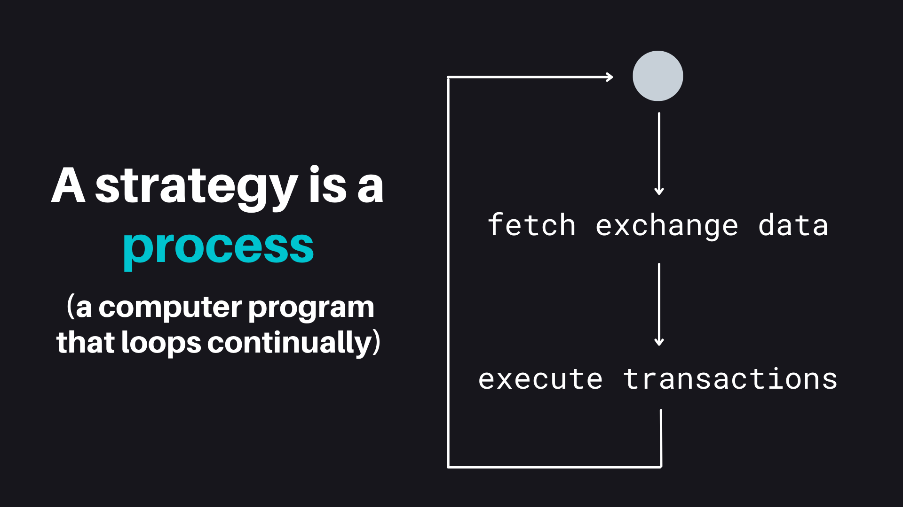

## What is a Strategy?

Like a computer program, an algorithmic trading strategy is a set of automated processes that executes repeatedly:

- **Data Collection**: Gathering real-time data from various sources
- **Data Processing**: Analyzing data to identify patterns and make decisions
- **Order Execution**: Placing and cancelling orders based on processed data

A Hummingbot strategy loads a set of [connectors](../exchanges/index.md) that integrate into different centralized and decentralized exchanges, adaptable to the unique features of each trading venue's WebSocket/REST APIs and nodes.

Each [clock tick](/global-configs/clock-tick/), a strategy loads real-time order book snapshots, user balances, order status and other real-time data from trading pairs on these venues and executes the logic defined in the strategy, parametrized by a pre-defined user configuration.

To run a strategy, a user selects a [base strategy](../v2-strategies/examples/), defines its input parameters in a [config file](/client/config-files/), and uses the `start` command in the Hummingbot client to run it. 

We encourage users to create their own custom strategies and/or extend the existing examples.

## Types of Hummingbot Strategies

### V2 Strategies

Hummingbot's V2 strategies represent the latest innovation in trading strategy development, designed for composability, access to real-time market data, and backtestability. Compared to the rigid V1 Strategies, V2 Strategies are modular and composable, allowing non-technical users to build powerful strategies using Lego-like components.

* [Sample V2 Strategies](../v2-strategies/examples/): Various V2 strategies and how to use them
* [V2 Strategies Cheatsheat](../v2-strategies/cheatsheet/): One-pager that helps you use and extend V2 strategies
* [V2 Strategy Architecture](../v2-strategies/): Learn about each component in the V2 framework

### [V1 Strategies](../v1-strategies/index.md)

The original Hummingbot V1 strategies offer a structured, template-based environment with user-friendly parameters, but they are less customizable than V2 strategies.

### [Scripts](../scripts/index.md)

Ideal for beginners and those seeking a quick, straightforward approach, a script provides a lightweight solution in a single Python file.

-   ## 🎓 Learn Strategy Development in Botcamp

    ---

    To gain a deeper understanding of Hummingbot strategies along with access to the latest framework updates, sign up for [Botcamp](/botcamp), which teaches you how to design, backtest and deploy advanced algo trading and market making strategies using Hummingbot.

