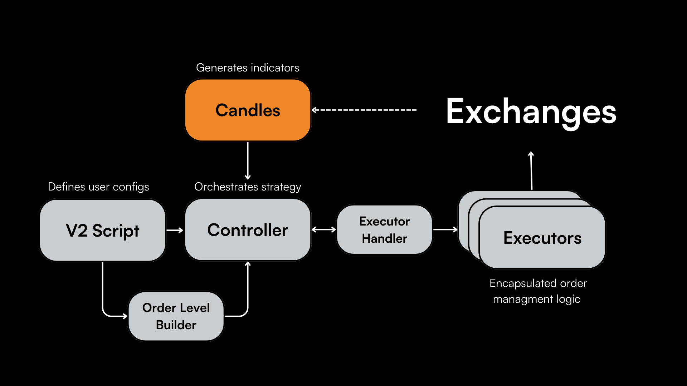

## Overview

The Candles component allows users to maintains a moving window of data and indicators that can be used in their strategy. It is a vital feature for traders to generate custom OHLCV (Open, High, Low, Close, Volume) candles. It combines historical and real-time data, allowing the creation of real-time custom technical indicators with the use of [pandas_ta](https://github.com/twopirllc/pandas-ta).

## Configuring Candles

- **Instantiation in script (single candle and market)**

```python
from hummingbot.data_feed.candles_feed.candles_factory import CandlesConfig

CandlesConfig(connector=candles_exchange, trading_pair=trading_pair,
              interval=candles_interval, max_records=candles_max_records)

config = DManV3Config(
            candles_config=[conf["candles_config"]],
        )
```

- **Key Configs**
    - `candles_exchange`: Identifies the data source, like binance or binance_perpetual.
    - `trading_pair`: The trading pair in 'BASE-QUOTE' format, e.g., BTC-USDT.
    - `candles_interval`: The time interval between candles.
    - `candles_max_records`: Maximum number of candles to store.
    - 
- **Using multiple candles**
    - For scripts/strategies that require multiple candle intervals or trading pairs we can initialize separate instances:
    
    ```python
    from hummingbot.data_feed.candles_feed.candles_factory import CandlesFactory, CandlesConfig
    
    class InitializingCandlesExample(ScriptStrategyBase):
        # Create CandlesConfig objects for each candle
        candles_config_1 = CandlesConfig(connector="binance", trading_pair="BTC-USDT", interval="3m")
        candles_config_2 = CandlesConfig(connector="binance_perpetual", trading_pair="ETH-USDT", interval="1m")
    
        # Initialize candles using the CandlesConfig objects
        candles_1 = CandlesFactory.get_candle(candles_config_1)
        candles_2 = CandlesFactory.get_candle(candles_config_2)
    
    ```
    

- **Accessing indicators**
    
    ```python
    def format_status(self) -> str:
            """
            Displays the three candlesticks involved in the script with RSI, BBANDS and EMA.
            """
            if not self.ready_to_trade:
                return "Market connectors are not ready."
            lines = []
            if self.all_candles_ready:
                lines.extend(["\n############################################ Market Data ############################################\n"])
                for candles in [self.eth_1w_candles, self.eth_1m_candles, self.eth_1h_candles]:
                    candles_df = candles.candles_df
                    # Let's add some technical indicators
                    candles_df.ta.rsi(length=14, append=True)
                    candles_df.ta.bbands(length=20, std=2, append=True)
                    candles_df.ta.ema(length=14, offset=None, append=True)
                    candles_df["timestamp"] = pd.to_datetime(candles_df["timestamp"], unit="ms")
                    lines.extend([f"Candles: {candles.name} | Interval: {candles.interval}"])
                    lines.extend(["    " + line for line in candles_df.tail().to_string(index=False).split("\n")])
                    lines.extend(["\n-----------------------------------------------------------------------------------------------------------\n"])
            else:
                lines.extend(["", "  No data collected."])
    
            return "\n".join(lines)
    ```
    
    The above code highlighted in red shows how you can add technical indicators (`rsi`, `bands`, and `ema`) to a custom format status displayed when the user runs the `status` command.  
    
- **Displaying candles in `status` command using `format_status`**

```python
def format_status(self) -> str:
        if not self.ready_to_trade:
            return "Market connectors are not ready."
        lines = []
        for trading_pair, executor_handler in self.executor_handlers.items():
            lines.extend(
                [f"Strategy: {executor_handler.controller.config.strategy_name} | Trading Pair: {trading_pair}",
                 executor_handler.to_format_status()])
        return "\n".join(lines)
```

This method is designed to display the status of your trading strategy, including the latest candlestick data.

Here's how you can modify the method to display the one-hour candlestick data for ETH-USDT with columns showing `timestamp`, `open`, `high`, `low`, and `close` when you run the `status` command

```python
def format_status(self) -> str:  
    if not self.ready_to_trade:
        return "Market connectors are not ready."

    lines = ["\n############################################ Market Data ############################################\n"]
    if self.eth_1h_candles.is_ready:
        candles_df = self.eth_1h_candles.candles_df
        # Format timestamp
        candles_df["timestamp"] = pd.to_datetime(candles_df["timestamp"], unit="ms").dt.strftime('%Y-%m-%d %H:%M:%S')
        # Select relevant columns for display
        display_columns = ["timestamp", "open", "high", "low", "close"]
        formatted_df = candles_df[display_columns].tail()  # Display last few records
        # Format the data frame as a string for display
        lines.append("One-hour Candles for ETH-USDT:")
        lines.append(formatted_df.to_string(index=False))
        lines.append("\n-----------------------------------------------------------------------------------------------------------\n")
    else:
        lines.append("  One-hour candle data is not ready.")

    return "\n".join(lines)
```

**Candles Examples**

- Single Candle -
    
    [https://github.com/hummingbot/hummingbot/blob/master/scripts/v2_market-making_dman_v3_multiple_pairs.py](https://github.com/hummingbot/hummingbot/blob/master/scripts/archived_scripts/examples_using_smart_components/directional_strategy_rsi_spot.py)
    
- Single Candle (multiple intervals) - https://github.com/hummingbot/hummingbot/blob/development/scripts/archived_scripts/examples_using_smart_components/directional_strategy_bb_rsi_multi_timeframe.py
- Multiple Candles -
    
    https://github.com/hummingbot/hummingbot/blob/master/scripts/v2_market-making_dman_composed.py
    
    (this script also uses multiple controllers)
    
- Indicators
    
    https://github.com/hummingbot/hummingbot/blob/master/scripts/archived_scripts/examples_using_smart_components/macd_bb_directional_strategy.py
    
- Displaying custom status
    
    https://github.com/hummingbot/hummingbot/blob/master/scripts/archived_scripts/examples_using_data_feeds/candles_example.py


## Usage Examples

### Initializing Candles

Create an instance of a candle for `BTC-USDT` from Binance Spot:

```python
class InitializingCandlesExample(ScriptStrategyBase):
    candles = CandlesFactory.get_candle("binance", "BTC-USDT", "3m")
    ...
```

### Logging Candles on Tick

To log candle data periodically, you can use the `on_tick` method:

```python
def on_tick(self):
    self.logger().info(self.candles.candles_df)
```

### Multiple Candles Initialization

For strategies that require multiple candle intervals or trading pairs, initialize separate instances:

```python
class InitializingCandlesExample(ScriptStrategyBase):
    candles_1 = CandlesFactory.get_candle("binance", "BTC-USDT", "3m")
    candles_2 = CandlesFactory.get_candle("binance_perpetual", "ETH-USDT", "1m")
    ...
```

### Relevant Scripts

For practical examples of the Candles component in action, visit the following scripts in the Hummingbot codebase:

- [download_candles.py](https://github.com/hummingbot/hummingbot/blob/master/scripts/download_candles.py)
- [candles_example](https://github.com/hummingbot/hummingbot/blob/master/scripts/archived_scripts/examples_using_data_feeds/candles_example.py)
- [simple_directional_strategy_example](https://github.com/hummingbot/hummingbot/blob/master/scripts/archived_scripts/examples_using_smart_components/directional_strategy_rsi_spot.py)
- [advanced_directional_strategy_example](https://github.com/hummingbot/hummingbot/blob/master/scripts/archived_scripts/examples_using_smart_components/directional_strategy_trend_follower.py)

These scripts show how to effectively use the Candles component within trading strategies and data analysis tasks.


## Available Exchanges

Currently, the following exchanges support the Candles component:

#### Spot Exchanges
- Binance (`binance_spot`)
- KuCoin (`kucoin`)
- Gate.io (`gate_io`)
- AscendEX (`ascendex`)

#### Perpetual Exchanges
- Binance (`binance_perpetual`)
- KuCoin (`kucoin_perpetual`)
- Gate.io (`gate_io_perpetual`)


To fetch candles from one of these exchanges, apply the `connector_name` above in the `get_candle` method of `CandlesFactory`:

```python
CandlesFactory.get_candle(connector_name: str, trading_pair: str, interval:str = "1m", max_records:int = 500)
```


## Key Methods and Properties

### Candles Factory

The [CandlesFactory](https://github.com/hummingbot/hummingbot/blob/13aab912ea297a70e52f560cc7239400a1204aa6/hummingbot/data_feed/candles_feed/candles_factory.py) class creates and returns a Candle object  based on the specified connector and trading pair. It has a class method `get_candle` which takes in a connector, trading pair, interval, and max_records as parameters.

The `CandlesBase` class is the cornerstone for fetching and storing candle data from exchanges. It ensures compatibility across different connectors by utilizing REST and WebSocket connections for data retrieval.

**Key Features:**

- Inherits from `NetworkBase`, ensuring network reliability and consistency.
- Utilizes Rest and WS Assistants for all I/O operations.
- Incorporates a double-ended queue to store candles efficiently.
- Implements the Throttler module for API rate limiting.

Below are the key methods and properties available in a Candles object. See [BinancePerpetualsCandles](https://github.com/hummingbot/hummingbot/blob/13aab912ea297a70e52f560cc7239400a1204aa6/hummingbot/data_feed/candles_feed/binance_perpetual_candles/binance_perpetual_candles.py) or [BinanceSpotCandles](https://github.com/hummingbot/hummingbot/tree/13aab912ea297a70e52f560cc7239400a1204aa6/hummingbot/data_feed/candles_feed/binance_spot_candles) for examples.

### `get_candle` Method

A static method from the `CandlesFactory` class to obtain candle data:

```python
CandlesFactory.get_candle(connector_name: str, trading_pair: str, interval:str = "1m", max_records:int = 500)
```

Parameters:

- `connector_name`: Identifies the data source, like `binance` or `binance_perpetual`.
- `trading_pair`: The trading pair in 'BASE-QUOTE' format, e.g., `BTC-USDT`.
- `interval`: The time interval between candles.
- `max_records`: Maximum number of candles to store.

### `start` and `stop` Methods

Essential for initializing and terminating the candle data stream:

```python
def start(self):
    ...
def stop(self):
    ...
```

- `start()`: Begin streaming and collecting candle data.
- `stop()`: Terminate the candle data stream.

### `is_ready` Property

Confirms if the candle data set is complete:

```python
@property
def is_ready(self):
    ...
```

### `candles_df` Property

Accesses the latest DataFrame of candle data:

```python
@property
def candles_df(self):
    ...
```
