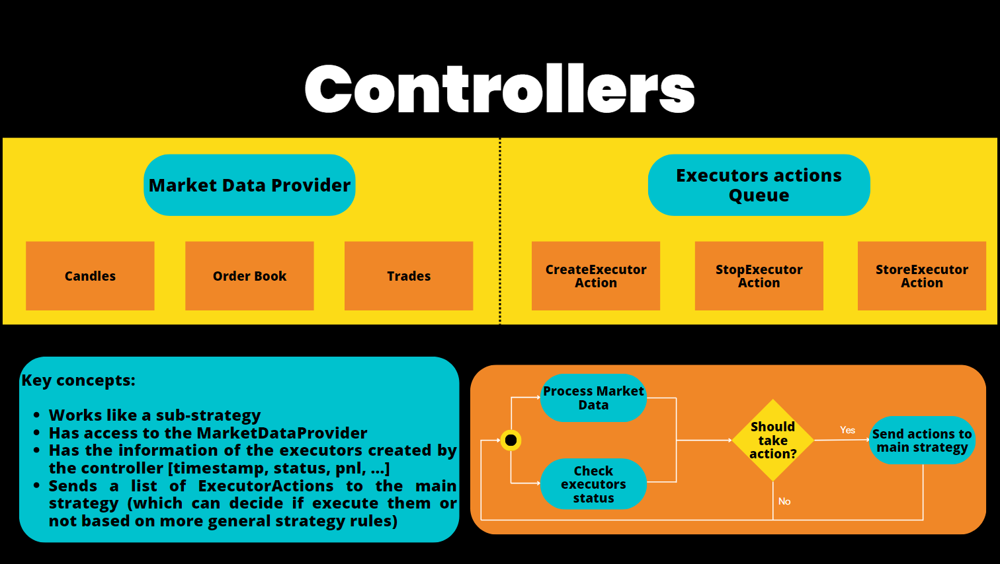

The **Controller** plays a crucial role within Hummingbot's Strategy V2 framework, serving as the orchestrator of the strategy's overall behavior. It interfaces with the **MarketDataProvider**, which includes OrderBook, Trades, and Candles, and forwards a series of **ExecutorActions** to the main strategy. The strategy then evaluates these actions, deciding to execute them based on its overarching rules and guidelines.

## Controller Types

The framework outlines two main types of controllers: **market-making** and **directional trading controllers**.
These controllers are designed to facilitate rapid strategy development by handling complex functionalities, allowing users to focus on customizing their strategy's actions.

### Directional Trading

- [bollinger_v1](https://github.com/hummingbot/hummingbot/blob/development/controllers/directional_trading/bollinger_v1.py)
- [dman_v3](https://github.com/hummingbot/hummingbot/blob/development/controllers/directional_trading/dman_v3.py)
- [macd_bb_v1](https://github.com/hummingbot/hummingbot/blob/development/controllers/directional_trading/macd_bb_v1.py)
- [trend_follower_v1](https://github.com/hummingbot/hummingbot/blob/development/controllers/directional_trading/trend_follower_v1.py)

### Market Making 

- [dman_maker](https://github.com/hummingbot/hummingbot/blob/development/controllers/market_making/dman_maker.py)
- [pmm_dynamic](https://github.com/hummingbot/hummingbot/blob/development/controllers/market_making/pmm_dynamic.py)
- [pmm_simple](https://github.com/hummingbot/hummingbot/blob/development/controllers/market_making/pmm_simple.py)

**General Overview of Controllers:**

Controllers are a crucial part of the framework, acting as intermediaries between the main strategy and the executors.
They process market data, assess the Executor's status, and decide whether to take action.
Actions determined by controllers are sent back to the main strategy for execution, rather than the controllers executing these actions directly.

**Changes in the Framework:**

The framework is moving away from detailed explanations of controllers towards a shared, high-level overview of how they function.
This shift includes removing certain elements like **Executor Handlers** and focusing more on the **Executor Orchestrator**.

**Role of Controllers:**

Controllers serve as the base classes for specific strategies, providing templates that simplify strategy creation.
They allow for the creation of custom strategies by inheriting from a controller base and implementing desired actions without adhering strictly to predefined trading or market-making rules.

**Integration with Other Components:**

Controllers are part of a larger ecosystem that includes executors, market data providers, and the executor orchestrator.
The framework emphasizes a progressive learning approach, starting with an understanding of executors, followed by market data providers (which now include candles directly, eliminating the need for separate candle instances), and finally, the integration of controllers.

**Advanced Strategies:**

Beyond basic strategy implementation, the framework introduces advanced strategies that utilize controllers in more complex scenarios.
Users can now use controllers as sub-strategies allowing them to use multiple controllers in a single script or trade multiple pairs / configs in a single bot. 