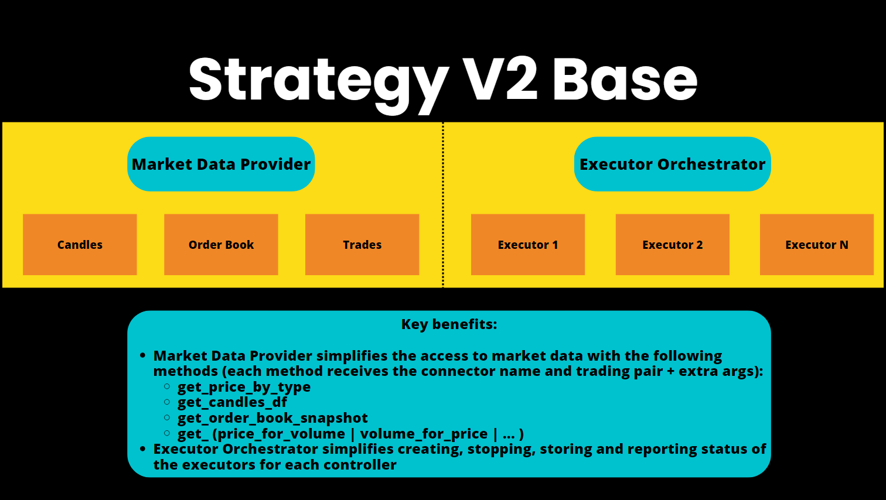

The StrategyV2 framework contains a set of interlocking components that can be combined to create powerful, customized algo trading strategies.

[](diagrams/9.png)

There are two ways to create strategies using the StrategyV2 framework:

* Scripts that use StrategyV2 components like the Market Data Provider and Executors
* Controllers that house the strategy logic. This allows a single loader script to manage multiple Controller configurations.

See the table below to decide which type to use:

| StrategyV2 Script                                                                | StrategyV2 Controller                                                                 |
|--------------------------------------------------------------------------------------|---------------------------------------------------------------------------------------------|
| The strategy is relatively simple                                                    | You want to manage the risk and diversify your portfolio in different controllers           |
| The logic is very standard across different trading pairs                             | The strategy is complex and you want to isolate the decision making                         |
| The strategy only trades on one trading pair                                          | You want to try multiple configs in the same bot                                            |
| You are getting started with Executors and you want a simple way to code your strategy | The strategy trades on multiple trading pairs                                               |
| Prototype a strategy                                                                  | You are familiar with the Strategy V2 and how the controllers interact with it              |

Check out [Walkthrough](./walkthrough.md) and [Walkthrough - Controller](./walkthrough-controller.md) to learn how to use them.

## Components

The most important components to understand are:

* [**Script**](#strategyv2-script): Orchestrates the overall strategy logic. This is a standard [script](/scripts) that inherits from the `StrategyV2Base` class. 
* [**Executor**](./executors/index.md): Manages orders and positions based on pre-defined user settings, ensuring that orders are placed, modified, or canceled according to the strategy's instructions.
* [**Controller**](./controllers/index.md): Defines a trading strategy based on a strategy controller base class, i.e. Directional or Market Making.
* [**Market Data Provider**](./data/index.md): Single point of access to exchange market data such as historical OHCLV [Candles](./candles/index.md), order book data, and trades.

## Script
[](./diagrams/14.png)

The entry point for StrategyV2 is a Hummingbot script that inherits from the [StrategyV2Base](https://github.com/hummingbot/hummingbot/blob/development/hummingbot/strategy/strategy_v2_base.py) class. 

This script fetches data from the Market Data Provider and manages how each Executor behaves. Optionally, it can load a Controller to manage the stategy logic instead of defining it in within the script. Go through the [Walkthrough](./walkthrough.md) to learn how it works. 

See [Sample Scripts](/v2-strategies/examples) for more examples of StrategyV2-compatible scripts.

### Adding Config Parameters

To add user-defined parameters to a StategyV2 script, add a configuration class that extends the `StrategyV2ConfigBase` class in [StrategyV2Base](https://github.com/hummingbot/hummingbot/blob/development/hummingbot/strategy/strategy_v2_base.py) class.  

This defines a set of configuration parameters that are prompted to the user when they run `create` to generate the config file. Only questions marked `prompt_on_new` are displayed.

Afterwards, these parameters are stored in a config file. The script checks this config file every `config_update_interval` (default: 60 seconds) and updates the parameters that it uses in-flight.

```python
class StrategyV2ConfigBase(BaseClientModel):
    """
    Base class for version 2 strategy configurations.
    """
    markets: Dict[str, Set[str]] = Field(
        default="binance_perpetual.JASMY-USDT,RLC-USDT",
        client_data=ClientFieldData(
            prompt_on_new=True,
            prompt=lambda mi: (
                "Enter markets in format 'exchange1.tp1,tp2:exchange2.tp1,tp2':"
            )
        )
    )
    candles_config: List[CandlesConfig] = Field(
        default="binance_perpetual.JASMY-USDT.1m.500:binance_perpetual.RLC-USDT.1m.500",
        client_data=ClientFieldData(
            prompt_on_new=True,
            prompt=lambda mi: (
                "Enter candle configs in format 'exchange1.tp1.interval1.max_records:"
                "exchange2.tp2.interval2.max_records':"
            )
        )
    )
    controllers_config: List[str] = Field(
        default=None,
        client_data=ClientFieldData(
            is_updatable=True,
            prompt_on_new=True,
            prompt=lambda mi: "Enter controller configurations (comma-separated file paths), leave it empty if none: "
        ))
    config_update_interval: int = Field(
        default=60,
        gt=0,
        client_data=ClientFieldData(
            prompt_on_new=False,
            prompt=lambda mi: "Enter the config update interval in seconds (e.g. 60): ",
        )
    )
```

### `on_tick` Method

This method acts as the strategy's heartbeat, is called regularly, and allows the strategy to adapt to new market conditions in real time.

```python
def on_tick(self):
    for executor_handler in self.executor_handlers.values():
        if executor_handler.status == ExecutorHandlerStatus.NOT_STARTED:
            executor_handler.start()
```

### `format_status` Method

This overrides the standard `status` function and provides a formatted string representing the current status of the strategy, including the name, trading pair, and status of each executor.

Users can customize this function to display their custom strategy variables.

```python
def format_status(self) -> str:
        if not self.ready_to_trade:
            return "Market connectors are not ready."
        lines = []
        for trading_pair, executor_handler in self.executor_handlers.items():
            lines.extend(
                [f"Strategy: {executor_handler.controller.config.strategy_name} | Trading Pair: {trading_pair}",
                 executor_handler.to_format_status()])
        return "\n".join(lines)
```

!!! tip Learn to Develop Algo Trading Strategies
    To gain a deeper understanding of Hummingbot strategies along with access to the latest framework updates, sign up for [Botcamp](https://www.botcamp.xyz), which teaches you how to design and deploy advanced algo trading and market making strategies using Hummingbot's Strategy V2 framework.
