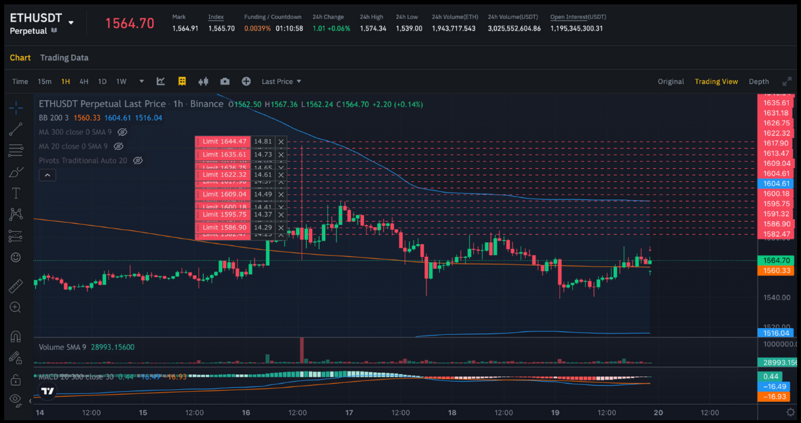
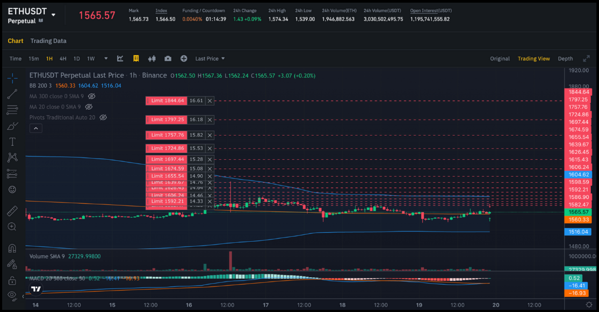
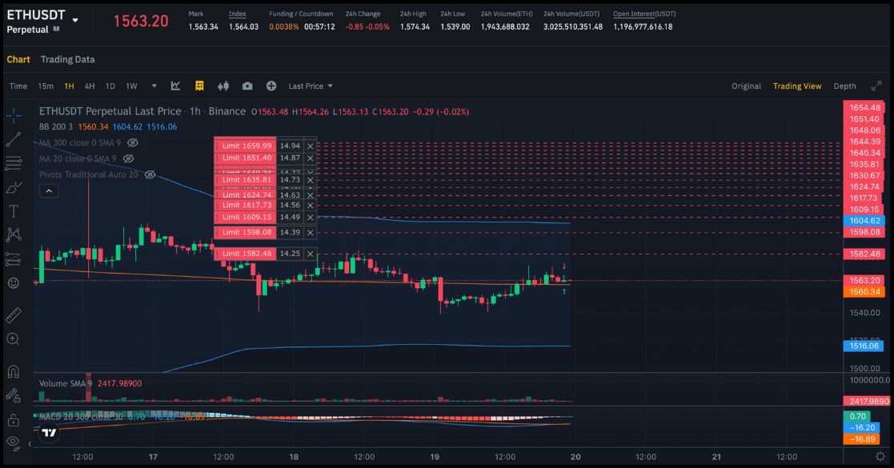

# Order Levels 

`Order levels` are predefined price points for buying or selling assets, crucial in both manual and algorithmic trading. They optimize pricing, enhance risk management by diversifying entry and exit points, and aid in executing strategic trading decisions like dollar-cost averaging or stop-loss orders. 

These levels are often determined based on market analysis and help in maintaining emotional discipline in trading. Additionally, in high-frequency trading, setting various order levels contributes to market liquidity. Overall, order levels are key to effective trading strategies, enabling better market entry/exit timing and informed trading choices.


## Manual Order Levels

Below is a sample code you can use to manually configure your order levels and set the parameters manually in v2 strategies. 

```Python
order_levels = [
    OrderLevel(level=1, side=TradeType.BUY, order_amount_usd=Decimal("10"),
               spread_factor=Decimal(0.5), order_refresh_time=60 * 5,
               cooldown_time=15, triple_barrier_conf=triple_barrier_conf),
    OrderLevel(level=2, side=TradeType.BUY, order_amount_usd=Decimal("20"),
               spread_factor=Decimal(1.0), order_refresh_time=60 * 5,
               cooldown_time=15, triple_barrier_conf=triple_barrier_conf),
    OrderLevel(level=3, side=TradeType.BUY, order_amount_usd=Decimal("30"),
               spread_factor=Decimal(1.5), order_refresh_time=60 * 5,
               cooldown_time=15, triple_barrier_conf=triple_barrier_conf),
    OrderLevel(level=1, side=TradeType.SELL, order_amount_usd=Decimal("10"),
               spread_factor=Decimal(0.5), order_refresh_time=60 * 5,
               cooldown_time=15, triple_barrier_conf=triple_barrier_conf),
    OrderLevel(level=2, side=TradeType.SELL, order_amount_usd=Decimal("20"),
               spread_factor=Decimal(1.0), order_refresh_time=60 * 5,
               cooldown_time=15, triple_barrier_conf=triple_barrier_conf),
    OrderLevel(level=3, side=TradeType.SELL, order_amount_usd=Decimal("30"),
               spread_factor=Decimal(1.5), order_refresh_time=60 * 5,
               cooldown_time=15, triple_barrier_conf=triple_barrier_conf),
]
```

Below is a breakdown of the above code:

- `OrderLevel:` This indicates the tier or priority of the order. Higher levels might represent larger order sizes or different strategies. For example, level 1 might be a small order to test the market, while level 3 might be a larger, more aggressive order.

- `Side=TradeType:` This specifies whether the order is a buy or sell. 

- `order_amount_usd:` This is the value of the order in USD. Different levels can have different order amounts, allowing for a graduated approach to investment and risk management.

- `spread_factor`: This could be a multiplier used to determine the price at which the order is placed relative to the current market price. A higher spread factor might mean the order is placed further from the current price, possibly to take advantage of anticipated market movements.

- `order_refresh_time:` This is the time interval after which the order will be re-evaluated or replaced. In a fast-moving market like crypto, conditions can change rapidly, so regularly updating orders is a sensible strategy.

- `cooldown_time:` This is a period after an order is executed during which no new orders at the same level are placed. It prevents overexposure in rapidly changing market conditions.


## Order Level Builder

The recent inclusion of an order level builder in the Hummingbot `v2 strategies framework` is a notable enhancement, allowing for more dynamic and flexible order management in automated crypto trading. This tool enables traders to define specific order levels with various parameters, adapting their trading strategies to the fast-paced and volatile nature of cryptocurrency markets. The added distributions module likely assists in creating more complex order arrangements based on predefined distribution patterns, potentially enhancing the strategic depth and efficiency of automated trading systems.


```Python
n_levels = 15
order_level_builder = OrderLevelBuilder(n_levels=n_levels)
order_levels = order_level_builder.build_order_levels(
    amounts=Decimal("12"),
    spreads=Distributions.linear(n_levels=n_levels, start=0.4, end=2.5),
    triple_barrier_confs=TripleBarrierConf(
        stop_loss=Decimal("1.5"), take_profit=Decimal("2.0"), time_limit=60 * 60 * 6, 
        trailing_stop_activation_price_delta=Decimal("0.2"), trailing_stop_trailing_delta=Decimal("0.05")),
    order_refresh_time=60 * 5,
    cooldown_time=5,
```

## Order Level distributions:

### Linear

[](linear.png)

```Python
spreads=Distributions.linear(n_levels=15, start=0.4, end=2.5)
```

`n_levels`

- This parameter represents the total number of levels or orders in the linear distribution. It determines how many individual spreads will be calculated and spaced evenly between the start_spread and end_spread.

`start`

- In a linear distribution, start_spread is the initial value of the spread. It represents the spread for the first order or level in the distribution.

`end`

- This is the spread value for the final order or level in the linear distribution. The intermediate levels are evenly spaced between the start_spread and the end_spread.


Summary:

- Linear distribution evenly distributes order levels between a start and an end value.

- Useful for creating equally spaced order levels.

- Results in a breakeven price in the middle of the distribution.

- Suitable for strategies where a consistent spread between orders is desired.


### Arithmetic Distribution

[](arithmetic.png)

```Python
spreads=Distributions.arithmetic(n_levels=15, start=0.4, step=0.2)
```

`n_levels`

- n_levels indicates the total count of levels or orders. The distribution increments each level's spread from the start_spread by a fixed step amount, up to the total number of levels specified.

`start`

- For the arithmetic distribution, start_spread serves as the base value from which the spread of each subsequent level is calculated. It's the spread of the first order or level.

`step`

- The step parameter determines the fixed amount by which the spread increases from one level to the next.

Summary:

- Arithmetic distribution starts at a given value and increases each subsequent level by a fixed step.

- Useful for incrementally increasing spreads between orders.

- Offers a predictable and regular increase in order levels.

### Geometric Distribution

[](geometric.png)

```Python
spreads=Distributions.geometric(n_levels=15, start=0.4, ratio=1.2)
```

`n_levels`

- This parameter indicates the total number of levels or orders in the geometric distribution. It determines the count of individual spreads, each calculated by multiplying the previous level's spread by a constant ratio.

`start`

- In geometric distribution, start_spread is the initial spread value for the first level. It sets the base from which each subsequent level's spread is calculated.

`ratio`

- Ratio is the multiplier applied to each level to calculate the next level's spread. It defines the rate at which the spread increases exponentially.

Summary:

- Geometric distribution multiplies each level by a fixed ratio.

- Results in exponentially increasing spreads.

- Suitable for strategies that require aggressive spacing in the later stages of order placement.

- Recommended for markets where liquidity needs vary significantly at different price levels.

### Logarithmic Distribution

[](logarithmic.png)

```Python
spreads=Distributions.logarithmic(n_levels=15, base=10, scaling_factor=1.0, start=0.4)
```

`n_levels`

- Represents the total number of levels or orders in the logarithmic distribution. This parameter determines how many spread levels will be generated based on the logarithmic formula.

`base`

- The base of the logarithm used in the distribution. It influences how quickly the spread increases as the level number increases.

`scaling_factor`

- This parameter adjusts the magnitude of the difference between the spreads of each level. A higher scaling factor will result in a greater difference between successive spreads.

`start`

- In logarithmic distribution, start_spread establishes the initial spread value. It serves as the reference point for the logarithmic calculation of spreads.

Summary:

- Logarithmic distribution creates order levels that are spaced according to a logarithmic scale.

- Offers denser order placement near the start value and sparser as the value increases.

- Particularly effective for mean reversion strategies.

- Allows for adjusting the spread intensity with parameters like base and scaling factor.


