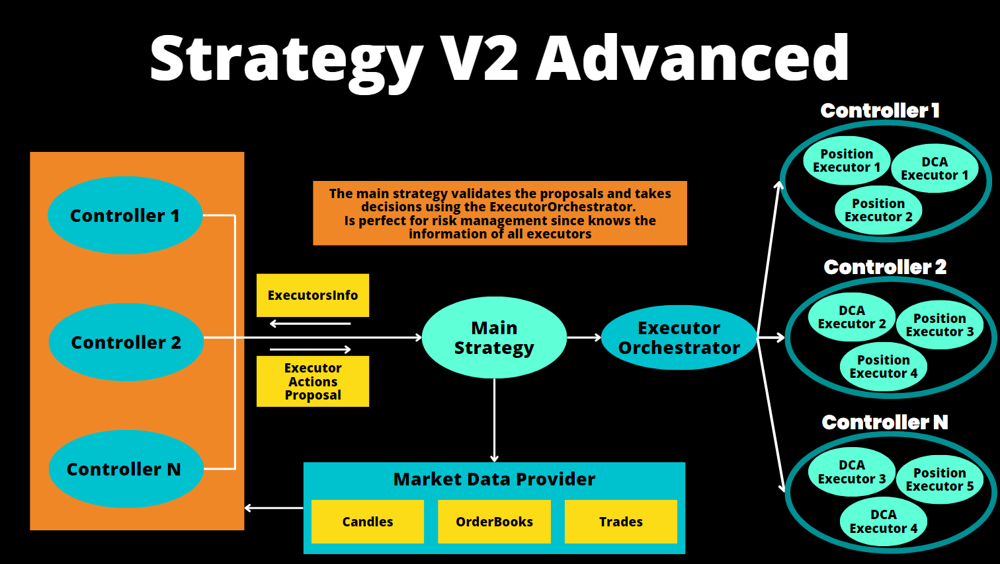

!!! tip
    Starting with [Hummingbot 2.0](https://lu.ma/ieyvhcft), you will be able to configure and deploy controllers using [Dashboard](/dashboard), the new entry point for Hummingbot users launching in June 2024!

In this more complex example, the strategy logic is housed in a [Controller](./controllers/index.md), and the user generates a controller configuration that is run with a generic script, which acts as a controller loader.

This allows users to run multiple configurations, as well as multiple controllers, in a single script.



## What we'll cover

Let's say we want to create a single bot that provides liquidity to two distinct trading pairs on Binance Futures, each configured with unique buy and sell spreads, order amounts, and other pair-specific parameters. In the past, users had to run separate Hummingbot instances for each configuration, each running a separate strategy or script. 

Now, this can be handled in a single strategy using the [pmm_simple.py](https://github.com/hummingbot/hummingbot/blob/development/controllers/market_making/pmm_simple.py) controller. 

First, we will generate pair-specific configurations. Then, we can run these configurations all at once with the [v2_with_controllers.py](https://github.com/hummingbot/hummingbot/blob/development/scripts/v2_with_controllers.py) generic script.


## Create the controller configs

The initial step involves generating a separate controller configuration for each trading pair.

[](../diagrams/15.png)

Execute the command below to generate the controller config:

```shell
create --controller-config market.making.pmm_simple
```

```shell

Enter the name of the exchange to trade on >> binance_perpetual
Enter the name of the trading pair to trade on >> WLD-USDT
Enter the total amount in quote asset to use for trading >> 100
Enter a comma-separated list of buy spreads >> 0.01, 0.02
Enter a comma-separated list of sell spreads >> 0.01, 0.02
Enter the refresh time in seconds for executors >> 20
Set the leverage to use for trading >> 20
Enter the stop loss >> 0.03
Enter the take profit >> 0.02 
Enter the time limit in seconds >> 2700
Enter the order type for taking profit >> LIMIT
Enter the trailing stop as activation_price, trailing_delta >> 0.013, 0.003
Enter a file name for your configuration >> conf_market_making.pmm_simple_1.yml

```

This will create the `conf_market_making.pmm_simple_1.yml` controller config file under the `/conf/controllers` folder 

---

Now, repeat the steps above to create a new controller config. 

This time, use a different trading pair, and different buy and sell spreads. Save this modified configuration under the file name `conf_market_making.pmm_simple_2.yml`.

Afterwards, you should now have two controller config files under the `/conf/controllers/` folder:

```shell
conf_market_making.pmm_simple_1.yml
conf_market_making.pmm_simple_2.yml
```

## Create the generic script config

[](../diagrams/16.png)


Execute the command below to generate the script config file:

```
create --script-config v2_with_controllers

```

Enter the file names of your controller configs, separated by commas:

```python
Enter controller configurations >>> conf_market_making.pmm_simple_1.yml, conf_market_making.pmm_simple_2.yml
Enter a new file name for your configuration >>> conf_v2_with_controllers_1.yml

```

!!! tip 
    Once you create the initial generic script config, it might be easier to edit this file and replace it with new controller names rather than having to re-generate it each time. 


## Start the script 

[](../diagrams/17.png)

Execute the command below to start the script:

```
start --script v2_with_controllers.py --conf conf_v2_with_controllers_1.yml
```

The bot should now be running and start placing orders for both pairs. Run the `status` command to see the bot status.

```
status --live
```

[](../diagrams/20.png)

## Changing configs

Users often need to modify the strategy configuration as it is running. In the Strategies V2 framework, the configs are **dynamic**, so you just need to save changes to the config files

Let's say we want to adjust the order spreads or refresh time for the first pair above.

The controller config files are under the `/conf/controllers/` folder within your instance. Browse to the Hummingbot folder then enter the command below:
```
nano conf/controllers/conf_market_making.pmm_simple_1.yml
```

This will open up Nano - a Linux text editor. You can also use Visual Studio Code or any other text editor you prefer.

```shell
id: EsRCab7Lw3CwqtBe524QvzG5i7ZDWJzoX787ZncknFoy
controller_name: pmm_simple
controller_type: market_making
candles_config: []
connector_name: binance_perpetual
trading_pair: WLD-USDT
total_amount_quote: 100.0
buy_spreads:
- 0.01
- 0.02
sell_spreads:
- 0.01
- 0.02
buy_amounts_pct: null
sell_amounts_pct: null
executor_refresh_time: 20
cooldown_time: 15
leverage: 20
position_mode: HEDGE
stop_loss: 0.03
take_profit: 0.02
time_limit: 2700
take_profit_order_type: 2
trailing_stop:
  activation_price: 0.013
  trailing_delta: 0.003


```


Make the necessary changes you want here then press <kbd>CTRL</kbd> + <kbd>O</kbd> to save, then <kbd>CTRL</kbd> + <kbd>X</kbd> to exit. 

If you edit and save changes to the controller config file, you'll see the spreads change on the next refresh, which is set by the `config_update_interval` parameter (default: 60 seconds).
